# Alien Hominid — univers visuel

> Moodboard de l'univers visuel de la franchise **Alien Hominid** (The Behemoth, créé par **Dan Paladin / Synj** et Tom Fulp sur Newgrounds en 2002). Style cartoon hand-drawn ultra reconnaissable : gros aplats, **contour noir épais**, petits aliens à antennes, gueules à crocs, palette acide. Décliné en officiel (jeux Flash → GBA → HD → Invasion), sprites, et fanart.

> [!note] Collecte multi-sources (pas un site web)
> Rassemblé à la main depuis plusieurs sources (Steam, LaunchBox DB, Wikipedia, The Spriters Resource). **Réf perso / inspiration uniquement** — chaque image appartient à The Behemoth ou à son auteur. Pas de réutilisation commerciale sans vérifier les droits.

## Pourquoi je l'aime
- **Le lettrage du logo** : « ALIEN HOMINID » dessiné à la main, lettres blanches à contour noir, irrégulières, qui débordent — très expressif.
- Le **trait** : contour noir gras + aplats francs + zéro dégradé. Tout est lisible et punchy même tout petit (sprite) ou en grand (key art).
- La **palette criarde** assumée : vert acide / lime, magenta, jaune, orange flammes — agressive mais cohérente.
- Le **chara-design** « cute mais gore » : aliens mignons à grands yeux + gueules à crocs + violence cartoon (explosions vertes, gore comique).
- La cohérence du **système visuel** sur 20 ans et plusieurs supports (Flash, GBA, HD, Invasion).

## À réutiliser pour
- Direction d'illustration cartoon à **contour épais** (mascotte, sticker, pixel art).
- **Lettrage logo** hand-drawn expressif.
- Palettes **bold / acid** pour un projet qui veut taper fort (Sordulo, projet jeune/fun).
- Projet : [[ ]]

---

## Officiel — key art & box art

Style maître : le logo hand-drawn, l'alien jaune, le robot FBI gris/teal, fond magenta + flammes.

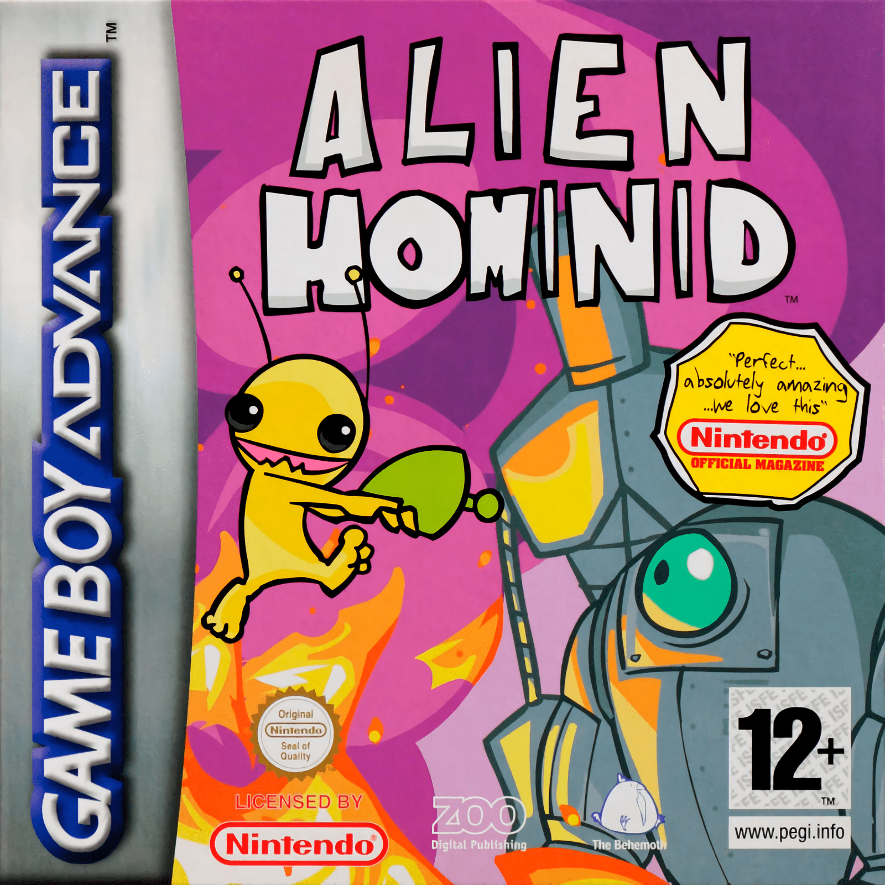
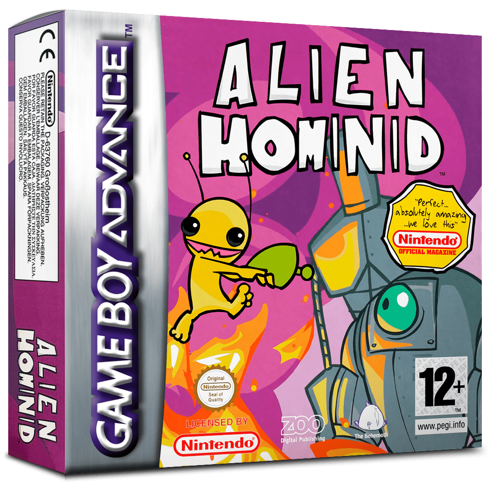
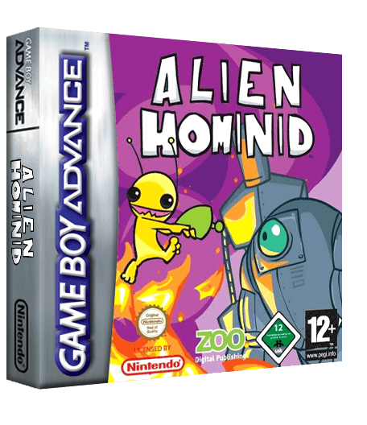
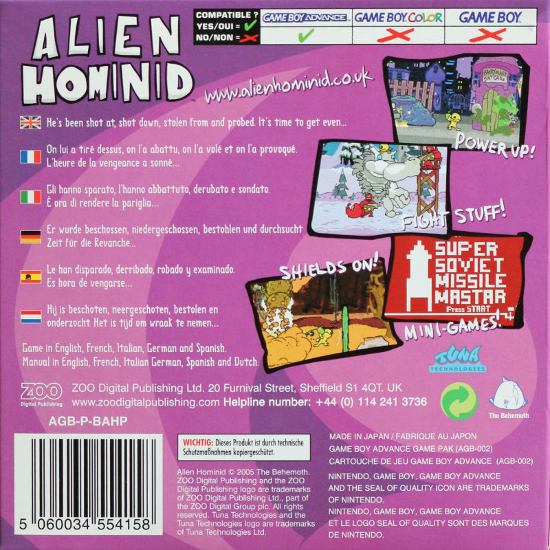
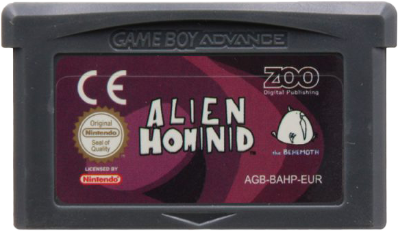
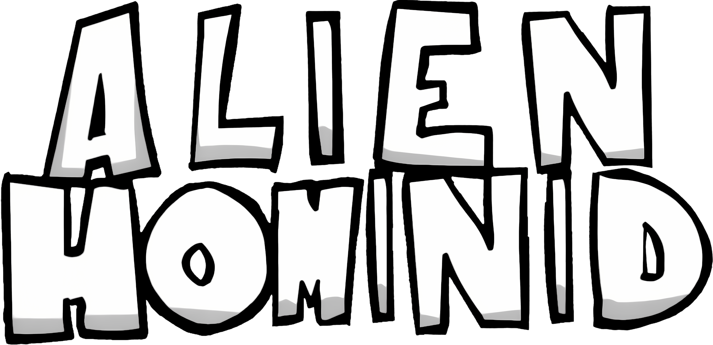

### Alien Hominid Invasion (2023) — le reboot
Roster multicolore (gris, orange, blanc à nœud, jaune, bleu), fond rayé vert acide.

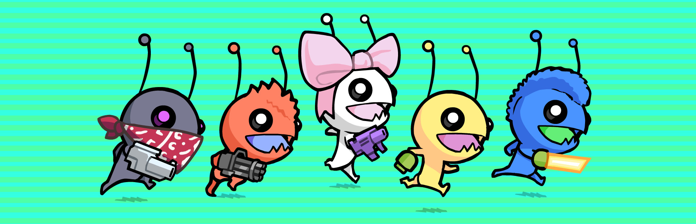
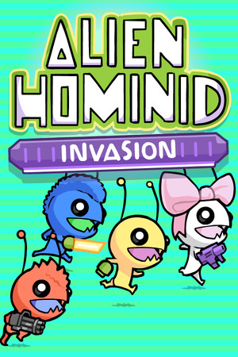
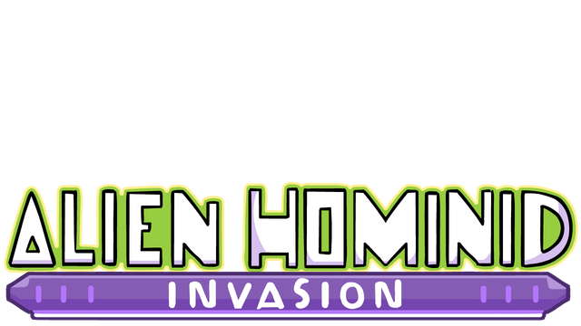
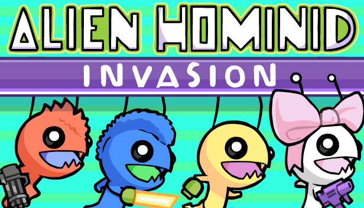

### Alien Hominid HD
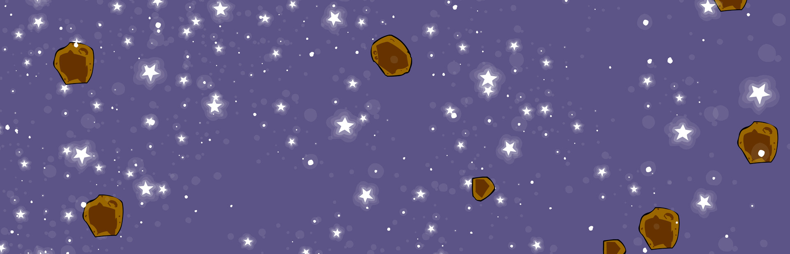
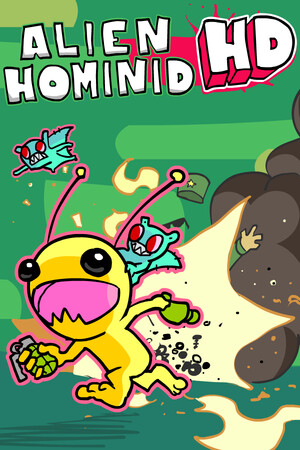
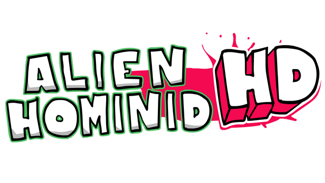

### Box art d'origine (Wikipedia)
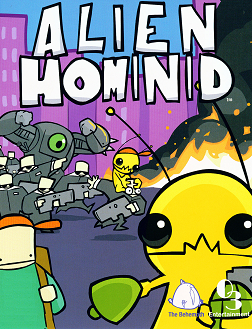

---

## In-game — screenshots (Invasion)

L'univers en mouvement : décors urbains violacés, explosions vert toxique, gore cartoon, UI manuscrite (« #GOALS! », « Shoppington's »).

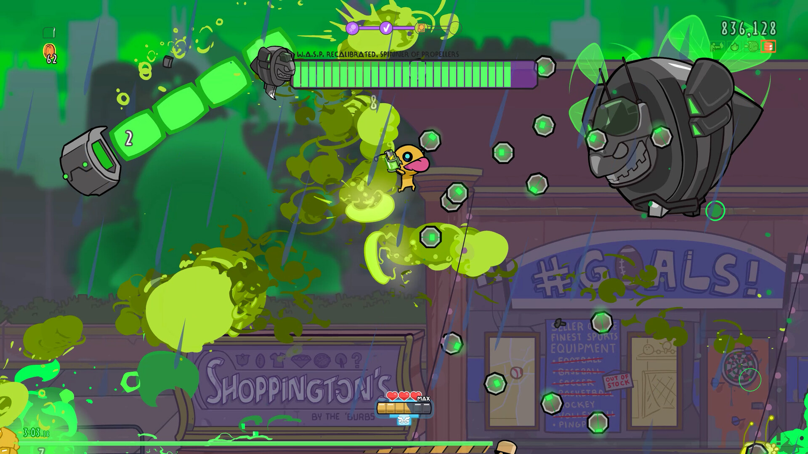
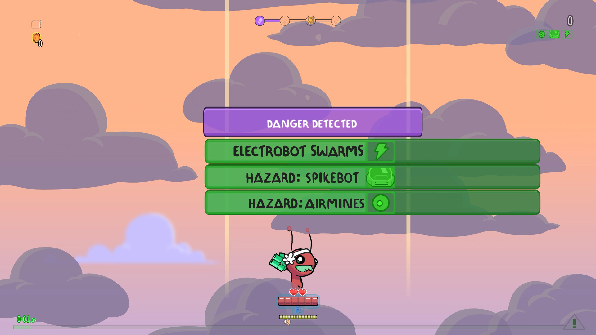
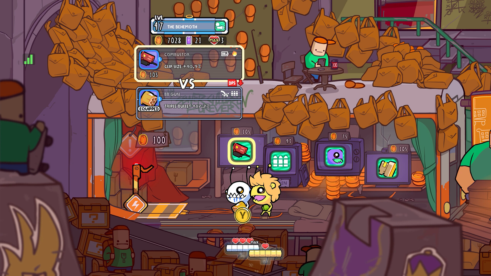
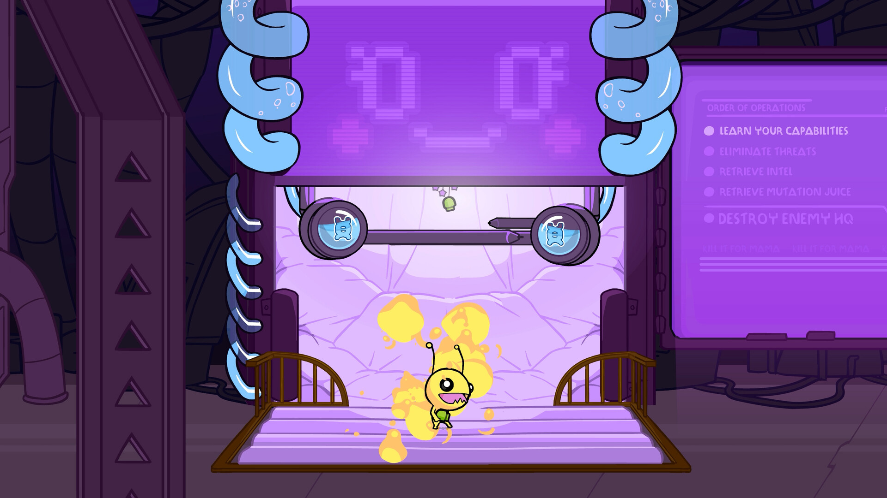
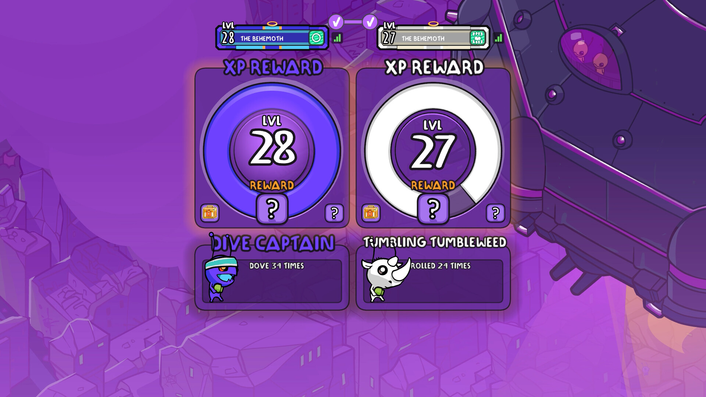
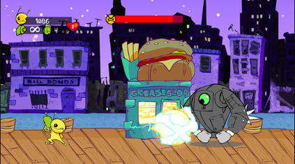

> Les 10 screenshots Invasion sont dans `screenshots/`.

---

## Sprites / pixel (Alien Hominid GBA)

Le même chara décliné en petit : animations de course, sauts, véhicules, cutscenes. Source : The Spriters Resource (rips par MajinPiccolo & Luke).

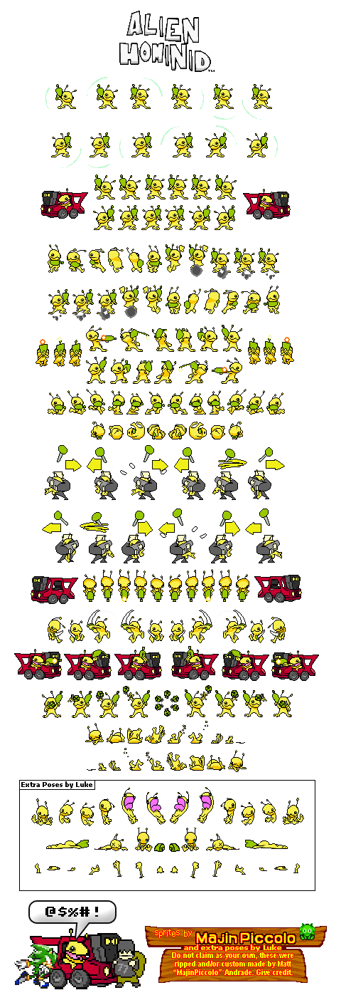
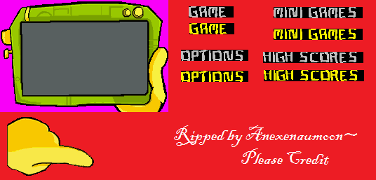
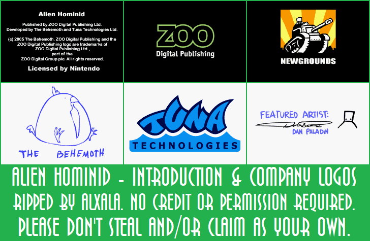
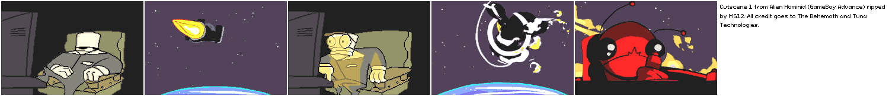

> Feuilles complètes (menu, cutscenes, extras) dans `sprites/`.

---

## Fanart / réinterprétations

Comment d'autres réinterprètent le perso (3D, autres styles).

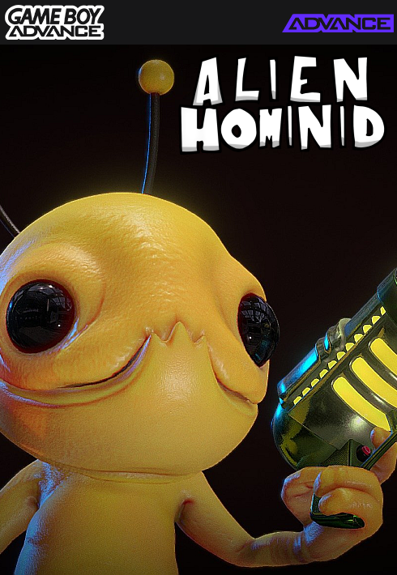
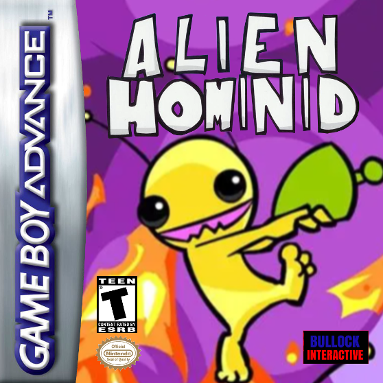

---

## Sources
- Steam — [Alien Hominid Invasion](https://store.steampowered.com/app/843200/) · [Alien Hominid HD](https://store.steampowered.com/app/1285360/)
- [LaunchBox Games Database — Alien Hominid](https://gamesdb.launchbox-app.com/games/images/17107-alien-hominid)
- [Wikipedia — Alien Hominid](https://en.wikipedia.org/wiki/Alien_Hominid) · [Dan Paladin](https://en.wikipedia.org/wiki/Dan_Paladin) · [The Behemoth](https://en.wikipedia.org/wiki/The_Behemoth)
- [The Spriters Resource — Alien Hominid (GBA)](https://www.spriters-resource.com/game_boy_advance/alienhom/)
- Fanart : DeviantArt (tag [alienhominidinvasion](https://www.deviantart.com/tag/alienhominidinvasion)), ArtStation — non rapatriés (protection hotlink, voir Limites)

> [!warning] Limites de la collecte
> - **DeviantArt / ArtStation / Fandom** bloquent le téléchargement automatique (Cloudflare / hotlink). Le fanart ici vient de LaunchBox ; pour plus de fanart il faut enregistrer les images **à la main** depuis ces plateformes.
> - **Art-book / concept-art officiel** non public : pas trouvable librement.
> - Si tu veux une pièce précise (un artwork DeviantArt repéré, un concept), donne-moi l'URL et je tente de la récupérer.
