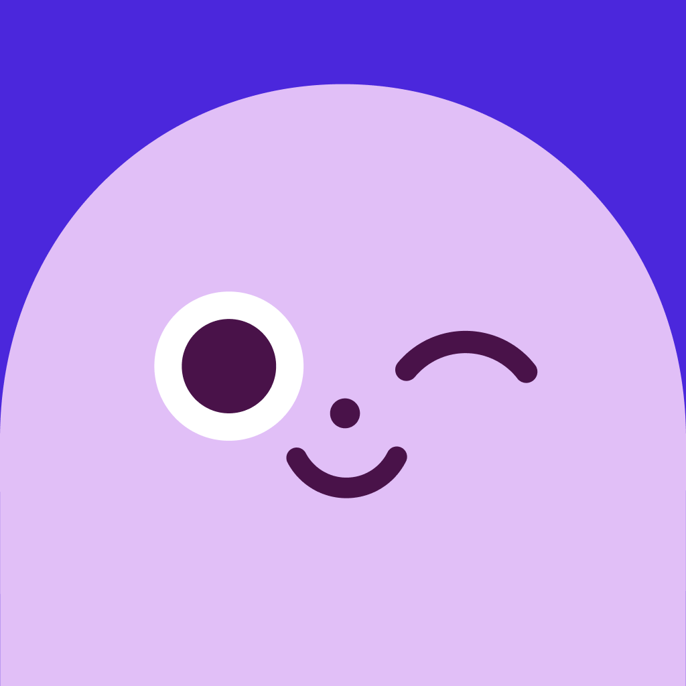

# Ahead

> L'app d'intelligence émotionnelle de ahead solutions GmbH (Berlin), qui se présente elle-même comme **« The Duolingo for emotional intelligence »**. Un cast de fantômes pastel, un funnel d'onboarding de 34 étapes, et une identité qui n'a pas bougé en cinq ans pendant que le nom du produit changeait quatre fois.

**Ce qui en fait un cas intéressant** : c'est l'exact inverse de [[duolingo-app]]. Duolingo publie ses cas d'étude, sa charte entière, ses directions écartées. Ahead ne publie **rien** — pas de press kit, pas un article sur son design, aucune couverture de presse design en cinq ans. Tout ce dossier a dû être reconstitué depuis les binaires servis par le site, les bases d'UI, la Wayback Machine et une page Wefunder archivée. Et pourtant la DA est parfaitement tenue. C'est un dossier sur un design qu'on ne peut connaître qu'en le regardant.

> **Lecture** : chaque famille est montrée par **une planche** (`<aspect>/planches/`), légendée juste dessous. Les fichiers individuels restent dans leur dossier d'aspect — c'est de là qu'on récupère un visuel précis.

---

## En bref

- **Le blanc porte le produit, le violet porte l'action.** 51 % de blanc sur les écrans réels, et le violet de marque `#6442EF` à 8 % — c'est-à-dire beaucoup. Contrairement à Duolingo qui réserve son vert et laisse le bleu travailler, Ahead **dépense sa couleur de marque** partout : boutons, progression, sélection.
- **Une carte pastel par famille de contenu.** Bleu `#CDF1FF` pour les fiches technique, jaune `#FFF3B9` pour la communauté, lavande `#E5E2FF` pour les conteneurs. La couleur est une taxonomie, pas une décoration.
- **Deux registres d'illustration coexistent.** Les fantômes « emotions buddy », un par émotion ; et des personnages **humains** à plat, gros yeux cernés de blanc, cheveux en blocs. Ce n'est pas la même main, et ils ne se croisent presque jamais.
- **Le marketing est plus sombre que le produit.** Les créas store et les paywalls sont un dégradé de nuit (`#331663` → `#3D1A76`) ; l'app est blanche. Le violet profond sert à vendre, pas à utiliser.
- **L'onboarding est le vrai produit.** 34 étapes, un questionnaire de 20 questions, deux engagements **dessinés au doigt**, et un titre de paywall réécrit selon la réponse à la question 10. On donne le résultat personnalisé **avant** de demander l'argent.
- **Le personnage est un composant d'état**, comme chez Duolingo : il souffle pour la respiration, tient la cloche du rappel, enfile une blouse pour le thérapeute WhatsApp, coiffe les barres du graphe de colère.
- **Pas de mode sombre sur le site, mais un vrai thème sombre dans l'app**, piloté par un réglage « Appearance = System default ». Seuls deux écrans sombres sont indexés : l'app est pensée claire d'abord.

---

## Écrans

### Les écrans que Ahead publie lui-même, en vectoriel

![[ecrans/planches/planche-ecrans-officiels-vectoriels-ahead.png]]

**La meilleure source de ce dossier, et personne ne l'avait ouverte.** Les quatre visuels d'écran de la page d'accueil ne sont pas des PNG mais des **SVG** : l'UI entière — textes, graphes, badges, barres de progression — est vectorielle. On peut y lire les rayons, la grille et les pastels sans passer par une capture. Les `.svg` sont dans `ecrans/` à côté des rendus.

On y voit le chemin « Keep your cool » à 63 %, le château de LEVEL 6 « Anger-proof your mind », la grille de cartes d'activité, et la mascotte rouge de la colère qui **déborde du cadre du téléphone** — un tic de composition récurrent chez eux.

### Les écrans réels, derrière le login

![[ecrans/planches/planche-ecrans-reels-ahead.png]]

Ce que le marketing ne montre pas. Quelques-uns méritent d'être regardés de près :

- `ecrans/reel-journey-carte-illustree-vagues-anxiete.png` — **l'écran le plus signé de la DA actuelle** : une scène pleine page de vagues gris-vert, des jalons numérotés, un coffre, une planche de surf, un aileron de requin. C'est la carte de parcours façon Duolingo, mais peinte comme une illustration d'album.
- `ecrans/reel-moments-empty-state-page-blanche.png` — **l'empty state le plus radical que j'aie vu** : une page entièrement blanche, un titre centré, une croix. Rien d'autre. Pas d'illustration consolante, pas de texte d'encouragement. Un parti pris.
- `ecrans/reel-jeu-emotion-tap-challenge.png` — violet saturé plein écran, un gros bouton blanc avec un blob rouge dedans, « Tap the screen as many times as you can in 5s. Can you beat our high score of 43? » Le seul écran de l'app qui abandonne le blanc.
- `ecrans/reel-learnings-profil-verrouille-7-jours.png` — le profil émotionnel **verrouillé derrière une série de sept jours**, avec l'empty state « Start Reflection to add your signs ». La donnée personnelle comme récompense de rétention.
- `ecrans/reel-mode-sombre-caution-scientifique.png` — la preuve du thème sombre, sur l'écran Harvard / Oxford / Cambridge.
- `ecrans/apple-editorial-journey-et-profil.png` — les deux écrans que **la rédaction d'Apple** a choisis pour son article éditorial, en 3000 px.

### Le paywall, huit millésimes et deux archétypes

![[ecrans/planches/planche-paywalls-millesimes-ahead.png]]

Six captures datées, nettes et sans filigrane, de janvier 2025 à juin 2026, plus deux variantes. Elles se comparent deux à deux, ce qui isole un changement à la fois.

**Deux archétypes alternent**, ce qui est en soi un enseignement :

| Archétype | Ce qu'il montre | Millésimes |
| --- | --- | --- |
| **A — proposition de valeur** | « Become a better *X* with Ahead! », 3 bénéfices à pastilles, laurier Apple Design Award Finalist, 5 étoiles 10K+ reviews, « No Payment Due Now », CTA « Try for $0.00 » | janv. 2025, nov. 2025 |
| **B — mécanique d'essai** | « Design your trial », frise Today / Day 5 / Day 7, choix entre deux essais, CTA « Redeem 7 days for $0.00 » | mai 2025, août 2025, févr. 2026, juin 2026 |

**Le titre de l'archétype A est réécrit d'après le questionnaire.** Trois variantes du même gabarit observées : « Become a better **manager** », « Become a better **partner** », « Become a better **person** » — elles correspondent aux réponses de la question 10, « What do you most hope to improve with this app? » (carrière → manager, relation amoureuse → partner, paix intérieure → person). C'est le mécanisme qui justifie la longueur du questionnaire.

**Et les prix n'augmentent pas : ils oscillent.**

| Date | Essai 30 j payant | Abonnement annuel | Layout |
| --- | --- | --- | --- |
| 5 mai 2025 | 4,90 $ | 59,99 $/an (~5,00 $/mois) | deux lignes empilées |
| 7 août 2025 | 6,49 $ | 79,99 $/an (~6,67 $/mois) | deux lignes empilées |
| 20 févr. 2026 | 4,90 $ | 59,99 $/an | **deux cartes côte à côte** |
| 29 juin 2026 | 6,49 $ | 79,99 $/an | deux cartes côte à côte |

Ce n'est pas une hausse, c'est un **test A/B au long cours** entre deux grilles, mené sur au moins quatorze mois. Et la refonte de layout (lignes → cartes) est arrivée entre novembre 2025 et février 2026, tout le reste du gabarit restant identique : un changement de forme isolé, donc lisible comme un test.

Tactique à retenir : l'essai gratuit de 7 jours est **toujours affiché à côté d'un essai de 30 jours payant** à petit prix. L'option gratuite est pré-cochée et le CTA n'annonce qu'elle ; l'option payante sert d'ancrage.

---

## Flows

### L'onboarding — 34 étapes, et le résultat avant le paywall

![[flows/planches/planche-onboarding-ahead.png]]

Le morceau de bravoure du produit. La séquence, telle qu'elle se déroule :

1. **Respiration** — « Take a deep breath », fantôme aux yeux clos. Avant même le logo.
2. **Preuve sociale** — trois lauriers : 3 500 000 membres, Apple Design Award Social Impact, « #1 Emotional Intelligence app in the world (2022-2024) ».
3. **Premier engagement dessiné** — « Are you ready to invest in yourself? » puis « Commit to yourself by drawing a checkmark » : on trace un check au doigt, le bouton dit « I promise myself ».
4. **Caution scientifique** — badge « Science Policy », logos Harvard / Oxford / Cambridge, CTA « Makes sense ». Montré **deux fois** dans le funnel, une fois sur fond clair, une fois sur fond violet.
5. **Le questionnaire, 20 questions** — surtout des **sliders à deux pôles rédigés en situations** plutôt qu'en échelles abstraites : « You're invited to an event full of strangers. Deep down, what do you want to do? » entre « Hide under my blanket » et « Put on pants and make friends ». Coupé par un interstitiel « Halfway to your results! / Did you know? ».
6. **Le résultat** — « Analyzing your answers… » avec trois barres nommées Profile / Goals / Personalization, puis **« Your emotional profile » en radar pentagonal** avec ses points forts et faibles étiquetés, enchaîné sur « Pick your journeys ».
7. **Second engagement dessiné** — « Give change a fair chance: Do 5 min of Ahead for 5 days! » puis « Ready to commit? Draw a happy face! » On dessine un smiley. Juste avant le paywall.
8. **Escalier de permission** — un pré-cadrage chiffré (« Ahead members who use reminders are 3X more likely to reach their goals », promesse « We'll only send you 1 notification per day »), puis l'alerte iOS native.
9. **Le paywall.**

Deux choses valent d'être volées. **La valeur est donnée avant le prix** : le profil émotionnel personnalisé arrive avant tout écran payant. Et **on fait dessiner l'utilisateur**, deux fois — un geste physique vaut mieux qu'une case à cocher.

### Une leçon complète, du premier écran à la récompense

![[flows/planches/planche-flow-une-lecon-complete.png]]

La boucle pédagogique enchaînée, que ni Mobbin ni Uiland ne montrent d'un bloc : carte d'entrée → article long avec ses sources → écrans-affirmations illustrés → quiz « Fill in the blank » avec ses états faux (barre rouge) et juste (barre verte) → choix de compétences en cartes « Try it later / Learn it now » → Congrats → feuille de rappel avec date picker → flamme de série → confettis → « New self-awareness level unlocked! You're a Forecaster ».

### Techniques, moment émotionnel, communauté

![[flows/planches/planche-flows-techniques-moment-communaute.png]]

Trois parcours enchaînés. L'ajout du widget iOS et l'exploration des techniques ; puis le **log d'un moment émotionnel** — grilles de tags d'émotion colorées par famille, nommage au clavier, curseur d'intensité, coffres au trésor à ouvrir, planche BD illustrée, confettis et poussin doré ; puis la communauté — question du jour, fil de réponses, feuille de tri, profil avec barres de compétences émotionnelles.

---

## Branding

### Le logotype et la typo

`branding/logo-wordmark-violet.svg` — « ahead » tout en bas de casse, très circulaire, **une seule couleur** `#4B27DC`, pas de symbole, pas de baseline. Version blanche fournie pour fond violet. C'est tout : il n'y a pas de lockup, pas de grille de construction, pas de règles d'usage — parce qu'il n'y a pas de charte.

![[branding/specimen-euclid-circular-b.png]]

**La typo est Euclid Circular B**, dessinée par **Emmanuel Rey** pour **Swiss Typefaces**, sortie en décembre 2017. Le specimen ci-dessus est rendu avec les fichiers **réellement servis par le site**, pas avec une approximation.

Trois détails techniques qui en disent long sur la maison :

- Le site sert des **TTF bruts, non compressés et non sous-ensemblés** (~140 Ko par graisse), pas de `woff2`. Et les URL du CSS contiennent des **espaces non encodés** (`/font/Euclid/Euclid Circular B Light.ttf`).
- Les `@font-face` sont injectés dans un `<style data-emotion>` par Emotion, **pas** dans la feuille de style — un relevé du CSS seul ne trouve rien.
- La famille CSS s'appelle `EuclidB` et **le poids 400 est mappé sur Light**, pas sur Regular. Le fichier Regular est bien servi par le serveur mais n'est déclaré dans aucun `@font-face`.

> Les six `.ttf` ont été récupérés pour lire leurs métadonnées et rendre le specimen, mais **ils ne sont pas rangés dans le dossier** : Euclid Circular B est une police commerciale sous licence Swiss Typefaces, et le vault comme le site sont publiés. Le specimen suffit comme référence visuelle.

### La mascotte, et le fait qu'elle n'ait jamais bougé

![[branding/apple-editorial-mascotte-fantome-lilas.png]]

Le visuel d'ouverture de l'article éditorial App Store, en 3000 × 4000 — la pièce la mieux définie du lot. Le fantôme lilas au contour blanc épais, yeux fermés, sourire courbe, posé sur un socle en squircle filaire.

![[branding/planches/planche-icone-chronologie-2021-2026.png]]

**Cinq ans, et rien n'a changé.** Avril 2021 : un dôme **orange** `#FD8F55` sur violet, deux gros yeux ronds. Octobre 2021 : le blob lilas au clin d'œil, sur indigo. Et depuis — juin 2024, août 2026 — **exactement les mêmes trois couleurs aux mêmes proportions** (`#E1BFF7` 71,5 % / `#4B27DC` 23 % / `#491249` 2,9 %), seul le cadrage du visage un peu agrandi. Pas un redesign : un recadrage.

Pendant ce temps, **le nom du produit a changé quatre fois** — « Ahead – Improve your emotional intelligence » (2021) → « Ahead: Manage your emotions » → « Ahead: Emotions Coach » (2023-2025) → « Ahead: Emotional Intelligence » / « Emotional Companion » (2026). L'identité visuelle est le seul point fixe d'un produit qui s'est repositionné quatre fois.

### Les deux registres d'illustration

![[branding/planches/planche-icones-emotions.png]]

Le système d'avatars-émotions en vectoriel : anger rouge, confidence, anxiety, positivity, procrastination, boredom, guilt, heartbreak, relief, flow — plus les pictos de technique (grenouille pour « Eat Your Frog », sablier pour « Timeboxing », loupe, baguette magique, atome, livre). Les SVG individuels sont dans `branding/icones-emotions/`.

![[branding/planches/planche-illustrations-humaines.png]]

**Et le second registre, qui n'a rien à voir** : des personnages humains à plat, très grands yeux ronds cernés de blanc, cheveux en blocs de couleur pleine, sur fonds unis saturés. Utilisé sur `/community` et dans les cartes d'activité. Les noms de fichiers sont restés des noms de frames Figma exportés tels quels (`Frame_40500_1`, `Group_40053_1`) — le pipeline n'a pas de nomenclature.

`branding/og-image-duolingo-for-emotional-intelligence.png` — le visuel social officiel, qui écrit le positionnement noir sur blanc. Et `branding/badges-app-of-the-day-et-note.png` pour le système de lauriers.

---

## Couleurs

Ahead ne publie **aucune charte**. Les deux nuanciers ci-dessous sont donc de nature différente, et la distinction compte : le premier vient de valeurs de tokens lues dans le code, le second d'un comptage de pixels.

![[couleurs/palette-declaree.svg]]

**Six valeurs, et c'est tout.** Le reste du bundle est la palette MUI par défaut — il n'existe aucun fichier de design tokens exposé. À noter : le violet du logo (`#4B27DC`) **n'est pas** le violet primaire de l'interface (`#6442EF`). Deux violets voisins et distincts, comme chez Toss.

| Nom du token | Hex | Rôle |
| --- | --- | --- |
| `theme-color` | `#6442EF` | violet primaire, la couleur d'action |
| `ctaTextColor` | `#4B27DC` | violet plus sombre, et unique couleur du logotype |
| `MuiRating color` | `#FFD231` | jaune des étoiles de notation |
| `backgroundColor` | `#F6F7F8` | surface grise des sections alternées |
| `body background` | `#FFFFFF` | le fond, en dur — aucune media query `prefers-color-scheme` sur le site |
| `text color` | `#212121` | texte courant, `0.938rem / 1.5rem` |

![[couleurs/palette-relevee-dans-les-ecrans.svg]]

**Le relevé raconte autre chose que la charte absente.** Le blanc occupe 51 % des écrans réels, et le violet de marque 8 % — c'est énorme pour une couleur de marque, et c'est le choix inverse de Duolingo. Les pastels ne sont pas décoratifs : chaque famille de contenu a sa couleur de carte. Et les créas store sont bâties sur un dégradé de nuit qui n'existe nulle part dans le produit.

**Dans l'app** — aucun nom publié, les tons sont nommés par leur rôle

| Nom de rôle | Hex | Part | Usage relevé |
| --- | --- | --- | --- |
| Blanc | `#FFFFFF` | 51,2 % | le canevas |
| Violet primaire | `#6442EF` | 8,0 % | boutons pleins, progression, sélection |
| Encre bleutée | `#212030` | 6,3 % | titres et texte fort |
| Bleu de carte | `#CDF1FF` | 2,3 % | fiches technique, bandeaux de citation |
| Lavande de surface | `#E5E2FF` | 1,4 % | cartes et conteneurs |
| Jaune de carte | `#FFF3B9` | 1,2 % | question du jour, encouragement |
| Lilas mascotte | `#E1BFF7` | 0,9 % | le corps du fantôme, et 71,5 % de l'icône d'app |
| Corail | `#FD5F53` | 0,3 % | colère, flamme de série |
| Vert | `#4BBC91` | 0,3 % | validation, badge Science Policy |
| Aubergine | `#491249` | — | les yeux et **tous** les traits (23 occurrences dans le hero vectoriel) |

**Dans les créas de l'App Store** — un dégradé de nuit, plus sombre que le produit

| Nom de rôle | Hex | Part | Usage relevé |
| --- | --- | --- | --- |
| Violet nuit clair | `#3D1A76` | 0,9 % | haut du dégradé |
| Violet nuit | `#38186C` | 0,8 % | cœur du dégradé |
| Violet nuit profond | `#331663` | 0,8 % | bas du dégradé |
| Lilas pâle | `#F3E5FC` | 3,3 % | nuages et mots-clés mis en couleur |

---

## Composants

Indexés dans [[_COMPOSANTS]]. Sélection courte : Ahead a peu de composants vraiment singuliers, et c'est honnête de le dire.

- `composants/bulles-de-selection-de-signes_ahead.png` (et son `.svg`) — **le nuage de bulles de tailles variables** pour sélectionner ses signes d'émotion (« Feeling craving », « Ruminating my mistakes », « Distorting the truth »). La bulle sélectionnée grossit. Un sélecteur multiple qui ne ressemble à aucune liste à cocher.
- `composants/graphe-a-barres-coiffees-de-tetes_ahead.png` (et son `.svg`) — **le graphe dont chaque barre est coiffée d'une tête d'émotion**. De la dataviz où la légende est le personnage.
- `composants/modale-et-selecteur-de-pays_ahead.png` — la feuille modale « Meet our WhatsApp Therapist » avec sélecteur d'indicatif pays et bouton désactivé. Au passage : Ahead pilote un **thérapeute par WhatsApp** inclus dans l'abonnement.

---

## Animations

Indexée dans [[_ANIMATIONS]].

`animations/kai-respiration-et-transition_ahead.mp4` — la seule animation réelle que j'aie pu récupérer : le compagnon **Kai** qui respire (pulsation du visage) puis la transition en overlay plein écran. 12,45 s, 745 Ko. Mobbin ne publie une animation que pour une poignée d'écrans, et celui-là en fait partie.

Aucun outil de motion n'est cité nulle part par Ahead — ni Rive, ni Lottie, ni After Effects. Contrairement à [[duolingo-app]] où le pipeline est documenté, ici on ne sait pas comment c'est fait.

---

## Marketing

![[marketing/planches/planche-creas-store-ahead.png]]

Quinze créas, millésime août 2026. Le système est strict : fond violet dégradé, un titre en Euclid avec **un ou deux mots en violet clair**, un seul visuel. Les créas **iOS et Android sont différentes** — Android ajoute des témoignages, « Science-proven techniques » et « Keep yourself accountable », et décline tout en huit versions paysage pour tablette.

Trois choses à en tirer. Le positionnement est écrit en toutes lettres sur la première créa (« The Duolingo for Emotional Intelligence »). Le laurier dit correctement « Apple Design Award **Finalist** ». Et la dernière créa vend le coach IA : « Your AI emotion coach, 24/7 — Talk with Kai ».

Le site, en pleine hauteur : `marketing/site-home-desktop-pleine-hauteur-2026.png` (2880 px de large, @2x) et sa version mobile · `marketing/site-community-pleine-hauteur.png`, la meilleure vue du registre illustratif humain · `marketing/site-businesses-b2b-pleine-hauteur.png`, le même système en plus sobre · et `marketing/site-microsite-technique-roulette.png`, un micro-site non listé au sitemap, « Technique Roulette », **le seul endroit de tout le domaine où quelqu'un est crédité** : « made by @krsj.dev ».

Plus les deux bandeaux de caution : `bandeau-presse-techcrunch-bustle-nyt.png` et `bandeau-harvard-oxford-cambridge.png`.

---

## Process

**Vide, et c'est un constat, pas un oubli.** Ahead ne publie rien de sa fabrication : pas de blog design, pas de case study, pas de directions écartées, pas même de changelog détaillé (les release notes de l'App Store disent « Bug fixes and improvements »). Son blog compte 15 684 URLs de contenu SEO et pas un seul article sur le design du produit.

La seule trace de process trouvée dans toute la récolte est indirecte : un build obsolète du site marketing contient à la fois `ghost.png` et `newGhost.png`, ce qui atteste d'une refonte du personnage — mais les fichiers n'y sont servis qu'en vignettes de 70 à 110 px, donc inexploitables.

---

## Archive

### L'app à travers ses millésimes

![[archive/planches/planche-app-millesimes-ahead.png]]

Quatre générations de DA en deux ans et demi, reconstituées depuis Mobbin (janvier 2024, octobre 2025) et Uiland (août 2025, février 2026) :

- **2024-01** — violet indigo dominant en aplat, cartes blanches, château de niveau, ton potache. Le quiz à curseur y montre déjà le ton de voix : « I get hot like a jalapeño! » contre « I stay cool as a cucumber ».
- **2025-08** — écrans plus nus, lavande très clair, pas de chrome.
- **2025-10** — arrivée du compagnon **Kai** en dégradés lavande → pêche, et des graphes de preuve sociale.
- **2026-02** — blanc et lavande, carte de parcours illustrée pleine page, tab bar à cinq entrées.

Et `archive/app-2024-05-choix-de-3-parcours-seulement.png` (capture d'une journaliste de Bustle) date l'élargissement : en mai 2024 il n'y avait que **trois** parcours, contre sept aujourd'hui.

### Le site à travers ses millésimes

![[archive/planches/planche-site-millesimes-ahead.png]]

- **2022-01, ère Webflow** — une longue page éditoriale à navigation verticale, titre « Master your emotions in 5 min a day. », capture d'emails « Get early access ».
- **2023-06, bascule Next.js** — page ultra-dépouillée, headline « Duolingo for emotional intelligence », un seul journey proposé.
- **2025** — le hero violet dégradé actuel, avec le sous-titre qui a changé de nature : « **Your AI pocket therapist**, built by scientists trained at Universities of Oxford, Cambridge, and Harvard ». On est passé de « pocket coach built by behavior change experts » à « AI pocket therapist » — et la meta description, elle, n'a jamais été mise à jour.

### Le fait d'archive le plus parlant

![[archive/planches/planche-site-2021-illustrations-en-emoji-apple.png]]

**Au lancement, Ahead n'avait aucune illustration.** Le site d'avril 2021 utilisait des **emoji Apple 3D bruts** comme visuels de section, téléchargés et renommés `Annoyed.png`, `Anxious.png`, `Disguised.png`, `Open eyes.png`. Le langage de blobs qui fait aujourd'hui toute l'identité est venu **après** le produit. C'est rassurant à savoir quand on démarre quelque chose.

![[archive/planches/planche-cartes-journey-2023-2024-ahead.png]]

Les cartes de journey de 2023-2024 en SVG (280 × 400, rayon 20) sur fonds pastel — blob rouge en colère, blob super-héros à cape, sablier de procrastination — plus les deux icônes de l'ère Webflow et l'OG image de 2023.

---

## Sources

Six pistes menées en parallèle. Deux ont rendu presque tout, une n'a rien trouvé — et c'est instructif.

**Officiel — `ahead-app.com`**
Le site lui-même, ses bundles et son bucket. C'est de là que viennent les **écrans vectoriels**, les logos, les 28 icônes SVG, les 15 illustrations humaines, les valeurs de tokens et les métadonnées de police. Médias servis depuis `storage.googleapis.com/web-api-media-uploads/` sans paramètre de redimensionnement. Stack : Next.js + MUI/Emotion, CMS Strapi sur Cloud Run.
**Il n'existe aucun press kit** — vérifié trois fois : `/press`, `/brand`, `/media`, `/newsroom`, `/assets` renvoient 200 mais servent la page d'accueil **à l'octet près** (catch-all Next.js) ; le `_buildManifest` ne liste aucune route de ce type ; les sous-domaines `press.` `brand.` `design.` `media.` sont en NXDOMAIN.

**Stores** — [App Store FR](https://apps.apple.com/fr/app/ahead-emotional-intelligence/id1570430177) et [Google Play](https://play.google.com/store/apps/details?id=com.aheadsolutions.aHead) (`com.aheadsolutions.aHead` sur les deux plateformes) : 15 créas, l'icône 1024, et les métadonnées du frontmatter.

**Bases d'UI** — [Uiland](https://uiland.design/screens/ahead) (deux versions indexées, 219 puis 840 écrans ; une vignette d'amorce gratuite par flow, d'où 17 écrans) · [Mobbin](https://mobbin.com) (deux versions, janv. 2024 et oct. 2025 ; les pages `/explore/screens/{id}` sont publiques et servent le PNG 1180 × 2556 sans compte) · [Screensdesign](https://screensdesign.com/apps/ahead-emotions-coach/) (walkthrough de 16 min 07, 188 écrans, recomposés en planches de flow).

**Onboarding et paywalls** — Screensdesign pour le funnel, et paywallscreens.com pour les **six millésimes datés** du paywall (bucket Supabase public, indexé par app id).

**Presse et contexte** — [l'article éditorial App Store d'Apple](https://apps.apple.com/us/story/id1684199574) « Build Healthy Emotional Habits » (artwork en 3000 px, citations de Kai Koch) · [le communiqué Apple des ADA 2024](https://www.apple.com/newsroom/2024/06/apple-announces-winners-of-the-2024-apple-design-awards/) · [Swiss Typefaces](https://www.swisstypefaces.com/fonts/euclid/) et [Fonts In Use](https://fontsinuse.com/typefaces/72780/euclid-circular-b) pour la typo · [Bustle](https://www.bustle.com/wellness/ahead-productivity-app-features-price-review) (28 mai 2024, les seules captures de presse) · [Ness Labs](https://nesslabs.com/ahead-featured-tool) (janv. 2022, planche marketing + interview) · [Tech.eu](https://tech.eu/2021/10/13/emotional-intelligence-training-app-ahead-raises-1-3-million-in-pre-seed-funding/) (la levée) · [la page Wefunder archivée](https://web.archive.org/web/20250421212058/https://wefunder.com/aheadapp) (les bios d'équipe).

**Web et archives** — la Wayback Machine pour tous les millésimes du site et les assets d'époque. Attention si tu y retournes : **le domaine a été recyclé** — avant 2021, `ahead-app.com` hébergeait un blog WordPress japonais sur l'épilation définitive. Seuls les snapshots 2021+ concernent l'app.

**Ce qui n'a rien donné, et pourquoi c'est un résultat** — la source « auteur / équipe design » est revenue **vide de médias**. Ahead n'a rien publié sur Dribbble ni Behance, et ses designers non plus. Aucune agence externe n'est créditée nulle part. Absentes aussi, vérifiées une par une : Page Flows, Appshots, Banani, nicelydone, WWIT, Refero, Land-book, Godly, SiteInspire, SaaS Landing Page, Awwwards. Et **aucune presse design en cinq ans** : rien sur It's Nice That, Brand New, The Brand Identity, Creative Bloq, Fast Company, Eye on Design, Design Week. Aucun teardown UX publié. La reconnaissance de cette app est intégralement Apple.

---

## Crédits

Une équipe design de **deux personnes** dans une société de 1 à 10. L'identité et l'illustration sont faites **en interne** — aucune agence n'apparaît nulle part, et une offre d'emploi « Senior Mobile Product Designer, spécialité Illustration & Animation » le confirme.

| Personne | Rôle | Source |
| --- | --- | --- |
| **Kai Koch** | Cofondateur. Ex VP chez **Casper Sleep**, ex MD/cofondateur Helpling, ex Director Lazada. | page /about, Wefunder |
| **John Roggan** | Cofondateur. Ex cofondateur ChefsList, ex McKinsey. | page /about, Wefunder |
| **Bomie Lee** | **Director Design**. Ex Senior Designer chez **Casper Sleep**, ex **Interactive Designer chez Apple**. | [Wefunder archivé](https://web.archive.org/web/20250421212058/https://wefunder.com/aheadapp) |
| **Bruno Everling** | **Director UX**. Ex Senior UX Designer chez BCG Digital Ventures, ex Product Designer chez **IDEO**. | Wefunder archivé |
| **Sarah Stein Lubrano** | **Head of Content**. Ex Head of Content de **The School of Life**, PhD en science comportementale à Oxford. | Wefunder archivé |
| **Syifa Fauziah** | Senior UI Designer & UX Illustrator (équipe actuelle). [Behance](https://www.behance.net/syifauziahfafa) — mais aucun projet Ahead publié, et son portfolio perso a expiré. | theorg.com |
| **Jaber Alyousfe** | Creative Lead (équipe actuelle), Berlin. Behance existant mais vide. | theorg.com |
| **@krsj.dev** | Crédité sur le micro-site `/roulette`. **Le seul crédit nominatif de tout le domaine.** | ahead-app.com/roulette |

**Une généalogie de style, à prendre comme une déduction et non comme une déclaration** : le cofondateur vient de Casper Sleep, sa directrice design vient de Casper Sleep. Le langage pastel, arrondi et rassurant d'Ahead est une DA de DNVB transposée à la santé mentale. Personne ne le dit ; les deux biographies le suggèrent fortement.

Citation de Kai Koch, dans l'article éditorial d'Apple — la meilleure formulation de l'intention produit : « You don't change how you think and act by reading about it, just like you don't learn to ride a bike that way. You learn it by actually doing it — and doing it consistently. »

Et ce que la rédaction d'Apple retient du design, ce qui est révélateur : « **How Ahead breaks down complicated feelings into actionable steps** ». Le mérite est attribué à la décomposition, pas à l'esthétique.

---

## Ce qui ne colle pas

Une fiche de référence doit aussi noter ce qui sonne faux. Sur Ahead, il y a trois choses.

**La récompense est surinterprétée.** La description App Store annonce « ◆ Apple Design Award 2024 (Social Impact) » en première ligne. Ahead était **finaliste**, pas lauréat : les lauréats Social Impact 2024 sont Gentler Streak et The Wreck. Leurs propres visuels sont corrects (« Apple Design Award **Finalist** » sur le laurier du site, sur la créa store et sur le paywall) — c'est le texte de description qui coupe le mot, et tous les agrégateurs l'ont recopié.

**Les chiffres ne concordent pas entre eux.** La fiche App Store dit « 2 million people », le hero du site « 4,000,000+ MEMBERS », la page communauté « over 3.000.000 self-improvers », l'onboarding « 3,500,000 members » — et le paywall, quelques secondes plus tard, « 1m+ lives changed ». Les badges du site portent « 10K+ REVIEWS » sur l'un et « 1.5K+ REVIEWS » sur l'autre. Mesure réelle via l'API Apple le 21 août 2026 : **4,74 sur 22 440 votes**.

**Le discours a changé sans que le produit le dise.** « Pocket coach built by behavior change experts » (2023-2024) est devenu « **AI pocket therapist** » avec caution Oxford / Cambridge / Harvard (2025-2026). Le mot « therapist » pour une app sans thérapeute, sur un sujet de santé mentale, mérite d'être noté — d'autant que le micro-site Roulette, lui, affiche correctement « Ahead is not therapy or medical advice ».

---

## Pourquoi je l'aime

- **La couleur comme taxonomie.** Une teinte de carte par famille de contenu — bleu pour les techniques, jaune pour la communauté, lavande pour les conteneurs. On sait où on est avant d'avoir lu.
- **Faire dessiner l'utilisateur.** Deux fois dans l'onboarding, on trace quelque chose au doigt pour s'engager. C'est bête, physique, et infiniment plus fort qu'une case à cocher.
- **Donner le résultat avant le prix.** Le profil émotionnel personnalisé arrive avant le paywall. On paie pour continuer, pas pour voir.
- **Un empty state totalement vide.** Une page blanche, un titre, une croix. Le courage de ne rien mettre.
- **Une identité qui ne bouge pas.** Quatre repositionnements, quatre noms, quatre refontes d'app — et la même mascotte aux mêmes couleurs depuis octobre 2021. C'est ce point fixe qui fait qu'on reconnaît l'app.
- **Et le fait qu'ils aient commencé avec des emoji Apple.** L'identité n'était pas un prérequis du lancement. Elle est venue quand il y avait quelque chose à habiller.

## À réutiliser pour

- **Le slider à deux pôles rédigés en situations** plutôt qu'en échelle abstraite (« Hide under my blanket » ↔ « Put on pants and make friends »). Transposable à n'importe quel questionnaire de préférence, et ça change tout au taux de complétion.
- **Le titre d'écran réécrit d'après une réponse** — un seul gabarit de paywall, trois personnalisations. Coût de production nul, effet perçu énorme.
- **Le millésimage systématique.** Six captures datées du même écran sur quatorze mois permettent de lire un test A/B de prix. À faire dans toutes mes inspis.
- **Le graphe dont les barres sont coiffées de personnages** — de la dataviz où la légende est illustrée. Pour un dashboard qui doit rester léger.
- **L'escalier de permission** : pré-cadrage chiffré + promesse de fréquence, puis l'alerte native. Jamais l'alerte nue.
- **Le paywall en tableau à archétypes alternés** — garder deux gabarits et les faire tourner plutôt que d'en optimiser un seul.
- Projet : [[ ]]

## Mots-clés

ahead, ahead app, ahead solutions, emotional intelligence, intelligence émotionnelle, EQ, quotient émotionnel, santé mentale, mental health, bien-être, wellbeing, self-care, self-improvement, développement personnel, gestion des émotions, emotion management, colère, anger, anxiété, anxiety, confiance, confidence, procrastination, positivité, positivity, rupture, heartbreak, deuil, grief, culpabilité, guilt, ennui, boredom, thérapie, therapy, pocket therapist, AI therapist, coach IA, AI coach, Kai, compagnon, companion, chatbot, conversation IA, science comportementale, behavior change, psychologie, CBT, Harvard, Oxford, Cambridge, caution scientifique, gamification, gamifié, série, streak, flamme, niveaux, levels, château, castle, XP, récompense, reward, célébration, celebration, confettis, coffre, chest, badge, achievement, parcours, journey, learning path, carte de parcours, chemin illustré, technique, toolkit, check-in, réflexion, reflection, moment émotionnel, profil émotionnel, emotional profile, radar, pentagone, self-awareness test, questionnaire, quiz, slider, curseur à deux pôles, onboarding, funnel, tunnel d'inscription, inscription repoussée, deferred signup, engagement dessiné, signature au doigt, drawing commitment, checkmark, happy face, permission notification, pré-cadrage, escalier de permission, paywall, hard paywall, essai gratuit, free trial, essai payant, design your trial, ancrage, anchoring, leurre, decoy, test A/B, A/B test, prix, pricing, oscillation tarifaire, abonnement, subscription, lifetime, plan annuel, Superwall, mascotte, mascot, fantôme, ghost, blob, emotions buddy, personnage, character design, illustration plate, flat illustration, pastel, lilas, violet, aubergine, dégradé de nuit, night gradient, carte pastel, taxonomie de couleur, couleur sémantique, empty state, page blanche, tab bar, cinq onglets, FAB, feuille modale, bottom sheet, sélecteur de pays, country picker, bulles de sélection, bubble selector, nuage de bulles, graphe à barres, dataviz illustrée, mode sombre, dark mode, Euclid Circular B, Swiss Typefaces, Emmanuel Rey, typo géométrique, sans-serif circulaire, TTF, woff2, poids 400 mappé sur Light, Emotion, MUI, Next.js, Strapi, Webflow, Google Cloud Run, Apple Design Award, ADA 2024, finaliste, finalist, Social Impact, App of the Day, article éditorial App Store, Apple editorial, Duolingo for emotional intelligence, Casper Sleep, IDEO, BCG Digital Ventures, The School of Life, Bomie Lee, Bruno Everling, Kai Koch, John Roggan, Sarah Stein Lubrano, Syifa Fauziah, Jaber Alyousfe, Berlin, Speedinvest, Wefunder, pre-seed, WhatsApp therapist, Technique Roulette, micro-site, pas de press kit, no press kit, identité in-house, Wayback Machine, millésime, archive, Mobbin, Uiland, Screensdesign, paywallscreens, Ness Labs, Bustle

---
[[_APPS|← Apps & produits]] · [[duolingo-app|← Le produit dont il se réclame]] · [[_INSPIRATION|← Inspiration]]
