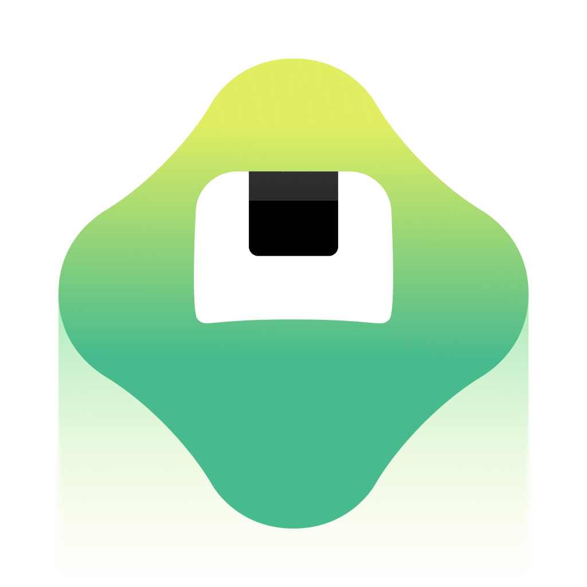

# Brilliant

> L'app d'apprentissage des maths et de l'informatique, et **l'anti-Duolingo sur la couleur** : le blanc occupe 61 % de la surface, la couleur de marque en occupe 0,16 %. Ce dossier existe pour ça, et pour une chose que presque personne ne publie — **les diagrammes manipulables comme unique système illustré**, plus sept articles de fabrication.

**Sources :** brilliant.org (captures maison, tokens du CSS de production, fichiers de police servis) · blog.brilliant.org (7 articles, tous de fabrication) · App Store et Google Play · Mobbin (4 millésimes datés) · Screensdesign · Adapty · les portfolios de [Cody Bond](https://www.lolcodybond.com/brilliant) et [Zack Davenport](https://www.mrdavenport.co/brilliant) · le blog de [Rive](https://rive.app/blog/how-brilliant-org-motivates-learners-with-rive-animations) · [Pop & Strange](https://popandstrange.com/popfolio/brilliant-org) — détail dans [[#Sources]]

> **Lecture** : chaque famille de visuels est montrée par **une planche** (`<aspect>/planches/`), légendée juste dessous. Les fichiers individuels restent dans leur dossier d'aspect.

## En bref

- **Le blanc n'est pas un fond, c'est la matière.** `#FFFFFF` = 61,09 % de la surface des écrans, mesuré au comptage de pixels. `green-500`, la couleur de marque, en occupe **0,16 %**. La couleur est réservée aux objets qu'on manipule.
- **Le relevé de pixels tombe pile sur les tokens déclarés.** #F2F2F2 = `gray-100`, #D4F5DD = `green-200`, #5CF0B6 = `mint-500`, #294BC6 = `blue-700`. Un produit qui tient sa charte au pixel.
- **La couleur code la discipline, pas la marque.** Les parcours de maths sont en bleu isométrique, ceux d'informatique en violet. Ce n'est pas un accent décoratif, c'est une taxonomie.
- **Trois familles typographiques, dont deux sur mesure**, lues dans la table `name` des `.woff2` de production : **CoFo Robert** (serif, les grands titres), **CoFo Brilliant** (sans bespoke, corps et intertitres), **CoFo Brilliant Semi-Mono** (code et jetons de maths). Toutes de [Contrast Foundry](https://contrastfoundry.com).
- **Le style d'illustration maison a un nom : `PIX`.** Nommé et revendiqué par Cody Bond, Lead Product Illustrator, qui l'a créé de la recherche au style guide.
- **Koji, le personnage, est riggé dans Rive, pas dessiné.** 18 fichiers `.riv` servis en clair. Ses quatre pointes s'appellent des *wings*, son œil est un ensemble lentille/globe/pupille, et il a des accessoires nommés — `Blue Mug`, `Tea Cup`, `Crossword`, `Pencil`.
- **Même astuce de bouton que Duolingo.** Les tokens déclarent un composant `button3d` dont la `--button3d-shadow-color` puise dans le cran 600 de chaque teinte : l'arête basse plus foncée qui donne une épaisseur physique. Deux DA opposées, le même truc — cf. [[duolingo-app]].
- **Le mur d'inscription arrive APRÈS le quiz d'onboarding**, et le paywall après le mur. On qualifie avant de demander quoi que ce soit.
- **Les paliers d'objectif quotidien sont nommés, pas chiffrés** : Casual, Regular, Serious, Intense.

## Écrans

![[ecrans/planches/planche-diagrammes-interactifs.png]]
**Le cœur du produit, et son seul système illustré.** Pas d'illustration décorative : les figures mathématiques *sont* l'art. La grammaire est constante — une question en sans gras en haut à gauche, la figure dans un conteneur gris très clair à coins arrondis, les objets manipulables en **cubes à léger biseau** (reflet en haut, ombre en bas à droite), les numéros d'étape en petites pastilles grises, et les formules composées en **KaTeX** (donc en Computer Modern, un serif) au milieu d'une UI en CoFo. Une balance pour `3x + 5 = 11`, un triangle de Sierpiński pour les fractions, une table de valeurs dont seule la colonne manipulable est en bleu.

![[ecrans/planches/planche-millesimes-2022-a-2026.png]]
**Quatre millésimes datés.** 2022 : cartes illustrées rose-brique, anneau de streak doré, tab bar Home / Courses / Today / Stats. 2024 : bascule complète — blanc, chemin de nœuds en cubes bleus isométriques, éclair de streak, onglet Leagues. 2025 : le violet apparaît pour l'informatique. 2026 : recommandations de parcours en cartes à vignette isométrique.

![[ecrans/planches/planche-lecons-et-leagues.png]]
Les leçons, les ligues, la fin de leçon et le chargement. Deux détails qui valent le coup : **l'écran de chargement est un gros anneau jaune seul** avec « Finding learning path recommendations based on your responses » — aucun spinner système. Et le feedback de bonne réponse n'utilise pas un vert d'accent mais `special-lesson-feedback-correct` **#00370F**, un vert de *texte* ; le « réessaie » est un brun **#403000**, jamais un rouge.

![[ecrans/planches/planche-store-couleur-par-ecran.png]]
Les 9 captures App Store. Elles portent un **système « une couleur pastel par écran »** — menthe, cyan, lavande, jaune, jaune-vert, pêche, rose — que le jeu Android en 2064 px, plus résolu mais neutre, ne porte pas. Les deux sont gardés pour cette raison ; le jeu Android en 1080 px est parti dans `archive/store-basse-resolution/`.

![[ecrans/bandeau-huit-diagrammes-du-hero-de-refonte.png]]
Huit images du hero de la refonte : nuage de points, grille de gems pilotée par une boucle `while`, dissection de carré, `cos(θ)` et cercle trigonométrique, énigme d'angles à curseur — avec le curseur illustré qui manipule.

## Flows

![[flows/planches/planche-onboarding-douze-etapes.png]]
**Douze étapes, et une décision remarquable : on qualifie avant de demander un compte.** L'accroche est une fusée annotée de l'équation `J = u·δm` — Brilliant montre des maths dès le premier écran. Puis « Which describes you best? », les centres d'intérêt, un écran de réassurance où Koji apparaît en blob plus mou, le choix du sujet, et surtout **« What is your math comfort level? » avec de vraies équations rendues en LaTeX dans les cartes** — on se situe en lisant une formule, pas en cochant « débutant ». L'objectif quotidien est nommé (Casual 5 min, Regular 10, Serious 15, Intense 20). Le mur d'inscription vient en 8ᵉ position, le paywall après.

![[flows/planches/planche-paywalls-2024-2026.png]]
Le paywall Premium, deux millésimes. 2024 : header noir spatial à fusée, trois bénéfices cochés, compte à rebours, 149,99 $/an. 2026 : le header disparaît au profit d'une **frise verticale de l'essai en quatre étapes** (tes objectifs, ton accès aujourd'hui, le rappel, la fin d'essai), 7 jours gratuits, 159,99 $/an. Le même déplacement que chez [[headspace]] — du carrousel d'arguments vers la chronologie honnête.

`flows/session-complete-95-ecrans-27s-nets-puis-floutee.mp4` — l'enregistrement d'une session de 10 min 26 couvrant 95 écrans, avec son chapitrage horodaté (Onboarding 00:02, Create Account 00:41, Subscribe 01:04, Take a Lesson 02:00, Practice 04:29, Explore Courses 05:44, Settings 09:50). **Net jusqu'à 00:27 seulement, flouté ensuite** par le paywall de la base — utile comme carte du flow et pour les timecodes, pas pour les visuels.

## Branding

![[branding/planches/planche-koji-le-systeme.png]]
**Koji.** Un blob à quatre pointes arrondies en dégradé vert → jaune-vert, avec **un seul œil** rectangulaire à pupille noire. Le calque du SVG officiel s'appelle littéralement `Koji_Default`. Il a sa route (`/koji/`), son z-index dédié (`--panda-z-index-in-content-ask-koji-animation`) et un drapeau d'expérimentation (`ol_router_koji_v2_08_2026`). Deux emplois observés dans le produit : **marqueur de l'étape courante** posé sur un nœud du chemin, et **avatar de célébration** en fin de leçon ou de série.

![[branding/planches/planche-koji-vingt-variations-cody-bond.png]]
Une vingtaine de variations publiées par Cody Bond sur son portfolio — formes, expressions, accessoires (chapeau de diplômé, crayon, gouttes, cube blanc dans l'œil). Le fichier s'appelle `kojis.png`, ce qui a confirmé le nom.

![[branding/casting-cinq-personnages-style-pix.png|600]]
**Le style `PIX`** appliqué aux humains : silhouettes plates, membres sans articulation, visages simplifiés à deux traits. Le cahier des charges, dit par son auteur : rendre l'apprentissage accessible tout en portant des diagrammes complexes, motiver sans distraire, « ne pas faire enfantin, mais pas sans vie non plus ».

![[branding/traitement-des-yeux-et-des-visages.png|500]]
Le détail qui fait le style : pupille pleine, un reflet blanc en cale, une étincelle jaune, les franges en aplats.

![[branding/logo-wordmark.svg|400]]
Le wordmark en vectoriel, extrait du SVG inline du header — **il n'existe aucun press kit** : `/press`, `/brand`, `/media`, `/newsroom` renvoient tous 404, et les chemins d'assets devinés répondent 403.

### Typographie

![[branding/typo/specimen-les-trois-familles-cofo.png]]
**Trois familles, trois rôles**, lues dans la table `name` des fichiers réellement servis (les `.woff2` et leurs conversions `.ttf` sont dans `branding/typo/`) :

| Famille | Rôle déclaré | Token CSS | Designer |
| --- | --- | --- | --- |
| **CoFo Robert** Medium + Italic | `display.lg → 5xl`, 24 → 60 px, weight 500 | `--panda-fonts-robert` | Elizaveta Rasskazova, équipe Anna Khorash |
| **CoFo Brilliant** R/M/B + italiques — **bespoke** | `headline.*` et corps | `--panda-fonts-brilliant` | Maria Doreuli, équipe Irina Smirnova, Elizaveta Rasskazova, Oleksandr Parkhomovskyy |
| **CoFo Brilliant Semi-Mono** | code et jetons de maths | `--panda-fonts-semi-mono` | Maria Doreuli, équipe Krista Radoeva |

La table `name` du Semi-Mono le dit elle-même : « CoFo Brilliant Semi-Mono is a custom version of CoFo Sans Semi-Mono ». S'y ajoutent **Source Code Pro** pour le code et les faces **KaTeX** pour les maths — ce qui met un serif Computer Modern au milieu d'une UI en CoFo, et c'est assumé.

Aucune fiche font du vault ne couvre ces familles. Candidates évidentes pour `/font`.

## Couleurs

![[couleurs/palette-relevee-dans-les-ecrans.svg]]
**Le blanc écrase tout : 61,09 % de la surface.** Et la couleur de marque, `green-500`, en occupe 0,16 % — à peine visible. C'est le fait central de cette DA : Brilliant ne colore pas son interface, il colore ses objets. Chaque valeur relevée est rapprochée du token déclaré qu'elle touche, et elles tombent presque toutes pile dessus.

**Ce que le comptage donne, rapproché des tokens**

| Nom de rôle / token | Hex | Part | Usage |
| --- | --- | --- | --- |
| `bg-primary` (blanc) | `#FFFFFF` | 61,09 % | Le fond, partout |
| proche de `bg-quip` | `#F2F9FB` | 3,89 % | Encarts d'explication |
| `gray-100` | `#F2F2F2` | 3,85 % | Conteneurs de diagramme |
| noir de texte | `#000000` | 1,54 % | Texte |
| `gray-950` | `#141414` | 1,16 % | Boutons noirs, texte fort |
| `green-200` | `#D4F5DD` | 0,71 % | Fond de bonne réponse |
| `yellow-300` | `#FCE49D` | 0,70 % | Surlignage, streak |
| `blue-950` | `#080F28` | 0,63 % | Fonds sombres de code |
| `green-500` | `#29CC57` | **0,16 %** | La couleur de marque |
| `purple-400` | `#B78AFF` | 0,15 % | Objets de diagramme |
| `mint-500` | `#5CF0B6` | 0,15 % | Objets de diagramme |
| `blue-700` | `#294BC6` | 0,14 % | Objets de diagramme |

![[couleurs/palette-declaree-les-quatorze-teintes.svg]]
**Quatorze teintes nommées, onze crans chacune, et pas un seul nom inventé par moi** — ce sont les tokens Panda CSS du CSS de production. Trois verts distincts, ce qui est rare : `green` pour la marque et le succès, `mint` pour le vert froid, `pear` pour le vert acide des halos de Koji.

**Le cran 500 des quatorze teintes**

| Token | Hex | Rôle observé |
| --- | --- | --- |
| `green-500` | `#29CC57` | Marque, aussi `status-success` |
| `mint-500` | `#5CF0B6` | Objets froids |
| `pear-500` | `#D8E82E` | Halos et célébrations |
| `teal-500` | `#2CB0A1` | Diagrammes |
| `cyan-500` | `#82EDE6` | Diagrammes |
| `blue-500` | `#456DFF` | Aussi `status-promo` |
| `purple-500` | `#9D62FF` | Coussins du parcours, informatique |
| `pink-500` | `#FF6BD5` | Diagrammes |
| `yellow-500` | `#F7C325` | Aussi `status-warning` |
| `orange-500` | `#FF8D23` | Diagrammes |
| `papaya-500` | `#FF775C` | Diagrammes |
| `red-500` | `#FF5D5D` | Aussi `status-error` |
| `gray-500` | `#999999` | Aussi `text-placeholder` |
| `oat-50` | `#F5F3F1` | `bg-oat`, le second fond — un blanc chaud |

![[couleurs/palette-declaree-echelle-du-vert.svg]]
**Le vert est la seule teinte utilisée à tous les crans** : le 500 pour les CTA, le 600 pour l'ombre du bouton 3D, le 200 pour les fonds de succès, le 950 pour du texte sur fond vert. Les deux autres verts, `mint` et `pear`, ne servent qu'aux objets et aux halos.

![[couleurs/palette-declaree-neutres-et-semantiques.svg]]
**Les deux tokens de feedback de leçon sont le détail le plus intéressant de la charte.** `special-lesson-feedback-correct` = **#00370F**, un vert quasi noir ; `special-lesson-feedback-retryable` = **#403000**, un brun. Ce sont des couleurs de *texte*, pas d'accent — et surtout, **se tromper n'est pas rouge**. Le rouge existe (`status-error`) mais il n'est pas mobilisé pour une mauvaise réponse.

Le système est en **double thème complet** : `bg-primary` vaut `white` en clair et `gray-950` en sombre, et chaque token sémantique a ses deux valeurs. Rayons de `.125rem` (sm) à `2rem` (3xl) plus `full` à 9999px. Ombres : `elevation-subtle` `0 1px 3px #0000000a`, `elevation-base` et `-md` en `0 0 15px` / `25px`.

## Composants

![[composants/badges-des-dix-ligues_brilliant.png|600]]
**Les dix badges de ligue** — et contrairement à [[duolingo-app]] qui décline une seule plume en dix matières, Brilliant change **la forme géométrique** à chaque palier : octogone, hexagone, bouclier, sceau, cube, flèche, nid d'abeille, pointe, ampoule, rosace. Noms relevés : Hydrogen (1), Titanium (5), Xenon (6), Einsteinium (10) — une échelle d'éléments chimiques.

![[composants/icones-produit-clair-et-sombre_brilliant.png|400]] ![[composants/graphe-de-connaissances-maths_brilliant.svg|400]]
Six icônes produit déclinées en fond clair et fond sombre. Et le **graphe de connaissances maths en SVG vectoriel** : une cinquantaine de notions reliées par des courbes gris clair, chaque libellé surmonté d'une barre en dégradé qui code sa famille. Un objet de conception pédagogique servi comme un asset de marque.

![[composants/planche-dix-sept-illustrations-de-cours_brilliant.png|600]]
Les 17 illustrations de cours en SVG — **et elles sont encore dans l'ancienne DA**, bleu roi et jaune d'or, alors que les tokens et Koji sont passés au vert. La refonte n'est pas finie : le contraste ancien/nouveau est visible dans le produit courant.

Tous référencés dans [[_COMPOSANTS]].

## Animations

![[animations/hero-de-refonte-diagrammes-manipules_brilliant.webm]]
Le hero de la refonte, 15 s : les diagrammes manipulés en direct au curseur. C'est le meilleur résumé du produit.

![[animations/new-streak-record-blob-vert-124_brilliant.mp4]]
![[animations/unit-1-complete-blob-vert-et-badge_brilliant.mp4]]
![[animations/streak-charge-pile-eclair_brilliant.mp4]]
Les célébrations, faites en **Rive** : Koji pulse et se déforme avant de faire apparaître son sourire, halo `pear` en expansion ; le badge d'unité jaillit ; la « Streak Charge » — un jeton qui préserve la série — tombe et rebondit en pixel-art isométrique.

![[animations/noeud-de-parcours-koji-en-marqueur_brilliant.mp4]]
![[animations/lesson-complete-desktop-noeud-bleu-xp_brilliant.mp4]]
Koji en marqueur de position au-dessus d'un nœud, et la fin de leçon desktop où le coussin monte, Koji se pose dessus et le compteur `LIFETIME XP` s'incrémente.

![[animations/diagramme-anime-multiplication-babylonienne_brilliant.gif]]
![[animations/badge-anime-ligue-einsteinium_brilliant.gif]]
Un diagramme de leçon animé (multiplication babylonienne, les aires se soustraient pas à pas — **et le fichier livré s'appelle `…_PIX.gif`**, ce qui confirme le nom du style de l'extérieur), et le badge Einsteinium en dégradé holographique.

**Brilliant est passé de Lottie + After Effects à Rive**, et le dit. Zack Davenport : « We embrace complexity because we know Rive can handle it. » Juliana Chen : « I saved a full day of work using Rive because I didn't have to do all the prep work and cross-check for handoff anymore. » Raisons citées : la State Machine permet des transitions d'états sans passer par l'ingénierie, les fichiers sont bien plus légers que du JSON Lottie, et la cohérence est tenue entre Android, iOS et web. Toutes référencées dans [[_ANIMATIONS]].

## Marketing

Captures pleine hauteur de brilliant.org (desktop + mobile) : `home`, `about`, `courses`, `careers`, `educators`, `resources`, `help`, `subscribe`, `gift-premium`, `start-homeschool`. **Pas de thème sombre** : le `home-dark` capturé était à 212,5 de luminosité moyenne contre 211,9 pour le clair — l'écart n'était que du contenu dynamique, le fichier a été supprimé.

![[marketing/campagne-30-pourcent-premium.png|500]] ![[marketing/fiche-app-store-en-contexte.png|400]]
Un visuel de campagne « 30% OFF Premium » — typo en volume dégradé rose-violet, Koji en épingle, fond nuit à ondes violettes, très loin de la sobriété du produit. Et la fiche App Store en contexte, avec sa carte d'événement « Meet Your New Personal Tutor ».

### Le sponsoring YouTube — le vrai média de Brilliant

![[marketing/planches/planche-sponsoring-youtube-2020-2023-2025.png]]
**Brilliant ne fait presque pas de publicité : il achète la fin des vidéos de YouTube éducatif.** Veritasium, Numberphile, Kurzgesagt, 3Blue1Brown, Karen Puzzles. Sa chaîne officielle `@BrilliantOrg` ne compte que **8 vidéos** — tout est délégué aux créateurs. Et en remontant trois encarts datés, on voit **le gabarit apparaître** :

| Année | Ce que Brilliant fournit | Habillage |
| --- | --- | --- |
| **2020** (Numberphile, 21/08) | **Rien.** Juste l'URL vanity `brilliant.org/numberphile` | Composée dans la typo du créateur, aucun logo, aucune bande |
| **2023** (Veritasium, 11/02) | **Le logo seul**, en surimpression haut-droite | L'URL et le CTA restent dans le **serif du créateur** |
| **2025** (Karen Puzzles, 16/02) | **Un kit complet** | Bandeau lower-third, QR code, curseur-mascotte animé, cadre de vignette webcam |

![[marketing/planches/planche-gabarit-2025.png]]
**Le gabarit 2025 en détail** : bandeau blanc pleine largeur, surtitre « Today's video is sponsored by », le pictogramme plat d'une main en manche bleue qui **pince un graphe de nœuds** — la métaphore du « manipuler pour comprendre » —, le wordmark « Brilliant » en bas de casse gras à terminaisons arrondies, « Start your 30-day free trial », et une **pastille vert vif** portant l'URL vanity. Le QR code fourni a l'icône d'app en son centre.

Deux constantes aux trois époques : **une URL vanity par créateur** (`brilliant.org/<Créateur>`), et un corps d'encart qui reste de la **capture d'écran produit plein cadre** — jamais d'animation 3D de marque, jamais de motion fourni au-delà du curseur-mascotte. Ce qui change en plus du gabarit : la durée passe de ~60 s (2020) à 105-123 s (2025), et l'encart quitte l'exclusivité du end-roll pour aller en mid-roll voire en early-roll. L'offre passe de « 20 % off » à « 30 jours gratuits + 20 % sur l'annuel ».

Le seul chiffrage public trouvé vient de **[Tubefilter](https://www.tubefilter.com/2024/02/20/top-5-youtube-branded-videos-mrbeast-shopify-veritasium-brilliant/)** (Sam Gutelle, 20 février 2024, données Gospel Stats) : sur une seule semaine de février 2024, « 20 newly-uploaded sponsored videos featured Brilliant tie-ins and got at least 25,000 views ». **Au-delà de cet article, la stratégie n'est documentée nulle part** — aucune étude de cas, aucun podcast growth. Actif de marque énorme, littérature quasi nulle.

## Process

![[process/planches/planche-fabrication.png]]
**Le blog `blog.brilliant.org` ne contient que sept articles, et tous parlent de fabrication.** C'est rare au point d'être la raison principale de ce dossier.

![[process/explorations-du-bouton-tuteur-vingt-cinq-pistes.png]]
**Une vingtaine d'explorations du bouton d'entrée vers le tuteur IA**, alignées et publiées telles quelles : étincelle, blob, gemme, dégradés, noir mat, capsule. La vidéo entière est dans `process/explorations-du-bouton-tuteur.webm`. Presque aucun éditeur ne montre ses pistes écartées à ce niveau de détail.

![[process/les-principes-du-tuteur-en-cartes.png|600]]
**Les principes du tuteur, en cartes** — et ce sont des principes de *conduite*, pas de style : « Never tell the learner the answer », « Honor their thinking », « **Don't say no worries when a student gets something wrong** », « Confirm progress, don't explain it ». La dernière est une règle de ton de voix qui vaut pour n'importe quel produit.

![[process/editeur-rive-state-machine-de-koji.jpg|600]]
**L'éditeur Rive ouvert sur la state machine du personnage.** Les onglets se lisent : Blorb / Node / Glow Loop / Color / Hover State / Icon / Lock, et les états `Blorb_entryComplete`, `Blorb_appearAndStart`, `Blorb_idleComp`, `Blorb_disappear`. « Blorb » est le nom interne d'un état antérieur du personnage — la version cercle, avant le losange lime. Le rig complet, lu dans les noms de calques des `.riv` : réactions `Answered_Morning / Evening / Break / Nod2 / Shrug / Surprise / Other`, contrôleurs `Eye Shape Picker`, `Eye Direction`, `Pupil Size`, `Lens Big / Small`, `Tilt X/Y`, `Wing Controllers`, `Joysticks`, `Camera`, et accessoires `Blue Mug`, `Tea Cup`, `Saucer`, `Steam`, `Crossword`, `Pencil`, `Phone New`.

![[process/radar-d-evaluation-des-jeux-six-axes.png|600]]
Une infographie interne d'évaluation des jeux d'apprentissage : trois mécaniques au-dessus d'un radar à six axes — correction mathématique, solvabilité unique, clarté visuelle, plausibilité physique, états impossibles, cohérence d'état. Le genre de document qu'on ne voit jamais sortir d'une entreprise.

![[process/turnarounds-de-personnages-quatre-vues.png|500]] ![[process/exploration-de-style-d-icones-v2.png|500]]
Des turnarounds de personnages en quatre vues, et une exploration de style d'icônes marquée « v2 ».

![[process/knowledge-graph-du-cursus-informatique.png|600]]
Le knowledge graph du cursus informatique, deux blocs *Decomposition* et *Abstraction* — un document de conception pédagogique publié tel quel.

## Archive

![[archive/planches/planche-l-ancienne-da.png]]
**L'ancienne DA, et elle est méconnaissable.** Le texte des leçons était en **serif**, les jetons en teal, le logotype `BRILLIANT` en capitales espacées monochromes, les cartes de cours en rose-brique, l'anneau de streak doré, la landing page une grille de pixels noir et blanc dessinée à la main. Comparé au blanc + vert lime + sans géométrique d'aujourd'hui, c'est un autre produit.

![[archive/planches/planche-generation-2020.png]]
**La génération 2020, retrouvée en filmant un encart sponsorisé** — c'est la seule façon de voir le produit d'alors : une leçon « Playing with Matchsticks », une carte **« 100-Day Challenge »** orange avec sa grille de jours, et un jeu de cartes de cours aux **illustrations dessinées à la main**, très loin des diagrammes géométriques d'aujourd'hui.

![[archive/planches/planche-generation-2023.png]]
**La génération 2023** : un éditeur de code **par blocs verts** avec sa simulation et son lecteur slow/fast, des histogrammes magenta à slider « Bin Size », une grille de proportions, et des boutons `Check` / `Show explanation` / `Reset`. La barre de progression était déjà segmentée et verte.

![[archive/generation-2023/lockup-disque-geodesique-capitales-espacees.jpg|500]]
**L'ancien lockup** : un disque inscrit d'un réseau de cordes facettées — une gemme en fil de fer — et `BRILLIANT` en capitales d'un sans géométrique léger très espacé. `archive/generation-2023/ancien-logo-disque-geodesique.svg` en donne la version vectorielle (Wikimedia, source déclarée brilliant.org). À comparer avec le lockup actuel dans [[#Branding]] : on est passé d'un **symbole abstrait** à un **pictogramme narratif** (la main qui pince un graphe).

`archive/store-basse-resolution/` — le jeu de captures Android en 1080×1920, écarté comme la plus basse résolution des trois jeux du même design.

## Sources

- **brilliant.org** — captures pleine hauteur maison de 10 pages (desktop + mobile), le wordmark en SVG extrait du header, les **tokens Panda CSS du CSS de production** (186 couleurs, rayons, ombres, familles typo), les **7 fichiers de police réellement servis**, les SVG de Koji, 18 fichiers `.riv`. **Aucun press kit** : `/press`, `/brand`, `/media`, `/newsroom` en 404, et aucun design system public (`design.brilliant.org`, `brand.brilliant.org`, `storybook.brilliant.org` ne résolvent pas).
- **[blog.brilliant.org](https://blog.brilliant.org)** (Ghost) — **7 articles, tous de fabrication** : « A world-class tutor in every home », « Hand-crafted, machine-made », « When "almost right" is catastrophically wrong: Evals for AI learning games », « Teaching Algebra from All Angles », « Programming in 2025 », « Coding rebooted », « Game on: Solving for x-citement ». C'est la source de tout `process/`.
- **App Store / Google Play** — icône, 9 + 16 captures, métadonnées (v10.4.0, 4,74/5 sur 31 836 avis US, sortie le 19 juin 2015).
- **Mobbin** — **4 millésimes datés** (deux du 26/07/2022, un du 09/12/2024, un du 27/10/2025), en résolution native sans filigrane. Aucun *flow* Brilliant indexé.
- **[Screensdesign](https://screensdesign.com/showcase/brilliant-learn-by-doing)** — 8 captures non floutées en 1080×2336 (leçon, paywall, leagues, onboarding) plus l'enregistrement de session et son chapitrage. Métadonnées de la base : 12 étapes d'onboarding, paywall de type « Free Trial – Soft Paywall ».
- **[Adapty](https://adapty.io/paywall-library/brilliant-learn-interactively/)** — le millésime de paywall de mars 2024, à 149,99 $/an.
- **[Cody Bond](https://www.lolcodybond.com/brilliant)** (Lead Product Illustrator) — la planche des variations de Koji, les turnarounds, l'exploration d'icônes, les badges de ligue, le casting. **La source qui nomme `PIX`.**
- **[Zack Davenport](https://www.mrdavenport.co/brilliant)** (Senior Director of Design) — 9 vidéos de case study en résolution native : parcours, nœuds, célébrations, streak.
- **[Blog de Rive](https://rive.app/blog/how-brilliant-org-motivates-learners-with-rive-animations)** — la capture de l'éditeur avec la state machine, et les citations sur la migration depuis Lottie.
- **[Pop & Strange](https://popandstrange.com/popfolio/brilliant-org)** — le renfort motion de 4 mois : diagrammes animés, badges de ligue, personnages narratifs, et l'ancienne landing page.
- **[theorg.com](https://theorg.com/org/brilliant-org/teams/product-design-and-illustration)** — l'organigramme de l'équipe design et illustration.
- **[jobs.lever.co/brilliant](https://jobs.lever.co/brilliant)** — l'offre « Senior/Staff Software Engineer (Interactives) » décrit l'architecture : « Each interactive is driven by APIs designed for learning designers, our LLM-powered content agent, and our AI tutor, with every possible configuration guaranteed to be a correct, solvable, and meaningful puzzle. »

**Ce qui a bloqué, et c'est substantiel** : le **budget de recherche web de la session était épuisé (200/200) avant que trois des quatre agents ne commencent** — ils ont travaillé au WebFetch seul, sur des moteurs qui rate-limitent (seul Brave respecte `site:`, et il coupe au bout de ~4 requêtes). L'intérieur des leçons est **derrière login + paywall Premium** : les diagrammes vraiment manipulables ne sont récupérables que par ce que Brilliant publie lui-même. Screensdesign **floute sa vidéo au-delà de 27 s** — 68 des 95 écrans capturés ne sont pas exploitables. Les **18 fichiers `.riv` se téléchargent mais aucun moteur Rive n'est installé** : j'ai lu les noms de calques, je n'ai pas pu rendre les poses. Mobbin `/apps/*` reste fermé, donc l'inventaire complet des écrans est inconnu. Appshots a bien une fiche Brilliant mais tout est derrière un compte. `paywallscreens.com` ne résout plus. Behance et Dribbble : **aucun projet officiel**, uniquement des concepts d'étudiants — rien retenu. Fonts In Use n'a aucune entrée Brilliant. Sur le volet presse : **`yt-dlp` ne passe sur YouTube qu'avec le client `web_embedded`** sur cette machine (tous les autres échouent en 403 ou réclament un PO token), et `--download-sections` échoue parce qu'il délègue à ffmpeg qui se fait 403 — il faut télécharger entier puis découper localement. Les vidéos intermédiaires pesaient 67, 97 et 161 Mo ; **les extraits Numberphile 2020 et Karen Puzzles 2025 sont en 720p et non 1080p** faute de tenir le plafond. `gospelstats.com` — la base qui chiffre justement les portefeuilles de sponsoring — est rendue entièrement en JS : c'est la piste à reprendre avec un navigateur. Google News renvoie vers un cookie-wall, donc cinq articles repérés (Forbes 2019, iMore, Microsoft Azure sur un partenariat quantique, Business Insider) **n'ont pas pu être ouverts et ne sont pas cités comme vérifiés**. Enfin, aucune vidéo de la chaîne officielle n'a été récupérée, en particulier la publicité de marque du 29 mai 2026 qui montrerait le nouveau système en motion. Et `claude-in-chrome` n'est pas installé sur cette machine.

## Contexte

- **Fondée en 2012**, CEO cofondatrice **Sue Khim** (Forbes 30 Under 30 Education, 2013 — la seule distinction vérifiée du dossier). Valorisation de 50 M$ atteinte en avril 2019 ; financement d'août 2013 mené par Social+Capital.
- **Rachat de Hellosaurus** en décembre 2022 ([Kidscreen](https://kidscreen.com/2022/12/07/brilliant-to-acquire-interactive-video-platform-hellosaurus/)) — une plateforme de vidéo interactive pour les 2-8 ans, avec un « Creator Studio » en drag-and-drop pour injecter de l'interaction dans une vidéo existante. Ça éclaire la direction produit.
- **Le positionnement actuel est un tuteur IA, et il s'appelle Koji.** Sue Khim, sur le podcast Edtech Insiders (13 juillet 2026) : un tuteur qui **pose des questions au lieu de donner des réponses**, et la métaphore « learning should feel like a **climbing wall** instead of an answer machine ».
- **Attention aux chiffres d'utilisateurs, ils ne sont pas monotones** : 100 000 en août 2013 (TechCrunch), **12 millions** annoncés en décembre 2022 (Kidscreen), **10 millions** revendiqués en 2025-2026 (Wikipedia et la home). Le chiffre baisse entre 2022 et 2025 selon les sources — changement de périmètre de comptage, sans doute. À ne jamais citer sans sa date.
- **Aucune distinction Apple, Google ou Webby n'est vérifiable** : la fiche Play ne porte aucune mention « Editors' Choice », les Apple Design Awards ne rendent que 2026 et Brilliant n'y est pas, et Wikipedia n'en mentionne aucune. Si un blog l'affirme, ne pas le reprendre.
- **La presse design est totalement muette.** Vérifié un par un : Brand New, It's Nice That, Fast Company / Co.Design, Design Week, The Brand Identity — rien sur Brilliant.org. Donc **le rebrand 2023 → 2025 n'a aucun case study**, et la source primaire, ce sont les encarts sponsorisés eux-mêmes. C'est exactement ce qui fait la valeur de ce dossier.

## Crédits

**Équipe design et illustration**, nominative (theorg.com croisé avec les portfolios) :

- **[Zack Davenport](https://www.mrdavenport.co/brilliant)** — Senior Director of Design. Crédité « Lead Product Designer » en 2023 sur le blog Rive. Son profil workspaces.xyz dit qu'il « oversees the design of Koji, Brilliant's algebra and coding tutor ».
- **[Cody Bond](https://www.lolcodybond.com/brilliant)** — Lead Product Illustrator & Art Director illustration, **créateur et propriétaire du style `PIX`** : « I lead the charge in creating Brilliant's in-house illustration style (named PIX) from research & ideating to building a style guide to expanding into brand design and beyond! ». Sept ans sur le poste. A depuis fondé la marque déco « cai & jo » — départ probable.
- **Juliana Chen** — Senior Product Illustrator, ex-Google Doodles (Magic Cat Academy, 2016). Fait les animations et les interactifs.
- **Isaac Kuula** — Staff Motion Designer.
- **Tou Yia Xiong** — Senior Illustrator.
- **Alex Penny** — Lead Product Designer. **Habib Placencia** — Senior Product Designer.
- **Lawrence Wilson** — Lead Copywriter & Brand Storyteller.

**Typographie — [Contrast Foundry](https://contrastfoundry.com) (LLC CoFo)** : **Maria Doreuli** pour CoFo Brilliant (bespoke) et CoFo Brilliant Semi-Mono ; **Elizaveta Rasskazova** pour CoFo Robert. Équipes créditées dans les tables `name` : Irina Smirnova, Oleksandr Parkhomovskyy, Krista Radoeva, Anna Khorash.

**Motion externe — [Pop & Strange](https://popandstrange.com/popfolio/brilliant-org)** : renfort de 4 mois sur les pubs, les animations in-app et les animations de landing page. Aucun nom individuel crédité sur leur page.

**Outillage — [Rive](https://rive.app)** pour le personnage et les états de leçon (26 `.riv` au total), **Panda CSS** pour le design system, **Next.js** en front, **KaTeX** pour les formules.

**Attention aux fausses pistes** : « Brilliant » est un mot très courant. Écartés après vérification — Brilliant Cleaning, Brilliant smart home, Brilliant Distinctions (Allergan), Brilliant Pala, Brilliant Classics, Brilliant Interactive Ideas. Et sur Behance, uniquement des redesigns d'étudiants (« Brilliant App re-design Concept », « Brilliant (Similar to Duolingo) App UI Design »…) : **rien d'officiel, rien retenu**. Le compte `dribbble.com/brilliant` existe mais n'a que deux shots d'une époque très ancienne (~2014-2015), probablement de **Cece Yu** — confiance moyenne, établie par co-présence des shots sur son profil.

## Pourquoi je l'aime

- **La couleur de marque à 0,16 % de la surface.** C'est un choix, pas une timidité : le vert ne sert qu'aux boutons et aux célébrations, et tout le reste est blanc pour que les diagrammes portent la couleur. À côté de [[duolingo-app]] où l'aplat saturé est partout, c'est la démonstration qu'il y a deux façons opposées de rendre l'apprentissage désirable.
- **Se tromper n'est pas rouge.** `special-lesson-feedback-retryable` est un brun #403000. Le rouge existe dans la charte et n'est pas mobilisé pour l'erreur. Une décision minuscule et énorme.
- **La couleur code la discipline.** Maths en bleu, informatique en violet. La palette sert la taxonomie du contenu, pas la reconnaissance de marque.
- **On qualifie avant de demander un compte.** Douze étapes d'onboarding, et le mur d'inscription en huitième position. Le niveau se choisit **en lisant de vraies équations**, pas en cochant « débutant ».
- **Les paliers d'effort sont nommés.** Casual, Regular, Serious, Intense — au lieu de 5, 10, 15, 20 minutes. Le même chiffre, mais on choisit une identité.
- **Le chargement est un anneau et une phrase.** « Finding learning path recommendations based on your responses. » Pas de spinner, pas de squelette : on dit ce qui se passe.
- **Ils publient leurs pistes écartées.** Vingt-cinq explorations d'un seul bouton, alignées et mises en ligne. Et un radar d'évaluation interne à six axes.
- **Les principes du tuteur sont des règles de conduite.** « Don't say no worries when a student gets something wrong. » Ça se transpose à n'importe quel produit qui parle à quelqu'un qui échoue.
- **Deux polices sur mesure pour une app d'éducation**, dont un serif pour les titres. Personne ne fait ça dans l'edtech.
- **Le même bouton à arête que Duolingo**, dans une DA opposée. La preuve qu'une astuce d'affordance survit au changement complet de registre.

## À réutiliser pour

- Projet : [[ ]]
- **Réserver la couleur aux objets manipulables** et laisser l'interface en blanc. À tester sur un produit qui croule sous les accents.
- **Ne pas faire rouge l'erreur** : un brun ou un vert sombre de texte pour « réessaie », le rouge gardé pour ce qui est vraiment cassé.
- **Coder la discipline par la couleur** plutôt que de tout ramener à la couleur de marque.
- **Qualifier avant d'exiger un compte**, et qualifier avec le vrai contenu (une équation, un extrait) plutôt qu'avec des étiquettes de niveau.
- **Nommer les paliers d'effort** au lieu de les chiffrer.
- **Le chargement qui dit ce qu'il fait** — un anneau et une phrase précise.
- **Publier ses explorations écartées** dans une présentation client : vingt-cinq pistes d'un bouton valent tous les arguments.
- **Écrire les principes de ton en règles négatives** (« ne dis pas *pas de souci* quand quelqu'un se trompe ») plutôt qu'en adjectifs.
- **Le diagramme comme seul système illustré** : pas d'illustration décorative, la figure du contenu *est* l'art. Applicable à tout produit qui explique quelque chose.
- **Rive plutôt que Lottie** quand un personnage a des états — la State Machine évite l'aller-retour avec l'ingénierie.

## Mots-clés

Brilliant · brilliant.org · Brilliant Worldwide · apprentissage · learning · edtech · éducation · maths · mathematics · informatique · computer science · programmation · data science · IA · AI · tuteur · tutor · tuteur IA · AI tutor · personal tutor · leçon interactive · interactive lesson · diagramme interactif · interactive diagram · diagramme manipulable · balance d'équation · triangle de Sierpinski · table de valeurs · pseudo-code · KaTeX · LaTeX · Computer Modern · Koji · mascotte · personnage · blob · losange · wings · Blorb · PIX · style d'illustration · illustration system · cube isométrique · isométrique · chemin d'apprentissage · learning path · nœud · node · coussin · streak · Streak Charge · série · LIFETIME XP · XP · Leagues · ligue · Hydrogen · Titanium · Xenon · Einsteinium · badge · classement · leaderboard · gamification · onboarding · qualification · comfort level · objectif quotidien · Casual Regular Serious Intense · mur d'inscription · signup wall · paywall · Premium · essai gratuit · free trial · frise d'essai · soft paywall · CoFo Brilliant · CoFo Robert · CoFo Brilliant Semi-Mono · Contrast Foundry · CoFo · Maria Doreuli · Elizaveta Rasskazova · typo sur mesure · bespoke typeface · serif · sans géométrique · Panda CSS · design tokens · token sémantique · double thème · dark mode · button3d · arête de bouton · green-500 · pear · mint · oat · gray-950 · lesson-feedback-correct · lesson-feedback-retryable · l'erreur pas en rouge · blanc dominant · 61 pour cent · Rive · state machine · Lottie · After Effects · Zack Davenport · Cody Bond · Juliana Chen · Isaac Kuula · Alex Penny · Habib Placencia · Lawrence Wilson · Pop & Strange · knowledge graph · graphe de connaissances · radar d'évaluation · principes du tuteur · explorations écartées · millésime · 2022 · 2024 · 2025 · refonte · rebrand · brand refresh · sponsoring YouTube · YouTube sponsorship · encart sponsorise · sponsor read · lower-third · gabarit sponsor · URL vanity · Veritasium · Numberphile · Karen Puzzles · Kurzgesagt · 3Blue1Brown · Tubefilter · Gospel Stats · QR code · Sue Khim · Hellosaurus · video interactive · climbing wall · Forbes 30 Under 30 · disque geodesique · gemme en fil de fer · main qui pince un graphe · 100-Day Challenge · blocs de code verts

---
[[_APPS|← Apps]] · [[_INSPIRATION|← Inspiration]]
