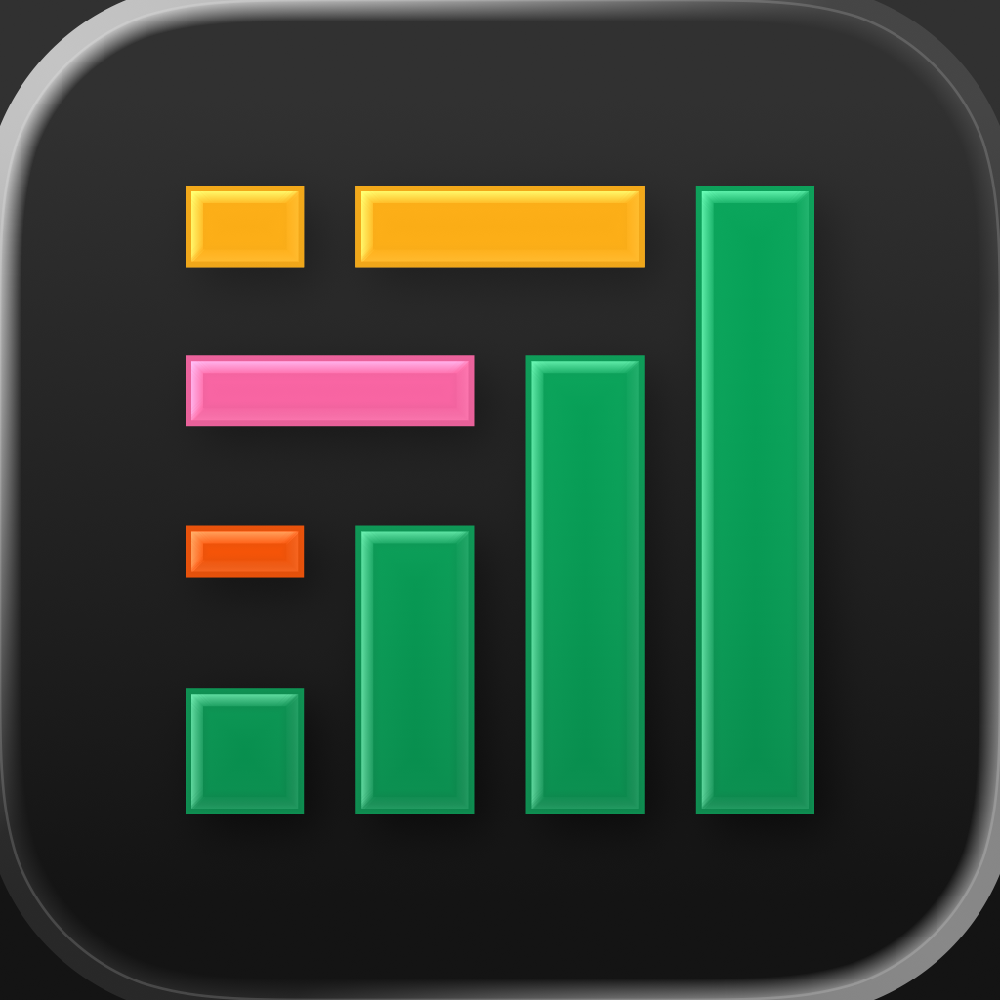

# Composer

> La stratégie de trading comme **arbre de blocs** : on empile des pondérations vertes, des conditions bleues et des filtres roses, et l'ensemble se lit en anglais courant. Le seul produit de trading **clair** de tout le corpus, dessiné par une équipe qui employait un cognitiviste à plein temps et voulait faire « l'Ableton Live de l'investissement ».

**Sources :** site officiel et son CSS (460 Ko en un seul fichier) · l'app réelle, dont l'arbre est **public sans compte** · centre d'aide illustré · App Store · API publique documentée · podcast Alpaca · Product Hunt (7 lancements) · Wayback Machine

> **Lecture** : chaque famille d'écrans est montrée par **une planche** (`<aspect>/planches/`), légendée juste dessous. Les fichiers individuels restent dans leur dossier d'aspect.

## En bref

- **Une couleur par type de bloc, et le code tient en trois teintes** : vert pour l'allocation, bleu pour la logique conditionnelle, rose pour le tri et la sélection. Il est identique dans l'éditeur web, dans la doc, dans le marketing, et il **survit à la traduction mobile** — l'onglet « Logic » de l'app iOS reprend les mêmes pilules.
- **Les conditions sont écrites en anglais, jamais en symboles.** Aucun opérateur mathématique nulle part : « 10d Cumulative Return of Any Of( NVDA TSLA AAPL ) are greater than 10% ». Et le popover d'édition est une **phrase construite de menus déroulants**.
- **Le produit affiche son propre DSL en clair, dans une publicité.** Le panneau « Create with AI » montre le `(defsymphony …)` en s-expression Clojure, avec un bouton Copy — chez un produit qui vend le no-code, c'est un aveu assumé.
- **Une seule police pour tout** : Neue Haas Grotesk Display, cinq graisses, des titres de 60 px aux cellules de table de 14 px. Aucune monospace, aucune fonte tabulaire. La densité passe par l'échelle et le gris, pas par un changement de famille.
- **Le fond n'est pas blanc et le noir n'est pas noir** : `#ecedee` pour le fond, `#101516` (un vert-noir) pour les panneaux sombres. Le blanc pur est réservé aux cartes qui doivent flotter.
- **Inversion de thème entre les surfaces.** Le web est clair — sauf le panneau de backtest, encastré en **bande noire** au milieu de la page. L'app iOS fait exactement l'inverse : tout est sombre, et c'est l'en-tête de compte qui reste clair.
- **93 `@keyframes` écrits à la main**, aucun framework : la page d'accueil rejoue littéralement le produit en CSS — curseurs de communauté, lignes de table qui apparaissent, blocs conditionnels qui se plient.
- **L'équipe UX était plus grosse que l'équipe d'ingénierie**, et un cognitiviste post-doctoral travaillait à plein temps sur site. Dit par le CEO lui-même, sur enregistrement, en 2021.

## Écrans

![[ecrans/planches/planche-editeur-et-arbre.png]]

**L'arbre de décision est public sans compte** — c'est ce qui rend ce dossier possible : `app.composer.trade/symphony/<id>/details`, onglet Logic, rend l'app réelle sans session. Le canevas est un graphe vertical à connecteurs coudés colorés selon le parent, sur fond pointillé (les captures les plus récentes passent à une grille de lignes). La hiérarchie est faite de **pilules totalement arrondies** (`border-radius: 9999px`) dont le paramètre s'écrit dans le libellé : « WEIGHT Inverse Volatility 25d », pas un réglage caché derrière un engrenage.

Les feuilles de l'arbre sont des cartes blanches à badge ticker noir, avec la raison sociale complète et la place de cotation. L'indentation en cascade fait ~40 px par niveau, et chaque pilule porte un chevron de pliage — **dont l'état est sauvegardé dans la stratégie elle-même** (le schéma de l'API expose `collapsed?` et `collapsed-specified-weight?` : le pliage du canevas fait partie du document, pas des préférences locales).

![[ecrans/planches/planche-bibliotheque-et-factsheet.png]]

**Le contraste entre la couche marketing et la couche donnée est brutal, et il n'est pas typographique.** C'est la même police partout ; l'écart se joue sur l'échelle, la densité et la chromie. La « Symphony Database » — 134 pages, ~2 680 stratégies, ouverte sans compte — est une table de **treize colonnes triables** en 14 px gris sur blanc, sans une seule couleur hors le bleu des liens. Juste au-dessus, un titre de 60 px et un hero en mosaïque saturée.

Sur la fiche individuelle, les deux couches se touchent physiquement : le panneau de backtest est une **bande noire qui coupe la page en travers**, immédiatement suivie d'une **bande vert vif pleine largeur** portant les blocs éditoriaux. Le passage donnée → marketing se fait par une frontière de couleur nette, sans transition.

Et les noms de la bibliothèque ne sont pas lissés : « The Holier Grail (NMB Cleaned) », « Inside Nancy Pelosi's Chips- V3 », « Pals Minor Spell of Summon Money », emojis compris. Le produit assume que ses stratégies sont écrites par sa communauté.

Le plus bel objet du lot est `how-it-works-arbre-et-texte-cote-a-cote.png` : **la même logique montrée deux fois, côte à côte** — l'arbre en lecture seule à gauche, et à droite une « Live Text Description » qui la re-narre en phrases à émojis (⏱ Every month / ② Pick two assets from the list below / 🥇 with the highest / 📏 20-day cumulative return / ⚖️ and weigh the picks equally), suivie du tableau des valeurs du jour avec les deux lignes retenues surlignées.

![[ecrans/planches/planche-store-ios.png]]

**L'app iOS est l'inverse chromatique du web** et pourtant le code couleur des blocs tient : l'onglet « Logic » d'une fiche de symphonie affiche les mêmes pilules vertes et roses sur fond noir. Les créas du store ont chacune un fond photographique différent — ciel bleu nuageux, montagne, marbre — avec un titre en gras condensé blanc. Registre « nature grandiose », zéro violet fintech. **Aucune app Android n'existe** : cinq packages testés, tous en 404.

## Flows

![[flows/planches/planche-flows.png]]

**La couche sociale est traitée comme une fonctionnalité de première classe, pas comme un partage bolt-on.** Deux gros boutons bleus flottants — « ◎ Publish to Community » et « ⧉ Remix » — et une fiche de symphonie qui affiche ses compteurs en pastilles noires : « Remixes 5,260 », « Watched by 1,402 ». Une stratégie publiée est un objet qu'on **forke**, et le vocabulaire l'assume.

Détail de mise en scène des maquettes marketing : **les lignes non pertinentes sont laissées en skeleton gris**. Le mockup ne remplit pas ce qu'il ne veut pas montrer — un choix plus honnête que du faux contenu.

Le panneau « Symphony Details » est là où se règle le comportement d'exécution, et il révèle une décision d'architecture : les deux « Trading Types » — `Calendar` (fréquence temporelle) et `Threshold` (seuil de dérive d'un actif) — sont **deux champs du même nœud racine**, pas deux modes séparés. Le schéma de l'API le confirme (`rebalance` et `rebalance-corridor-width` cohabitent).

Et « Create with AI » ferme la boucle : l'IA écrit le DSL dans un panneau à onglets Chat / Code, puis l'insère dans le canevas avec quatre actions — Copy / Edit / Insert / **Insert & backtest**. La dernière est la plus intéressante : générer et évaluer d'un seul geste.

## Composants

![[composants/planches/planche-grammaire-de-blocs.png]]

**Le menu « ADD BLOCK » est la carte du langage** : six types seulement — Asset, Group, Weight (Allocation), If/Else (Conditional), Any/All (Multiple Conditions), Filter — chacun avec son icône colorée et sa phrase d'explication. Six primitives pour composer n'importe quelle stratégie.

Le popover **« EDIT CONDITIONAL » est le composant à retenir de tout ce dossier** : un formulaire fait uniquement de pilules-menus qui se lisent comme une phrase — `if [10d Cumulative Return] of [Any of | All of] [NVDA, TSLA, +1]` / `are [greater than | less than]` / `[10%]`. Les mots de liaison (`if`, `are`) sont des pastilles grises inertes. On construit une expression booléenne sans jamais voir une parenthèse.

Le bloc **Filter** mérite sa mention à part : la paire « SORT 90d Cumulative Return » + « SELECT Top 3 » pointe des flèches roses vers chaque candidat, et **les actifs non retenus restent affichés en fondu**. Montrer ce qui a été écarté, plutôt que de le faire disparaître, est un choix de design rare.

![[composants/planches/planche-donnee-et-chrome.png]]

**Le module de backtest est un objet noir dans une page claire**, avec sa propre barre d'outils (période, presets, Investment / Fees / Slippage, bouton RUN vert lime), son mini-scrubber de plage, et ses chips de série colorées. Le graphe d'allocation historique est la seule dataviz vraiment polychrome du produit : une aire empilée à 100 % en rouge, orange, vert, bleu, violet.

Le chrome de l'éditeur tient en peu de choses : un split-button « Save changes », une paire Undo/Redo, et une entrée **« Clean up »** à l'icône balai — un bouton qui range l'arbre. Et la barre de recherche est aussi l'entrée du chat : « ENTER — Chat with AI about *apple* ». Un seul composant pour deux intentions.

## Couleurs

![[couleurs/palette-le-code-couleur-des-blocs.svg]]

**C'est le vrai design system du produit, et il tient en trois couleurs.** Vert = allocation, bleu = logique, rose = sélection ; le blanc porte les actifs, l'ambre signale l'emplacement vide. Ce code a survécu à trois refontes complètes de la marque et à la traduction mobile — c'est l'actif de DA le plus solide de Composer.

| Rôle | Hex | Où il apparaît |
| --- | --- | --- |
| Weight (opérateur) | `#31805a` | pilule « WEIGHT Equal / Specified / Inverse Volatility / Market Cap » |
| Poids explicite | `#1ec072` | sous-pilule de valeur (« 60.00 % »), plus vive que l'opérateur |
| If / Else (condition) | `#1f86ff` | toute la logique conditionnelle, écrite en anglais |
| Filter (tri, sélection) | `#f6609f` | la paire SORT + SELECT Top N et ses flèches |
| Emplacement vide | `#ffbb38` | « Add a Block — Securities, Weights, Conditions… » |

![[couleurs/palette-declaree.svg]]

**Aucune charte n'est publiée** — ni chez Composer, ni chez SoFi (dont le newsroom répond 403 derrière Cloudflare, donc non vérifié plutôt qu'absent). Ces valeurs sont lues dans un CSS de 460 Ko où Tailwind compilé s'empile sur une couche Webflow héritée : deux générations de site cohabitent dans le même fichier, avec un bleu marine `#002e50` qu'on ne voit plus nulle part.

Le fait notable est le **cyan `#2fc1ff`** : il existe bien, mais il ne sert quasiment jamais en aplat. Il vit en **orbe flouté** (`filter: blur(100px)`, animation de 10 s), toujours apparié au rose pastel `#ffb4ed`, et il est réservé à tout ce qui touche à l'IA. C'est un accent d'ambiance, pas un accent d'interface.

![[couleurs/palette-relevee-dans-les-ecrans.svg]]

**Le seul produit clair du corpus de trading du vault.** TradeZella, RizeTrade, Trader's Second Brain, UltraTrader, TradeTrack, StonkJournal, TraderSync, [[temper]], [[tradingplan]] : tous sombres. Composer est à 75,7 % de clairs — et son fond n'est même pas blanc.

| Famille | Part | Rôle |
| --- | --- | --- |
| blanc pur `#ffffff` | 35,11 % | cartes et tables, **pas** le fond |
| gris de fond `#ecedee` | 17,95 % | le vrai fond du site et du canevas |
| gris de ligne `#f7f7f7` | 4,59 % | alternance des lignes de table |
| noir de marque `#101516` | 4,34 % | le panneau de backtest, encastré |
| noir pur `#000000` | 6,26 % | bordures d'écran, badges tickers |
| vert `#1ec072` | 1,80 % | la couleur saturée la plus présente |
| cyan `#43b9fa` | 1,52 % | tracé des courbes de backtest |

> Relevé fait sur les 10 fichiers d'UI de `ecrans/`. Les trois créas App Store sont exclues : ce sont des photographies, elles auraient gonflé les bleus de 15 points.

## Branding

![[branding/planches/planche-identite.png]]

**Le logo est un mini graphique en barres** : cinq barres vertes croissantes coiffées de traits jaune, orange et rose, plus un tiret orange vif à gauche. Il n'est servi qu'en **PNG 280 × 48** — aucun SVG n'existe en fichier (le mark du header est un `<svg>` inline). Le lockup actuel est vertical : « Composer » avec « by SoFi » dessous, mark SoFi inclus, et il apparaît jusqu'en filigrane à l'intérieur des graphiques de backtest.

Le jeu de **six icônes de catégorie sur carrés noirs** est l'actif le plus identitaire après le code couleur : traits fins qui se replient en flèche, cibles concentriques, étoile de huit flèches multicolores, balance de deux cibles sur un triangle. Vert, rose, orange, jaune, cyan, violet sur noir — la palette entière du produit condensée dans un bandeau.

Et l'abonnement n'est pas un tableau de prix : c'est un **objet physique**, une plaque noire mate gaufrée « $288/YR — FULL ACCESS PASS TO AUTOMATED TRADING » avec son numéro de série. Une carte de membre plutôt qu'une grille tarifaire.

La photographie de marque de la page `/ai` est encore un autre registre : main humaine tenant une sphère irisée, ciel réel, paysage de roche rouge. Organique et chaud, posé sur les mêmes grilles de pixels — et le titre y passe en graisse régulière quand la home est en bold. La page IA se veut plus calme que le produit.

## Marketing

![[marketing/planches/planche-marketing.png]]

**Le site rejoue le produit plutôt que de le montrer.** Les 93 `@keyframes` sont écrits à la main et animent des reconstitutions HTML : lignes de table qui se remplissent, curseurs de communauté qui se déplacent, blocs conditionnels qui se plient. Toute une famille est même dupliquée en variante `-crypto`, trace d'une section qui a existé.

Le hero est une mosaïque de rectangles pleins non alignés — vert, rose, cyan, orange, bleu marine, certains texturés de points — derrière un « Composer » géant qui **déborde et passe devant les blocs**. La baseline, « Trading. Built better. », est posée en dessous.

`marketing/defsymphony-le-dsl-affiche-en-clair.png` est le visuel le plus contre-intuitif du dossier : un produit no-code qui met son code source en publicité.

## Process

**Deux faits, tous deux sourcés, et aucun n'est trivial pour un produit financier de 2021.**

Dans le podcast Alpaca du 26 août 2021, le CEO Benjamin Rollert explique que Composer employait **un cognitiviste post-doctoral à plein temps, sur site**, et que **l'équipe UX était délibérément plus grosse que l'équipe d'ingénierie** — la conviction étant que le vrai problème du produit était le design, pas la technique. Il nomme aussi sa référence, et ce n'est pas un concurrent : **Excel**, « simultaneously extremely usable and extremely flexible ». Il rejette explicitement les deux échecs classiques du no-code de trading — « a not very good imperative programming language », ou une boîte trop rigide. Les étalons de qualité cités sont Figma, Notion et Superhuman.

Le second document est un post LinkedIn du designer fondateur, **Mikael Staer Nathan**, à l'annonce du rachat : « Six years ago, I joined Composer as the first hire and designer. Three guys and a digital napkin sketch. » Et la thèse d'origine, en une phrase : **« We want to build the Ableton Live of investing. »** Toute la nomenclature — symphonie, Opus, Composer — en découle. Ce n'est pas du branding plaqué, c'est le concept fondateur.

Le versant technique répond au versant design : le choix de **Clojure** (documenté sur le blog d'ingénierie) n'est pas indépendant de la forme du produit. Une symphonie *est* un arbre de données, et le Lisp en est la représentation naturelle. L'API publique le confirme au champ près — types de nœuds `root / group / if / filter / asset`, quatre nœuds de pondération distincts, conditions `binary` et `compound` avec opérateurs `any` / `all` : le schéma de données et la grammaire visuelle sont le même objet.

## Archive

![[archive/planches/planche-millesimes.png]]

**Trois directions artistiques nettement distinctes en cinq ans**, et un arc de baseline qui raconte tout : « Investing, made creative. » (2021) → « The Next Generation of Active Investing » (2022) → « Investing. Built Better. » (2023) → « Trading. Built Better. » (2025) → « Composer by SoFi — Trading. Built Better. » (2026). Créatif, puis financier, puis trader, puis absorbé.

Le millésime 2021 est le plus éloigné : logo « COM/PO/SER » empilé sur vert forêt profond, arbre de symphonie figuré en barres arrondies multicolores. En octobre 2022, l'ère **Opus** bascule sur un gris clair éditorial avec des illustrations géométriques hachurées. Mai 2023 marque la rupture technique — sortie de Webflow vers une stack maison — et installe la charte encore en place aujourd'hui.

**Le rachat par SoFi n'a rien re-brandé**, et c'est vérifiable : l'`opengraph.png` a un md5 **identique** entre juillet 2024 et août 2026. Seul le `<title>` gagne « by SoFi ». Un dossier qui annoncerait une refonte post-rachat se tromperait. L'ancien nom survit d'ailleurs dans les URL : les PDF réglementaires sont servis depuis un bucket `www.investcomposer.com`.

Les mockups de l'éditeur de 2021 sont précieux : le menu « ADD BLOCK » y expose déjà tout le vocabulaire — Asset, Group, Weight, If/Else, Filter — avec le même codage par icône colorée. **La grammaire n'a pas bougé en cinq ans**, seule sa peau a changé.

## Pourquoi je l'aime

- **Un code couleur à trois teintes qui tient cinq ans, trois refontes et deux plateformes.** C'est la démonstration qu'un système se juge à ce qui survit, pas à ce qui brille.
- **Montrer ce qui a été écarté.** Les actifs non retenus par le Filter restent visibles en fondu — l'interface explique sa propre décision.
- **Deux représentations synchronisées de la même logique**, l'arbre et sa narration en phrases, côte à côte sur le même écran. Rare, et immédiatement compréhensible.
- **Une seule police du titre de 60 px à la cellule de 14 px.** Le pari inverse de tout le secteur, et il tient.
- **Un cognitiviste à plein temps dans une startup fintech de 2021.** La meilleure anecdote de méthode de tout le vault.

## À réutiliser pour

- Tout **éditeur visuel de logique** : la pilule qui porte son paramètre dans son libellé, et le popover-phrase fait de menus déroulants.
- Une **table dense en fin de tunnel marketing** : le contraste d'échelle et de densité sans changement de police.
- Un **panneau de données encastré** en bande sombre dans une page claire, traité comme un instrument à part.
- Projet : [[ ]]

## Limites de la récolte

- **L'éditeur en écriture reste derrière le login.** Aucun compte n'a été créé. Ce que montre `ecrans/` vient soit des captures officielles pleine résolution, soit de l'arbre en **lecture seule accessible publiquement**. `/symphony/<id>/logic` en URL directe redirige vers l'inscription : seul le chemin `/details` fonctionne, l'onglet étant une bascule client.
- **Aucun press kit.** Sept routes testées chez Composer, toutes en 404. Côté SoFi, `sofi.com/press`, `/newsroom`, `/brand` et `investors.sofi.com` répondent **403 derrière Cloudflare**, y compris en Chrome headless : impossible de vérifier si le press kit SoFi couvre Composer — ni dans un sens ni dans l'autre.
- **Aucun logo vectoriel** en fichier. Le mark du header est un SVG inline, `/images/logo.svg` est en 404.
- **Aucune base d'UI n'indexe le produit** : Appshots, Screensdesign, Refero et Banani vérifiés, zéro résultat. UXArchive et Mobbin en 403 — non conclu.
- **Aucun designer nommé sur un visuel précis.** Mikael Staer Nathan est le designer fondateur et unique au démarrage, mais aucune source ne dit qu'il a dessiné tel écran. Il n'a par ailleurs publié aucun travail Composer en portfolio. Crédit laissé à l'entreprise.
- **Un deuxième designer existe probablement** (l'équipe UX était censée dépasser l'ingénierie) mais aucune source publique ne le nomme : champ laissé vide plutôt que déduit.
- **Le « Composer Manifesto » n'a pas été lu** (Medium répond 403). Le lien est rapporté, son contenu n'est pas exploité.
- **L'écran d'options chain manque** : ses trois captures sont hébergées sur un CDN Google qui répond 403.

## Sources

- **L'app réelle, sans compte** — `app.composer.trade/symphony/<id>/details`, onglet Logic : l'arbre déplié en 3000 × 3150. C'est la pièce maîtresse du dossier. → [app.composer.trade](https://app.composer.trade/symphony/MmQbpf2U5TMQFmr9Nt2e/details)
- **Site officiel et son CSS** — 460 Ko en un fichier : les tokens, les 93 `@keyframes`, les orbes floutés de l'IA, les captures officielles de l'éditeur en 2880 × 2376. → [composer.trade](https://www.composer.trade)
- **Bibliothèque publique** — 134 pages, ~2 680 symphonies, table de 13 colonnes, fact sheets complètes, sans login. → [composer.trade/trading-strategies](https://www.composer.trade/trading-strategies)
- **Centre d'aide illustré** — la seule fenêtre publique sur l'éditeur en usage : menu ADD BLOCK, popovers, conditions imbriquées, panneau Symphony Details. → [help.composer.trade](https://help.composer.trade/article/54-create-tutorial)
- **API publique** — `swagger.json` (299 Ko) lu sans appeler d'endpoint : le schéma `symphony-score-v1` confirme la grammaire visuelle au champ près, et révèle que l'état de pliage du canevas est persisté dans la stratégie. → [api.composer.trade/docs](https://api.composer.trade/docs/)
- **Podcast Alpaca #015** (26 août 2021) — la doctrine de conception, par le CEO : le cognitiviste, l'équipe UX surdimensionnée, Excel comme référence. → [alpaca.markets/learn/podcast-episode15](https://alpaca.markets/learn/podcast-episode15)
- **Product Hunt** — 7 lancements de 2021 à 2025, dont les visuels de galerie sont des millésimes datés de l'UI. → [producthunt.com/products/composer-2](https://www.producthunt.com/products/composer-2)
- **Wayback Machine** — 200 captures, 174 versions distinctes : les trois DA, l'arc de baseline, et la preuve que le rachat n'a rien re-brandé. → [web.archive.org/…/composer.trade](https://web.archive.org/web/*/composer.trade*)

## Crédits

- **Mikael Staer Nathan** — Founding Designer, premier employé (juillet 2020), seul designer au démarrage. Formé à l'OCADU (Toronto) puis master en Visual Communication au KADK (Copenhague). Aujourd'hui chez SoFi. → [mikael.design](https://www.mikael.design/) · [LinkedIn](https://ca.linkedin.com/in/mikaelstaer) · [x.com/mikaelstaer](https://x.com/mikaelstaer)
- **Benjamin Rollert** — CEO et co-fondateur, auteur du « Composer Manifesto » et de l'exposé de doctrine du podcast Alpaca. → [composer.trade/author/benjamin-rollert](https://www.composer.trade/author/benjamin-rollert)
- **Ananda Aisola** (COO) et **Ronny Li** (CTO puis Chief Data Officer, auteur des billets d'ingénierie) — co-fondateurs. Aucune source ne leur attribue de travail de design.
- **Composer Technologies Inc.**, Toronto, fondée en 2020 par trois anciens de Ritual et Breather. ~11,4 M$ levés (First Round Capital, Left Lane Capital, Golden Ventures, Not Boring Capital). Rachetée par **SoFi** le 23 juin 2026, conditions non divulguées.
- **Neue Haas Grotesk Display** — dessin original de **Max Miedinger** (1957-1961, direction artistique Eduard Hoffmann), revival par **Christian Schwartz** commandé en 2004 par Mark Porter au *Guardian* et achevé en 2010 pour Richard Turley à *Bloomberg Businessweek*. Servie ici via Adobe Fonts. → [commercialtype.com](https://commercialtype.com/catalog/neue_haas_grotesk)

## Mots-clés

constructeur de stratégie, strategy builder, no-code, low-code, arbre de décision, decision tree, canevas, canvas, éditeur visuel, éditeur de blocs, block editor, node editor, graphe, pilule, chip, popover, menu déroulant, condition, if-then, if-else, any-of, all-of, booléen, imbrication, récursif, pondération, allocation, weight, inverse volatility, market cap, filtre, sort, select top n, actif, ticker, ETF, backtest, backtesting, rapport de performance, Sharpe, Calmar, drawdown, expectancy, out-of-sample, benchmark, slippage, rebalancing, seuil, symphonie, symphony, DSL, Clojure, EDN, s-expression, defsymphony, langage naturel, langue naturelle, plain language, live text description, code couleur, couleur par type, design system, une seule police, Neue Haas Grotesk, Helvetica, Christian Schwartz, thème clair, light mode, inversion de thème, bande noire, encart sombre, dataviz, aire empilée, orbe flouté, blur, keyframes, animation CSS, rejouer le produit, bibliothèque publique, communauté, remix, publier, fork, marketplace, Product Hunt, Golden Kitty, SoFi, rachat, acquisition, rebranding, cognitiviste, sciences cognitives, équipe UX, Ableton Live, Excel, Figma, Notion, Superhuman, Toronto, MCP, Claude, IA générative, vibe trading

## À voir aussi

- [[tradingplan]] — l'autre bâtisseur de règles, mais en formulaire plutôt qu'en graphe, et sombre.
- [[temper]] — l'opposé exact sur la couleur : 48 % de noirs contre 76 % de clairs ici.
- [[traders-second-brain]] · [[tradezella]] — les journaux de trading, pour situer ce que Composer ne fait pas.
- [[_APPS]] · [[_COMPOSANTS]] · [[_ANIMATIONS]]
