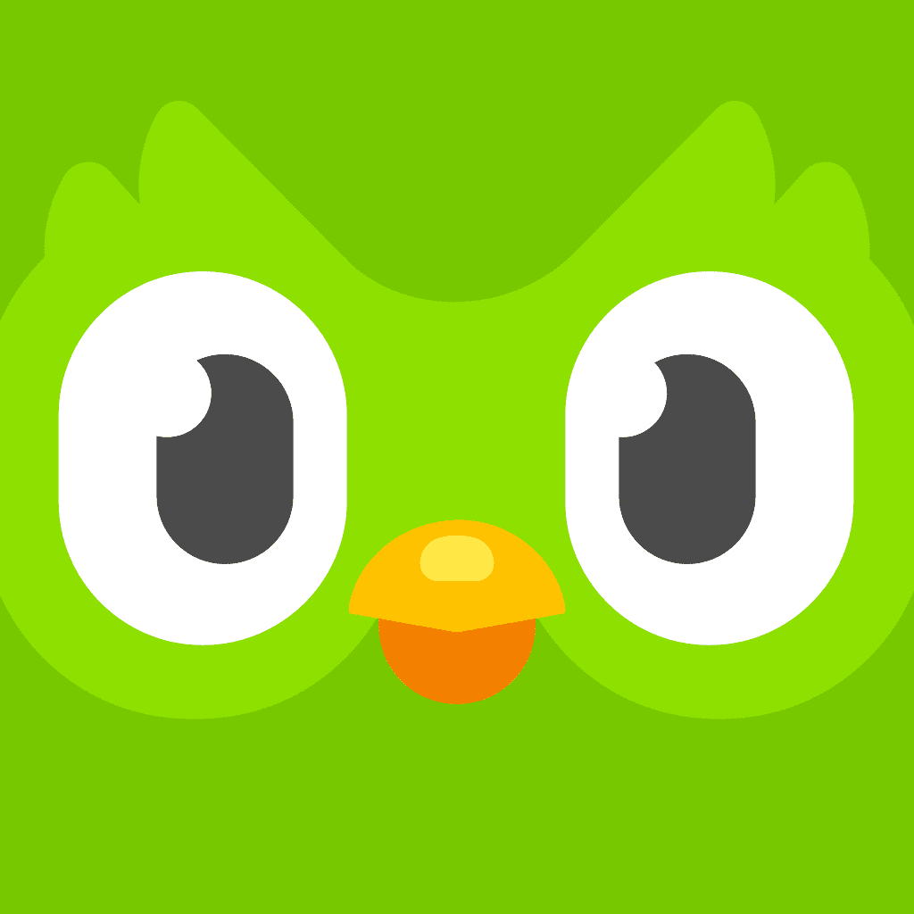

# Duolingo — le produit

> Le dossier de **l'application** : ses écrans, ses parcours, ses paywalls, son système de gamification et les deux refontes qu'elle a publiquement documentées. Complément produit de [[duolingo]], qui contient le brand book vectoriel complet (logotype, character design, illustration, palette officielle). Ici, rien de la charte : uniquement ce que l'app fait à l'écran.

**Ce qui rend cette cible rare pour un designer product** : Duolingo publie ses cas d'étude. La refonte du chemin (2022) et le « Tab Refresh » (2026) existent en ligne avec le diagnostic, les directions écartées, les critiques internes en légende et l'avant/après. Presque aucun produit de cette taille ne fait ça.

> **Lecture** : chaque famille d'écrans est montrée par **une planche** (`<aspect>/planches/`), légendée juste dessous. Les fichiers individuels restent dans leur dossier d'aspect — c'est de là qu'on récupère un écran précis, en résolution native.

---

## Le produit en bref

- **Trois surfaces, une seule mise en page.** iOS, Android et le web partagent la même colonne centrale d'environ 440 px. Le web n'est pas repensé : il ajoute une sidebar verticale (LEARN / LEADERBOARDS / QUESTS / SHOP / PROFILE / MORE) à la place de la tab bar, passe l'onboarding sur deux colonnes, remplace les icônes d'action par des libellés en capitales, et laisse d'énormes vides à gauche et à droite.
- **Le blanc est la structure.** Sur les 20 écrans officiels du press kit, le blanc occupe **82,6 %** de la surface. Pas de gris de fond, pas de conteneurs : la hiérarchie tient à l'espacement, aux bordures de 2 px en `#E5E5E5` et au rayon unique.
- **Le bleu, pas le vert, est la couleur d'interaction.** Contre-intuitif et vérifié au pixel : dans une leçon, Macaw `#1CB0F6` (2,5 % de la surface) est presque **quatre fois** plus présent que Feather Green `#58CC02` (0,68 %). Le vert est réservé à la validation et au bouton Continuer ; le bleu porte la sélection, l'audio et le micro.
- **Boutons en pilule à arête basse.** Chaque bouton plein a une arête d'un ton plus foncé sous lui (`#1899D6` sous le bleu, `#4EAD10` sous le vert) : un relief de 4 px qui donne la sensation d'un bouton physique enfonçable. C'est le détail le plus copié de l'app.
- **Le palier payant inverse tout.** Super et Max abandonnent le blanc pour un dégradé de nuit (`#2D2473` → `#4C1C73`), le vert pour le bleu-violet `#3C4DFF`, et s'autorisent des dégradés que le produit gratuit s'interdit.
- **Le personnage est un composant d'interface.** Duo et le cast ne décorent pas : ils portent la consigne (bulle de dialogue), la validation, la célébration, la culpabilisation (widget, notifications) et désormais la conversation (Video Call). C'est ce qui fait tenir un produit d'apprentissage sur un registre de jeu.

---

## Écrans

### Les 14 types d'exercice

![[ecrans/planches/planche-exercices-duolingo.png]]

La grammaire complète de l'app, en résolution native depuis le press kit officiel. Chaque exercice réutilise le même châssis — barre de progression + croix de sortie + compteur de cœurs en haut, consigne, zone de réponse, barre d'action basse — et ne change que la zone du milieu. Écoute et réponds, mot manquant, syllabes entendues, son d'un kana, bonne image (label NEW WORD violet), phrase à prononcer avec révélation, tracé de caractère manquant, micro, paires à associer, banque de mots, jetons de traduction, saisie libre. Le bouton CONTINUER reste **gris désactivé** jusqu'à ce qu'une réponse existe : l'app ne laisse jamais partir à vide.

### Les six onglets, après le Tab Refresh 2026

![[ecrans/planches/planche-onglets.png]]

Chemin, Quêtes (objectif mensuel « Duo's Frozen Winter »), Ligue saphir, Feed d'amis, Profil, Video Call. C'est l'état livré de la refonte documentée plus bas dans [[#Process]] : taille de header hiérarchisée selon la fonction de l'onglet, titre toujours au même endroit, système typographique resserré.

### Les cours non linguistiques

![[ecrans/planches/planche-cours-math-music-chess.png]]

Math, Music et Chess sont trois **sous-univers chromatiques** greffés sur le même squelette : bleu quadrillé pour Math (hub « Math Games » en grille de six jeux), violet pour Music (chemin à nœuds de notes, carte de morceau à étoiles, clavier tactile), vert et blanc d'échiquier pour Chess. La preuve que le système encaisse un changement complet de matière sans changer de structure.

### Écrans réels derrière le login

![[ecrans/planches/planche-ecrans-reels-android.png]]

Ce que le press kit ne montre pas : la boutique et ses trois paliers de gemmes, la recharge de cœurs à 350 gemmes, le Streak Freeze équipé, le calendrier de série avec la Streak Society encore cadenassée, les réglages de notification, la modale violette « Double XP pendant 15 minutes », la ligue bronze avec sa Tour Eiffel, les records personnels. Captures d'un enregistrement Page Flows (Android, 2024).

### L'app web et le Duolingo English Test

![[ecrans/planches/planche-app-web.png]]

Deux leçons dans le navigateur, la recherche d'amis en trois colonnes, et surtout le **Duolingo English Test** — la sous-marque qui inverse la hiérarchie chromatique : l'item de nav actif y est une pilule **bleu clair**, le CTA principal est bleu `#1CB0F6`, le vert ne sert plus d'état. Même famille typographique arrondie, logo différent (un sceau festonné avec la silhouette de Duo évidée, pas la tête de Duo).

### Le paywall Super, six millésimes

![[ecrans/planches/planche-paywalls-millesimes.png]]

La chronologie tarifaire lue sur les captures datées :

| Date | Essai | Individual | Family | Autres |
| --- | --- | --- | --- | --- |
| janv. 2022 (Plus) · à vérifier | 14 jours | 79,99 $/an — 6,67 $/mois | 119,99 $/an — 9,99 $/mois | capture écartée du dossier : provenance introuvable |
| 28 févr. 2025 | « TRY FOR $0.00 » | prix non affichés | — | argument « 4.2x more likely to finish » |
| 2 juin 2025 | 7 jours (annuels) / aucun | 95,99 $/an — 7,99 $/mois | 119,99 $/an — 9,99 $/mois | Student 47,99 $/an, Monthly 12,99 $/mois |
| 5 sept. 2025 | 7 jours | 95,99 $/an | 119,99 $/an | — |
| 8 déc. 2025 | 7 jours | 95,99 $/an | 119,99 $/an | prix inchangés sur 3 mois |
| 18 juin 2026 | **30 jours** | 9,99 $/mois — 119,99 $/an | 11,99 $/mois — 143,99 $/an | +25 % sur l'annuel individuel |

Trois mouvements de design lisibles dans cette suite. **Un** : l'essai passe de 14 jours (ère Plus) à 7, puis remonte à 30 en 2026 — le levier a changé de nature, on ne vend plus une remise mais une longue habitude. **Deux** : la durée d'essai devient un **outil de segmentation**, affichée comme un séparateur au-dessus des offres (7 jours pour l'annuel, 3 jours pour le mensuel, aucun pour le plan étudiant) — l'essai décourage activement le mensuel. **Trois** : en 2026 le paywall s'inverse graphiquement, cartes claires sur fond de nuit, et les bénéfices passent d'une liste globale à un détail par carte.

Le tableau comparatif FREE vs SUPER, lui, ne bouge pas : cinq lignes dont **une seule** cochée côté gratuit. Et le CTA principal est devenu « TRY FOR $0.00 » avec une icône de lien externe, « PAY IN APP » relégué en lien secondaire dessous — l'achat web-first pour contourner la commission de l'App Store.

### La créa App Store, août 2026

![[ecrans/planches/planche-store-2026-08.png]]

Huit écrans habillés d'un bandeau de couleur pleine par promesse (orange, bleu, violet, jaune, rouge, vert). Millésime daté et intéressant à comparer avec les huit rangés dans [[duolingo]] : les échecs, le Video Call et la série ont disparu de la vitrine, remplacés par des exercices de **prononciation**. La créa store suit la feature qu'on pousse, pas la marque.

Écrans isolés notables, hors planche : `ecrans/feature-mini-units-2026-chemin-pleine-hauteur.png` (le chemin sur toute sa hauteur, avec l'icône éclair d'énergie dans la top bar), `ecrans/feature-practice-hub-2026-onglet-entrainement.png` (l'onglet Practice devenu gratuit en février 2026, header bleu et cartes de skills), `ecrans/feature-tournoi-diamant-demi-finales.png`, `ecrans/feature-friend-streak-drawer.png`, `ecrans/energie-2025-explication-nouvelle-monnaie.jpeg`.

---

## Flows

### Onboarding — l'inscription arrive en dernier

![[flows/planches/planche-onboarding-duolingo.png]]

Le parcours le plus étudié du produit, et sa mécanique est explicite. L'engagement est **annoncé et minimisé** (« Just 7 quick questions before we start your first lesson! », « Here's your first 2 minute lesson. »), la création de compte est **repoussée après la première leçon** et sautable (une croix, pas une flèche retour), et elle arrive avec un levier de peur de perte : « Don't lose your progress! Let's create a profile. » Le paywall comparatif Super est glissé **dans** ce flux, avant toute inscription. Le même écran existe en clair et en sombre — utile comme paire.

Les trois écrans iOS (`onboarding-ios-*`) montrent la version longue : choix de langue groupé par langue de départ, sept motivations à icône, puis « Start from scratch » (badge RECOMMENDED) contre « Find my level ».

### La refonte du chemin, novembre 2022

![[flows/planches/planche-refonte-du-chemin-2022.png]]

Déployée pour tous les apprenants le **1er novembre 2022**. L'arbre de compétences en grille (parcours libre) devient un **chemin unique linéaire** ; chaque compétence, qui valait six paliers de couronne, est condensée en trois niveaux posés directement dans le chemin ; les Stories quittent leur onglet violet pour devenir des nœuds ; les Tips sont regroupés dans un « guidebook » par unité.

Luis von Ahn, sur l'intention : « The two goals that we had were decreasing confusion and increasing learning outcomes. » Le constat de départ : « Two people could spend the same number of hours doing the same number of lessons, but end up in different places » (Ryan Sims, VP of Design).

Et le backlash, qui fait partie du cas d'étude : des dizaines de tweets « the worst update ever », des comparaisons à Candy Crush, des campagnes d'avis une étoile, un compte Twitter « Duo Is Sad », une pétition Change.org. Le grief de fond, formulé par un designer utilisateur : « I don't believe for a second that there's one way to learn language, and it seems like that's what they're trying to tell us. It's the opposite of inclusive. » Réponse de von Ahn : « I think it is important to realize that people are change averse » — et sur un retour en arrière, « having to maintain two separate systems is pretty difficult ». Duolingo avait anticipé et déployé d'abord sur les nouveaux utilisateurs pour mesurer l'engagement.

### Les parcours IA

`flows/video-call-lily-3-etapes-appel.png` — entrée depuis le chemin (carte « Video Call: Lily MAX / CALL +30 XP »), écran d'appel violet foncé « Calling Lily… », puis Lily plein écran avec « TAP TO SPEAK ».
`flows/max-roleplay-3-etapes-mise-en-situation.png` — mise en situation, corrections annotées en vert, bilan noir « WORDS USED 40 / XP EARNED 30 » avec badge NEW RECORD.
`flows/max-explain-my-answer-et-roleplay.png` — les deux features Max côte à côte.

### Autres parcours

`flows/app-streak-society-3-ecrans-*.png` (intronisation, paliers de récompense verrouillés, calendrier doré) · `flows/app-audio-lessons-player-travel-*.png` (player, question à l'oral, « Repeat what you hear ») · `flows/app-friends-quest-modal-*.png` · `flows/widget-flow-installation-ios.png`.

**Deux enregistrements vidéo** de l'app en fonctionnement, source Page Flows (Android 2024) — c'est là qu'on voit les transitions réelles, pas les écrans figés :
`flows/tour-complet-app-android-general-browsing.mp4` (5 min 12, 105 écrans distincts) et `flows/flow-fin-de-niveau-xp-legendary.mp4` (2 min 47, une leçon jouée jusqu'au level-up).

---

## Branding

Le brand book complet est dans [[duolingo]]. Ce qui est ici concerne le **produit** : sa typo réelle et l'icône comme surface de test.

### La typo, relevée dans les binaires servis

C'est la trouvaille la plus solide de la récolte : les polices ne sont pas déclarées en `@font-face` mais injectées en JavaScript via l'API `FontFace`, donc invisibles à un simple relevé CSS. Les fichiers eux-mêmes ont été récupérés et lus (`branding/font-*.woff2`).

| Police | Rôle | Nature | Auteur |
| --- | --- | --- | --- |
| **Duolingo Sans** | texte courant, UI | **variable**, axe `wght` 100→900, v1.500, Glyphs 3.4.1, 915 glyphes ; instances nommées 100/200/300/**350**/**575**/700/900 | Bézier Inc., « custom-designed exclusively for Duolingo, Inc. » |
| **Feather Bold** | display, titres | **statique**, un seul poids, v1.001, 453 glyphes / 409 points de code (latin de base) | Krista Radoeva chez Fontsmith (racheté depuis par Monotype) |
| **Noto Sans Math** | cours Math | statique, 5131 glyphes, table MATH | Monotype / Delve Fonts, SIL OFL |

Trois choses à retenir. **Les poids 350 et 575** de Duolingo Sans sont des crans hors échelle standard, dessinés sur mesure. **Feather Bold est trop pauvre pour le monde** : 409 points de code, pas de cyrillique, pas de diacritiques vietnamiennes — alors le code fait `["ru","uk","vi"].includes(uiLanguage) ? feather900 : feather700`, où `feather900` pointe vers le fichier **Duolingo Sans**. Autrement dit, dans les UI russe, ukrainienne et vietnamienne, la police nommée « feather » est en réalité Duolingo Sans en 900. **Noto Sans Math** est la seule police non propriétaire du stack : l'aveu que la marque n'a pas de glyphes mathématiques maison.

Note de datation : Fonts In Use documentait encore, en mars 2024, un couple **Feather Bold pour le display + DIN Next Rounded pour l'UI**. Les binaires servis en août 2026 disent Duolingo Sans. La police d'UI a donc été remplacée par une variable sur mesure entre les deux — et je n'ai pas trouvé d'annonce publique de ce remplacement.

### Feather Bold vient de la mascotte

![[branding/planches/planche-feather-bold.png]]

Le rebrand de 2019 est signé **Johnson Banks** (Londres), pas une équipe interne. Michael Johnson, son fondateur : « So many tech and Silicon Valley brands have adopted the same neutral, characterless sans-serif typography. We were determined to find something that stood out — and the answer was to use their mascot as our inspiration. » Les planches montrent la mécanique : l'aile de Duo devient la panse du `a`, la houppe de plumes au-dessus de son œil devient la boucle du `g à lunettes`. Le brief n'était pas esthétique mais d'unification — Duo, les couleurs et le style d'illustration marchaient **dans** l'app, mais il n'existait presque aucune règle pour les utiliser dehors.

`branding/wordmark-avant-apres-2019.png` — l'ancien wordmark en DIN Rounded contre le nouveau à terminaisons en bec.

### L'icône de l'app n'est pas un asset de marque, c'est une surface de test

![[branding/planches/planche-icone-chronologie-2011-2026.png]]

Quinze ans d'icône, datée à la semaine. Trois régimes : le hibou dont **le visage est le mot « duo »** (2011), le 3D skeuomorphe (2012-2013), l'aplat (2013-2019), puis depuis 2018 le « Modern Duo » qui sert de base à une **série de variantes expressives**. Duolingo A/B-teste ses icônes directement sur la fiche App Store — d'où deux variantes le même mois (nov./déc. 2025, deux en février 2026).

La séquence de dégradation vaut d'être vue en entier : Duo qui fond (oct. 2023), Duo en smoking blasé (janv. 2024), Duo épuisé (avr. 2024, justifié comme « littéralement épuisé » par ses campagnes marketing), Duo malade au nez qui coule (sept. 2024, « Duo is quite literally sick of reminding everyone to do their lessons! »), Duo glitché (nov. 2025), Duo méconnaissable et recadré (févr. 2026), Duo au pansement (févr. 2026), Duo au gribouillis tremblant (juin 2026). Le regard design extérieur n'est pas complaisant : « this is certainly the most graphic and disturbing icon I've seen so far », « this visceral guilt-tripping ploy has really ruffled my feathers » (Creative Bloq).

`branding/duo-mort-fevrier-2025.jpg` — la mort de Duo, annoncée le 11 février 2025. Fait décisif pour un dossier produit : l'opération est née comme **un changement d'icône**, pas comme une campagne. Zaria Parvez, senior social media manager : « Candidly, we had three posts, and we were gonna post them and be chilling. […] When we posted that, we saw that the user engagement was popping off. » En deux semaines, 1,7 milliard d'impressions, et deux fois plus de conversation sociale que n'importe laquelle des dix meilleures pubs du Super Bowl 2025. Puis des réunions avec le marketing, **le produit** et l'engineering pour transformer trois posts en campagne mondiale avec intégrations in-app. Le produit est traité comme un canal narratif au même titre que TikTok.

Aussi : `branding/icones-historique/` contient les icônes en fichiers séparés, dont les deux prototypes de 2010 en SVG — le hibou écarté et le **robot** jamais utilisé, révélé à la DuoCon 2024, écarté après un A/B test que le fondateur a fait passer à sa famille. Et `branding/lockup-duolingo-english-test.png` pour la sous-marque.

---

## Couleurs

Aucun hex n'est inventé ici. La **charte publiée** (noms d'animaux, Pantone, CMJN) est déjà rangée dans [[duolingo]] ; ces deux nuanciers sont un **relevé de pixels** sur les écrans de ce dossier, ce qui n'est pas la même information : ils disent ce que l'app fait vraiment de sa palette. Les noms d'animaux sont ceux de la charte officielle quand la couleur correspond ; les teintes sans nom publié sont décrites par leur rôle.

![[couleurs/palette-relevee-interface-de-lecon.svg]]

**Le blanc n'est pas un fond, c'est la structure** — 82,6 % de la surface sur les 20 écrans officiels, sans un seul gris de remplissage. Et le contre-pied de la marque : dans une leçon, le bleu Macaw est presque **quatre fois** plus présent que le vert Feather Green. Le vert est gardé pour la validation et le bouton Continuer ; le bleu porte toute l'interaction. Chaque bouton plein a aussi son arête basse d'un ton plus foncé — la paire `#1CB0F6` / `#1899D6` et la paire `#58CC02` / `#4EAD10`.

**Fond et structure**

| Nom | Hex | Part | Usage relevé |
| --- | --- | --- | --- |
| Snow | `#FFFFFF` | 82,6 % | le canevas, jamais un gris |
| Swan | `#E5E5E5` | 7,1 % | bordures 2 px des cartes et des jetons |
| Polar | `#F7F7F7` | 2,6 % | remplissage des champs de saisie |
| Hare | `#AFAFAF` | 0,3 % | texte et boutons désactivés |

**Interaction** — le bleu domine le vert

| Nom | Hex | Part | Usage relevé |
| --- | --- | --- | --- |
| Macaw | `#1CB0F6` | 2,5 % | sélection, audio, micro : la couleur d'action dans la leçon |
| Blue Whale | `#1899D6` | 0,1 % | arête basse du bouton bleu |
| Feather Green | `#58CC02` | 0,7 % | validation et CTA Continuer |
| Tree Frog | `#4EAD10` | — | arête basse du bouton vert |

**Texte**

| Nom | Hex | Part | Usage relevé |
| --- | --- | --- | --- |
| Eel | `#4B4B4B` | 0,9 % | texte courant et titres |
| Wolf | `#3D3D3D` | 0,1 % | texte fort |
| Gris moyen | `#787878` | — | libellés secondaires en capitales |
| Noir | `#000000` | 0,4 % | présent surtout via les illustrations |

**États et récompenses** — « splashes of delight », toujours en petite quantité

| Nom | Hex | Part | Usage relevé |
| --- | --- | --- | --- |
| Cardinal | `#FF4B4B` | 0,3 % | erreur et compteur de cœurs |
| Bee | `#FFD300` | 0,1 % | XP, combo, série |
| Beetle | `#CE82FF` | 0,1 % | nouveauté, Super, quêtes |
| Fox | `#F6B702` | — | or des jalons et des coffres |

![[couleurs/palette-relevee-super-et-max.svg]]

**Le palier payant inverse tout le système.** Le blanc tombe à 24,8 % et ne sert plus que de texte et de cartes ; le fond devient un dégradé de nuit ; le vert de marque disparaît complètement, remplacé par un bleu-violet. Super et Max s'autorisent des dégradés que le produit gratuit s'interdit — c'est la seule zone où la marque se contredit, et elle le fait exprès.

**Fond de nuit dégradé** — aucun de ces tons n'a de nom publié

| Nom de rôle | Hex | Usage relevé |
| --- | --- | --- |
| Bleu nuit | `#2D2473` | cœur du dégradé de fond |
| Nuit chaude | `#352273` | haut du dégradé, vers le violet |
| Nuit froide | `#152A73` | bas du dégradé, vers le bleu |
| Marine profond | `#0B2F6F` | extrémité la plus froide |

**Accents premium**

| Nom de rôle | Hex | Part | Usage relevé |
| --- | --- | --- | --- |
| Bleu-violet vif | `#3C4DFF` | 2,0 % | CTA et cartes de plan Super |
| Violet profond | `#4C1C73` | 0,8 % | fond des écrans Max et Video Call |
| Cyan pâle | `#C7FFFE` | 0,7 % | étincelles et halos |
| Snow | `#FFFFFF` | 24,8 % | texte et cartes claires du paywall 2026 |

**Deux hex tiers à ne pas confondre avec la charte.** Mobbin publie une page couleurs de marque accessible sans compte qui ajoute `#E6E6FA` et `#FF6F61` — ils n'apparaissent nulle part dans mon relevé. Et Refero donne `#76CE00` comme couleur dominante moyenne perçue de la landing, plus jaune que le `#58CC02` canonique. Ce sont des mesures de tiers, pas des couleurs déclarées.

---

## Composants

Indexés dans [[_COMPOSANTS]].

- `composants/tableau-comparatif-free-vs-super_duolingo-app.jpg` — le comparatif en **tableau** in-app, distinct des paywalls plein écran : cinq lignes, une seule coche côté gratuit.
- `composants/panneau-coeurs-upsell-super_duolingo-app.png` — le panneau Hearts (« Worry less about mistakes / Refill FULL / SUPER Unlimited — TRY FREE »). Illustré par Duolingo dans son article d'ingénierie sur le **server-driven UI** : les composants d'upsell sont rendus depuis le serveur, donc modifiables sans mise à jour de l'app.
- `composants/systeme-niveaux-de-couronne_duolingo-app.png` et `noeuds-du-chemin-etats_duolingo-app.png` — les six paliers de couronne (violet, bleu, vert, rouge, orange, or) et les états d'un nœud du chemin.
- `composants/badges-neuf-ligues_duolingo-app.png` — les neuf blasons de ligue. Une seule plume, déclinée en matière et en forme : nacre, bronze, argent, cuivre, or, platine, puis trois hexagones. La progression se lit à la matière avant le nom.
- `composants/labels-de-difficulte-exercice_duolingo-app.png` — les labels PREVIOUS MISTAKE (orange) et HARD EXERCISE (rouge) posés **au-dessus** de la consigne. Un composant minuscule qui change la lecture de tout l'écran.
- `composants/coffre-trois-etats_duolingo-app.png` — le même objet fermé, verrouillé, ouvert.
- `composants/widget-trois-tailles-etats_duolingo-app.png`, `widget-grille-complete-des-etats_duolingo-app.png`, `widget-serie-deux-formats_duolingo-app.png` — environ trente états du widget iOS : Duo change d'humeur **et** de couleur de fond selon l'état de la série, du « Let's get rolling! » au « Last chance! ». Le composant le plus expressif du produit, et il vit hors de l'app.
- `composants/headers-hierarchie-sombre_duolingo-app.png`, `headers-espacement-nettoye_duolingo-app.png` — les règles de header issues du Tab Refresh.
- `composants/schema-attribution-des-ligues_duolingo-app.png`.

---

## Animations

Indexées dans [[_ANIMATIONS]]. Deux origines : le **press kit officiel** (section Animation, préfixe `officiel-`) et les **designers de l'équipe** sur Dribbble.

L'outil est **Rive**, pas Lottie : Duolingo a rebâti tous ses personnages avec, pour des fichiers « smaller and more performant » et un lip-sync à l'échelle.

- `animations/officiel-fin-de-session-{eddy,lily,lin}_duolingo-app.mp4` — trois personnages, trois fins de session. La récompense est jouée par un acteur, pas par une barre de progression.
- `animations/officiel-combo-5-in-a-row_duolingo-app.gif` et `-10-in-a-row_duolingo-app.gif` — les paliers de combo en milieu de leçon.
- `animations/officiel-serie-jour-3_duolingo-app.gif`, `officiel-jalon-de-serie_duolingo-app.gif`, `officiel-promotion-ligue-saphir_duolingo-app.gif`, `officiel-label-hard-exercise_duolingo-app.gif`, `officiel-gemme-duo_duolingo-app.gif`.
- `animations/ui-echecs-plateau-en-jeu_duolingo-app.gif`, `ui-musique-partition-clavier_duolingo-app.gif`, `ui-duolingo-score-augmentation_duolingo-app.gif`.
- `animations/passes-animation-jalon-365-jours_duolingo-app.gif` — **deux passes d'animation comparées côte à côte** pour la célébration « 365 day streak! ». Rare : un studio qui publie son itération de timing.
- `animations/widget-bascule-des-etats_duolingo-app.gif`.
- Par les designers : `mastery-quiz-anneau-et-historique_duolingo-app.gif` (Jenny Cha), `passage-de-niveau-couronne_duolingo-app.gif` et `xp-ramp-up-challenge-timer_duolingo-app.gif` (AJ Noh), `calendrier-de-serie-14-jours_duolingo-app.gif` (Alisa Le).

**Le behind-the-scenes technique**, introuvable ailleurs : `animations/rive-editor-fichier-production-lily-visemes-state-machine-tags.jpg` est le vrai fichier de production de Lily ouvert dans Rive — artboards imbriqués séparant tête et corps, tags de calques (VISEMES, JOYSTICK, LIGHTING…), events (`lean_back_event`, `random_lean_event`), inputs de State Machine (`is_visemes_bool`, `viseme_type`, `listening_num`) et le graphe d'états. Specs annoncées : 8 animations de tête × 8 de corps combinées = plus de 64 variations de mouvement neutre, plus de 20 formes de bouche par personnage, le tout sous 1 Mo.

Jasmine Vahidsafa, Senior Animator, sur le pourquoi (`animations/citation-jasmine-vahidsafa-*.png`) : « The State Machine lets us create these organic transitions, so if there's any processing delay, it looks like she's pondering what you said. It's subtle but crucial. » Le temps de calcul de l'IA est déguisé en réflexion du personnage. C'est de la latence transformée en jeu d'acteur.

---

## Process

Nouvel aspect dans le vault (voir [[_INSPIRATION]]) : Duolingo publie ses cas d'étude, et ces images ne sont ni des écrans ni des composants — ce sont des **étapes de fabrication**.

### Tab Refresh, février 2026

![[process/planches/planche-tabs-refresh-directions.png]]

Article du 4 février 2026, signé **Leah Lee** et **Lokesh Fulfagar** (Design). Le seul cas d'étude de design produit détaillé publié officiellement par Duolingo.

**Le diagnostic** (`process/tabs-refresh-01-diagnostic-headers-incoherents.png`) : les onglets fonctionnaient un par un mais « ne semblaient pas faire partie de la même famille » — headers de tailles différentes, typo sans hiérarchie, espacements incohérents.

**Les quatre directions**, nommées et montrées : *Punchy* (headers en aplats de couleur saturée), *Soft* (dégradés apaisants), *Modular* (cartes flexibles), *Flat* (mise en page minimale et beaucoup de blanc).

**Les deux critiques internes**, reproduites en légende, et qui résument tout l'arbitrage : « It's consistent with other headers but does it serve a purpose? » et « It's simplified, but is it clear? » Elles correspondent aux deux directions écartées (`process/tabs-refresh-07-rejet-espace-inefficace.png`, `-08-rejet-manque-de-clarte.png`).

**Ce qui a été livré** : tailles de header hiérarchisées selon la fonction de l'onglet, titre au même endroit partout, styles typographiques « minimaux et intentionnels », et le blanc utilisé volontairement plutôt que des conteneurs forcés. Sorti d'abord sur iOS. Principes cités : « Craft transforms good products into delightful ones », équilibrer la cohérence avec l'intention, la simplicité avec la clarté.

### Le jalon de série, janvier 2022

`process/jalon-de-serie-01-croquis-initiaux.jpg` → une douzaine de concepts au trait orange (Duo bougie, Duo dent, Duo phénix, Duo trophée).
`process/jalon-de-serie-02-exploration-phenix.jpg` → trois variantes d'écran « 365 day streak! » avec un Duo phénix aux ailes déployées.
`process/jalon-de-serie-03-direction-ballon-retenue.jpg` → la direction retenue, « Balloon Milestone Duos », aux paliers 50 / 100 / 365.

### Le widget, 2023

`process/widget-croquis-crayon-dix-emotions.jpeg` — dix croquis crayon non retouchés, publiés par Apple. Chaque cadre teste un couple **copy + émotion** : « Don't let it break! », « Time to practice! », « Last chance! », « Let's get rolling! », avec Duo paniqué, contrarié, en sueur, endormi, bras croisés, liquéfié. Le lien direct entre le texte et l'état du personnage, à l'état de brouillon.

---

## Archive

L'état antérieur du produit, pour comparer.

![[archive/planches/planche-ancienne-ui-de-lecon.png]]

L'UI de leçon **avant** la refonte du chemin, capturée sur une build ancienne (Banani) : wordmark « duolingo » centré en header, barre de progression fine, boutons CHECK / CONTINUE en capitales, bannière de validation vert pâle collée en bas, bulles de dialogue des personnages sur les côtés, et l'écran de fin « Learning legend! » à trois badges (TOTAL XP jaune / SPEEDY bleu / GREAT vert) — remplacé depuis par une célébration animée. Le coach mark d'onboarding avec tout l'écran assombri sauf la bulle du personnage est un pattern qui a disparu.

Aussi : `archive/monetisation-2019-boutique-competence-bonus-verrouillee-plus.png` (une compétence « Bonus » grisée avec un badge PLUS **au milieu du parcours** — le verrouillage payant posé dans l'apprentissage lui-même) · `archive/monetisation-2019-pari-de-gemmes-7-jours-de-serie.png` (le « Streak Wager » : parier 50 gemmes sur sept jours de série) · `archive/serie-2020-ecran-historique.png` · `archive/web-2013-home-duolingo-com-bleue.jpg` (duolingo.com en février 2013 : fond ciel dégradé, paysage semi-réaliste, Duo encore skeuomorphe, baseline « Free language education for the world »).

---

## Marketing

`marketing/hero-officiel-{chess,math,music,super,max}.png` — les cinq visuels de couverture du press kit, écrans en mockup sur fond de scène.
`marketing/landing-super-pleine-hauteur.png` — la page `/super` en pleine hauteur, DA bleu nuit, tableau comparatif à trois colonnes, frise « how your free trial works » Today / Day 5 / Day 7. Elle **viole** ce que le reste du système s'interdit : Duo en dégradé vert→violet, carte de prix en dégradé.
`marketing/landing-duolingo-for-schools-pleine-hauteur.png` — déclinaison **bleue** de la marque (pas verte), avec des captures du back-office enseignant. À savoir si la fiche sert de référence : un bandeau annonce la fin du produit au 31 juillet 2027.
`marketing/annonce-energie-2025.png`, `energie-illimitee-palier-max.jpeg` — le passage des **cœurs à l'énergie** (juillet 2025) : une batterie rose à éclair remplace le cœur, et l'énergie illimitée devient l'argument premium.
`marketing/bilan-2025-*.png`, `annonce-music-2023.png`, `visuel-social-duolingo-math.png`.

---

## Sources

Aucune source unique : six pistes menées en parallèle, plus le press kit officiel exploité par son API.

**Officiel**
- Press kit — [press.duolingo.com](https://press.duolingo.com) → DAM Lingo `duolingopress.lingoapp.com`, kit de 298 assets en 7 sections. Les **40 écrans UI en 1470×2952** et les **10 animations in-app** de ce dossier viennent de là, récupérés par l'API publique `api.lingoapp.com/v4`. Mention du kit : « Please credit Duolingo when using these assets for editorial purposes. »
- Blog produit et design — [blog.duolingo.com/core-tabs-redesign](https://blog.duolingo.com/core-tabs-redesign/) (Tab Refresh 2026) · [new-duolingo-home-screen-design](https://blog.duolingo.com/new-duolingo-home-screen-design/) (chemin 2022) · [streak-milestone-design-animation](https://blog.duolingo.com/streak-milestone-design-animation/) · [widget-feature](https://blog.duolingo.com/widget-feature/) · [server-driven-ui](https://blog.duolingo.com/server-driven-ui/) · [guide-to-duolingo-practice-hub](https://blog.duolingo.com/guide-to-duolingo-practice-hub/) · [intermediate-mini-units](https://blog.duolingo.com/intermediate-mini-units/) · [product-highlights](https://blog.duolingo.com/product-highlights/) · [duolingo-max](https://blog.duolingo.com/duolingo-max/) · [duolingo-leagues-leaderboards](https://blog.duolingo.com/duolingo-leagues-leaderboards/) · [music-course](https://blog.duolingo.com/music-course/) · [chess-course](https://blog.duolingo.com/chess-course/)
- App Store FR et Google Play — les 8 écrans promo et l'icône, plus les métadonnées du frontmatter.
- `www.duolingo.com` — les quatre fichiers `.woff2` réellement servis.

**Bases d'UI et flows**
- [Page Flows](https://pageflows.com/post/android/general-browsing/duolingo/) — les deux MP4 et les écrans réels Android 2024 (21 flows Duolingo existent, accessibles sans login).
- [Banani](https://www.banani.co/references) — l'ancienne build de l'écran de leçon, en 1125×2436.
- [Refero](https://refero.design/147-duolingo.com) — l'app web derrière le login et les landings pleine hauteur (9 captures accessibles en anonyme sur 235 annoncées).
- [Screensdesign](https://screensdesign.com/showcase/duolingo-language-lessons) — onboarding en mode sombre et un « Choose a plan » (captures watermarquées).
- [Uiland](https://uiland.design/screens/duolingo) — l'onboarding iOS en clair, sans watermark.
- paywallscreens.com — les cinq millésimes datés du paywall Super.

**Auteurs et équipe**
- [dribbble.com/Duolingo](https://dribbble.com/Duolingo) — compte officiel de l'équipe, 19 membres, chaque shot crédité nominativement. C'est de là que viennent les composants et animations attribués.
- [Rive × Duolingo](https://rive.app/blog/duolingo-s-ai-powered-video-call-brings-lily-to-life) — le fichier de production de Lily et les specs d'animation.
- [Apple, « Behind the Design: Duolingo »](https://developer.apple.com/news/?id=jhkvppla) — les croquis crayon du widget et les verbatims de Ryan Sims.

**Presse et contexte**
- [Creative Review, 17 sept. 2019](https://www.creativereview.co.uk/duolingo-rebrand-johnson-banks/) — le rationnel typo de Johnson Banks.
- [Brand New, 16 sept. 2019](https://www.underconsideration.com/brandnew/archives/new_wordmark_and_identity_for_duolingo_by_johnson_banks.php) — l'avant/après du wordmark.
- [Fonts In Use](https://fontsinuse.com/uses/59497/duolingo-app) — l'attribution de Feather Bold à Krista Radoeva / Fontsmith.
- [NBC News, 25 août 2022](https://www.nbcnews.com/tech/tech-news/duolingos-update-redesign-luis-von-ahn-interview-rcna44655) — l'interview de von Ahn et le backlash du chemin.
- [Fast Company, 10 avril 2025](https://www.fastcompany.com/91313082/duolingo-dead-duo-owl-social-media-campaign) — la mort de Duo, née comme un changement d'icône.
- [Creative Bloq, 30 août 2024](https://www.creativebloq.com/design/logos-icons/is-duolingo-okay) — la critique de l'icône malade.
- [Duolingo Icon Archive](https://www.duolingoicons.com/) (Rui Silva) — la chronologie datée des icônes.
- [RevenueCat](https://www.revenuecat.com/blog/growth/rip-toggle-paywall) et [Growth.Design](https://growth.design/case-studies/duolingo-user-retention) — l'achat web-first et la monétisation d'avant.

---

## Crédits

| Personne | Rôle | Ce qu'on lui doit ici |
| --- | --- | --- |
| **Ryan Sims** | VP of Design | La doctrine : « We're not an education company. We're a fun and motivation company. » Et le nom du chemin : « We call it "the path." It was a complete reboot of our product strategy. » |
| **Gregory Hartman** | Executive Creative Director / Head of Art | L'origine du cast in-app : « it really just started with our head of art, Greg Hartman, who began drawing characters and saying, "Wouldn't it be cool if you encountered the same people through the entire experience?" » |
| **Tyler Murphy** | Chief Product Designer | Entré en 2012, a dessiné les apps iOS et Android d'origine et la plateforme Incubator. |
| **Leah Lee** et **Lokesh Fulfagar** | Design | Le Tab Refresh 2026 et son cas d'étude. |
| **John Trivelli** | Product / Brand Designer (depuis 2015) | Leaderboards, Achievements, XP Boost, Streak Society, Friends Quest. Les badges de ligue et d'achievement de ce dossier. |
| **AJ Noh** (Ahjin Noh) | Product Designer | Kana lessons, grammar lessons, audio lessons, labels d'exercice, XP Ramp Up, niveaux de couronne. |
| **Jenny Cha** | Product Designer | Features Plus : Mastery Quiz, coffres de récompense. |
| **Kyle Ruane** | Product Designer | Le widget de série et le profil utilisateur. |
| **Alisa Le** | Designer | Le calendrier de série. |
| **Jasmine Vahidsafa** | Senior Animator | L'animation de Lily dans Video Call, sur Rive. |
| **Kurt Hartfelder** | Animateur / motion | Les cycles d'animation de personnage. |
| **Johnson Banks** (Michael Johnson) | Agence d'identité, Londres | Le rebrand 2019 : logotype, Feather Bold, guide d'illustration, ton de voix. |
| **Krista Radoeva** / Fontsmith | Type designer | Le dessin de Feather Bold. |
| **Bézier Inc.** | Type foundry | Duolingo Sans, la variable sur mesure de l'UI. |
| **Luis von Ahn** | CEO, cofondateur | Les arbitrages publics sur le chemin. |
| **Zaria Parvez** | Senior Social Media Manager | La mort de Duo. |

Duolingo a par ailleurs industrialisé le motion par acquisitions de studios : **Gunner** (Detroit, 2022), **Hobbes** (Detroit, juillet 2024, 12 personnes) et **Animade** (Londres) — l'acquisition de Hobbes marque la création d'une équipe motion design dédiée au sein du département Design.

---

## Pourquoi je l'aime

- **Un système qui tient sur quatre matières.** Langues, maths, musique, échecs : le même châssis d'exercice, la même barre de progression, le même bouton en pilule. Seule la zone du milieu et la dominante changent. C'est la démonstration la plus propre que j'aie vue de ce qu'un design system achète vraiment.
- **Le blanc comme décision, pas comme défaut.** 83 % de blanc, zéro conteneur gris, une bordure de 2 px et un seul rayon. Tout le budget visuel est dépensé sur les accents et les personnages. À l'opposé de l'instinct de remplir.
- **Le contre-pied du bleu sur le vert.** J'aurais parié sur le vert partout ; le relevé dit le contraire. La couleur de marque reste rare pour que la validation garde sa force. Leçon transposable directement.
- **Ils publient leurs directions écartées.** Le Tab Refresh montre *Punchy*, *Soft*, *Modular*, *Flat*, les deux rejets et les critiques internes en une phrase chacune. C'est un cas d'étude utilisable tel quel comme modèle de présentation de refonte.
- **La latence déguisée en jeu d'acteur.** Faire pondérer Lily pendant que l'IA calcule, c'est du design d'attente qui ne montre pas d'attente. Le meilleur détail du dossier.
- **Le personnage porte les états.** Trente widgets, une icône qui se dégrade, des fins de session jouées par trois acteurs différents : le même travail fait ailleurs par des toasts et des barres de progression.

## À réutiliser pour

- **Boutons à arête basse** — le relief de 4 px sous chaque bouton plein : la façon la moins chère d'obtenir une sensation tactile sans ombre ni dégradé. À tester sur un produit à moi.
- **Un mascotte comme composant d'état** — consigne, validation, erreur, célébration, relance. Utilisable dès qu'un produit doit garder quelqu'un dans une habitude.
- **Onboarding à inscription repoussée** — annoncer un engagement minimal, faire vivre la valeur, puis demander le compte avec un levier de perte. Le pattern à copier pour toute app qui perd des gens au formulaire.
- **Un paywall en tableau à une seule coche** — plus lisible et plus violent qu'une liste d'avantages.
- **Le millésimage comme méthode** — garder les captures datées d'un même écran sur quatre ans permet de lire une stratégie. À faire systématiquement dans mes prochaines inspis.
- **Modèle de présentation de refonte** — diagnostic en une image, quatre directions nommées, les rejets avec leur raison en une phrase, avant/après. Structure directement réutilisable pour un client.
- Projet : [[ ]]

## Mots-clés

duolingo, duo, hibou, owl, apprentissage des langues, language learning app, edtech, éducation, education app, gamification, gamified learning, jeu, game mechanics, série, streak, streak freeze, flamme, calendrier de série, cœurs, hearts, énergie, energy, gemmes, gems, monnaie virtuelle, in-app currency, XP, points d'expérience, couronnes, crowns, ligues, leagues, leaderboard, classement, tournoi diamant, quêtes, quests, daily quest, friends quest, succès, achievements, badges, coffre, chest, récompense, reward, célébration, celebration, combo, 5 in a row, jalon, milestone, chemin, path, learning path, arbre de compétences, skill tree, refonte, redesign, tab refresh, onglets, tab bar, barre d'onglets, header, hiérarchie typographique, onboarding, inscription repoussée, deferred signup, paywall, hard paywall, super duolingo, duolingo plus, duolingo max, essai gratuit, free trial, family plan, student plan, prix, pricing, tarification, achat web-first, web-first purchase, comparatif free vs premium, exercice, exercise, choix multiple, multiple choice, traduction, translate, appariement, matching pairs, prononciation, speaking, micro, écoute, listening, tracé de caractère, kana, hiragana, katakana, grammaire, conjugaison, saisie libre, banque de mots, word bank, jetons, tokens, bouton pilule, pill button, arête basse, bouton 3D, bordure 2px, rayon unique, blanc dominant, white canvas, accent bleu, macaw blue, feather green, palette relevée, tokens couleur, mode sombre, dark mode, dégradé de nuit, premium dark, mascotte, mascot, character design, cast, Duo, Lily, Bea, Zari, Oscar, Junior, Falstaff, Eddy, Lin, personnage comme interface, bulle de dialogue, speech bubble, widget iOS, lockscreen widget, états de widget, notification, culpabilisation, guilt, dark pattern, rétention, retention, habitude, habit, IA, AI, GPT-4, roleplay, explain my answer, video call, appel vidéo, conversation IA, visemes, lip sync, synchronisation labiale, Rive, state machine, animation d'interface, motion design, micro-animation, transition, Lottie, Feather Bold, Duolingo Sans, DIN Next Rounded, Noto Sans Math, typo variable, variable font, axe de graisse, wght, police sur mesure, custom typeface, Johnson Banks, Michael Johnson, Fontsmith, Krista Radoeva, Bézier Inc, Monotype, g à lunettes, spectacle g, terminaison en bec, logotype dérivé de la mascotte, icône d'app, app icon, A/B test d'icône, icône saisonnière, Duo malade, Duo épuisé, Duo glitché, mort de Duo, dead Duo, campagne virale, TikTok, Zaria Parvez, Luis von Ahn, Ryan Sims, Gregory Hartman, Tyler Murphy, John Trivelli, AJ Noh, Jenny Cha, Kyle Ruane, Alisa Le, Jasmine Vahidsafa, Leah Lee, Lokesh Fulfagar, Gunner, Hobbes, Animade, press kit, brand assets, Lingo, design system, server-driven UI, practice hub, mini units, duolingo score, duolingo math, duolingo music, duolingo chess, échecs, duolingo abc, duolingo english test, DET, sous-marque, schools, app web, sidebar, trois colonnes, English Test, backlash, avis une étoile, pétition, change averse, Candy Crush, Page Flows, Banani, Refero, Screensdesign, Uiland, Mobbin, paywallscreens, Growth Design, RevenueCat

---
[[_APPS|← Apps & produits]] · [[duolingo|← L'univers de marque]] · [[_INSPIRATION|← Inspiration]]
