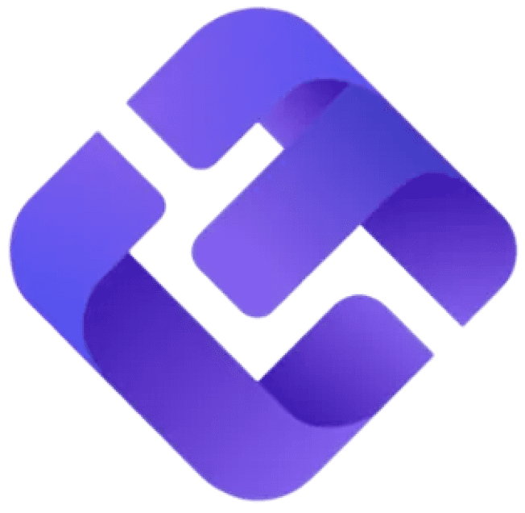

# EdgeFlo

> Le playbook **fondu dans le terminal d'exécution** : le plan de trading n'est pas un document à côté du graphique, c'est l'objet qui contient les garde-fous — et tant que la routine du matin n'est pas cochée, le bouton d'achat porte un cadenas. « This isn't a warning popup you can click through. It's a hard wall. »

**Sources :** site officiel et son CSS · quatre pages `/features/` non listées · walkthrough produit de 2 min 34 s servi par le CDN · 22 tutoriels vidéo de l'Academy · cinq micro-démos muettes · Wayback Machine · registre de Singapour

> **Lecture** : chaque famille d'écrans est montrée par **une planche** (`<aspect>/planches/`), légendée juste dessous. Les fichiers individuels restent dans leur dossier d'aspect.

## En bref

- **Le playbook porte les garde-fous.** Dans le module *Edge*, `RISK CONTROLS` (max trades/jour, risque par trade, perte max) et `TRADING WINDOW` ne sont pas dans un écran de réglages : ce sont des **rubriques du plan**. Changer de playbook change les limites. C'est le geste de conception le plus fort du produit.
- **Le bouton d'achat devient inclickable.** Pas un avertissement, pas une confirmation : « 🔒 Trade » grisé, à côté d'un chip « Pre-Market Routine 1/3 » deux fois plus large que lui. Et le blocage est à l'échelle du **compte**, jamais du marché — « There's no side door ».
- **Le site est sombre, l'app est claire.** 88,6 % de blancs au relevé de pixels côté produit, quand la landing est intégralement noire et violet néon. Deux directions artistiques pour le même produit.
- **Trois modales d'override cohabitent, avec des hiérarchies de boutons contradictoires.** Sur l'une le bouton plein est « Stay Disciplined », sur l'autre c'est « Trade Anyway ». Probablement une incohérence plutôt qu'une intention — et elle est instructive.
- **L'orange-rouge est la seule couleur chaude de toute la charte, et il n'apparaît que sur « Trade Anyway ».** La marque réserve sa teinte la plus agressive à l'action qu'elle désapprouve.
- **La transgression n'est pas interdite, elle est facturée.** Une raison écrite obligatoire, archivée dans le journal, et un barème de points affiché : perte max = −4 pts, dépassement de cible = −2, surtrading = −1.
- **La routine chaîne les modules entre eux** : « Meditate → Open Sanctuary », « Review Trade Plan → Open Edge », « Mark Up Charts → Open Trading ». La checklist du matin est le liant de l'architecture.
- **Neuf modules dans une seule app**, dont trois qu'aucun concurrent n'embarque — Sanctuary (méditation), Notebook (à la Notion), Academy. L'argument « stop trading across 10 tools » rendu littéral.

## Écrans

![[ecrans/planches/planche-le-playbook-edge.png]]

**Un plan est un objet structuré à sept rubriques nommées** : `CHARTING PROCESS` (étapes numérotées), `ENTRY CRITERIA` (critères réordonnables à la souris), `ENTRY MODELS`, `TRADE MANAGEMENT RULES`, `EXIT CRITERIA`, `TRADING NOTES`, plus un « Plan Type ». Il porte un toggle **Active** — un seul plan actif à la fois — et s'auto-sauvegarde.

Le détail qui distingue ce produit : `ENTRY MODELS` n'est pas du texte mais **deux galeries de captures de graphiques annotées**, intitulées « Setup screenshots » et « Entry examples ». Le blog en donne la raison, et c'est un argument de design : *« Rules are easy to bend. Pictures are hard to argue with. »*

Trois cartes latérales accompagnent le plan : `PLAN STATS` (Trades Taken, Win Rate, Net PnL, **Compliance 90 %**), `RISK CONTROLS` et `TRADING WINDOW`. Le playbook est donc **noté lui-même**, pas seulement le trader : c'est une hypothèse mesurée.

En mode exécution, le plan devient une checklist cochée avec un pied de carte « ✓ Reviewed today at 11:43 » et un bouton « Mark as reviewed ». Ce n'est pas un document mort qu'on relit, c'est un objet qu'on valide avant de trader.

![[ecrans/planches/planche-les-neuf-modules.png]]

**Le rail latéral est la carte du produit** : Dashboard, Trading, Edge, Journal, Notebook, News, Sanctuary, FloAI, Academy, puis « Backtesting » grisé avec un badge *Soon*. En pied, un bouton « Light Theme » — donc un mode sombre existe côté app, mais **aucune capture n'en est publiée** sur le site.

Le **Dashboard** met le score de discipline au même rang visuel que la courbe d'équité : un anneau ambre « 64 /100 », un badge de palier (« Developing Trader ») et la phrase de progression « 6 more points to get *Consistent Trader* ». Décomposé en trois barres — Performance 26/40, Discipline 32/40, Consistency 6/20. **La performance ne pèse que 40 %** de la note.

Le **Journal** ne mesure pas le résultat mais l'obéissance : les quatre lignes du jour sont « Plan followed: Yes ✓ », « Guardrail violations: 3 », « Pre-Market Routine: Not started 0/3 », « Trades journaled: 3/5 ». Toutes des métriques de process. Et la fiche de trade demande **l'émotion d'entrée et de sortie** en menus à emoji, plus une note vocale — capturée à la clôture du trade, pas le soir.

**Sanctuary est la rupture de densité du corpus** : une photographie de montagne pleine largeur, une carte de session de méditation avec ses durées et son ambiance sonore, et un « Mental Toolkit » catégorisé Reboot / Rewire / Recovery. Un registre visuel qui n'a rien à voir avec le reste de l'app — et c'est délibéré.

## Flows

![[flows/planches/planche-le-verrou-et-l-override.png]]

**Le verrou d'abord.** La routine pre-market est un panneau de trois lignes très aérées, chacune avec sa pastille colorée, sa case à cocher et un **lien profond vers le module concerné**. Pied de panneau : « Complete all steps to hide this banner ». Tant qu'elle n'est pas finie, le bouton « Trade » reste grisé avec un cadenas. Une fois cochée, un bandeau vert « Session Ready — You're ready to execute » apparaît, le bouton passe au vert, un chronomètre de session démarre et un bouton « End Session » s'affiche. **La séance devient un objet avec un début et une fin.**

**Puis le triptyque de l'override, et son incohérence.** Trois modales de blocage coexistent :

| Modale | Bouton en contour | Bouton plein |
| --- | --- | --- |
| « Max Daily Loss Triggered » | Override With Reason | **Stay Disciplined** (violet) |
| « You've breached your trading rules » | Respect Guardrail | **Trade Anyway** (orange→rouge) |
| « Override Guardrail for Today » | Cancel | **Trade Anyway** (orange→rouge) |

Sur la première, le bouton plein — celui qui attire l'œil — est l'action vertueuse. Sur les deux autres, c'est la transgression. Le même système de design plaide alternativement pour et contre le même geste. À mon avis un accident plutôt qu'un choix, et c'est exactement le genre de détail qu'on ne voit qu'en mettant les trois côte à côte.

Le reste est remarquablement tenu : la deuxième modale **énumère les infractions horodatées** (« Max daily loss: −$1100 ($1,000.00) at 10:43 »), la troisième exige une **raison écrite** et une case « I understand this trade violates my guardrails », et le champ est pré-rempli d'un exemple d'excuse réelle — « Need quick funds to cover an emergency expense before payday ». Le produit ne moralise pas, il reproche factuellement et archive.

La **revue hebdomadaire** clôt la boucle : le Discipline Report liste chaque infraction avec ses jours, puis l'IA produit non pas un résumé mais **une règle pour la semaine suivante** — « Next week focus: No routine = no trade. If you skip the routine, you don't earn the right to click buy/sell. »

## Composants

![[composants/planches/planche-composants.png]]

**Le panneau guardrail est un composant unique qui couvre tout le spectre, de l'encouragement à l'interdiction, par la seule couleur du bandeau.** Compteur « Trades: 2 / 5 » en pastilles qui se remplissent, fenêtre de trading avec chip Open/Closed, et surtout une **jauge bipolaire** graduée −$1K / 0 / +$1K qui se remplit vers la gauche en rouge ou vers la droite en vert. La cible quotidienne y est traitée comme une limite au même titre que la perte max — on peut « dépasser » en gagnant.

Dessous s'empilent des bandeaux d'état, même forme, teinte différente : vert « Within limits », violet « You have 3 trades remaining today », ambre « You took trade outside allowed hours », rose « Max Loss is reached! ». Pas de modale intempestive, pas de changement de forme.

**Le barème de discipline est affiché, donc jouable** : « Max Daily Loss breach — 2 trades — −4 pts », « Profit Target Violations — 2 trades — −2 pts », « Max trades/day violation — 1 trade — −1 pts ». Chaque faute a un poids différent, et le score est fenêtré sur les 100 derniers trades : ce n'est pas un casier permanent, il se rachète.

**Le garde-fou le plus structurant est le moins spectaculaire** : dans le ticket d'ordre, « Risk Per Trade » porte un **cadenas** et le champ « Lots » est encadré en violet avec une icône baguette magique et la mention « Auto-calculated ». La taille de position n'est pas saisie, elle est déduite. Forcer le lot déclenche un bandeau ambre : « Careful, you overrode the maximum risk percentage rule » — la même grammaire que l'override de guardrail, appliquée à un champ de formulaire.

Enfin, un pattern qui revient partout : **le réglage est réécrit en phrase avant validation.** La modale « Block Trading Settings » conclut ses cases et ses chips par « Blocks trading 15 min before and 15 min after High Impact events ».

## Animations

![[animations/walkthrough-produit_edgeflo.mp4]]

Le walkthrough officiel de 2 min 34 s déroule le cycle complet : configurer les guardrails dans Settings → cocher la routine → bandeau « Session Ready » → bouton Trade déverrouillé avec chronomètre. C'est la meilleure preuve que le verrou fonctionne comme annoncé.

> Fichier recompressé en H.264 720p (5 Mo au lieu des 67 Mo du VP8 d'origine servi par le CDN) — le dépôt est déjà lourd et l'original n'apportait rien de plus à cette définition.

Point technique à signaler : **il n'y a aucune transition CSS ni courbe personnalisée dans la feuille servie.** Les quatre seuls `@keyframes` sont des spinners de composants tiers. Tout le mouvement passe par Framer Motion, en JavaScript — il n'existe donc pas de charte de motion lisible dans le CSS de ce produit.

## Couleurs

![[couleurs/palette-le-site-est-sombre-l-app-est-claire.svg]]

**Le site et le produit ne partagent pas leur direction artistique.** La landing est noire, violet néon, avec des ombres à teinte violette (la valeur la plus fréquente de toute la feuille est `rgba(119,52,179,0.06)`, 327 occurrences). L'app, elle, est un blanc cassé `#fafafa` à 56,2 % — et ses cartes prennent une teinte lavande `#f1f1f7` plutôt qu'un gris neutre, seul lien chromatique avec la marque.

![[couleurs/palette-relevee-dans-l-app.svg]]

**7,5 % de couleur en tout, et une hiérarchie sémantique nette.** Le violet est l'accent de marque ; le vert, le rouge et l'ambre sont trois crans d'état, dans cet ordre de gravité. L'ambre à 0,05 % est le plus rare et le plus intéressant : c'est le cran intermédiaire, celui de l'avertissement qui ne bloque pas encore.

| Famille | Part | Rôle |
| --- | --- | --- |
| blancs | 88,63 % | fond d'app, cartes, surfaces |
| bleu-gris `#4c6971` et bleus | 5,26 % | zones de graphique, chandeliers |
| violet `#8b5cf6` / `#6d56f8` | 1,13 % | accent de marque : boutons, états actifs, barres de score |
| vert `#0ab57d` | 0,66 % | gain, règle tenue, Trade déverrouillé |
| rouge `#f26a6a` | 0,40 % | perte, « Max loss hit » |
| ambre `#e49909` | 0,05 % | l'avertissement qui ne bloque pas |

> Les captures d'écran sont servies en PNG à palette indexée : elles ont été converties en RGB pour le relevé, sans être modifiées dans le dossier.

**Et une seule couleur chaude dans toute la charte** : le dégradé orange→rouge du bouton « Trade Anyway ». Elle n'existe nulle part ailleurs.

## Process

**Ce qui tient lieu de documentation de conception ici, c'est un cours.** L'Academy publie 22 tutoriels plateforme filmés écran par écran, et **chaque fiche porte un champ « how this helps your trading »** qui explique l'intention du module. Sur les guardrails : « This is how you stop blowing accounts from one emotional session. Guardrails turn discipline into a system so you don't rely on willpower when you're tilted, rushed, or euphoric. » Sur le plan : « When your plan lives beside your charts, you stop relying on memory. » De la doc de design déguisée en pédagogie.

![[process/demo-guardrails-toasts.jpg|700]]

**Les cinq micro-démos muettes de la chaîne EdgeFlo Support sont le corpus d'UI le plus propre publié par la marque** — écran nu, curseur, aucun facecam, une fonctionnalité par vidéo — et elles ne sont exposées nulle part sur le site : elles n'existent que via les embeds d'un seul article de blog.

Le récit d'origine est publié sur LinkedIn par la société : sept comptes explosés, des challenges de financement ratés, plus de 10 000 $ perdus en trading émotionnel — « most traders fail not because they don't care, but because the process is full of friction » → « a system designed to protect traders from themselves ». Et un chiffre public : le fondateur annonce **200 000 $ investis** dans la construction, dans un Short YouTube de décembre 2025.

**Le bâclage éditorial, à signaler parce qu'il est instructif.** Toutes les pages d'article portent le `<title>` par défaut de Framer, « … - My Framer Site ». Un article nomme le fondateur « Brett Goh » six fois et invente un programme « Outliers » (partout ailleurs : Brad Goh, The 1% Club) — odeur nette de rédaction IA non relue. Le pied de `/download` affiche « © 2025 » quand les autres pages affichent 2026. Et une capture du rail latéral écrit **« EdgeFlow » avec un w**. Un produit dont l'UI est très tenue et dont le contenu ne l'est pas du tout.

## Marketing

![[marketing/planches/planche-blog.png]]

**Le blog a un registre graphique à lui, et il ne montre jamais le produit.** 390 articles bâtis sur un gabarit fixe : une illustration d'en-tête au **trait néon** sur fond aubergine (un presse-papier lumineux dont les entrées sont CONDITION / ALLOWED ACTION / INVALIDATION / FOLLOW-UP), puis deux ou trois schémas maison — jamais une capture d'interface. Un seul article sur 390 fait exception.

Le second registre est le **diagramme sur fond `#0d0d10`**, filets de 1 px en gris très sombre, mots-clés en violet clair et le reste en blanc. C'est là que le raisonnement éditorial se lit : « Full Playbook vs Simplified Playbook » — « The full playbook is your training manual. The simplified playbook is your field guide. »

Et l'Academy est encore une troisième direction : cartes de cours en Inter sur fond clair, sans aucun des trois registres précédents. Trois DA pour un seul produit, si l'on compte le site, le blog et l'Academy.

## Archive

![[archive/planches/planche-2025-en-sombre.png]]

**En juillet 2025, EdgeFlo était une page d'attente — et son app était pensée en sombre.** « The World's First AI Trading Superapp Is Coming », typographie Onest + Inter (aucune trace des trois polices actuelles), token de couleur `rgb(139, 92, 245)`, et une iconographie d'objets 3D en verre chromé néon bleu et rose. Les maquettes d'app y sont **toutes sombres**, présentées en perspective sur fond noir texturé.

En mars 2026, bascule complète : « Trade with guardrails, not willpower », plus de 3D néon mais des illustrations à trait plat, et surtout **l'app est passée en thème clair**. Le site, lui, est resté sombre. C'est de cet écart que naît la double direction artistique d'aujourd'hui.

Deux détails datent le produit au passage : la mention « Forex only for now » de mars 2026 disparaît en juillet avec le lancement multi-actifs, et le tag d'émotion à six emoji — aujourd'hui un pilier du journal — existait **déjà** dans les maquettes de 2025, en sombre.

## Pourquoi je l'aime

- **Mettre les limites de risque à l'intérieur du playbook**, pas dans les réglages. Une décision d'architecture d'information qui change tout le produit : le plan devient l'unité de configuration.
- **Un composant unique qui va de l'encouragement à l'interdiction** en ne changeant que la teinte de son bandeau. Économie de moyens exemplaire.
- **Une seule couleur chaude, réservée à l'action désapprouvée.** C'est de la charte qui prend parti.
- **Le barème affiché.** Dire au trader combien coûte chaque faute, c'est traiter la discipline comme un système jouable plutôt que comme une leçon de morale.
- **Le triptyque d'override, y compris son incohérence** : trois modales pour un même geste, c'est le meilleur cas d'école que j'aie sur « hiérarchiser deux boutons quand on n'est pas d'accord avec l'utilisateur ».

## À réutiliser pour

- Une **jauge bipolaire** où la borne haute est aussi une limite (pas seulement un objectif).
- Un **verrou d'action conditionné à une checklist**, avec l'override déprioritisé visuellement plutôt que caché.
- Un **champ calculé plutôt que saisi** (le lot déduit du risque), avec avertissement au forçage.
- Un **score fenêtré et son barème public** — se racheter est possible, et on sait comment.
- Projet : [[ ]]

## Limites de la récolte

- **Aucun accès à l'app.** Tout ce que montre ce dossier vient des captures servies par le site, des vidéos officielles et de l'Academy. Pas de démo publique, pas de compte créé (l'essai est à 7 $).
- **Aucun press kit, aucun logo vectoriel.** Sept routes testées, toutes en 404 ; le sitemap de 380 URL n'en liste aucun. Le logo n'existe qu'en PNG (favicon 46 × 44, monogramme 3D 652 × 636).
- **Aucune capture du mode sombre de l'app**, alors que le bouton « Light Theme » du rail prouve qu'il existe. Les 110 captures publiées sont toutes claires.
- **Aucun designer identifié.** Pas de page équipe, pas de studio crédité, aucun compte Dribbble/Behance/Read.cv rattaché au produit. Une personne, **Baqr Ali**, est listée sur le LinkedIn de la société sans que son rôle soit précisé — je ne le déduis pas.
- **Manrope n'existe pas**, contrairement à ce qu'annonçait le repérage : les quatre familles servies sont Inter, Plus Jakarta Sans, Nunito et Fragment Mono — et parmi elles, **seules les deux premières sont réellement appliquées**. Les deux autres sont préchargées sans qu'aucune règle ne les utilise.
- **Aucune charte de motion lisible** : zéro transition CSS, tout passe par Framer Motion en JS. Il faudrait instrumenter le bundle pour la relever.
- **X, Instagram et TikTok inaccessibles** (402 / pas de session) ; Product Hunt en 403, présence non tranchée ; le registre ACRA de Singapour est payant, donc pas d'UEN vérifié.
- **390 articles de blog pour zéro capture d'app** : le blog est un mur de SEO programmatique sur gabarit fixe. Un seul article fait exception.

## Sources

- **Site officiel et son CSS** — les tokens Framer, les ombres à teinte violette, les 153 images d'UI en pleine résolution. → [edgeflo.com](https://www.edgeflo.com)
- **Les quatre pages `/features/`** — non listées dans la nav, et c'est là que sont les meilleures captures : la modale d'override avec son champ raison, le barème de points, le donut de taxonomie des violations. → [/features/guardrails](https://www.edgeflo.com/features/guardrails) · [/features/ai-trading-journal](https://www.edgeflo.com/features/ai-trading-journal) · [/features/smart-trading-platform](https://www.edgeflo.com/features/smart-trading-platform) · [/features/learning-mindset](https://www.edgeflo.com/features/learning-mindset)
- **Walkthrough produit** — fichier de repli servi par le CDN Framer derrière un embed Loom : 2 min 34 s de screencast réel, qui prouve le cycle guardrails → routine → session.
- **Academy** — 22 tutoriels plateforme, chacun avec son champ « how this helps your trading ». Son fichier de contenu est servi en clair et expose tout le back-office éditorial. → [academy.edgeflo.com](https://academy.edgeflo.com/platform-tutorials.html)
- **Article de blog TradeLocker** — le seul texte du site qui explique le raisonnement de design, et le seul à embarquer des démos d'UI. → [le lien](https://www.edgeflo.com/blog/what-tradelocker-traders-are-missing-the-discipline-layer-edgeflo-adds-to-your-execution)
- **Wayback Machine** — 26 captures de la racine : l'état de juillet 2025 en sombre, et la bascule de mars 2026. → [web.archive.org/…/edgeflo.com](https://web.archive.org/web/*/edgeflo.com*)

## Crédits

- **Brad Goh** — fondateur, trader à plein temps, animateur de la chaîne YouTube « The Trading Geek » et instructeur de tous les tutoriels de l'Academy. Il porte le produit à la première personne. **Aucune source ne lui attribue le dessin** de l'interface, et aucun designer n'est crédité nulle part. → [LinkedIn](https://sg.linkedin.com/in/brad-goh-3a7118185) · [1percentclub.co](https://1percentclub.co/) · [portrait TechBullion](https://techbullion.com/brad-goh-the-anti-guru-trader-redefining-success-through-proof-and-discipline/)
- **EDGEFLO PTE. LTD.** — Singapour, fondée en 2025, 2 à 10 salariés. Aucune adresse publiée ; les CGU ne donnent que la raison sociale et `support@edgeflo.com`.
- **Inter** — [Rasmus Andersson](https://rsms.me/inter/), SIL OFL 1.1. Fonte de corps du site (71 fichiers `.woff2` servis) et **seule fonte de l'Academy**, qui est un site distinct.
- **Plus Jakarta Sans** — [Tokotype](https://github.com/tokotype/PlusJakartaSans) (Gumpita Rahayu), SIL OFL 1.1, commandée à l'origine par 6616 Studio pour l'identité de la ville de Jakarta. Graisses 600 et 800 seulement, en accent d'interface.
- **Fragment Mono** ([Wei Huang](https://github.com/weiweihuanghuang/fragment-mono), direction Studio Lin) et **Nunito** sont servies mais jamais appliquées — à ne pas porter aux crédits de la DA.

## Mots-clés

playbook de trading, trading playbook, plan de trading, garde-fou, guardrail, trade guard, verrou, blocage, hard wall, bouton désactivé, cadenas, override, transgression, raison obligatoire, friction délibérée, discipline, score de discipline, edge score, barème, points, pénalité, violation, infraction, taxonomie, routine, pre-market, checklist, lien profond, deep link, session, chronomètre, jauge bipolaire, bandeau d'état, toast, avertissement, trois crans, vert ambre rouge, ticket d'ordre, calcul de lot, position sizing, risque par trade, R:R, terminal de trading, chart, TradingView, TradeLocker, cTrader, journal, tag d'émotion, emoji, note vocale, revue hebdomadaire, rapport IA, coach IA, FloAI, Claude, méditation, sanctuary, mental toolkit, notebook, academy, neuf modules, superapp, rail latéral, thème clair, light mode, thème sombre, double DA, site sombre app claire, violet, dégradé, orange rouge, ombre colorée, Framer, Framer Motion, Inter, Plus Jakarta Sans, Singapour, prop firm, build in public, SEO programmatique, incohérence de design

## À voir aussi

- [[tradingplan]] — le parti pris exactement inverse : la checklist y laisse cocher une croix rouge et continuer, rien n'est bloqué.
- [[temper]] — le troisième terme : ni checklist ni blocage, mais une interruption en temps réel depuis l'encoche.
- [[composer]] — l'autre produit clair du corpus, et l'autre façon de rendre une stratégie lisible.
- [[_APPS]] · [[_COMPOSANTS]] · [[_ANIMATIONS]]
