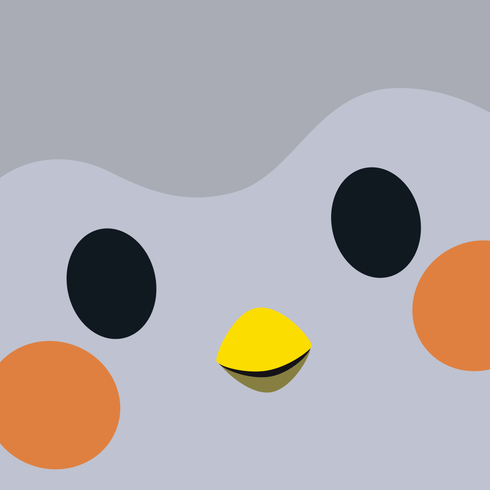

# Finch

> Un oiseau dont on s'occupe en s'occupant de soi. Ce dossier existe pour **la quantité d'assets** — le portail Guardians sert publiquement le bundle complet de l'app, soit 11 372 SVG et ~3 000 Lottie — et pour un parti pris rare : **la gamification sans sanction**, poussée jusqu'à un film de marque qui montre le self-care raté.

**Sources :** [finchcare.com](https://finchcare.com) · le bundle d'assets public du portail Guardians (`AssetManifest.json`, 15 119 entrées) · [boutique officielle](https://shop.finchcare.com) · Discord « Finch Fam » · App Store et Google Play · Screensdesign (session de 14 min, 183 écrans) · Adapty et Paywall Screens · Weirwork, Kirsten Lepore, Mathematic · MediaPost, Chief Marketer, LBBOnline, AWN, Paste — détail dans [[#Sources]]

> **Lecture** : chaque famille de visuels est montrée par **une planche** (`<aspect>/planches/`), légendée juste dessous. Les fichiers individuels restent dans leur dossier d'aspect.

## En bref

- **Le vrai parti pris n'est pas « pas de streak », c'est « pas de sanction ».** Finch a bien des objectifs quotidiens, des streaks, des timers et une monnaie virtuelle. Ce qu'il n'a pas, c'est le moindre écran qui reproche un échec. À vérifier dans l'app avant de le tenir pour définitif — les sources se contredisent sur les streaks, jamais sur l'absence de punition.
- **Le nom vient d'Atticus Finch** (*To Kill a Mockingbird*) et du fait que les pinsons ne vivent pas seuls. L'analogie avec la santé mentale est assumée par le fondateur.
- **8 versions de Finch abandonnées en 10 mois** avant l'oiseau. Le concept d'origine : faire éclore un oiseau confronté chaque jour à des dangers (aigles, fantômes, orages, extraterrestres) que les exercices de self-care permettaient de survivre. Les « oiseaux immortels » sont venus après, avec la communauté.
- **Le décor de l'accueil change** (nid turquoise, forêt verte, serre) et porte l'état du jour. La jauge d'énergie et la liste d'objectifs sont posées en cartes flottantes par-dessus.
- **Les couleurs servent une fonction, pas un thème** : vert = action et objectifs, violet nuit = soundscapes et respiration, orange = streak, jaune = amis et micropets, cyan = boutique et penderie, bandeau sombre = saison.
- **Pas de vrai mode sombre global.** Les écrans sombres sont des *thèmes de fonctionnalité* (Soundscapes, Breathing), pas un thème système.
- **Finch n'affiche jamais un écran nu.** Collections en cartes « ??? », insights sans données, « Start a new area », « No tags found » — chaque état vide a son illustration ou son placeholder à collectionner.
- **Le statut PBC se traduit dans l'UI** : le programme *Guardians* permet de parrainer un abonnement Finch Plus pour quelqu'un qui ne peut pas se le payer, avec un compteur (163 129 personnes parrainées en février 2025) et un écran « You're sponsored by a Guardian ».
- **L'animation est intégralement en Lottie à 25 fps**, avec une nomenclature systématique : `CB01_*` pour le corps habillable animé pièce par pièce (jusqu'à 1 566 fichiers dans un seul set), `CMP_*` par micropet, `Effects_Solo_*` par effet, `Finch_<action>` pour les scènes de soin.

## Écrans

![[ecrans/planches/planche-ecrans-de-l-app.png]]
**Les écrans de Finch.** Tab bar à **six** onglets — Home / Quests / Shop / Friends / Bag / prénom de l'oiseau — avec badges numériques et **des icônes illustrées pleines couleurs, jamais de line-icons**. L'accueil superpose la jauge « 1st Adventure 0/15 », la liste « 7 goals left for today! » et un toast noir de récompense. Le hub self-care est une grille de huit pastilles (Goal Ideas, Reflections, Breathe, Soundscapes, Movements, Timers, Act of Kindness, First Aid Kit) sur un dégradé rose/violet, l'oiseau en avion au-dessus. Les Quests portent la bannière saisonnière. La boutique « Mr. Prickles' Shop » a son marchand animé en haut et un timer de rafraîchissement.

![[ecrans/trois-ecrans-la-boucle-de-base.png|600]]
La boucle en trois temps : accueil avec l'oiseau et les objectifs → écran d'amitié → gain d'énergie MAX avec confettis.

![[ecrans/soundscapes-catalogue-fond-bleu-nuit.png|400]] ![[ecrans/accueil-oiseau-en-aventure-compte-a-rebours.png|400]]
Le catalogue Soundscapes sur fond bleu nuit, avec ses onglets WEATHER / ANIMALS / INDOORS / URBAN / MIXES et un coût en éclairs par carte. Et **l'état d'attente le plus intéressant du produit** : pendant que l'oiseau voyage, l'accueil affiche « Adventuring — back in 7:59:47 » avec un chemin en pointillés jalonné et une porte de sortie honnête : « Come back later, **or gain more energy so Piper can come back sooner!** »

![[ecrans/recompenses-milestones-et-recap-de-saison.png|600]]
La monnaie Rainbow Stones, les milestones d'un Journey, et le récap de saison « Frozen Frontier » avec quatre métriques. **Le progrès abstrait est matérialisé en collections et en zones à débloquer** — c'est le levier central.

![[ecrans/penderie-essayage-en-apercu-live.png|400]] ![[ecrans/insights-calendrier-d-humeur-compte-neuf.png|400]]
La penderie, avec l'oiseau en aperçu live en haut et une case NONE dans chaque catégorie. Et Insights sur un compte neuf : le calendrier d'humeur en grille de points, les cartes Goals et Reflections vides — mais jamais nues.

![[ecrans/widgets-et-tutoriels-d-installation.png|500]]
Les widgets et **leurs tutoriels d'installation iOS et Android dessinés** à la main. Finch illustre même la procédure système.

![[ecrans/planches/planche-store-ios.png]]
Les 8 captures App Store (1260×2736). Le store en propose **trois jeux identiques** des mêmes 8 visuels (iOS 1260×2736, Android 1512×2688 et 2064×2752, cadrages différents) : le jeu iOS est retenu ici parce que l'écran du téléphone y est le plus grand donc l'UI la plus lisible, et trois des 2064 px sont gardés dans `branding/artwork-store-haute-resolution/` pour l'illustration seule.

## Flows

![[flows/planches/planche-onboarding-et-checkin.png]]
**L'onboarding** commence par « Choose your Finch Egg! » — sept œufs colorés en constellation, un bouton « Hatch egg ». Puis « Choose a trait for Piper », six traits en emoji + libellé, **l'oiseau réagit au-dessus du choix**. L'étape « Energy & Activity » propose quatre réponses dont une pour les limitations physiques.

**Le check-in d'humeur en trois étapes** est le meilleur flow du dossier. Étape 2 : « Try to dig a little deeper » — Pleasant / Neutral / Unpleasant en rail à gauche, colonne de mots précis à droite (Content, Fulfilled, Accepted, Good, Calm, Mellow, Peaceful). Étape 3 : « What made you feel good, calm? » avec treize tags en pilules (Family, Myself, Health, Pets, Co-workers, Work, School…) plus une zone de texte libre. **On passe de l'émoticône au vocabulaire, puis du vocabulaire à la cause.**

![[flows/respiration-unwind-breathing-phase-hold.png|400]] ![[flows/programme-guardians-parrainer-un-abonnement.png|500]]
L'exercice « Unwind Breathing » en cours, cercle concentrique violet en phase « Hold ». Et le programme **Guardians** : « Sponsor Finch Plus for those who cannot afford it », paliers communautaires, compteur de personnes parrainées, écran « You're sponsored by a Guardian » côté bénéficiaire.

![[flows/planches/planche-paywalls.png]]
**Les quatre paywalls, et une mécanique en deux temps.** D'abord un soft paywall d'onboarding (« Finch is free to use, but we'd love… »). Puis l'offre unique : « Biggest deal ever! One-time 43% OFF », l'oiseau en lunettes de soleil avec une bouée. Puis la **timeline verticale** Today / Day 5 / Day 7, 69,99 barré → 34,99 $/an, et la rareté explicite : « **Offer expires when you exit this screen!** » Une variante ajoute « 100% Satisfaction Guaranteed! Full refund anytime » ; une autre, en pleine page violette, joue la preuve sociale : « Plus Users are 4x more likely to stick ».

![[flows/parrainage-paliers-de-recompenses.png|500]]
Le parrainage : silhouettes de micropets à débloquer en haut, liste de paliers en bas (600 Rainbow Stones 0/1, Bear Hood, Finch Plushie 0/2, Cookie the Cow 0/3).

## Branding

![[branding/planches/planche-le-personnage.png]]
**Le personnage et sa parenté.** 305 poses statiques dans le bundle officiel (calme, célébration, trophée, pom-poms, lecture, pêche, brossage de dents, duos, gestes de conseil, sommeil, sport, transports) — 108 sont montrées ici. Les PNJ nommés : **Professeur Oatmeal** (chef et professeur, trois expressions) et **Rocket** (six poses : énergique, extraverti, en vol, cœur, méditation). Et les **62 micropets nommés** — Beaky, Bob, Aurora, Batrick, Krypto… un bestiaire entier de compagnons secondaires.

![[branding/planches/planche-decors-et-saisons.png]]
Les décors et les saisons. 106 lieux de voyage dans le bundle (Paris, Tokyo, Le Caire, Alpes, Amazonie, Serengeti, la Lune, le Soleil, Midnight Manor, Cosmic Rest Stop). 97 visuels d'événements « Good Vibes » saisonniers avec leur copy. 30 fonds de présentation de tenues (Space Ace, Pretty in Pink, Sea U Later, S'mores Adventure). 51 cartes d'affirmations illustrées — une scène complète par affirmation. Et l'identité du Discord officiel : bannière de saison « AUGUST SEASON — GAME ON! », icône devant un arc-en-ciel Progress Pride.

![[branding/special-story-juin-2026-collab-dc.png|600]]
La *special story* de juin 2026 : **collab DC** — l'oiseau en Supergirl, Krypto le chien à cape, des extraterrestres, et les décors « Cosmic Rest Stop » (arrêt de bus, food court, garage, quartier commerçant). 187 fichiers pour un seul événement mensuel.

![[branding/logo-horizontal.svg|400]]
Le logo officiel en vectoriel : tête d'oiseau dans une pastille blanche + mot-symbole « Finch » **en Rubik Bold cerné de blanc**. Décliné en vertical et en marque figurative seule.

![[branding/artwork-store-haute-resolution/oiseaux-dans-la-foret-2064px.jpg|500]]
L'artwork des captures store en 2064 px : illustration vectorielle plate, aucun artefact, aplats francs.

**Typo** — **Rubik** (Regular 400 / Medium 500 / Bold 700) pour tout le texte, plus **Nanum Pen Script** (manuscrite) pour les annotations et les accents. Déclarées dans le `FontManifest.json` du bundle et rechargées sur le site. Les visuels de la boutique officielle sont annotés à la main en Nanum Pen Script — **c'est la signature graphique marketing de la marque**.

## Couleurs

![[couleurs/palette-declaree.svg]]
**Le seul hex que Finch déclare comme couleur de marque est #72CAFC** — il est à la fois `theme_color` et `background_color` du `manifest.webmanifest`. Le reste du nuancier reprend les **noms de rôles écrits dans la feuille de style du site** : leurs mots, pas les miens. Il n'y a **ni press kit, ni brand book, ni palette nommée** : `/press`, `/brand`, `/media`, `/blog`, `/about` renvoient tous 404.

![[couleurs/palette-relevee-dans-les-ecrans.svg]]
Le relevé de pixels. Un ciel bleu très clair (#A4DFFF) occupe à lui seul plus de 1,7 % de la surface totale — **c'est ce qui rend les personnages lisibles : le fond ne se bat jamais avec eux.** Et le texte de titre est un bleu ardoise #2F3F4C, jamais du noir.

## Composants

![[composants/icones-d-inventaire-le-vestiaire_finch.png|600]]
**1 017 icônes d'inventaire** dans le bundle — chapeaux, perruques, chaussures, pantalons, accessoires. 63 sont montrées ici. Tout en SVG.

![[composants/objets-de-decoration-du-birdhouse_finch.png|600]]
**1 533 objets de décoration du birdhouse** : lits, horloges, affiches de voyage, instruments, plantes. Style plat à aplats, léger iso.

![[composants/emotes-et-echelle-d-humeur_finch.png|500]] ![[composants/economie-pierre-arc-en-ciel-et-coffres_finch.png|500]]
Les 25 pictos d'émotes et d'humeurs, dont **l'échelle d'humeur 1→5 en deux variantes** (bouton et calendrier) — le même contenu dessiné deux fois pour deux contextes. Et l'économie : la pierre arc-en-ciel (monnaie), les coffres bois / argent / or avec cadenas et tête de mort, fermés et ouverts, plus les mascottes marchandes Dafinci, Prickles et Robin. Tous référencés dans [[_COMPOSANTS]].

## Animations

![[animations/session-complete-14-min-183-ecrans_finch.mp4]]
**L'enregistrement d'une session complète, 14 min 11, 183 écrans** — onboarding, paywall, objectifs, aventure, soundscapes, respiration, quêtes, boutique, penderie, amis, profil, réglages. À garder pour les transitions et les micro-animations : c'est ce qui manque partout ailleurs.

![[animations/film-whatever-it-takes-to-get-through-the-day_finch.mp4]]
**Le film de marque, en 1080p.** Voir [[#Marketing]] et [[#Process]] — c'est la pièce maîtresse du dossier.

![[animations/spot-yoga-avec-les-ours_finch.gif]] ![[animations/spot-brule-des-papiers-dans-la-poubelle_finch.gif]]
![[animations/spot-se-coupe-la-frange_finch.gif]] ![[animations/spot-rituel-bougies-et-cristaux_finch.gif]]
![[animations/spot-binge-de-hockey-a-la-tv_finch.gif]] ![[animations/spot-kaiju-rose-et-l-oiseau_finch.gif]]
Les six boucles de la campagne, telles que Weirwork les publie : yoga avec des oursons en équilibre, brûler des papiers dans une poubelle, se couper la frange aux ciseaux, un rituel de bougies et de cristaux, un binge de hockey, le kaiju qui rugit. **Chaque boucle est un « whatever it takes » différent.**

![[animations/animation-d-essai-oiseau-qui-fait-des-coeurs_finch.gif|300]]
Une animation d'essai de Bella Alfonsi (34 images) : l'oiseau couché sur le ventre qui fait apparaître des cœurs.

`animations/lottie-source-*.json` — deux **fichiers Lottie source officiels** : `Finch_Stretching_01` (900×800, 25 fps, 300 frames) et `Effects_Solo_Confetti_01` (800×800, 25 fps, 50 frames). Tout est en Lottie 25 fps chez Finch. Référencées dans [[_ANIMATIONS]].

## Marketing

![[marketing/planches/planche-campagne-2026.png]]
**« Whatever It Takes To Get Through The Day » (mai 2026, Mental Health Awareness Month) — la première campagne de marque de Finch, cinq ans après le lancement.** Un monde CG entièrement en textures feutre et laine, personnages trapus, ville pastel rose/lavande/bleu poudre. Un kaiju rose à trois yeux détruit une ville en feu ; un personnage en peignoir scrolle devant 900 453 mails non lus ; trois autres sont avachis sur un canapé la nuit, éclairés en bleu par l'écran, dans des restes de junk food. L'oiseau Finch entre en scène en 3D feutre, et le film finit en courant dans un quartier pavillonnaire en flammes.

L'intention est citée telle quelle par le CEO : *« If we want to normalize self-care, we have to stop making it look so perfect. Most wellness advertising shows self-care as something polished and aspirational… Real self-care is usually much smaller and stranger than that. **It's bargaining with yourself to answer one email.** »*

Et la position anti-IA est explicite, de la VP Marketing : *« There's a larger message about humanity… It felt disingenuous to use AI. »* Le film est en CG artisanal, « every frame crafted by hand ». Le titre est un **lettrage 3D en fausse laine bouclée**, pas une police. Signé « **A self-care film by Finch** » — pas « a commercial ».

![[marketing/campagne-affiche-kaiju-rose.jpg|400]] ![[marketing/campagne-affiche-gateau-dans-le-frigo.jpg|400]] ![[marketing/campagne-affiche-yoga-avec-les-ours.jpg|400]]
Les trois affiches verticales de la campagne, en 1500×2250.

![[marketing/site-hero-your-new-self-care-best-friend-3420px.png|600]]
Le hero de finchcare.com en 3420 px : scène ciel / soleil / collines, **un oiseau habillé généré aléatoirement**, titre en Rubik Bold cerné, badge « 5.0 · 500k+ ratings ».

![[marketing/boutique-merch-officielle.png|600]]
La boutique officielle : peluches birb en pyjama-ours, casquette « Hot Birb Summer », pin's émaillé plage, t-shirts « just keep floating » et « you are loved », gourde 20 oz, sets de stickers Pride. **Tous les visuels produits sont annotés à la main** en Nanum Pen Script.

![[marketing/defis-mensuels-badges-et-pins-2026.png|600]]
Les défis mensuels 2026 : badges vectoriels, mockups de pin's émaillés photographiés en main, planches de stickers. Titres nommés : « Friends of Oz » (collab *Le Magicien d'Oz*), « Birb's Eye View », « Fun in the Sun », « Helping Hand », « Spring Cleaning », « Good Vibrations », « Tracing My Roots ».

## Process

![[process/campagne-cinq-plans-la-direction-feutre.jpg|600]]
Cinq plans du film, pour lire la direction artistique : les matières feutrées, la palette pastel salie, les échelles (intérieur nuit, kaiju, extérieur jour). **Kirsten Lepore a dessiné elle-même les storyboards** — rare pour une réalisatrice sur ce type de projet — et le kaiju à trois yeux vient de son croquis initial, quasi inchangé jusqu'au film final.

![[process/animation-de-mascotte-chapeau-de-fete.jpg|400]]
Une animation de mascotte par Bella Alfonsi. Détail important sur le pipeline : **Finch fournit les designs et les prestataires les animent** — « Finch provided designs of their mascot and Bella made them come to life ». Le personnage est dessiné en interne.

## Archive

**Aucun état antérieur documenté, et le dossier n'a donc pas de `archive/`.** Finch est sortie en 2021 et n'a pas connu de refonte publiée ; les notes de version illustrées vivent sur `help.finchcare.com`, derrière un mur Cloudflare que cette session n'a pas pu franchir. C'est le seul aspect vide des cinq dossiers de ce lot.

## Sources

- **[finchcare.com](https://finchcare.com)** — site Next.js. **Aucune page press kit, brand book ni blog** (`/press`, `/brand`, `/media`, `/blog`, `/about` → 404). Relations presse : press@befinch.com. Domaine interne de l'équipe : `befinch.com`.
- **Le portail Guardians (`finchcare.com/guardians`) — la trouvaille du dossier.** C'est une app Flutter Web qui sert **publiquement le bundle d'assets complet de l'app** : `finchcare.com/assets/AssetManifest.json` = 15 119 entrées, dont 11 372 sous `packages/finch/assets`. Répartition : 1 533 objets birdhouse, 1 017 icônes d'inventaire, 305 poses d'oiseau, 196 visuels de special stories, 106 décors, 97 good vibes, 65 micropets, 51 affirmations, 41 fichiers de défis, 30 fonds de tenues — plus ~3 000 JSON Lottie. Tout en SVG et Lottie, donc **pleine qualité par construction**.
- **[shop.finchcare.com](https://shop.finchcare.com)** — la boutique Shopify officielle.
- **Discord « Finch Fam »** (`discord.gg/finchfam`, guild 943903226338615326) — 264 160 membres, niveau boost 3, tag de guilde « birb », couleurs de badge déclarées par Finch #10EBB8 et #57B59E. Groupe Facebook officiel : `facebook.com/groups/finchfam`.
- **App Store / Google Play** — icône, 8 + 16 captures, métadonnées. API Apple consultée le 2026-08-20 : éditeur « Finch Care Public Benefit Corporation », 4,9474/5 sur **741 474 avis US**, sortie le 12 mai 2021, v3.73.197.
- **[Screensdesign](https://screensdesign.com/apps/finch-self-care-pet/)** — 183 écrans horodatés, dont 12 en pleine qualité (2160×4670) dans le HTML ; le reste vient du **mp4 720p de 14 min** hébergé sur le CDN Bunny, dont 15 frames ont été extraites à `ffmpeg`.
- **[Adapty](https://adapty.io/paywall-library/finch/)** et **[Paywall Screens](https://www.paywallscreens.com/apps/finch-mobile-paywall-c882)** — les paywalls, dont deux millésimes hors filigrane (10/2025 et 07/2026).
- **[Kirsten Lepore](https://www.kirstenlepore.com/Finch-Whatever-it-Takes)** (réalisatrice) et **[Kevin Weir / Weirwork](https://www.kevinjweir.com/finch)** — les affiches, les six boucles, les crédits complets.
- **[AWN](https://www.awn.com/animationworld/kirsten-lepore-gets-weird-finchs-whatever-it-takes-get-through-day)**, **[LBBOnline](https://lbbonline.com/news/finch-whatever-it-takes-to-get-through-the-day)**, **[MediaPost](https://www.mediapost.com/publications/article/415234/self-care-app-finch-promotes-whatever-it-takes-to.html)**, **[Chief Marketer](https://www.chiefmarketer.com/finchs-first-brand-campaign-celebrates-the-weirder-side-of-self-care/)** — les stills de presse et les citations.
- **[VCU Brandcenter](https://brandcenter.vcu.edu/news/alum-kevin-weir-launches-weirwork/)** — deux stills en 2976 px.
- **[Sophie Pilley, « The Magic of Finch »](https://www.sophiepilley.com/post/the-magic-of-finch-where-self-care-meets-enchanted-design)** (7 février 2025) — la meilleure lecture design tierce, avec des planches d'écrans réels. **Ses trois maquettes de redesign (« Adoption Centre », « Micropedia », enclos de micropets) ont été volontairement écartées du dossier** : ce sont ses concepts, pas le produit Finch, et les garder ici les rendrait indiscernables du vrai dans six mois.
- **[Paste Magazine](https://www.pastemagazine.com/tech/finch/finch-app-mental-health-virtual-pet-self-care)** (janvier 2023) — les citations des fondateurs sur l'origine.
- **[IXD@Pratt](https://ixd.prattsi.org/2026/02/design-critique-finch-self-care-pet-ios-app/)** (Marianne Benyamin, février 2026) — la critique académique : le bouton vert cohérent dans l'onboarding, mais un « gulf of evaluation » (on ne sait pas si l'onboarding est fini) et une surcharge cognitive des pages Settings et Quests.
- **[Stephanie Yuan, Medium](https://medium.com/finchcare)** — le récit des 8 versions abandonnées (un seul article récupérable, la publication renvoie 403).

**Ce qui a bloqué** : `help.finchcare.com` (Zendesk derrière Cloudflare — c'est là que vivent les release notes illustrées, et `claude-in-chrome` n'est pas installé dans cette session). **Reddit r/finch entièrement inaccessible** (403 sur l'API, les miroirs redlib morts ou derrière un proof-of-work) : zéro capture communautaire, donc aucun écran « vécu » et un seul événement saisonnier documenté. Mobbin 403. UXArchive 403. Page Flows 404 sur Finch. Appshots page vide. ArtStation 403 — **la piste la plus rentable restante** : vérifier si Sylvain Sarrailh, Julien Missaire, Jade Astoux ou Clémence Perlin (Mathematic) ont publié le concept art et les planches de character design du film. Le film HD n'existe ici qu'en 1080p via la version de presse ; le Vimeo de la réalisatrice est restreint par domaine. Medium 403 sur la publication Finch Care. Ad Age payant. Le budget de recherche web des agents (200 appels) a été épuisé avant la fin sur trois des quatre sources.

## Crédits

**Fondateurs** — **Stephanie Yuan** et **Thomas « Nino » Aquinas Nugraha Budi** (CEO). App lancée le 12 mai 2021. Leur raison de départ, citée par Stephanie Yuan : *« We both struggled with anxiety and depression and found self-care challenging to stick with, so we were hoping to make self-care fun and accessible after seeing many others share similar struggles. »* Et Nino Aquinas : *« To take care of yourself, you don't actually need a lot — you just need consistency and motivation. It's not like people don't know what to do for their well-being; life just gets in the way… Motivation is as important as what you do. »*

**Équipe créative interne** — l'oiseau est **dessiné en interne**, et l'équipe ne publie pas : **zéro projet Finch sur Behance, Dribbble, ArtStation ou Fonts In Use** (vérifié). Nommés : **Alan Lau** (Creative Director), **Amanda Berry** (Jr. 2D Designer — character design, illustration, animation 2D ; ex-Sesame Workshop, Cleveland Institute of Art), **Katie Shill** (VP Marketing), **Bea DyBuncio** (Marketing Manager). Product designers : **Nadia Rudenko**, **Alli Karkantis**. En août 2024, Finch recrutait son **premier art director**, à manager un seul Creative Designer et un seul Lead Animator, sur une « scrappy creatives setup ».

**Animation de mascotte** — **[Bella Alfonsi](https://www.bellaalfonsi.com/work/finch-character-animation)**, animatrice freelance. Finch fournit les designs, elle les anime.

**Campagne « Whatever It Takes To Get Through The Day » (mai 2026)** — montée **hors modèle agence classique**, Finch a approché l'agence en septembre 2025 :
- **Agence : [Weirwork](https://www.kevinjweir.com/finch)** — ECD **Kevin Weir** (ex-ECD Droga5), CD **Mark Bielik**, producer Isaac Hoff, strategy Tom Naughton. Kevin Weir : *« We need more weird work in the world… It takes a brave client to introduce their self-care bird app with a film about hanging on by a thread. »*
- **Réalisation : [Kirsten Lepore](https://www.kirstenlepore.com/Finch-Whatever-it-Takes)** (via **PRETTYBIRD** US) — nommée aux Oscars pour *Marcel the Shell*, Emmy pour *I Am Groot*.
- **Animation : Mathematic** (Paris) — concept art **Julien Missaire** et **Sylvain Sarrailh**, character design **Jade Astoux** et **Clémence Perlin**, rigging Jules-Baptiste Giraud et Guillaume Boudeville, anim 3D Christophe Mauceri / Charline Parisot / Emma Lebourgeois, lighting Anaïs Sassatelli et Manuel Quinto, FX Paul Charpentier.
- **Musique et son : Human**, compositrice **Ava Matasavage**. **Média : Headlight** — CTV (Roku, YouTube TV) + Meta / TikTok / Instagram, 12 semaines, versions 30 / 60 / 90 s.

**Chiffres, par ordre de solidité** : (1) Apple, API officielle, 2026-08-20 — 4,9474/5 sur 741 474 avis US. (2) Chief Marketer, mai 2026 — **2 millions d'utilisateurs quotidiens**, audience surtout Gen Z et millennials, croissance essentiellement par bouche-à-oreille. (3) Le programme Guardians affichait **163 129 personnes parrainées** en février 2025. Les chiffres d'ARR qui circulent sur les blogs produit (30-40 M$) ne sont pas vérifiables — je ne les reprends pas.

**Distinctions — résultat négatif vérifié**, et c'est une information en soi : aucune distinction Apple ni Google confirmable. Les listes officielles ont été ouvertes une par une (Apple Newsroom App Store Awards 2024, blog Google Play Best of 2022 avec ses honorable mentions, Apple Design Awards) : **Finch n'y figure pas**. Un blog tiers affirme une « honorable mention » Google Play 2022 que la source primaire ne dit pas. La légitimité de Finch tient à sa note et à son volume d'avis, pas à un palmarès.

**Attention aux homonymes** : « Finch » est un mot très courant. Écartés — l'artiste Finchwing / Chloe Peters, Finch Bird Studio (jeu indie), Finch Creative / Finch Brands / Finch Creative Group (agences), la police « Finch » de Green Type. Et un faux positif Behance : « Dino: Habit Tracker App | Inspired by Finch App » de Likearth Studio est un **clone assumé**, pas Finch.

## Pourquoi je l'aime

- **La gamification sans sanction.** Il y a des streaks, des timers, une monnaie. Il n'y a pas un seul écran qui reproche. C'est la nuance que tout le monde rate en citant Finch, et c'est celle qui compte.
- **Le check-in en trois marches** : émoticône → mot précis → cause. Trois écrans pour faire dire à quelqu'un ce qu'il ressent vraiment, sans jamais lui demander d'écrire d'abord.
- **L'état d'attente honnête.** « Come back later, or gain more energy so Piper can come back sooner. » Le produit dit qu'il n'a rien à montrer maintenant, et propose une porte de sortie au lieu de retenir.
- **Aucun écran nu.** Une collection vide est une grille de « ??? » à remplir. Un insight sans données a quand même son calendrier dessiné. L'état vide est un objet de désir.
- **La couleur sert une fonction, pas un thème.** Vert = agir, violet nuit = se calmer, jaune = les autres. On sait où on est avant d'avoir lu.
- **Un film de marque qui montre l'échec.** Un kaiju, 900 453 mails, une frange coupée aux ciseaux à 2 h du matin. « Real self-care is usually much smaller and stranger than that. » Et l'anti-IA assumée, pas comme posture mais comme cohérence de discours.
- **Le statut PBC descend jusqu'à l'écran.** Guardians n'est pas une page « nos valeurs », c'est un bouton dans l'app avec un compteur.
- **Le bundle entier est en SVG et en Lottie.** Un personnage habillable animé pièce par pièce, 1 566 fichiers pour un seul set. C'est une décision d'architecture, et elle explique la profusion.

## À réutiliser pour

- Projet : [[ ]]
- **Le check-in à trois marches** (échelle → vocabulaire → cause) — réutilisable partout où il faut qualifier un ressenti ou une satisfaction.
- **Retirer les sanctions sans retirer les mécaniques.** Garder streak, monnaie et progression ; supprimer tout écran qui constate un manquement.
- **L'état d'attente qui donne une porte de sortie** plutôt qu'un spinner ou une notification promise.
- **L'état vide comme objet de collection** : la grille de « ??? » plutôt que « aucun élément ».
- **La couleur par fonction** et non par thème, avec un fond dominant très clair qui laisse les personnages lisibles.
- **Le lettrage matière** (fausse laine, feutre) comme titre de campagne, au lieu d'une police.
- **La contre-campagne wellness** : montrer le geste raté, petit et bizarre, au lieu du geste parfait. À proposer dès qu'un client de santé ou de bien-être arrive avec un moodboard de yoga au lever du soleil.
- **Les visuels produits annotés à la main** en manuscrite — ça humanise une boutique en une police.

## Mots-clés

Finch · Finch Care · Finch Care PBC · Public Benefit Corporation · self-care · soin de soi · santé mentale · mental health · bien-être · wellness · anxiété · dépression · journal · journaling · humeur · mood tracking · check-in · habitudes · micro-objectifs · goals · oiseau · bird · birb · pinson · Atticus Finch · animal de compagnie virtuel · virtual pet · tamagotchi · compagnon · mascotte · Piper · Professeur Oatmeal · Rocket · micropets · Beaky · Krypto · Rainbow Stones · pierre arc-en-ciel · monnaie virtuelle · coffres · Mr. Prickles · Dafinci · Robin · birdhouse · penderie · tenues · outfits · inventaire · collection · aventure · adventure · voyage · décors · Paris · Tokyo · Cosmic Rest Stop · saison · Outback Adventure · Frozen Frontier · Good Vibes · special story · collab DC · Supergirl · Friends of Oz · quêtes · quests · streak · gamification sans sanction · no punishment · pas de culpabilisation · soul friends · amis · parrainage · referral · Guardians · Finch Plus · paywall · timeline d'essai · one-time offer · rareté · preuve sociale · garantie satisfaction · Soundscapes · Breathe · respiration · Unwind Breathing · Timers · Act of Kindness · First Aid Kit · Insights · calendrier d'humeur · état vide · empty state · tab bar six onglets · icônes illustrées · Rubik · Nanum Pen Script · SVG · Lottie · 25 fps · CB01 · Effects_Solo · personnage habillable · widget · Discord · Finch Fam · Stephanie Yuan · Nino Aquinas · Thomas Aquinas Nugraha Budi · Alan Lau · Amanda Berry · Katie Shill · Bella Alfonsi · Weirwork · Kevin Weir · Mark Bielik · Kirsten Lepore · PRETTYBIRD · Mathematic · Sylvain Sarrailh · Julien Missaire · Jade Astoux · Human · Ava Matasavage · Whatever It Takes To Get Through The Day · kaiju · feutre · feutrine · laine · lettrage matière · anti-IA · no AI · CG artisanal · campagne · brand film

---
[[_APPS|← Apps]] · [[_INSPIRATION|← Inspiration]]
