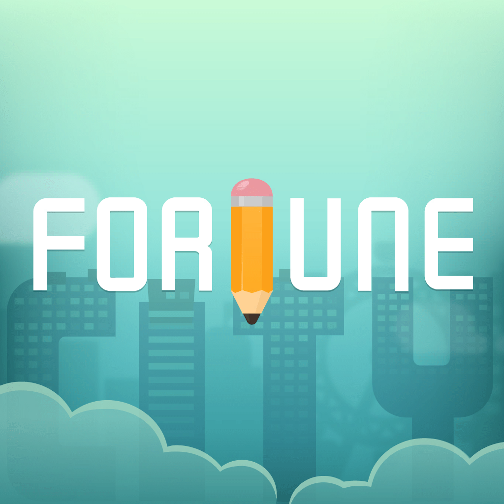

# Fortune City

> Tenir son budget en construisant une ville isométrique. Ce dossier existe pour **une seule règle de design**, celle que le studio répète partout : *une dépense = un bâtiment*. Tout le reste — 269 bâtiments dessinés à la main, sept thèmes, un chat comptable — découle de cette phrase-là.

**Sources :** [page produit officielle](https://sparkful.app/fortune-city) · [press kit SPARKFUL](https://sparkful.app/media) (ZIP par produit) · le CDN `assets.sparkful.app/packages/universe-assets/` (269 bâtiments en PNG transparent) · [blog du studio](https://sparkful.app/blog) · App Store et Google Play · Adapty · blogs produit taïwanais et japonais (playpcesor, AGIRLS, iPhone Mania) · Red Dot, INSIDE, bnext, ShoppingDesign, Mockplus — détail dans [[#Sources]]

> **Lecture** : chaque famille de visuels est montrée par **une planche** (`<aspect>/planches/`), légendée juste dessous. Les fichiers individuels restent dans leur dossier d'aspect.

## En bref

- **La règle tient en une phrase, et le studio l'assume comme un critère** : « imaginer l'utilisateur comme un enfant — la règle doit s'expliquer en une phrase ». Ici : *une transaction = un bâtiment*, *deux bâtiments identiques = fusion*. Chez Plant Nanny : *boire de l'eau = la plante grandit*.
- **Le studio refuse le mot « gamification ».** Sa doctrine s'appelle **玩心設計 / Playable Design** et se définit contre : « 玩心設計不強調點數、徽章、競爭等機制 » — le playable design n'insiste pas sur les points, les badges, la compétition. Le but est un produit non pas amusant à regarder mais **« jouable »**.
- **13 catégories de bâtiments, chacune du LV1 au LV8, 269 visuels au total.** La montée en niveau ajoute des étages, un aménagement de parcelle et un objet-enseigne géant en toiture. Chaque catégorie a sa gamme chromatique.
- **Un bord dentelé façon ticket de caisse sépare systématiquement la ville (le jeu) du bandeau comptable (l'outil).** C'est la signature graphique du produit.
- **La ville suit l'heure réelle** : jour clair, crépuscule violet, nuit bleu nuit. C'est le vrai mode sombre du produit — environnemental, pas un réglage.
- **L'écran Analyse est nativement sur fond bleu nuit** alors que la saisie est sur fond clair : le contraste sombre/clair sert à séparer le jeu de la comptabilité.
- **Le mode édition fait basculer toute la carte en niveaux de gris** sauf l'élément manipulé. Un état visuel entier plutôt qu'un chrome d'outils.
- **Aucune charte couleur publiée.** Le press kit ne contient ni hex, ni nom de police, ni vectoriel — seulement des PNG jusqu'à 8001 px.

## Écrans

![[ecrans/planches/planche-la-ville-quatre-etats.png]]
**L'écran principal, dans ses quatre états.** Jour, crépuscule, nuit — le cycle suit l'heure réelle. Puis le mode édition : toute la carte passe en niveaux de gris, seul le bâtiment déplacé reste en couleur, et on sort par une pastille X centrée en bas. Le HUD haut porte prospérité, pièces, diamants et ouvriers ; le bandeau comptable est en bas, séparé par le bord dentelé.

![[ecrans/ville-vue-ipad-hud-complet-2048x2732.jpg|600]]
La même vue en 2048×2732 (iPad) : le HUD complet et la liste des dépenses du jour, sans habillage marketing.

![[ecrans/ville-grille-de-quartiers-plein-cadre.png|400]] ![[ecrans/ville-plein-cadre-sans-habillage-1080.png|400]]
Deux captures store rares : la ville en plein cadre, sans accroche par-dessus.

![[ecrans/saisie-depense-photo-presse-6000px.jpg|600]]
**La saisie de dépense, en photo de presse à 6000 px** — le meilleur document du dossier sur le cœur du produit. Grille de 10 catégories en pictos colorés, chips de dépenses récurrentes, **pavé numérique maison sombre** avec `+` et `−` intégrés et une validation en pastille dorée. Pas de clavier système : le geste est à un pouce.

![[ecrans/analyse-donut-depenses-fond-sombre.png|400]] ![[ecrans/analyse-barres-mensuelles-fond-sombre.png|400]]
L'écran Analyse : donut rose épais avec le montant au centre, sélecteur de mois à flèches, jauge revenus/dépenses ; puis l'histogramme du mois, une barre par jour. **Entièrement sur fond bleu nuit**, à l'inverse de la saisie.

![[ecrans/planches/planche-fiches-et-catalogue.png]]
Les fiches et le catalogue. **Toute fiche présente son sujet en polaroid tenu par un trombone, avec une mini-bio narrative sous les stats.** La fiche citoyen a dix jauges — une par catégorie de dépense — en deux colonnes. La fiche bâtiment côté gestion montre le rendement à l'heure, un minuteur, et trois postes de travail avec le citoyen affecté sur un socle et sa pastille d'humeur. Le catalogue est rangé par catégorie puis par paliers LV1-LV3 / LV4-LV5 / LV6-LV7, avec silhouettes grisées pour le non-débloqué et un pourcentage de complétion : **la collection sert de barre de progression à l'habitude.**

![[ecrans/planches/planche-recompenses-et-celebrations.png]]
**Les récompenses passent par des objets imprimés**, jamais par un toast génarique : un badge gravé façon tampon sur papier texturé (« GOOD HABIT », « ADMINISTER »), un polaroid tamponné COMPLETE, une carte dorée qui se retourne avec des particules d'étoiles, et la modale de retour quotidien « Équipements publics » adressée au *Maire*.

![[ecrans/boutique-themes-sept-merveilles.png|400]] ![[ecrans/histoires-cartes-verrouillees-bureau-de-poste.png|400]]
La boutique de thèmes — bannière illustrée, texte narratif façon carte de voyage, vignette de prévisualisation du décor, prix en diamants. Et l'écran Histoires, où une carte reste verrouillée avec « encore 1 jour d'enregistrement pour déverrouiller ».

![[ecrans/2019-donjon-souterrain-et-biomes.png|600]]
Le donjon souterrain (2019) : la parcelle décolle, et une bande verticale d'ambiances propose montagne enneigée, désert, épave sous-marine, chalet, temple.

## Flows

![[flows/onboarding-01-mascotte-se-presente-en-cfo.png|500]]
L'ouverture : fond de motif d'objets en filigrane, **le chat Money Meow se présente comme Directeur financier** dans une bulle basse, puis une main animée pointe « saisis ta première écriture du jour ».

![[flows/onboarding-02-tuto-guide-de-la-fusion.png|500]]
Le tutoriel de la fusion : une zone de ville isolée en carte, le reste assombri, la main-curseur qui désigne le bouton, puis la modale avec le coût en pièces.

![[flows/saisie-depense-categories-et-pave-numerique.png|500]]
Le flow de saisie, avec la modale d'activation de **Smart Note** — les suggestions de libellé proposées en pastilles à partir du lieu et des habitudes.

![[flows/statistiques-donut-puis-detail-par-jour.png|500]]
Statistiques : le donut et la liste de catégories, puis le panneau de détail par jour qui glisse par-dessus.

![[flows/notification-dans-la-carte-puis-fiche-voyageur.png|500]]
**Les notifications vivent DANS la carte**, pas dans une liste : une pastille enveloppe se pose au-dessus d'un citoyen de passage, et l'ouvrir affiche sa fiche « Voyageur ». Le pattern le plus singulier du produit.

![[flows/classement-amis-puis-visite-de-ville.png|500]]
Le social : classement Amis / Global / Local, puis la visite de la ville d'un ami — **dans un habillage de thème complètement différent** (ciel orange, toits rouges, mer). C'est la meilleure vitrine de vente des thèmes.

![[flows/paywall-cfo-trois-paliers-et-carrousel.png|400]] ![[flows/2017-tutoriel-d-origine-cashy-puis-cathy.png|500]]
Le paywall CFO : carrousel illustré de 6 pages, trois paliers (2,49 / 19,99 avec ruban −35 % / 14,49), essai 14 jours, dans une boutique à 4 onglets Diamonds / Themes / Builders / CFO. Et le tutoriel d'origine de 2017, avec un détail savoureux : **le chat se présente comme CASHY sur le premier écran puis CATHY sur les trois suivants** — une hésitation de nommage restée dans la capture publiée par le studio.

## Branding

![[branding/planches/planche-logo-quatre-declinaisons.png]]
Les quatre déclinaisons autorisées : fond couleur, monochrome noir, monochrome blanc, lockup vertical. Le wordmark est en capitales géométriques très ouvertes, terminaisons droites, U et C dessinés en arcs quasi circulaires, **le T de FORTUNE remplacé par un crayon jaune à gomme rose** — le même crayon que dans l'icône d'app. Le dégradé passe d'un vert tendre à un turquoise de gauche à droite.

![[branding/logo-horizontal-8001px.png|500]]
Le logo horizontal en 8001 px, fond transparent. Aucun vectoriel n'existe : le press kit ne contient que des PNG.

![[branding/banniere-logo-sur-skyline-isometrique.png|600]]
La bannière produit : wordmark blanc et baseline « Track your spending, grow a city » sur la skyline isométrique, fond dégradé menthe à motif triangles.

![[branding/studio-fourdesire-construction-du-monogramme.png|400]] ![[branding/studio-fourdesire-logo-final.png|400]]
L'identité du **studio** (2015, Behance) : le f et le d posés sur grille et cercles guides, qui se referment en boucle d'infini. C'est le seul projet que l'équipe ait jamais publié sur Behance — pas Fortune City.

![[branding/red-dot-2018-mascotte-trophee-doree.webp|400]]
Le bandeau d'annonce du Red Dot 2018, avec la mascotte-trophée dorée au crayon.

**Typo** — non identifiée, et je ne l'attribue pas. Fonts In Use n'a aucune entrée Fortune City ni Fourdesire. Le wordmark est une sans-serif géométrique à bas de casse arrondi ; rien ne dit si c'est un dessin sur mesure ou une police du marché.

## Couleurs

![[couleurs/palette-relevee-batiments.svg]]
**Le relevé sur les 269 bâtiments.** À lire comme un relevé, pas comme une charte : **Fourdesire / SPARKFUL ne publie aucune charte couleur** — j'ai vérifié le press kit, la page produit, la page « à propos » et le blog. Ce qui ressort : une palette de pastels chauds (crème, pêche, rose bonbon, sable) tenue par un seul bleu franc et une famille de verts, avec le trait en #111111 mais jamais de noir en aplat. Chaque catégorie de dépense a sa gamme — le blanc-menthe pour la santé, le bleu-violet translucide pour l'électronique, le jaune-or pour les revenus.

![[couleurs/palette-relevee-vue-de-ville.svg]]
Le relevé sur l'écran principal. Les mêmes pastels, plus les bleus de ciel et d'eau qui structurent le fond, et l'anthracite du pavé numérique de saisie.

![[couleurs/sept-themes-de-ville-en-coupe.png|600]]
**Les sept thèmes, en coupe.** Chaque thème redéfinit le sol ET le sous-sol : pierre sombre, bleu à motif feuillage, brique vert foncé, terre cuite, biscuit-chantilly, brique rose, herbe et sable doré. C'est le vrai système couleur du produit — pas une palette de marque, un jeu de **terrains**.

## Composants

![[composants/planches/planche-les-13-categories-de-batiments.png]]
**Les 13 catégories de bâtiments, chacune du LV1 au LV8** — 269 visuels reconstitués depuis le CDN officiel (`assets.sparkful.app/packages/universe-assets/buildings/<catégorie>-<niveau>_<variante>/0/building.png`, PNG transparent 600×600 chacun). La restauration monte du stand de rue au palais dim sum ; les boissons du vendeur ambulant au « Gold Label Latte » ; le logement de la tente de montagne aux maisons japonaises à toit bleu avec bassin, cerisier et linge qui sèche. La progression suit toujours la même grammaire : **plus d'étages + un aménagement de parcelle + un objet-enseigne géant en toiture**.

![[composants/chaine-d-evolution-d-un-batiment_fortune-city.jpg|600]]
La chaîne d'évolution, telle que le studio la présente : l'étal qui devient supérette 24 h, puis le fleuriste de la graine au tournesol géant, la série terminée par un point d'interrogation.

![[composants/citoyens-yeux-triangulaires-et-bulles_fortune-city.jpg|500]]
Le parti pris graphique des citoyens : **yeux en triangle, bouche en arc**. Deux traits, et ça suffit à porter une expression.

![[composants/blocs-ui-donut-barres-classement_fortune-city.png|500]]
Les blocs UI isolés en pleine qualité : îlots avec étiquettes de prix, donut de dépenses à pastilles d'icônes, barres mensuelles, liste de classement avec vignettes de ville.

![[composants/gabarit-carte-produit-d-un-batiment_fortune-city.jpg|500]]
Le gabarit de carte produit, décliné pour **chacun** des 269 bâtiments : le bâtiment centré sur un dégradé turquoise avec des silhouettes de ville en filigrane et le logo en bas à droite. Un système de présentation, pas des images une par une.

![[composants/quatre-batiments-en-cartes-3d_fortune-city.png|500]]
L'évolution de style, rapportée par le studio : au début les artistes dessinaient la ville à 45 degrés parce que l'app était en 2D ; aujourd'hui ils dessinent les bâtiments en **« cartes 3D »**. Tous référencés dans [[_COMPOSANTS]].

## Animations

![[animations/carrousel-de-batiments-au-changement-de-categorie_fortune-city.gif]]
La première refonte d'onboarding : **le carrousel de bâtiments défile en direct au changement de catégorie de dépense**, au-dessus du pavé numérique noir. On voit le bâtiment avant de valider la dépense — la boucle de récompense est ramenée dans le geste de saisie.

![[animations/trailer-officiel-track-your-spending-grow-a-city_fortune-city.mp4]]
Le trailer officiel, 43 s en 1080p : construction d'un bâtiment après saisie, croissance de la ville, habitants, écrans de statistiques en mouvement. Référencées dans [[_ANIMATIONS]].

## Marketing

Captures pleine hauteur de `sparkful.app` (desktop + mobile) : `home`, `fortune-city`, `download-fortune-city`, `help`. Les quatre versions localisées (ja / ko / zh-cn / zh-tw) ont été écartées — même page, autre langue.

![[marketing/key-visual-panoramique-theme-dessert-9450px.png|600]]
Le key visual panoramique en 9450 px : ville isométrique **thème gâteau**, bâtiments coiffés de fraisiers et de chantilly, plus le chat Money Meow au crayon, sur dégradé menthe.

![[marketing/schema-une-depense-un-batiment.jpg|600]]
**Le principe du produit en une image** : chaque dépense étiquetée de son prix (下午茶 $30, 大杯奶茶 $35, 壽司 $600, 晚餐 $789) devient un bâtiment distinct sur la trame de la ville. C'est ce visuel qu'il faut garder si on n'en garde qu'un.

![[marketing/red-dot-2018-visuel-de-presse.jpg|600]]
Le visuel du dossier Red Dot : logotype, baseline, et iPad + iPhone + Android montrant la ville, la saisie et le donut d'analyse.

![[marketing/campagne-japon-4-millions-de-telechargements.png|500]] ![[marketing/quatre-mises-en-situation-lifestyle.png|500]]
La campagne japonaise des 4 millions de téléchargements — deux habitants en gros plan, bandeau titre lettré à la main dans une flèche. Et les quatre mises en situation officielles (l'app en main ou posée sur bois clair, décor de Noël, carnet et crayon, Apple Watch).

![[marketing/banniere-promo-in-app-bonheur-limite.png|500]]
Une bannière promo in-app : dégradé pêche-corail, habitant à lunettes tendant une bague en diamant, feuillages découpés au premier plan. **Même les écrans monétisés sont illustrés et narratifs.**

## Process

![[process/planches/planche-fabrication-des-batiments.png]]
**La chaîne de fabrication, publiée par le studio** : wireframes papier annotés au crayon et photographiés au téléphone, puis les bâtiments dessinés à l'iPad à l'Apple Pencil — lineart terminé, aplats posés seulement sur la végétation. Les catégories les plus enregistrées par les utilisateurs (la nourriture en tête) décident des bâtiments à produire, d'où les sous-types cuisine chinoise / occidentale / goûter.

![[process/planches/planche-concept-pk-ecarte-vs-retenu.png]]
**Le « 概念 PK », et c'est la pièce la plus rare du dossier** : le studio publie, dans ses récaps annuels de conférence *Playground*, le concept **écarté** (marqué 遺珠, « la perle laissée ») face au concept **retenu**. Ici : un créateur d'avatar citoyen avec sélecteur de coiffures, écarté au profit de la Place des Citoyens ; une compétition sportive entre citoyens, écartée au profit du mécénat VIP. Très peu d'éditeurs publient ce qu'ils ont refusé.

![[process/refonte-du-chat-money-meow-avant-apres.png|600]]
**La refonte du chat 錢喵喵 (Money Meow)** : de la version costume / lunettes / cigare de 2017 à la silhouette arrondie de 2019, lunettes agrandies, **et l'encoche à l'oreille conservée** — le signe qu'il est un chat errant adopté. Repositionné en mentor selon le schéma du voyage du héros. Créé par Sophia, l'artiste principale.

![[process/diagramme-parcours-utilisateur-4-points-d-entretien.png|600]]
Le diagramme du parcours testé — recherche App Store, fiche produit, tutoriel, exploration libre — avec quatre points d'entretien en dégradé de jaunes.

![[process/conference-playground-2021.jpg|400]] ![[process/equipe-fourdesire-devant-le-mur-du-studio.jpg|400]]
La conférence *Playground* et l'équipe devant le mur bleu du studio de Taipei.

## Archive

![[archive/store-2017/android-01.jpg|400]] ![[archive/store-2017/android-03.jpg|400]]
Le jeu de captures store de la génération précédente (1242×2208, habillage blanc et teal) — à comparer avec le jeu iOS actuel, où chaque écran a sa propre couleur de fond saturée (bleu, violet, rose, rouge, vert) et un personnage en médaillon. Les cinq captures paysage 1280×720 (tablette) ont été jetées : doublons de basse résolution.

## Sources

- **[Page produit officielle](https://sparkful.app/fortune-city)** — les sept thèmes en coupe, les blocs UI isolés. Redirections vérifiées : `fourdesire.com` → 301 vers `sparkful.app/zh-TW/about`, `fortunecityapp.com` → 301 vers la page produit.
- **[Press kit SPARKFUL](https://sparkful.app/media)** — ZIP par produit, en anglais et en chinois traditionnel. Le lot Fortune City (70 Mo) est rangé en 8 dossiers : App Icon, Product Logo, Product Banner, Screenshots, Brand Logo, User Scenarios, Behind the Scenes, plus un communiqué. Logos en PNG jusqu'à 8001 px — **aucun SVG, aucun vectoriel**. Contact : Cara Huang, Marketing Director.
- **`assets.sparkful.app/packages/universe-assets/buildings/`** — **la trouvaille du dossier** : les 269 bâtiments en PNG transparent 600×600, plus une carte de présentation 2400×1260 pour chacun. Rangés en 13 catégories × 8 niveaux. Les pages sœurs `/universe/plants` (Plant Nanny) et `/universe/planets` (Walkr) suivent le même gabarit.
- **[Blog du studio](https://sparkful.app/blog)** — une douzaine d'articles, tous en chinois traditionnel. Les trois utiles : l'interview des illustratrices, « 遊戲化產品的用戶引導：以《記帳城市》為例 » (refonte de l'onboarding) et « 如何為產品注入玩心 » (les cinq principes), les deux derniers signés **Sammy Long**, Assistant Producer.
- **Récaps annuels *Playground*** (2019, 2021, 2022) — slides de conférence d'équipe, avec la rubrique « 概念 PK ».
- **App Store / Google Play** — icône, 7 + 12 captures, métadonnées (v4.20.5, 4,52/5 sur 4 976 avis US).
- **[Adapty](https://adapty.io/paywall-library/fortune-city/)** — le seul écran de l'UI **actuelle** accessible publiquement.
- **[playpcesor 電腦玩物](https://www.playpcesor.com/2017/05/fortunecity-android-app.html)** (Esor Huang) et **[AGIRLS 電獺少女](https://agirls.aotter.net/post/51063)** — les walkthroughs taïwanais, seule source pour les écrans profonds. **[iPhone Mania](https://iphone-mania.jp/news-213278/)** pour les écrans japonais.
- **[Red Dot](https://www.red-dot.org/project/fortune-city-25920)** — la fiche du prix 2018 avec ses crédits.
- **[PR Newswire APAC](https://en.prnasia.com/releases/apac/fourdesire-launches-a-limited-time-online-game-create-your-dream-life-celebrating-4-million-downloads-worldwide-of-fortune-city-244122.shtml)** (26 avril 2019) — la photo de presse de la saisie en 6000 px.
- **[Mockplus « UXer Talks »](https://www.mockplus.com/designer/post/chen-wei-fan-fourdesire)** (août 2017) — les photos de wireframes papier et de fabrication.
- **[INSIDE](https://www.inside.com.tw/article/13880-fourdesire-fortuncity-earn-red-dot-award)**, **[bnext 數位時代](https://www.bnext.com.tw/article/55743/fourdesire-google-play-best-app)**, **[ShoppingDesign](https://www.shoppingdesign.com.tw/post/view/9425)** — la doctrine du studio et les distinctions.

**Ce qui a bloqué** : l'app est **absente de toutes les bases d'UI** — Mobbin 404 sur `/apps/fortune-city`, UXArchive 403, Appshots page vide, Screensdesign aucune fiche, rien sur Refero, Banani, Page Flows ni uisources. Absente aussi de Game UI Database et Interface In Game (qui couvrent PC/console) : **l'app tombe entre les deux mondes**. `ui.cn` (page « 記帳城市 », la piste la plus prometteuse restante) — connexion en timeout. Medium 403 (l'étude de cas de localisation INLINGO, l'article d'un designer Fourdesire). Instagram `@sparkful.app` et Facebook `fortunecityapp` inaccessibles : `claude-in-chrome` n'est pas installé. Une seule vidéo YouTube récupérée sur deux (le tour produit de la v1.3 échoue en 403). Les variantes de thème par bâtiment ne sont pas exposées : l'index de thème dans l'URL du CDN n'accepte que `0`, les valeurs 1 à 5 renvoient 403. **Il manque donc l'écran de saisie et l'onboarding dans leur version actuelle** — tout ce qu'on a d'eux date de 2017-2018.

## Crédits

**Studio** — fondé en août 2012 à Taipei sous le nom **Fourdesire**, renommé **SPARKFUL**. Les noms de paquets Android gardent `com.fourdesire.fortunecity` et le contact presse reste en `@fourdesire.com`.

- **陳威帆 / Wei-Fan Chen (« Taco Chen »)** — CEO, producteur, auteur de la doctrine *Playable Design*. [Behance](https://www.behance.net/skiests) · [Medium](https://weifanchen.medium.com)
- **張閔傑 / Min-Chieh Chang** — co-fondateur, directeur design. [Behance](https://www.behance.net/decill) (n'y publie que des exercices Daily UI, aucun Fortune City)
- **Sophia** — **artiste principale (主美術) de Fortune City**. Vient de l'animation ; Fortune City est son premier projet de jeu chez Fourdesire. Créatrice du chat **錢喵喵 / Money Meow**, et c'est elle qui a posé le style des bâtiments empilés comme des blocs et la palette. Aucun portfolio personnel trouvable.
- **詹詹 / Zhan Zhan** — second illustrateur, d'abord connu pour les 12 planètes de Walkr, crédité en 2022 sur des bâtiments de Fortune City. Anecdote publiée par le studio : sa façade de la catégorie beauté a d'abord été esquissée en droguerie avant d'être retravaillée vers un grand magasin haut de gamme.
- **Sammy Long** — Assistant Producer, auteur des deux articles de process les plus riches.
- **Sophia Wang** — Creative Direction, et **Wei Fan Chen** — Production, sur le dossier Red Dot 2018.

**Distinctions vérifiées** : **Google Play « meilleure application de l'année » 2017** (Taïwan, Corée, Hong Kong) — première app développée à Taïwan en tête de plusieurs classements nationaux simultanément. **Red Dot Award: Brands & Communication Design 2018**. Historique du studio : Walkr, meilleur jeu + meilleure app Apple Watch 2015.

**À ne pas reprendre** : aucun Apple Design Award ni featuring éditorial Apple daté n'est confirmable. La seule affirmation en ce sens vient du fondateur lui-même et n'est recoupée par aucune source Apple. Le studio ne publie **rien** sur Behance, Dribbble ni ArtStation côté produit : tout passe par son propre blog — vérifié profil par profil sur les quatre comptes identifiés.

**Chiffres sourcés** : 4 millions de téléchargements de Fortune City au bout de deux ans, 20 millions cumulés sur toutes les apps du studio (communiqué, avril 2019). 5,4 millions revendiqués aujourd'hui pour Fortune City, 35 millions pour le studio. Répartition fin 2017 : Taïwan 45 %, Chine 30 %, puis Hong Kong, Japon, Corée, États-Unis.

## Pourquoi je l'aime

- **La règle explicable à un enfant, érigée en critère de conception.** « Une dépense = un bâtiment. » Le studio en fait le troisième de ses cinq principes, et refuse toute mécanique qui ne tiendrait pas dans une phrase.
- **Le refus du mot « gamification ».** *Playable Design* se définit explicitement contre les points, les badges et la compétition. Le pari : rendre le produit *jouable*, pas récompensant.
- **Le bord dentelé de ticket de caisse.** Un détail graphique qui fait tout le travail d'architecture : d'un côté le jeu, de l'autre l'outil, et on sait toujours où on est.
- **Le mode sombre est environnemental.** La ville suit l'heure réelle. Pas de toggle, pas de réglage — le produit change parce que la journée change.
- **Le mode édition en niveaux de gris.** Un état visuel entier plutôt qu'une barre d'outils. La carte devient sa propre interface.
- **Les notifications vivent dans la carte.** Une pastille enveloppe au-dessus d'un citoyen de passage, pas une liste.
- **Les récompenses sont des objets imprimés.** Badge-tampon sur papier texturé, carte dorée qui se retourne, polaroid tamponné. Aucun toast générique.
- **Le studio publie ce qu'il a écarté.** Le « 概念 PK » met le concept refusé à côté du concept retenu, dans une conférence publique.
- **Trois fois la même idée, assumée.** Plant Nanny, Walkr, Fortune City : convertir un geste ingrat en progression visible d'un monde. Une signature de studio, pas trois produits.

## À réutiliser pour

- Projet : [[ ]]
- **Le test de la phrase unique** comme filtre de conception : si la règle ne s'explique pas en une phrase à un enfant, elle ne rentre pas.
- **Séparer le jeu et l'outil par un bord dessiné** (dentelé, déchiré, perforé) plutôt que par un onglet.
- **Le mode sombre environnemental** — l'état du produit suit l'heure réelle, sans réglage.
- **Le mode édition qui désature tout sauf l'objet manipulé.**
- **Les notifications posées dans le contenu** au lieu d'une pile de notifications.
- **Une récompense qui est un objet** (tampon, carte, polaroid) plutôt qu'un message.
- **Le gabarit de carte produit décliné pour chaque item** d'un catalogue — 269 fois le même cadre, jamais une image isolée.
- **Publier le concept écarté à côté du retenu** dans une présentation client : ça montre le travail bien mieux qu'un moodboard.

## Mots-clés

Fortune City · 記帳城市 · Fourdesire · 四合 · SPARKFUL · Taïwan · Taipei · suivi de dépenses · expense tracker · budget · comptabilité · bookkeeping · finances personnelles · gamification · Playable Design · 玩心設計 · jouable · playable · habitude · habit tracking · ville · city builder · simulation · isométrique · isometric · axonométrique · 45 degrés · cartes 3D · pixel · illustration · pastel · crème · menthe · bâtiments · buildings · 269 bâtiments · LV1 LV8 · niveaux · paliers · fusion · merge · collection · catalogue · complétion · citoyens · habitants · polaroid · trombone · yeux triangulaires · Money Meow · 錢喵喵 · chat comptable · CFO · directeur financier · mascotte · Sophia · 詹詹 · Zhan Zhan · Wei-Fan Chen · Taco Chen · 陳威帆 · Min-Chieh Chang · Sammy Long · Sophia Wang · bord dentelé · ticket de caisse · pavé numérique maison · Smart Note · donut · camembert · histogramme · analyse · thèmes · terrains · cycle jour nuit · crépuscule · mode sombre environnemental · mode édition · niveaux de gris · badge tampon · carte dorée · célébration · récompense · quête · mission · panneau d'affichage · 城市佈告欄 · diamants · paywall CFO · abonnement · Red Dot 2018 · Google Play Best App 2017 · Plant Nanny · Walkr · press kit · universe assets · concept PK · 概念 PK · 遺珠 · Playground · conférence · wireframe papier · iPad · Apple Pencil

---
[[_APPS|← Apps]] · [[_INSPIRATION|← Inspiration]]
