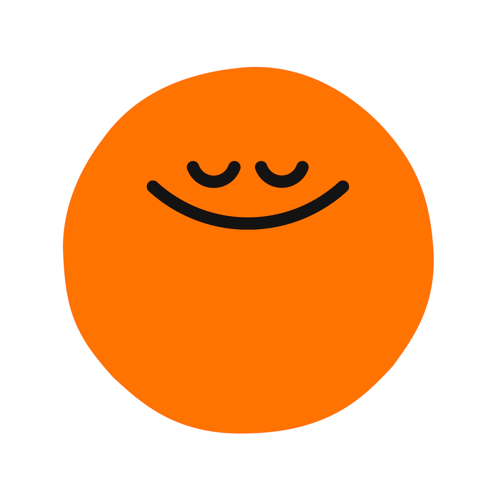

# Headspace

> L'app de méditation devenue entreprise de santé mentale, et surtout **la charte la plus complètement publiée** que j'aie trouvée : brand center intégral en accès libre, palette nommée avec ses Pantone, ratios d'usage chiffrés, frame rates imposés, typo sur mesure. Ce dossier existe pour ça — et pour la règle du cercle imparfait.

**Sources :** [brand center officiel](https://live.standards.site/headspace) (13 pages, 724 médias, sans login) · [press kit Google Drive](https://drive.google.com/drive/folders/1_bGJi36dthZc4eDgt2jDTqaAj12Qxrbi) · headspace.com · App Store et Google Play · Mobbin (5 flows, pages de détail rendues côté serveur) · Adapty · Screensdesign · le case study de Tina Hardison · Italic Studio · Moth Studio · Nexus Studios · It's Nice That, Print Mag, Brand New — détail dans [[#Sources]]

> **Lecture** : chaque famille de visuels est montrée par **une planche** (`<aspect>/planches/`), légendée juste dessous. Les fichiers individuels restent dans leur dossier d'aspect.

## En bref

- **Le brand mark est un cercle imparfait, mais le personnage se dessine en cercle parfait.** Règle écrite noir sur blanc : « DO USE A PERFECT CIRCLE WHEN ILLUSTRATING OUR DOT AS A CHARACTER » / « do not use the imperfect circle for our dot ». Deux objets, deux géométries, un seul symbole.
- **La typo est un cut sur mesure d'Aperçu**, dessiné avec **Colophon Foundry** : « Headspace Aperçu ». Le sourire hero est **intégré à la fonte** (raccourci `_hero_`), et la ponctuation a des alternates dont les points deviennent sparkle, croix ou cœur.
- **La charte donne des ratios, pas seulement des couleurs.** Palette Care : Yellow 200 à 50 %, Blue 100 à 30 %, accents à 20 %. C'est le détail le plus directement réutilisable de tout le dossier.
- **Trois frame rates seulement, imposés** : 12 fps (énergique, playful), 24 fps (« relaxing, ambient, and instructional » — les boucles de respiration), 60 fps (technique, in-app). Interdiction explicite des « easy easy or default ease settings ».
- **Le cran 400 de chaque famille de couleur est marqué SHADOW ONLY.** Une palette où un quart des valeurs est réservé aux ombres.
- **La refonte date du 25 avril 2024**, pas de 2021 (2021 = la fusion à 3 Md$ avec Ginger). Faite en interne, avec Italic Studio en soutien sur six mois.
- **L'intention est nommée** : sortir du seul sourire. Le système d'illustration a évolué « to include a range of faces expressing a range of emotions beyond a smile » — stress, tristesse, contentement.
- **Pas de mode sombre global.** Le sombre est un *univers*, réservé au Sleep : Indigo et Winkle, marqués `[SLEEP ONLY]` dans la charte.

## Écrans

![[ecrans/planches/planche-players-et-etats-vides.png]]
Les players et les états vides. Le player de méditation a deux pickers (professeur, durée) au-dessus d'un gros bouton play, sur un dégradé jaune → orange en collines. Le player de sleepcast bascule dans un violet profond à cercles concentriques, avec un **double slider Ambiance ↔ Voice** — un composant maison introuvable ailleurs. Et les états vides sont tous illustrés par une mascotte différente : loupe multicolore pour la recherche, mascotte rose qui pousse un toggle géant pour les téléchargements. **Chez Headspace un état vide est un moment de marque, jamais un texte gris.**

![[ecrans/accueil-today-start-your-day.png|400]] ![[ecrans/2026-accueil-today-good-afternoon.png|400]]
Le feed d'accueil, deux millésimes : « Start your day » en liste verticale à puces de progression, tab bar Today / Explore / prénom. À droite le millésime récent, avec l'assistant IA Ebb et un tooltip Guest Pass.

![[ecrans/explore-quatre-tuiles-meditate-sleep-move-music.png|400]] ![[ecrans/progression-run-streak-goals-etoiles.png|400]]
L'onglet Explore — quatre grosses tuiles colorées Meditate / Sleep / Move / Music sous une barre de recherche. Et l'écran de progression « RUN STREAK GOALS », avec la mascotte cerveau sur pattes et une grille de huit étoiles dont une seule débloquée.

![[ecrans/2024-ecrans-managing-anxiety-et-video-clinicien.png|600]]
Les écrans tels que la marque les présente en 4K : entourés des formes flottantes du système (nuage violet, fleur rose, bouton play bleu, point orange souriant). La mise en scène des écrans fait partie de la charte.

![[ecrans/ecran-meditate-issu-du-design-system.png|400]] ![[ecrans/fin-de-session-run-streak-et-partage.png|400]]
L'écran Meditate tel qu'il sort du design system, et l'écran de fin de session avec la share sheet iOS.

![[ecrans/planches/planche-store-ios.png]]
Les 8 captures App Store (1242×2208). Deux d'entre elles ne sont pas des écrans mais des cartons marketing (titre de marque, logos de presse) — utiles pour le discours, pas pour l'UI. Le jeu Android équivalent (mêmes visuels en français, 782×1389) a été écarté : moitié de la résolution.

## Flows

![[flows/planches/planche-onboarding-ios.png]]
**L'onboarding**, capté sur Mobbin en résolution native (1180×2676 iOS, 1080×2456 Android). Le splash s'ouvre sur la colline orange qui monte avec « Breathe in » puis « Breathe out » — l'app fait respirer avant de demander quoi que ce soit. Puis welcome, création de compte, « What's on your mind? » en pilules d'objectifs, restitution personnalisée, et l'écran nuit « Let's have a good night » avec son bandeau bleu nuit et ses sapins.

![[flows/planches/planche-paywalls-2022-2026.png]]
**Les paywalls, quatre millésimes et deux variantes A/B.** Le gabarit 2022 est un carrousel de tuiles (« First 14 days free », tuile Annual orange « Best value »). À partir de 2024 il devient une **frise chronologique** Today / In 12 days / In 14 days — beaucoup plus lisible. Les deux variantes Android se voient côte à côte dans le même flow : fond jaune contre **fond bleu**, « First 14 days free » contre « First 7 days free », tuile Annual contre Monthly présélectionnée. En 2026 le CTA devient « Try for $0.00 ».

![[flows/2024-message-du-coach-et-programme-guide.jpg|500]]
Le message du coach, signé d'un prénom et d'un métier (« — Lina, Coach »), au-dessus d'une carte de programme guidé.

## Branding

![[branding/planches/planche-logo-et-regles.png]]
Le logo et ses règles. Le brand mark s'appelle l'**Imperfect Circle**, et le texte officiel dit pourquoi : « If you look closely, you'll notice the brand mark is an imperfect circle. It invites us to embrace the imperfections of life as part of the human experience. It's the lens that we see everything through as a brand. **Not perfect, but whole.** » La zone de protection vaut un diamètre d'imperfect circle sur les quatre côtés. Deux sous-marques ont leur propre lockup : Headspace Care et Headspace Studios.

![[branding/planches/planche-typo-headspace-apercu.png]]
**Headspace Aperçu**, cut sur mesure d'Aperçu par Colophon Foundry. Texte officiel : « We collaborated with Colophon Foundry to create a custom version of their Aperçu typeface. Playful letterforms take on a friendlier feel that alludes to the curve of our iconic smile. » Servie sur `static.headspace.com/fonts/apercu-v1.002/`. 6 graisses + 6 italiques, plus Apercu Mono Pro sous licence séparée. Réglages officiels donnés au chiffre près : Bold / Orange 200 / 120 px / -30 de tracking / 100 % d'interligne pour un titre. **Toujours en sentence case, jamais en capitales** (do-not explicite).

![[branding/planches/planche-systeme-illustration.png]]
**Le système d'illustration.** Le personnage s'appelle « our Dot ». Règles chiffrées : trois couleurs secondaires maximum par illustration, épaisseurs de trait homogènes, varier les visages quand il y a plusieurs personnages, et « AVOID BEING LITERAL, do not reflect JUST the problem » → « DO SHOW AN ELEVATED METAPHOR ». La bibliothèque officielle est rangée en 8 thèmes : Evergreen, Work, Education, Mindful Eating, Seasonal, Sleep, Stress Anxiety, Hard Topics — chacun décliné en JPEG / PDF / PNG / SVG, avec un nommage `HS-<theme>-<sujet>-<initiales de l'illustrateur>`.

![[branding/cle-visuelle-everything-your-mind-needs.png|600]]
La clé visuelle de la refonte 2024 : « everything your mind needs » en arc au-dessus d'un gros soleil orange souriant.

![[branding/planche-systeme-de-marque-en-tuiles.jpeg|600]]
Le système en une planche : logo, spécimen « AaBbCc 12345 » avec le sourire en swash, jeu d'icônes bleues, personnage jaune, photo lifestyle. Sur les icônes, la charte est nette : « Our icons are bespoke, quirky, rounded, and one of a kind. **We never use stock icons.** »

**Adjectifs de marque déclarés** (répétés deux fois dans la charte) : *Hopeful, Visionary, Approachable, Reliable*.

## Couleurs

![[couleurs/palette-core-primaires-et-secondaires.svg]]
**La Core Palette**, avec noms, hex et Pantone. Six familles de quatre crans, et le cran 400 de chaque famille est marqué **SHADOW ONLY** : réservé aux ombres, jamais aux aplats. Phrase de référence sur l'orange : « Orange is our most-recognizable brand color, inspired by the traditions of meditation and practice. Use orange freely, supported by white and dark grey. »

![[couleurs/palette-gris-et-sous-palettes.svg]]
Les gris et les sous-palettes. Trois séparations explicites : les **Warm Grey** (dont le 700 #2D2C2B, déclaré comme « the black text color » — Headspace n'utilise pas de noir), les **Cool Grey** marqués `[PRODUCT ONLY]`, et les **Indigo + Winkle** marqués `[SLEEP ONLY]`. La palette n'est pas un ensemble de couleurs, c'est un ensemble de **permissions**.

![[couleurs/palette-ratios-officiels.svg]]
**Les ratios de la palette Care** — 50 / 30 / 20. Le détail que presque aucune charte ne publie.

![[couleurs/palette-declaree-enterprise-officielle.svg]]
Le nuancier officiel de la palette enterprise, tel que le brand center le publie.

![[animations/systeme-couleur-anime-orange-white-warm-grey_headspace.gif]]
Et le même système en mouvement, dans le case study interne : les blocs Orange / White / Warm Grey avec leurs noms.

## Composants

![[composants/design-system-variables-figma-primitives-et-tokens_headspace.png|600]]
**Les variables Figma du design system**, publiées dans une étude de cas Figma (6 décembre 2023) : une collection *Primitives* (white, warmGrey, coolGrey, orange, yellow, blue, green, pink, purple, indigo, winkle, red, spacing, size, borderRadius) et une collection *Tokens* sémantiques en light/dark (primary, foreground, border, background, surface, overlay, interactive, contrast, status). 85 % des fichiers de design tirés du système.

![[composants/design-system-planche-composants-care_headspace.png|600]]
La planche de composants Headspace Care : écran Welcome, icônes Member Support, boutons, cartes vidéo, chips, avatars.

![[composants/bottom-sheet-choose-your-teacher_headspace.png|400]] ![[composants/systeme-sprite-photo-detouree-et-visage_headspace.png|400]]
Le bottom sheet « Choose your teacher » — carte carrousel avec portrait et bio, pagination trois points, par-dessus le player assombri. Et le système **« sprite »** : une photo détourée dans une forme de cadrage, plus un visage. Règle motion associée : « Apply sprites sparingly, leaving ample time between their appearances. » Pour les membres, avatars illustrés ; pour les guides et thérapeutes, photo couleur détourée sur une couleur de marque.

Tous référencés dans [[_COMPOSANTS]].

## Animations

![[animations/point-orange-qui-se-demultiplie-en-visages_headspace.gif]]
**L'animation qui dit l'intention de la refonte** : le point orange souriant, seul sur jaune, se démultiplie en une famille de formes-visages portant des expressions différentes. La sortie du sourire unique, en cinq secondes.

![[animations/axe-de-ton-clinical-vers-playful_headspace.gif]]
**L'axe de ton, imprimé en pied de plusieurs planches** : un curseur `CLINICAL ←→ PLAYFUL`. Côté playful, « happy looks good on you » en cursive sur orange ; côté clinique, « decrease depressive symptoms by 32% » en gras sur bleu. Le système est explicitement un curseur, pas un style.

![[animations/typo-morphing-apercu-vers-headspace-apercu_headspace.gif]]
Le slider animé « APERCU → HEADSPACE APERCU » : les lettres y / a / l / k / z morphent de l'Aperçu original vers le cut maison. La preuve visuelle directe de ce qui a été redessiné.

![[animations/logo-anime-version-primaire_headspace.mp4]]
![[animations/transition-iris-swipe-du-point-orange_headspace.mp4]]
Les animations officielles du logo, fournies pré-rendues par le brand center, et la transition **iris swipe** de 2023 : le Dot s'ouvre en volet plein écran.

![[animations/nexus-ballon-qui-respire_headspace.gif]] ![[animations/nexus-ecureuil-au-bonnet-rouge_headspace.gif]]
Nexus Studios, 2017 — le partenaire animation de Headspace depuis 2016 : un ballon turquoise qui se gonfle et se dégonfle (la métaphore de la respiration), un écureuil à bonnet rouge dans un paysage stylisé.

![[animations/nasdaq-times-square-love-your-mind_headspace.gif]] ![[animations/stories-verticales-fond-qui-cycle_headspace.gif]]
La tour Nasdaq de Times Square habillée en jaune, et des stories verticales dont le fond cycle orange → bleu → violet.

**Règles motion officielles, chiffrées** : trois frame rates seulement — **12 fps** énergique et playful, **24 fps** « relaxing, ambient, and instructional » (boucles de respiration, animation d'environnement), **60 fps** technique et in-app. Velocity curves obligatoires, « easy easy or default ease settings » interdits, interdiction de scaler la bouche en X ou en Y. Reveal du texte par mot pour les titres courts, par ligne pour les lower thirds. Toutes référencées dans [[_ANIMATIONS]].

## Marketing

Captures pleine hauteur de headspace.com (desktop + mobile) : `home`, `app`, `meditation`, `mindfulness`, `sleep`, `coaching`, `online-therapy`, `ai-mental-health-companion`. Le site sert ses images via `headspace-contentful.imgix.net` — récupérables en pleine qualité sans paramètre de resize.

![[marketing/ooh-bus-jaune-how-are-you-today.png|600]]
Un bus entièrement jaune Headspace : « how are you today? » en cursive noire, un blob bleu et un sourire orange en bord de caisse.

![[marketing/ooh-panneau-you-can-coaching.png|600]]
Le dispositif OOH le plus fort : à gauche une photo avec la typo bleue répétée « can't… strong… », à droite un panneau vert avec une bulle « You can. » et la signature « Mental health coaching from headspace ». **Le message est réparti sur deux panneaux.**

![[marketing/ooh-plate-too-full-et-big-day-today.jpg|500]] ![[marketing/ooh-from-inner-critic-to-inner-champion.webp|500]]
« Plate too full? » avec une assiette illustrée, « Big day today? » sur orange, et « From inner critic to inner champion » avec des photos détourées en blobs plus une carte produit in-app.

![[marketing/hero-desktop-ebb-et-sleepcast.png|500]]
Le hero actuel du site : mockup app « Managing Anxiety », carte Sleepcast Denali, Dot orange, bulle Ebb.

## Process

![[process/planches/planche-moth-sleep-2019.png]]
**Moth Studio, campagne Sleep 2019 — la seule chaîne de process complète du dossier** : storyboard rough (une vingtaine de vignettes violet/vert, du réveil à l'endormissement) → planche d'expressions du personnage Susie → character design « Jones » en trois variantes numérotées → concept design jour → un décor d'immeuble en coupe **décliné jour et nuit** → le plan final en forêt violette. Un film hero de 60 s plus six spots de 15 s.

![[process/netflix-2021-exploration-de-personnages.png|600]]
Netflix, *Headspace Guide to Meditation* (2021) : la planche d'exploration de character design pour les trailers — une trentaine de variantes d'un personnage-blob jaune sur bleu outremer.

![[process/netflix-2021-colourboard-guide-to-meditation.png|600]]
![[process/netflix-2021-colourboard-spot-nouvel-an.png|600]]
Les colourboards en 4K : douze vignettes chacun, qui fixent la gamme violet / jaune / vert de la série avant l'animation.

![[process/netflix-2021-decor-nocturne-guide-to-sleep.png|400]] ![[animations/netflix-breakdown-du-trait-au-rendu_headspace.gif|400]]
Un décor nocturne vertical de *Guide to Sleep*, et le breakdown animé du trait nu au rendu final.

L'intention de la série, citée par son directeur artistique Drew Takahashi : « Many of us have done our share of commercials where every second is there to stimulate or seduce. In this case the subject seemed to demand a different use of the medium. » Les séquences d'exercice sont visées comme « **a kind of animation lava lamp**. Something with a warming presence that you don't necessarily need to look at in order to feel it in the room ». Et : « the curse of the ego too clever is not right here ».

## Archive

![[archive/2019-wordmark-avant-la-refonte.png|500]]
Le wordmark d'avant 2024 : point orange plein + « headspace » en bas de casse gris anthracite. Seul état antérieur trouvable — Wikimedia n'a aucun SVG du logo Headspace, seulement ce PNG daté 2019.

![[archive/millesime-player-vert-deau-dealing-with-distractions.png|400]] ![[archive/2022-paywall-carrousel-first-14-days-free.png|400]]
**Le millésime le plus dépaysant du dossier** : l'ancien player Headspace, fond vert d'eau, titre en capitales espacées « DEALING WITH DISTRACTIONS », « Session 1 », sélecteur 10 MIN / 15 MIN. Aucun rapport avec la charte orange actuelle. À côté, le paywall carrousel de 2022.

## Sources

- **[Brand center officiel](https://live.standards.site/headspace)** — 13 pages (Homepage, Who We Are, TOV, Logo, Color, Typography, UI, Illustration, Photography, Motion, Layouts, Applications, Accessibility), 724 fichiers, **accessible sans login**. La source la plus riche du dossier : palette nommée avec Pantone, règles motion chiffrées, règles d'illustration, logos vectoriels. Le document est intitulé en interne « Headspace - Live Example » sur la plateforme standards.site — c'est vraisemblablement l'instance réelle exposée en vitrine par l'éditeur ; les assets sont bien des fichiers de production, mais **la nature « exemple public » mérite d'être signalée**.
- **[Press kit](https://www.headspace.com/press-and-media)** → dossier Google Drive public : App Screengrabs, Illustrations (8 thèmes en SVG), Logos, Spokespeople Bios, HQ Office Photos, Video Assets. Contact : press@headspace.com.
- **headspace.com** — heros desktop et mobile via le CDN Contentful/imgix.
- **App Store / Google Play** — icône, 8 + 8 captures, métadonnées (v8.28.0, 4,84/5 sur 973 866 avis, catégories Health & Fitness + Productivity).
- **Mobbin** — 5 flows (iOS Onboarding 18 écrans, Android Onboarding 24, iOS Meditate 5, Completing a session 15, Searching 5) en résolution native. Découverte importante : **les pages de détail `mobbin.com/flows/<uuid>` et `mobbin.com/screens/<uuid>` sont rendues côté serveur et accessibles sans compte** ; seules les pages d'app et la recherche exigent le login. Les images sont sur des URLs signées éphémères, avec filigrane « curated by Mobbin ».
- **[Adapty](https://adapty.io/paywall-library/headspace-sleep-meditation/)** — deux millésimes de paywall hors filigrane (2022 et 2023).
- **Screensdesign** — le millésime récent (accueil 2026, paywall « Try for $0.00 », player Brown Noise).
- **[Case study de Tina Hardison](https://www.tinahardison.com/headspace-brand)** — qui dirigeait l'équipe brand interne. Publie la liste de crédits nominative complète et les animations du système (axe clinical↔playful, morphing de la typo, système couleur).
- **[Italic Studio](https://italic-studio.com/projects/headspace-rebrand/)** — le studio de soutien : OOH, écrans, boucles motion.
- **[Moth Studio](https://www.moth.studio/projects/sleep-headspace)** et **[Netflix trailers](https://www.moth.studio/projects/headspace-trailers)** — le process complet.
- **[Nexus Studios](https://nexusstudios.com/work/headspace/)** — partenaire animation depuis 2016.
- **[It's Nice That](https://www.itsnicethat.com/articles/italic-studio-headspace-graphic-design-project-250424)** (25 avril 2024, Liz Gorny) et **[Print Mag](https://www.printmag.com/branding-identity-design/headspaces-refreshed-identity-offerings-signal-new-era-of-empowered-well-being/)** (8 mai 2024, Amelia Nash) — la ligne de crédits officielle et l'intention.
- **[Figma blog](https://www.figma.com/blog/building-a-design-system-that-breathes-with-headspace/)** (6 décembre 2023) — le design system et ses variables.

**Ce qui a bloqué** : Brand New (post du 20 mai 2024, corps derrière l'abonnement — donc **pas d'analyse critique avant/après exploitable**, c'est le manque principal). Le communiqué BusinessWire (403 Akamai). Le Behance de Sasha Baranovskaya (429). Le portfolio de Karen Yoojin Hong (404 sur les sous-pages) — la piste la plus rentable restante pour la bibliothèque d'illustration et les icônes in-app. Page Flows (millésimes 2018 / 2020 / 2021 derrière un compte). UXArchive **hors service** (Cloudflare erreur 1000, « DNS points to prohibited IP »). Aucune vidéo Vimeo ni YouTube récupérée (`yt-dlp` échoue en 401 sur Vimeo). Les 14 OTF Headspace Aperçu sont téléchargeables depuis le brand center mais sous licence propriétaire Colophon × Headspace — **non récupérés délibérément**. Aucune capture live du site via navigateur : `claude-in-chrome` n'est pas installé dans cette session.

## Crédits

**Refonte 2024, dévoilée le 25 avril 2024.** Ligne officielle publiée par It's Nice That et reprise par Print Mag : *« Headspace rebrand, design support by Italic Studio, custom typeface by Colophon Type Foundry, brand guidelines by Order developed on Standards. »* Conception **in-house**, Italic Studio en soutien sur six mois — ITAL/C écrit : « faire évoluer la marque, pas la réinventer ».

Crédits nominatifs, publiés par **[Tina Hardison](https://www.tinahardison.com/headspace-brand)**, qui dirigeait l'équipe brand :
- **Creative Direction** — Tina Hardison, David Hsia, Liz Tran, Dani Balenson
- **Brand Design** — Lauren Allik, Marissa Meier
- **Motion** — PJ Kim, Brian Lee, Delaney Tritone
- **Copy** — Joseph Mains, Makenzie McNeill
- **Product Design** — Ken Seeno, Steven Sczepanik
- **Illustration** — Ryan Cox (Lead Illustrator), Karen Yoojin Hong (Brand Designer), Sasha Baranovskaya (freelance, Amsterdam, notamment les Sleepcasts)
- **Type Design** — [Colophon Foundry](https://www.colophon-foundry.org)
- **Photography** — Andria Lo, Jason LeCras

L'équipe dédiée illustration ne compte que **deux personnes** : Karen Yoojin Hong et Ryan Cox. Karen a refait les couleurs de marque, les icônes in-app et les illustrations evergreen, et construit la bibliothèque plus ses guidelines.

**Design system** — Steven Sczepanik (Senior Product Designer, Design Systems) et Nick Hayward (Senior iOS Engineer).

**Animation — deux studios distincts, ne pas confondre :**
- **[Nexus Studios](https://nexusstudios.com/work/headspace/)** — partenaire depuis 2016, équipe interne dédiée de 35+ personnes, CD **Mark Perrett**, 150+ personnages et environnements. A aussi réalisé la série Netflix (Alex Grigg y a réalisé deux épisodes de 20 min).
- **[Moth Studio](https://www.moth.studio/projects/sleep-headspace)** — campagne Sleep 2019. Designers **Ping Mak** et **Chi He**, animation Ben Ommundson et Hozen Britto, compositing Victoria Jardine, musique et son Ally Mobbs. Côté Headspace : CD **William Fowler**, Senior Producer Sara Leimbach. Les trailers Netflix : réalisation et animation Moth Studio, production **Hornet**, design **Qian Shi** et **Ester Rossi**.

**Série Netflix *Headspace Guide to Meditation* (janvier 2021)** — directeur artistique de la série **Drew Takahashi**. Quatre studios, quatre épisodes chacun : Strange Beast (Hannah Jacobs, Lara Lee, Magnus Atom, Yuval Haker), Blink Industries (Alex Grigg, Katy Wang, Gabriel de Bruin), Compost Creative (Colin Thornton, Neil Wilson), Augenblick Studios (Aaron Augenblick, Devin Clark).

**Jalons** : fondée en mai 2010 à Londres par **Andy Puddicombe** (10 ans de formation de moine bouddhiste) et **Richard Pierson**, app lancée en 2012 ; fusion avec Ginger en août 2021 (3 Md$) ; abandon du nom « Headspace Health » en octobre 2023 ; refonte de marque le 25 avril 2024 ; Headspace XR en mars 2024 ; Tom Pickett CEO en août 2024.

**Attention aux fausses pistes** : Fonts In Use n'a **aucune** entrée Headspace. Behance ne contient que des concepts d'étudiants et des redesigns de fans (Zahra Syed, Anuj Waiba, Imran Khan, Hannah Jacobs) — aucun travail officiel. L'origine du point orange (le « temple du front », les robes safran) ne vient que de blogs de branding secondaires : **aucune source de premier rang ne l'explique**, ne pas le reprendre comme un fait.

## Pourquoi je l'aime

- **Une charte qui publie ses ratios.** 50 / 30 / 20. Presque personne ne le fait, et c'est ce qui fait la différence entre une palette et un système.
- **Le cercle imparfait, sauf pour le personnage.** Une règle contre-intuitive, argumentée en trois phrases, tenue partout. « Not perfect, but whole. »
- **Le sourire est dans la fonte.** Pas un logo posé à côté du texte : un glyphe, appelable par un raccourci. La marque est composable au clavier.
- **L'axe de ton imprimé dans la charte.** `CLINICAL ←→ PLAYFUL` en pied de page. La marque assume qu'elle doit parfois dire « −32 % de symptômes dépressifs » et parfois « happy looks good on you », et elle donne le curseur au lieu d'interdire l'un des deux.
- **Trois frame rates, et une signification par frame rate.** 24 fps parce que c'est « relaxing, ambient » — le rythme d'image comme choix de ton.
- **Le sombre est un univers, pas un réglage.** Indigo et Winkle, `[SLEEP ONLY]`. Beaucoup plus intéressant qu'un dark mode générique.
- **Les états vides sont des moments de marque.** Une mascotte différente à chaque écran vide.

## À réutiliser pour

- Projet : [[ ]]
- **Publier des ratios d'usage** avec la palette, pas seulement des hex. À faire systématiquement sur les chartes Sordulo.
- **Le curseur de ton** comme livrable de charte : deux extrêmes nommés et des exemples de chaque côté, plutôt qu'une liste d'interdits.
- **Le glyphe de marque intégré à la fonte** — à explorer dès qu'un client a un symbole simple et une typo sur mesure.
- **La palette à permissions** : `[PRODUCT ONLY]`, `[SLEEP ONLY]`, `SHADOW ONLY`. Dire *où* une couleur a le droit d'aller.
- **Les frame rates prescrits** dans une charte motion, avec une intention par valeur.
- **Le message OOH réparti sur deux panneaux** (« can't… » puis « You can. »).
- **La frise chronologique de paywall** Today / In 12 days / In 14 days — nettement plus honnête et plus lisible qu'un carrousel de tuiles.
- **Un état vide illustré par une mascotte différente à chaque écran.**

## Mots-clés

Headspace · méditation · meditation · mindfulness · pleine conscience · santé mentale · mental health · wellness · bien-être · sommeil · sleep · sleepcast · Andy Puddicombe · Richard Pierson · Ginger · Headspace Care · Headspace Studios · Headspace XR · Ebb · assistant IA · coach · thérapeute · Imperfect Circle · cercle imparfait · Dot · hero smile · sourire · point orange · Headspace Aperçu · Apercu · Colophon Foundry · typo sur mesure · custom typeface · glyphe · alternates · ponctuation · sparkle · sentence case · palette nommée · named palette · Pantone · SHADOW ONLY · PRODUCT ONLY · SLEEP ONLY · Warm Grey · Cool Grey · Indigo · Winkle · ratios d'usage · 50 30 20 · design tokens · variables Figma · design system · Order · Standards · brand center · brand guidelines · illustration system · blobs · personnages · faces · émotions · elevated metaphor · sprite · photo détourée · icônes bespoke · motion · frame rate · 12 fps · 24 fps · 60 fps · velocity curve · iris swipe · lava lamp · Tina Hardison · Italic Studio · ITAL/C · Kevin · Ryan Cox · Karen Yoojin Hong · Sasha Baranovskaya · Steven Sczepanik · Ken Seeno · Nexus Studios · Mark Perrett · Moth Studio · Ping Mak · Chi He · Hornet · Qian Shi · Ester Rossi · Drew Takahashi · Netflix · Guide to Meditation · Guide to Sleep · Love Your Mind · clinical playful · axe de ton · tone of voice · onboarding · breathe in breathe out · paywall · frise d'essai · trial timeline · variante A/B · run streak · gamification · état vide · empty state · bottom sheet · double slider · Ambiance Voice · OOH · affichage · bus · Nasdaq · Times Square

---
[[_APPS|← Apps]] · [[_INSPIRATION|← Inspiration]]
