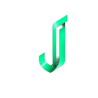

# Journali

> Le playbook **classé par espérance de gain** — vingt stratégies notées sur cinq crans, avec podium à médailles — et un gate pré-trade dont le cool-off n'est pas un compte à rebours mais **une barre qu'il faut maintenir enfoncée dix secondes**, avec le bilan chiffré de vos passages en force affiché juste au-dessus.

**Sources :** site officiel et ses quatre feuilles CSS inline · les routes publiques de l'app (`/strategies`, ses 20 fiches) · le JS de `/checklist`, lu pour reconstituer les règles du gate · press kit · Wayback Machine · walkthrough vidéo d'un fondateur

> **Lecture** : chaque famille d'écrans est montrée par **une planche** (`<aspect>/planches/`), légendée juste dessous. Les fichiers individuels restent dans leur dossier d'aspect.

## En bref

- **Le playbook est un classement, pas une bibliothèque.** Vingt stratégies rangées de #1 à #20, chacune avec un verdict sur **cinq crans de couleur** — de « Strongly Recommended » à « Not Recommended » (une seule stratégie porte le rouge : Micro Scalping). Podium à médailles or/argent/bronze pour le top 3.
- **Le cool-off est un geste physique, pas une attente.** Quand le gate rend un feu rouge, il n'y a aucun bouton de validation : à la place, une barre de 50 px qu'il faut **maintenir enfoncée pendant 10 000 ms**, avec remplissage en temps réel, décompte et anneau qui tourne. **Relâcher avant la fin remet à zéro.**
- **Et au-dessus de cette barre, le système affiche le coût réel des overrides passés** : leur nombre, leur taux de réussite (en rouge sous 50 %) et leur P&L net cumulé. Une boucle d'apprentissage, pas juste un frein.
- **Le verdict a trois états, pas deux.** Le jaune — « Take it with reduced size » — est absent de tout le discours marketing mais bien présent dans le code.
- **Le halo rouge pulse deux fois plus vite que le vert** (1,8 s contre 3 s). L'urgence est encodée dans le tempo de l'animation, pas seulement dans la teinte.
- **Aucune vraie capture d'écran nulle part.** Les huit « écrans produit » de la landing sont des maquettes reconstruites en **HTML/CSS pur** — la page ne sert que trois fichiers image. Choix technique fort (netteté, thème réactif) mais l'UI montrée est idéalisée.
- **Deux design systems non réconciliés** : Syne + noir bleuté + vert néon côté marketing, Plus Jakarta Sans + crème papier ou noir bleuté côté app. Passer de la landing à `/strategies` change de marque.
- **Deux logos contradictoires** : le press kit distribue un carnet crème en Georgia serif, le produit utilise un J en ruban 3D vert. Aucun rapport entre les deux.
- **Icônes emoji en production**, partout : la navigation (📖 Journal, ⚡ Trade Check) et les vingt cartes du playbook. Rendu dépendant de l'OS, mais un ton qui tranche avec le sérieux du reste.

## Écrans

![[ecrans/planches/planche-le-playbook-classe.png]]

**Le même playbook est mis en page trois fois, et chaque version dit autre chose.** Sur la landing, un carrousel à scroll-snap de cartes de 280 px, chacune empilant rang mono coloré + emoji, nom, tagline en italique, pilule de verdict, ligne de stats en monospace séparée par un **filet pointillé** (`65% WR · 1.6R · 418 using`), puis badges d'actif et de niveau. La carte #1 monte plus haut au survol que les autres, avec une ombre verte renforcée.

Sur `/strategies` — page publique, dans le design system de l'app — c'est un **podium** : trois cartes surélevées à médailles 🥇🥈🥉 et labels CHAMPION / SILVER / BRONZE, liserés or, argent, bronze, puis une grille de deux colonnes pour les rangs 4 à 20. Et **les métriques changent de nature** : « 3 298 trades logged / 447 traders » au lieu de « 65 % WR · 1.6R ». Deux sources de vérité — un backtest IA et des données communautaires — que la landing mélange sans le dire.

Le troisième état est le plus intéressant : **dans le produit, le même objet est alimenté par vos propres trades** et le verdict passe de cinq crans à trois — ★ HOT / WATCH / LEAK — sous un bandeau « Total expectancy +1.42R ». Le classement communautaire devient un diagnostic personnel. Le message du site le dit : « Verdicts, not just numbers ».

La fiche de stratégie individuelle est une page produit complète : barre de cinq métriques à plat, carte de verdict à étoile, et une carte « ✦ AI ANALYSIS » à liseré dégradé vert→violet contenant quatre paragraphes rédigés et un encadré monospace de notes de backtest (« 100 sessions, profit factor 1.92, false-breakout rate 22% »).

![[ecrans/app-strategy-rankings-theme-creme.png]]

**Le thème clair est un crème papier, jamais montré sur la landing** — `#f0ede8` de fond, cartes blanches, encre `#141412` chaude, et un vert d'accent **forêt** `#1a6b3c` qui n'est pas le néon assombri mais une autre couleur. C'est une seconde peau complète, pas un mode dégradé.

## Flows

![[flows/planches/planche-tradecheck.png]]

**TradeCheck est le sujet de ce dossier, et le vrai écran vaut mieux que son mockup.** Le formulaire enchaîne instrument, sélecteur de setup, deux gros boutons de direction, quatre champs de prix, puis une barre calculée `$RISK · $REWARD · R:R · % OF DAILY CAP`. Et surtout un bloc **« HOW ARE YOU FEELING? »** en cinq chips emoji de 78 px — 😤 Frustrated, 😰 Anxious, 😐 Neutral, 😊 Confident, 🔥 In the Zone — dont le sélectionné passe en `scale(1.06)` avec bordure verte.

Le verdict se dessine en carte à **barre verticale de 4 px** colorée selon l'état, coiffée d'un bandeau en dégradé 135° et surmonté d'un **halo radial qui déborde de 50 % de tous les côtés**. Les actions changent selon le verdict : vert → « Log this trade → » ; jaune → « Take it with reduced size → » ; **rouge → aucun bouton de validation**, juste une carte « 🛑 The gate says stop. »

Les cinq contrôles du mockup marketing sont propres (Setup quality, News window, Risk:Reward, Session P&L, Emotion check) mais **le code va bien plus loin**, avec des règles croisées que le marketing ne mentionne pas :

| Règle lue dans le JS | Seuil jaune | Seuil rouge |
| --- | --- | --- |
| Série de pertes | 2 pertes | 3 pertes ou plus |
| Émotion déclarée | Anxious | Frustrated |
| **Contradiction émotion / session** | — | « Confident » ou « In the Zone » sur 3 pertes d'affilée |
| Prop firm — perte journalière consommée | ≥ 50 % | ≥ 80 % |
| R:R | < 1,5:1 | < 1:1 |
| Événement à fort impact | dans les 2 h | — |
| Surtrading | 8 trades déjà pris | — |

La plus belle est la contradiction : **se déclarer confiant après trois pertes déclenche un rouge**, avec le motif « likely tilt masked as confidence ». Le produit ne croit pas la déclaration de l'utilisateur, il la recoupe avec ses données — et un encart ambre s'affiche en direct sous les chips.

## Composants

![[composants/planches/planche-composants.png]]

**Tous ces composants sont des maquettes reconstruites en HTML/CSS**, ce qui explique leur netteté et leur cohérence — et impose de les lire comme une UI idéalisée, pas comme une capture.

Le **tableau du playbook produit** est le plus dense : cinq colonnes (Setup / WR / Avg R / N / verdict), le nom du setup portant un sous-titre monospace gris (« Long · RTH »), les métriques en DM Mono colorées selon le signe, et le verdict en pilule teintée sur trois crans. Au-dessus, un bandeau « TOTAL EXPECTANCY / +1.42R » avec une pilule « PROFITABLE ».

Le **calendrier heatmap** est le classique du genre bien exécuté : grille de sept colonnes, cases teintées par intensité de gain, le numéro du jour relégué en bas à droite de la case, et quatre stats sous la grille.

L'**insight IA** emploie un procédé rare : les chiffres clés du texte sont **surlignés en vert inline** (« Entries after 2:30pm EST », « 68% of the time », « $340 per week »), et trois tags rectangulaires classent le diagnostic — TIME-OF-DAY PATTERN, HIGH CONFIDENCE, 247 TRADES.

Et la **saisie de trade** se termine par une note en **Lora italique** dans un encadré à barre verticale verte. C'est le seul endroit où une serif apparaît dans une donnée : le produit distingue typographiquement ce qui est mesuré de ce qui est raconté.

## Couleurs

![[couleurs/palette-declaree-au-press-kit.svg]]

**Le press kit déclare six couleurs en clair** — c'est généreux et rare. Le problème est ailleurs : aucune de ces valeurs n'est celle des maquettes produit du même site.

![[couleurs/palette-trois-verts-qui-ne-se-confondent-pas.svg]]

**Trois verts pour une seule marque, et rien ne les hiérarchise.** `#00d584` sur la landing, `#00d084` au press kit et sur les pages internes, `#2ecc71` dans **tous** les mockups produit. Autrement dit : les « écrans produit » de la page d'accueil n'utilisent pas le vert de la page d'accueil. Le même désaccord existe pour le rouge (`#ff4f68` contre `#ff5f5f`) et pour l'ambre (`#f5ba45` contre `#f5a623`).

![[couleurs/palette-deux-peaux-completes.svg]]

**Deux thèmes entiers, et l'accent change de valeur — pas seulement de luminosité.** En sombre, tous les fonds sont des noirs **bleutés** (`#07090c` pour le marketing, `#0a0d12` pour l'app : deux fonds distincts). En clair, tout devient chaud : crème `#f0ede8` à 6,28 %, encre `#141412`, et un vert forêt `#1a6b3c`. Passer d'un thème à l'autre change la température du produit.

| Thème | Fond | Surface | Encre | Accent |
| --- | --- | --- | --- | --- |
| sombre (marketing) | `#07090c` | `#111820` | `#eef2f7` | `#00d584` |
| sombre (app) | `#0a0d12` | `#111620` | `#dce6f0` | `#52d98f` |
| clair (app) | `#f0ede8` | `#ffffff` | `#141412` | `#1a6b3c` |

**Et la couleur est rarissime dans les deux cas** : 0,41 % en thème clair au relevé de pixels, à peine plus en sombre. Le vert `#00d584` ne pèse que 0,06 %.

![[couleurs/palette-l-echelle-des-verdicts.svg]]

**Deux registres d'évaluation coexistent** : cinq crans pour classer les stratégies, trois pour trancher un trade. Et le détail qui vaut le dossier : **le halo du verdict rouge pulse en 1,8 s quand le vert pulse en 3 s.** Deux fois plus vite. Le tempo porte l'urgence.

## Branding

![[branding/planches/planche-deux-identites.png]]

**Le press kit distribue une identité que le produit n'utilise pas.** Le SVG téléchargeable — seul vecteur disponible — montre un **carnet arrondi noir** contenant trois traits de texte et une polyligne montante, avec un wordmark en **Georgia serif** et un sous-titre « TRADE JOURNAL » en Courier lettré, sur une palette crème et noire. **Zéro vert.** Le site et l'app, eux, utilisent un **« J » en ruban 3D vert** à facettes et brillance, avec un wordmark en Syne sans-serif et un point vert final.

Deux marques, deux typographies, deux palettes. Et le logomark réellement employé **n'existe qu'en PNG** : le seul SVG servi est l'identité abandonnée.

**Quatre polices, quatre rôles — et un bug.** Syne (400-800) est la police principale du marketing, souvent en 800 avec un `letter-spacing` de −2 px. Plus Jakarta Sans (300-800) est celle de l'app. DM Mono porte tous les sur-titres capitales lettrés (8 à 11 px, `letter-spacing` jusqu'à 2,5 px) et toutes les métriques. **Lora n'existe qu'en italique** : la moitié accentuée de chaque titre (« A discipline engine. », « Kill what's *bleeding*. », « *before* you click. »), toujours en dégradé vert avec `drop-shadow`.

Le bug : la landing **déclare** Plus Jakarta Sans dans au moins cinq règles sans la **charger**. Les onglets du carrousel et plusieurs CTA retombent silencieusement sur Syne.

## Marketing

![[marketing/planches/planche-marketing.png]]

**Le procédé récurrent est la statistique vérifiée collée à l'humain.** Dans la section communauté, chaque message de chat porte une **pilule de R vérifié** devant le texte (+2.4R en vert, −0.5R en rouge). Dans les témoignages, l'identité est suivie d'un **encadré de stats à bordure verte en trois colonnes monospace** (« +$42,180 Q1 2026 P&L / +1.8R AVG R / APEX PROP FIRM ») avant la citation. La marque appuie sa preuve sociale sur des chiffres, pas sur des adjectifs — et l'assume jusque dans son slogan de section : « Real traders. Real receipts. »

La section « pain » dessine ses trois *leaks* **en CSS pur** : une courbe d'équité qui monte en vert puis chute en rouge, une grille de points gris avec quatre points verts glowants (les setups gagnants invisibles), une pilule violette « Same mistake × 47 » encadrée de deux icônes de boucle. Trois micro-visualisations plutôt que trois icônes.

Deux bandes de mouvement horizontal tournent en permanence — un ticker de trades (40 s) et un bandeau de brokers (42 s) — qui donnent au site une nervosité de salle de marché.

Et le violet (`#8b7cf8` / `#a96bff`) est **systématiquement la couleur de l'IA et du palier Premier**, seul écart au duo vert/rouge. Anthropic est d'ailleurs un argument de vente explicite : le badge « ★ Ranked #1 by Claude for best trading journal » figure dans le hero **et** dans l'image OG, avec une pilule violette « CLAUDE » sur le mockup du coach.

## Process

**Le récit d'origine est publié et daté**, signé collectivement « the founders » le 20 avril 2026. Le brief fondateur y est cité presque tel quel : *« A trading journal I can log to from my phone in thirty seconds, that tells me the truth about my trading. »* Le texte pose la vitesse de saisie et le mobile-first comme contraintes de design premières, revendique une architecture PWA, et se date « Eighteen Months In » — donc un démarrage vers fin 2024.

La thèse est affichée sur `/about` en trois principes qui commandent l'UI : **« Discipline > Profit — A good journal tracks how you made the trade, not just the P&L. Consistency scoring is a first-class feature »** ; « AI should actually help — Our AI is Claude from Anthropic » ; « Free forever is real ». Et le positionnement est daté contre la concurrence : « Most trading journals on the market today were built between 2011 and 2018 (…) They're desktop-first. They're expensive. And their "AI insights" are templated strings dressed up to look smart. »

**Un commentaire du CSS révèle une équipe qui audite** : `--ink-dim:#6a7c94; /* brightened from #2a3d50 to pass WCAG AA contrast on the dark bg (now ~4.9:1) */`. Une correction de contraste documentée dans le code, c'est rare.

Mais ce n'est **pas du build-in-public** : aucun screenshot de travail, aucune itération, aucun avant/après. Le seul walkthrough de l'app est une vidéo de 12 min d'un fondateur, dont la répartition des durées est parlante — **3 min 43 s pour la saisie d'un trade contre 29 s pour le Trade Checklist**. La vitesse de saisie est bien le cœur revendiqué ; le gate pré-trade, lui, reste secondaire dans le discours, alors que c'est le différenciateur.

**Le profil de l'éditeur explique le reste.** Ce n'est ni un studio ni une startup financée : c'est une **communauté Discord de 65 000 membres qui s'est verticalisée en éditeur de logiciels**. Journali est le quatrième produit de la même équipe de deux personnes (Flowtopia → TraderTax → Oasis Trading Group → Journali), auto-financé, distribué par la communauté et par le SEO.

## Pourquoi je l'aime

- **Le cool-off en appui long.** Remplacer une attente passive par un geste physique de dix secondes qui se réinitialise si on lâche, c'est de la conception d'interaction au sens plein — la friction devient corporelle.
- **Afficher le bilan chiffré des overrides passés au-dessus du bouton d'override.** Le produit ne dit pas « ne fais pas ça », il montre ce que ça a coûté. C'est la meilleure idée de tout ce run.
- **Recouper la déclaration de l'utilisateur avec ses données.** Se dire confiant après trois pertes déclenche un rouge : l'interface a le droit de ne pas croire ce qu'on lui dit.
- **Le tempo comme porteur de sens.** Un halo qui pulse deux fois plus vite en rouge qu'en vert.
- **Classer un playbook et oser le rouge.** Dire « Not Recommended » sur une de ses vingt propres fiches, c'est un choix éditorial que peu de produits assument.

## À réutiliser pour

- Une **confirmation à friction graduée** : appui long avec remplissage temps réel et remise à zéro au relâchement, quand un simple « Êtes-vous sûr ? » ne suffit pas.
- Un **historique de conséquence** posé à côté de l'action risquée (nombre, taux de réussite, coût cumulé).
- Une **échelle de verdict à cinq crans** avec sa pilule colorée, pour classer un catalogue de façon opinionée.
- Le **surlignage inline des chiffres** dans un texte généré, pour rendre un paragraphe d'analyse scannable.
- Projet : [[ ]]

## Limites de la récolte

- **Toutes les captures de ce dossier sont des rendus faits maison** (Chrome headless @2x), fidèles au pixel à ce que sert le site — mais ce ne sont **pas des fichiers fournis par l'éditeur**. Le press kit renvoie à `press@journali.io` pour de vraies captures. Et les « écrans produit » du site sont eux-mêmes des maquettes HTML/CSS, pas des captures d'app.
- **Les états dynamiques de TradeCheck n'ont pas pu être vus** : verdict jaune, verdict rouge, barre d'override en cours de remplissage. Ils exigent une session et des trades en base. **Ils ont été reconstitués à la lecture du JS et du CSS, pas observés.** Aucun compte n'a été créé.
- Même limite pour le **Journali Score rempli**, la courbe d'équité, le calendrier heatmap réel et le Weekly Debrief généré : tout est en état vide sans session.
- **Il n'existe aucune page marketing sur TradeCheck**, et le CTA officiel « How TradeCheck works → » pointe vers `/features/trade-journal`, une page qui **ne contient pas une seule occurrence du mot**. Lien mort de contenu sur le différenciateur revendiqué.
- **Aucun logo vectoriel du logomark réel.** Le seul SVG servi est l'identité abandonnée du press kit.
- **Zéro trace archivistique du produit** : trois captures Wayback sur tout le domaine, toutes antérieures (une page placeholder de 2019-2020). Aucun avant/après possible.
- **Aucune galerie de design ne l'indexe** — vérifié sur huit sources, dont trois avec le texte de non-résultat effectivement lu (Awwwards, SaaS Landing Page, Screensdesign). Aucun comparatif indépendant ne le cite non plus, et **toutes** les pages qui le classent n°1 sont ses propres pages SEO.
- **Le designer n'est pas identifié.** Une piste existe — la société sœur Flowtopia crédite « Defcor.us » — mais Defcor est une SSII texane dont le portfolio public ne mentionne ni Journali ni Flowtopia. **Je n'attribue pas le design.**
- **Identités civiles non vérifiables** : X répond 402, LinkedIn 999. Seul le prénom « Tyler » est attesté, par le site lui-même.
- **Prix incohérents** : le press kit annonce 20 $ et 30 $/mois, le site facture 8 $ et 10 $/**semaine** par défaut (soit ~35 $ et ~43 $/mois).
- **Aucune application mobile** : zéro trace de store sur tout le site, le mobile est traité comme du web.

## Sources

- **Site officiel et ses CSS inline** — aucune feuille externe : 87 660 caractères dans un `<style>` sur la landing seule. Les tokens, les quatre thèmes, les quinze `@keyframes` nommés, la texture de grain SVG. → [journali.io](https://journali.io)
- **Les routes publiques de l'app** — `/strategies` et ses 20 fiches, rendues dans le design system du produit avec le sélecteur de thème, sans login. → [journali.io/strategies](https://journali.io/strategies)
- **Le JS de `/checklist`** — lu pour reconstituer les règles réelles du gate, les trois verdicts et le mécanisme d'appui long. C'est la source la plus précieuse du dossier.
- **Press kit** — palette déclarée, descriptifs pré-rédigés, bio fondateur, quatre téléchargements de logo. → [journali.io/press](https://journali.io/press)
- **Récit d'origine** — le brief fondateur, les contraintes de design premières, la datation du projet. → [journali.io/blog/why-we-built-journali](https://journali.io/blog/why-we-built-journali)
- **Walkthrough vidéo** — 12 min 19 s par un fondateur, seule fenêtre sur l'app derrière le login. Chapitres utiles : 9:00–9:29 pour le Trade Checklist, 6:10–8:26 pour les analytics. → [youtu.be/h7lo9z3vML0](https://youtu.be/h7lo9z3vML0)
- **Wayback Machine** — trois captures en tout, qui établissent que le domaine servait à autre chose avant. → [web.archive.org/…/journali.io](https://web.archive.org/web/*/journali.io*)

## Crédits

- **TheTradingChamp** (prénom « Tyler », nom de famille non publié) — co-fondateur, « leads product and strategy across the Oasis ecosystem ». → [x.com/thetradingchamp](https://x.com/thetradingchamp) · [YouTube](https://www.youtube.com/channel/UC3Ev6rOQkIy0E1mj5bNfQQw)
- **BullishBritt** (aucun nom civil publié) — co-fondateur, « leads operations, growth, and community ». → [x.com/BullishBritt](https://x.com/BullishBritt)
- **Aucun designer identifié.** Aucun crédit, aucun colophon, aucune mention « designed by » dans le HTML. Voir les limites : la seule piste ne tient pas.
- **Journali** — aucune entité légale nommée nulle part (ni CGU, ni confidentialité, ni `/about`). Droit applicable : État du Texas. Quatrième produit de l'écosystème Oasis (Flowtopia, TraderTax, Oasis Trading Group), auto-financé.
- **Syne** — [Bonjour Monde](https://gitlab.com/bonjour-monde/fonderie/syne-typeface) (Lucas Descroix, George Triantafyllakos), créée en 2017 pour le centre d'art Synesthésie à Saint-Denis, SIL OFL.
- **Plus Jakarta Sans** — [Tokotype](https://github.com/tokotype/PlusJakartaSans) (Gumpita Rahayu), commande initiale du studio 6616 pour la ville de Jakarta, SIL OFL.
- **DM Mono** — Colophon Foundry pour DeepMind, dérivée de DM Sans, SIL OFL.
- **Lora** — [Cyreal](https://github.com/cyrealtype/Lora-Cyrillic), SIL OFL.
- **Partenariats** : Official NinjaTrader Vendor · SnapTrade pour la synchro courtiers · **Claude d'Anthropic** pour l'IA.

## Mots-clés

playbook de trading, trading playbook, classement de stratégies, strategy rankings, expectancy, espérance de gain, R-multiple, verdict, cinq crans, podium, médaille, or argent bronze, rang, hot watch leak, leak, edge, gate pré-trade, pre-trade gate, TradeCheck, feu vert, feu rouge, green light, red light, trois verdicts, cool-off, appui long, press and hold, friction délibérée, remise à zéro, override, historique d'override, coût de la transgression, tilt, détection de tilt, contradiction, recoupement, émotion, chips emoji, état émotionnel, discipline, Journali Score, consistency, calendrier heatmap, prop firm, drawdown, trailing, jauge, badge d'impact, calendrier économique, insight IA, surlignage inline, Claude, Anthropic, violet de l'IA, maquette HTML CSS, mockup en code, pas de capture, deux design systems, deux logos, trois verts, deux thèmes, crème papier, noir bleuté, vert néon, vert forêt, Syne, Lora italique, DM Mono, Plus Jakarta Sans, grain SVG, feTurbulence, marquee, ticker, WCAG, contraste, accessibilité, R vérifié, preuve sociale chiffrée, receipts, communauté Discord, verticalisation, bootstrapped, SEO, Texas, NinjaTrader, SnapTrade, PWA

## À voir aussi

- [[edgeflo]] — l'autre gate du corpus, mais qui bloque vraiment le bouton d'achat au lieu de facturer la friction.
- [[tradingplan]] — le playbook sans aucun classement ni verdict : la règle brute, sans jugement.
- [[temper]] — l'interruption en temps réel, le troisième terme de la famille.
- [[traders-second-brain]] — l'autre produit à très faible taux de couleur, et l'autre « Leak Map ».
- [[_APPS]] · [[_COMPOSANTS]] · [[_ANIMATIONS]]
