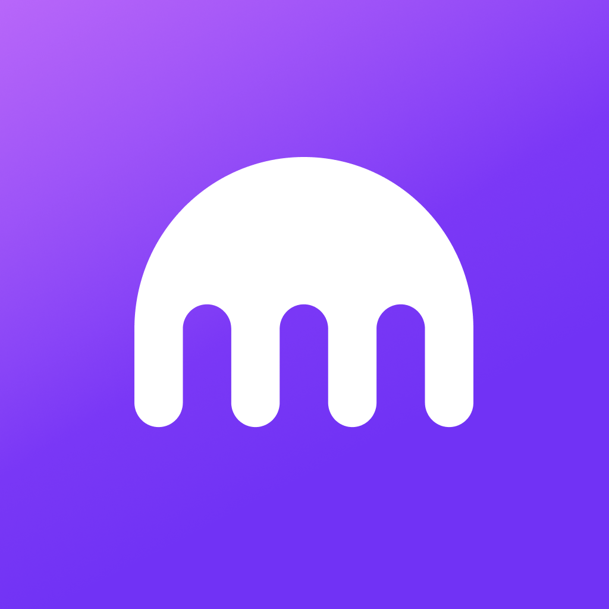

# Kraken

> L'app grand public de l'exchange crypto Kraken (Payward, Inc.), et la marque autour. Ce dossier existe pour une raison précise : Kraken a **refait son interface trois fois en sept ans**, et les trois millésimes sont documentés ici côte à côte — l'illustration SF de 2019, le thème clair de 2024, le thème sombre de 2025, plus les écrans d'une refonte 2026 encore non sortie. C'est une étude de cas rare sur *comment une fintech durcit sa direction artistique en vieillissant*.

**Sources :** [kraken.com](https://www.kraken.com) (capture 2026-08-18) · [press kit consumer](https://www.kraken.com/press/kraken-images) · [blog produit Kraken](https://blog.kraken.com) · [App Store](https://apps.apple.com/us/app/kraken-buy-crypto-stocks/id1481947260) · [Google Play](https://play.google.com/store/apps/details?id=com.kraken.invest.app) · [Mobbin](https://mobbin.com) (écrans in-app et flows) · [Refero](https://refero.design/websites/161) (108 captures du site, toutes de 2022) · [Antonin Collard — Kraken Redesign, Behance](https://www.behance.net/gallery/84271287/Kraken-Redesign) · [Rune Fisker](https://runefisker.com/Kraken-bitcoin-exchange) · [Creative Salon — campagne Mother](https://creative.salon/articles/work/mother-kraken-crypto-makes-the-world-go-forward)

> **Lecture** : chaque famille est montrée par **une planche** (`<aspect>/planches/`), légendée dessous. Les fichiers individuels restent dans leur dossier d'aspect — c'est de là qu'on récupère un asset précis.

---

## Le système en bref

- **Une seule couleur d'action.** Le violet `#7132F5` est la seule couleur vive de l'interface. Tout le reste est neutre, sauf la sémantique de marché (vert de hausse, rouge de baisse) qui n'est jamais décorative. Sur le relevé de pixels des écrans store, le violet ne représente que **1,3 % de la surface** — il ne travaille que parce que tout autour est éteint.
- **Les neutres sont des gris bleutés, jamais des gris purs.** `#484B5E`, `#686B82`, `#9497A9` — et le fond sombre de l'app est un violet-noir `#09041A`, pas un noir. C'est ce qui empêche l'écran de tomber dans le terminal financier générique.
- **Trois fontes propriétaires** et rien d'autre : Kraken Brand en titrage, Kraken Product en interface, Kraken Mono pour les chiffres. Une fintech qui se paye son propre caractère plutôt qu'un Inter — c'est le signal le plus net de la maturité de la marque.
- **Le mark n'est pas un poulpe.** C'est une arche pleine à quatre tentacules courtes, lisible comme une méduse ou comme un « m ». Kraken ne le fige pas : il le décline en **matière** (chrome irisé, verre translucide, dalles prismatiques) et c'est ça, le vrai système visuel — pas le logo, le rendu 3D du logo.
- **Site clair, app sombre.** Le site marketing est un canvas quasi-blanc où le violet ponctue ; l'app est sombre depuis 2025. Assumé, pas incohérent : le site vend, l'app se regarde des heures.

---

## Écrans

### App 2024 — thème clair

![[planche-app-2024-theme-clair.png]]

Le millésime indexé par Mobbin (version publiée le 10/09/2024), donc **avant** la bascule sombre de février 2025. Fond blanc, violet en ponctuation, illustrations vectorielles lavande avec la mascotte. Points remarquables : la **tab bar à 5 items avec bouton central circulaire violet** (identique sur iOS et Android), les **empty states systématiquement actionnables** (« Build your watchlist », « You have no cash or crypto to withdraw » → « Make a deposit »), et la fiche actif Bitcoin avec courbe orange, sélecteur 24H-ALL, bloc Rewards et CTA d'achat collant.

### App 2025 — la refonte sombre

![[planche-app-2025-theme-sombre.png]]

Annoncée le 19/02/2025 (« Bolder, leaner, faster »). Kraken écrit lui-même que « the outdated color scheme needed a refresh » et vise « a mature, modern, holistic investment platform ». L'accueil passe en sections Gainers / Hot / Trending, le portfolio gagne une courbe violette sur fond noir. Le troisième visuel est le press kit officiel — qui, lui, montre encore le thème clair : les deux coexistent selon le réglage « Theme: Automatic » visible dans les paramètres.

### App 2026 — écrans du teaser, non sortie

![[planche-app-2026-teaser.png]]

Frames extraites du [teaser officiel du 16/07/2026](https://www.youtube.com/watch?v=XL3P730Mcxk). Kraken annonce une app **reconstruite depuis zéro** autour des objectifs financiers de l'utilisateur, avec une intelligence « built into the fabric » plutôt qu'un assistant greffé. Ce qu'on y voit : un flux d'actualité en cartes à vignette 16:9 et chips de tags, un donut de répartition de portefeuille, et surtout un **écran de proposition avec boutons Approve / Change** — l'IA propose, l'utilisateur valide. Retour au thème clair dominant. Ces écrans ne sont dans aucun store : c'est la seule trace publique.

### Écrans de store

![[planche-store-android-fr.png]]

Google Play en français — ce sont des écrans **à plat**, sans mockup, donc les plus fidèles à l'UI réelle. C'est sur eux qu'a été fait le relevé de couleurs.

![[planche-store-ios.png]]

App Store US — mockups de marque, plus habillés, avec les key arts 3D en fond. Utiles pour la direction artistique, pas pour lire l'interface.

Écrans web grand public de 2023 (thème clair, dégradés lavande) : ![[web-2023-clair-accueil-portefeuille.png|500]]

---

## Flows

![[planche-inscription-kyc.png]]

**Inscription + KYC en 10 étapes**, le morceau le plus instructif du dossier. La vérification d'identité est sous-traitée à **Persona** (footer « Secured with Persona », bloc de consentement biométrique). La séquence complète : compte activé → nom légal → adresse → source des fonds → pré-flight pièce d'identité → capture → pré-flight selfie → liveness « Hold still » → vérification en cours → identité vérifiée, qui bascule directement sur « Buy crypto ».

Ce qui mérite d'être volé : **tous les écrans du parcours partagent un seul gabarit** — barre de progression et croix de sortie en haut, titre + sous-titre explicatif, champs, CTA pilule ancré en bas et **désactivé en gris tant que la saisie est invalide**. Un seul gabarit, dix écrans, zéro fatigue.

![[planche-achat-retrait-depot.png]]

Achat (montant en chiffres géants, pilules de raccourci $25/$50/$100/MAX, pavé numérique, puis bottom sheet de succès avec illustration 3D), retrait (empty state → sélection d'actif avec soldes en double unité → montant avec erreur de minimum en direct) et dépôt BTC Lightning (QR, compte à rebours d'expiration, encart d'avertissement).

À noter : **il n'y a pas de paywall**. Kraken se monétise par les frais, et met en avant ses rendements par des bannières promo fermables — pas par un mur d'abonnement.

---

## Branding

![[planche-logo-et-icones.png]]

Lockup horizontal officiel avec l'endossement « by PAYWARD » (Payward, Inc. est l'entité juridique), les deux icônes d'app en vectoriel, et le splash Android. L'icône sombre est un dégradé `#101114 → #5B1ECF` ; la claire est un aplat `#7132F5` avec deux lueurs roses `#F4AAFF` / `#F000FB`. Rayon du squircle : 114,49 sur 1024.

![[planche-keyarts-3d.png]]

**Le vrai système de marque.** Le même mark rendu en chrome irisé, en verre violet translucide, en dalles prismatiques (métaphore de la profondeur de marché), et la vague de pièces 3D du press kit en 4K. La marque ne vit pas dans un logo mais dans une **matière** qu'on peut décliner à l'infini.

![[planche-illustrations-2019-rune-fisker.png]]

Les illustrations du relaunch 2019, par **Rune Fisker** (Copenhague, représenté par Agent Pekka), agence **BBH New York**. Brief : « an ownable, sci-fi set of illustrations inspired by the Kraken mythology ». Personnages en apesanteur, canyons violets, soleils dorés, palette corail/pêche/bleu nuit. Elles ne sont plus utilisées aujourd'hui — la marque est passée du dessin à la 3D — mais elles restent une leçon de cohérence d'univers.

Spécimen des trois fontes propriétaires : ![[specimen-kraken-brand-product-mono.png|600]]

Kraken Brand (Light → ExtraBlack, 6 graisses + obliques), Kraken Product (Regular → Bold), Kraken Mono. Aucune n'a de fiche dans le vault ; elles sont sous licence Kraken et **non réutilisables** — un `/font` n'aurait donc pas grand intérêt ici.

---

## Couleurs

![[palette-marque-et-fonds.svg]]

Relevé dans le **CSS réel de kraken.com** (tokens `--colors-ds-*`, `--background-color-ds-*`), en versions claire et sombre. Ce ne sont pas des noms marketing : ce sont les tokens du design system.

![[palette-semantique-marches.svg]]

![[palette-relevee-app-sombre.svg]]

Le troisième nuancier est un **relevé de pixels**, pas une charte : compte des couleurs réellement affichées sur les 9 captures Google Play. Il dit une chose que les tokens ne disent pas — la proportion. 43,5 % de l'écran est un violet-noir, 1,3 % est du violet de marque.

Le nuancier reconstitué depuis les tokens : ![[palette-tokens-design-system.png|600]]

---

## Composants

- ![[tableau-marches-onglets_kraken.png]] — le tableau de marchés de la home avec ses onglets pilule (Crypto / Spot-marge / Contrats à terme / xStocks). Dense, lisible, sans bordure : la hiérarchie tient au seul espacement.
- ![[feuille-actions-buy-sell-convert_kraken.png|400]] — la bottom sheet du bouton central : Buy / Sell / Convert / Deposit / Withdraw, une ligne par action avec icône cerclée, libellé et sous-titre explicatif. Le modèle du menu d'actions qui explique au lieu de lister.
- ![[carte-produit-vip-chrome_kraken.png]] et ![[carte-produit-krak-cartes_kraken.png]] — les cartes produit pleine largeur de la home, chacune avec sa propre 3D et son propre fond. Le principe de composition du site : une pile de cartes arrondies, une par univers produit.
- ![[footer-multicolonnes_kraken.png]] — footer à six colonnes qui assume sa densité SEO sans devenir illisible.

Référencés dans [[_COMPOSANTS]].

---

## Animations

**Aucune retenue.** La passe automatique sur kraken.com n'a produit que 3 à 5 images réelles sur 5 secondes (page trop lourde : 3D, vidéos, ~1 fps réel au lieu de 12). Un fichier de 3 frames n'est pas une animation, donc rien n'est entré dans le dossier. La home n'a par ailleurs **aucun loader** — elle apparaît d'un coup. Les deux vidéos de marque sont dans `marketing/`.

---

## Marketing

Le site actuel, capturé le 18/08/2026 : home + 11 pages produit grand public, en desktop et mobile, plus la home en thème sombre.

![[home.jpg|600]]

La composition de la home est le point fort : une **pile de cartes pleine largeur à coins arrondis** sur fond lavande clair, une par univers produit (Pro, app grand public, VIP, Institutional, Krak, CLI, levier), chacune avec sa 3D et sa dominante propre. Le contraste est franc entre le canvas blanc et les cartes très sombres.

Deux films officiels :
- ![[film-de-marque-crypto-makes-the-world-go-forward.mp4]] — première campagne mondiale de Kraken (19/10/2023), agence **Mother** (Londres), remportée sur pitch après douze ans sans prise de parole. Ligne : « money makes the world go round, crypto makes the world go forward ». Endline de marque : **« See What Crypto Can Be »**.
- ![[teaser-nouvelle-app-2026.mp4]] — le teaser de la refonte 2026.

Visuels d'annonce : ![[annonce-refonte-app-2025.png|500]] et ![[annonce-refonte-app-2026-agent-ia.png|500]]

---

## Archive — les états antérieurs

### Refonte 2019, par Antonin Collard

![[planche-refonte-2019-collard.png]]

Le case study complet de la refonte de kraken.com en 2019 : direction artistique et design par **Antonin Collard** (aujourd'hui AD chez Salomon). Que ce soit bien le travail officiel et non un concept est vérifiable — le texte des maquettes (« Welcome to Kraken. We put the power in your hands ») est mot pour mot celui du kraken.com archivé en décembre 2019.

Ce qu'on y apprend :
- **L'abandon du bleu est une décision explicite.** Kraken sort de la mer de bleu de la fintech, jugée « ennuyeuse », pour un violet qui doit évoquer « richesse et prestige ». C'est l'acte fondateur du violet actuel.
- La typo d'alors : **Celias Bold** (TypeDynamic) en titrage + **Grifo S Light** (R-Typography) en éditorial — un couple sans/serif qu'on ne retrouve plus du tout aujourd'hui.
- Palette 2019 : violet, noir, blanc en primaires ; bleu nuit, corail, pêche en secondaires.
- Le parti pris déclaré : ton conversationnel et illustration « to bring humanity and a strong personality in a way that still feels sleek and simple ».

### Le site en 2022, avant le rebrand

![[planche-site-2022-pre-rebrand.png]]

Neuf captures pleine hauteur récupérées chez Refero (juillet et décembre 2022), toutes antérieures au rebrand de 2023. **Rien à voir avec aujourd'hui** : nav indigo saturée pleine largeur, CTA **orange** en pilules, fonds violets pleins, illustrations Fisker en pleine page. On y trouve aussi deux produits depuis disparus — le **marketplace NFT** et le dashboard web connecté de l'époque.

Le pivot est net : indigo + orange → canvas blanc + violet unique ; illustration organique → 3D matiériste ; Celias + Grifo → fontes propriétaires.

---

## Chronologie de la marque

| Date | Ce qui se passe | Source |
| --- | --- | --- |
| 2011 | Lancement de l'exchange | store |
| 2019-01-29 | Rebranding annoncé : abandon du bleu pour le violet | [blog Kraken](https://blog.kraken.com/news/kraken-rebranding-do-you-like-it) |
| 2019 | Refonte du site (Antonin Collard) + illustrations (Rune Fisker / BBH New York) | Behance, runefisker.com |
| 2022 | Site indigo + CTA orange, marketplace NFT | Refero |
| 2023-07-24 | Refonte web grand public, « Crypto shouldn't be cryptic » | [blog](https://blog.kraken.com/product/crypto-shouldnt-be-cryptic-introducing-krakens-refreshed-web-experience) |
| 2023-10-19 | Première campagne mondiale, agence Mother | Creative Salon |
| 2025-02-19 | Refonte de l'app, bascule en thème sombre | [blog](https://blog.kraken.com/product/the-new-supercharged-kraken-app) |
| 2026-07-10 | Annonce d'une app reconstruite autour des objectifs financiers | [blog](https://blog.kraken.com/news/new-kraken-app-coming-soon) |

---

## Crédits

- **Antonin Collard** — direction artistique et design de la refonte site 2019 · [Behance](https://www.behance.net/antonincollard) · [profil FWA](https://thefwa.com/profiles/antonin-collard) *(son site perso est hors ligne)*
- **Rune Fisker** — illustrations de marque 2019 · [runefisker.com](https://runefisker.com) · agent : Agent Pekka
- **BBH New York** — agence créative du relaunch 2019
- **Mother** (Londres) — campagne mondiale 2023 « Crypto Makes the World Go Forward »
- **Kraken Design Team** — [dribbble.com/KrakenDesignTeam](https://dribbble.com/KrakenDesignTeam) (8 shots, 2021-2022)
- **Aucun auteur identifiable** pour la refonte app 2025 ni pour la reconstruction 2026 : rien sur Behance, Dribbble, Read.cv ni dans la presse. Équipe interne, non créditée publiquement.

---

## Pourquoi je l'aime

- **La discipline chromatique.** Une seule couleur d'action sur tout un produit financier, et elle occupe 1 % de l'écran. C'est l'inverse du réflexe « une couleur par fonctionnalité », et c'est ce qui rend l'interface calme malgré la densité de chiffres.
- **Le logo traité comme une matière, pas comme un fichier.** Chrome, verre, prisme, pièces empilées : Kraken a compris qu'un mark simple ne vaut que par ce qu'on en fait en rendu. C'est reproductible sur n'importe quelle marque au symbole géométrique.
- **Le gabarit unique du parcours KYC.** Dix écrans administratifs pénibles rendus supportables par un seul modèle rigoureux et un CTA qui dit clairement quand il est prêt.
- **La lisibilité de la trajectoire.** Voir 2019, 2022, 2024, 2025 et 2026 côte à côte montre une marque qui *durcit* : de l'illustration chaleureuse vers l'abstraction froide et matiériste, à mesure que le public passe du curieux à l'investisseur.
- Les **gris bleutés** plutôt que des gris neutres, et le fond violet-noir plutôt que noir. Détail minuscule, effet énorme sur la température de l'écran.

## À réutiliser pour

- Projet : [[ ]] — tout produit financier ou dashboard dense : le modèle « un seul accent, tout le reste neutre » et la sémantique hausse/baisse qui n'est jamais décorative.
- Le **gabarit de parcours administratif** (progression + titre explicatif + CTA désactivé) pour n'importe quel onboarding long : KYC, inscription pro, formulaire de devis.
- Le système **mark décliné en matières 3D** pour une identité qui doit tenir sur beaucoup de supports sans se répéter.
- La **pile de cartes produit pleine largeur** de la home, pour présenter plusieurs offres d'un même écosystème sans faire une grille tiède.
- Les **empty states actionnables** : jamais un message seul, toujours le bouton qui résout.

## Mots-clés

kraken, payward, exchange crypto, crypto exchange, bourse crypto, bitcoin, ethereum, trading app, investment app, app finance, fintech, néobanque crypto, web3, blockchain, portefeuille crypto, crypto wallet, watchlist, portfolio tracker, courbe de prix, price chart, sparkline, carnet d'ordres, market data, tableau de marchés, market table, achat instantané, instant buy, DCA, achats récurrents, recurring buy, staking, rewards, APR, rendement, retrait, withdraw, dépôt, deposit, lightning network, QR code, KYC, vérification d'identité, identity verification, Persona, liveness, selfie, onboarding, inscription, sign-up, 2FA, passkeys, sécurité, empty state, bottom sheet, feuille d'actions, action sheet, tab bar, bouton central, pavé numérique, numeric keypad, pilules, pills, chips, segmented control, thème sombre, dark mode, thème clair, light mode, violet, purple, #7132F5, violet-noir, gris bleutés, sémantique hausse baisse, vert rouge, design tokens, design system, Kraken Brand, Kraken Product, Kraken Mono, fonte propriétaire, custom typeface, Celias, Grifo S, IBM Plex, 3D, chrome, irisé, iridescent, verre, glass, translucide, prismatique, key art, mark, lockup, wordmark, icône d'app, app icon, squircle, splash screen, rebrand, refonte, redesign, Antonin Collard, Rune Fisker, BBH New York, Mother, Agent Pekka, campagne, brand film, See What Crypto Can Be, agentic, IA financière, approve change, bento, cartes empilées, stacked cards, canvas clair, Mobbin, Refero, press kit

---
[[_APPS|← Apps & produits]] · [[_INSPIRATION|← Inspiration]]
