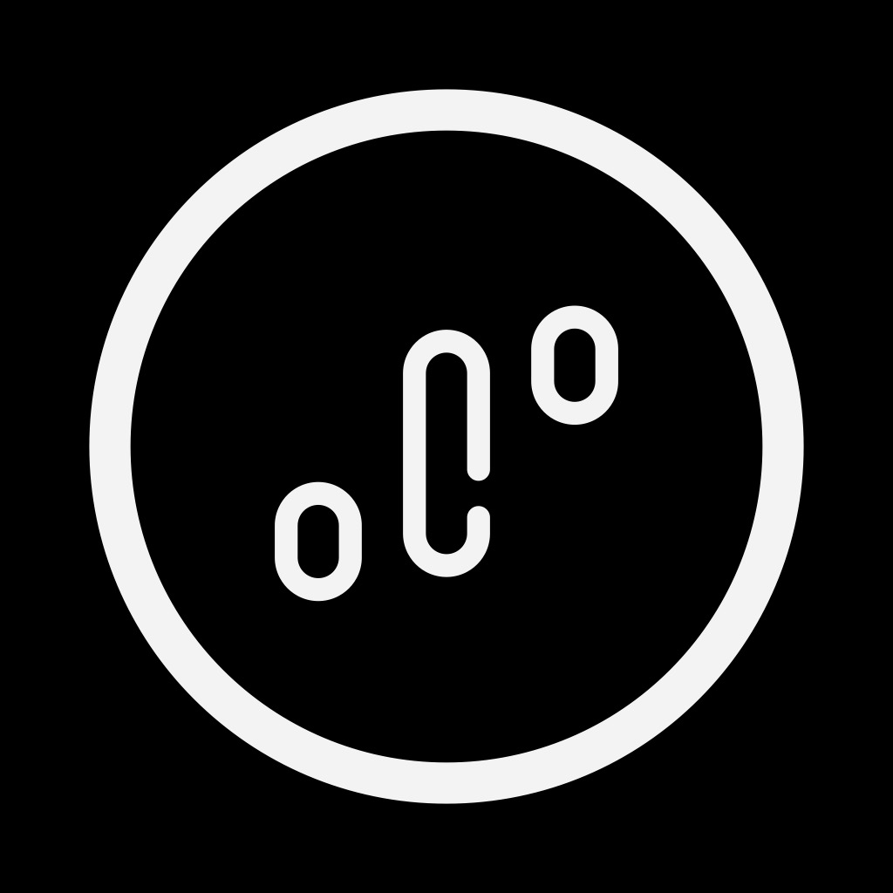

# MonkTrader

> La seule app de discipline du vault qui ne se contente pas de te prévenir : elle **verrouille ton app de courtage au niveau du système**, avec l'API Screen Time d'Apple. Puis elle te laisse toujours passer outre — en l'écrivant dans ton journal. Écrite seule, en un mois, par un designer d'interaction sud-africain de 2024 qui n'a publié aucun de ses projets.

**Sources :** fiche et API App Store · site officiel monktrader.app capturé section par section · assets Framer du site (écrans natifs 1179×2556) · index de recherche Framer exposé · Behance et page développeur Apple de l'auteur · The Open Window (son école) · vérifications négatives sur 6 bases d'UI et 9 galeries — détail en [[#Sources]].

> **Lecture** : chaque famille est montrée par **une planche** (`<aspect>/planches/`), légendée juste dessous. Les fichiers individuels restent dans leur dossier d'aspect — c'est de là qu'on récupère un écran précis.

## En bref

- **Le verrou est réel, pas symbolique.** Là où la douzaine d'autres produits de trading du vault journalisent après coup, MonkTrader pose un `ManagedSettings` d'Apple sur MetaTrader 5 : l'app de courtage ne s'ouvre plus. La capture `ecrans/store-04-monk-wall-blocage-sur-metatrader-5.png` montre exactement ça — l'écran de blocage iOS par-dessus MT5, avec le fond de l'app bloquée flouté derrière.
- **Trois choix, jamais deux, et le pire est toujours offert.** Stay Disciplined (blanc plein) · Delay Decision (gris) · Continue Anyway (rouge, texte nu, sans bouton). La hiérarchie de friction est dessinée dans le poids du bouton, pas dans un blocage. L'auteur l'écrit dans sa fiche store : « MonkTrader is a friction layer, not a cage ».
- **Sauf une fois.** Quand on modifie une règle *active*, Delay Decision disparaît : il ne reste que Stay Disciplined et Continue Anyway (`composants/monk-wall-a-deux-choix_monktrader.png`). Différer n'a plus de sens quand la transgression consiste à désarmer la règle elle-même — le système retire l'option plutôt que de la griser.
- **L'app et le site ne partagent pas leur palette.** L'app tient sur noir absolu + vert `#21C35D` + rouge `#ED4343`. Le site, lui, n'a **ni vert ni rouge dans son CSS** : monochrome, un seul accent `#0099FF`, et un dégradé violet réservé au prix de l'offre Founder. Les seules couleurs de statut qu'on y voit sont *dans les captures d'app*.
- **Aucun broker, aucun compte, aucune donnée qui sort.** Le produit repose entièrement sur une question posée à l'ouverture : « as-tu clôturé un trade ? gagné ou perdu ? ». Tout le reste en découle. C'est un pari de design assumé sur l'honnêteté déclarative.
- **Le vocabulaire est la moitié du produit.** « The Monk Wall™ », « Monk Code » (le jeu de règles), « Discipline Over Dopamine », « Perfect Days ». Le nom de chaque objet fait le travail que ferait ailleurs une illustration.
- **Le wordmark se contredit.** La marque est « MonkTrader » en un mot sur le store et le site, mais l'en-tête de l'app affiche « Monk Trader » en deux mots, sur tous les écrans. Et la fiche store a été renommée en cours de route : « MonkTrader – Stop Overtrading » → « MonkTrader: Day Trading Rules ».
- **Le « Monk Wall™ » porte un ™ sur une image que le voisin utilisait déjà.** *Gaman – Stop Overtrading* est sorti dix jours plus tôt, même mécanique Screen Time, et sa fiche dit mot pour mot « puts a wall in front of your trading apps ». Dix apps sont nées sur ce problème en neuf mois — voir [[#Le cluster]].
- **Produit d'un mois, invisible partout.** Sorti le 16 août 2026, 1 note, 0 avis rédigé, aucune archive nulle part. Absent de Screensdesign, Adapty, Appshots, Mobbin, Banani, Apphud, des neuf galeries testées, et même du top 11 de la recherche App Store « stop overtrading ». Ce dossier est, à la date de capture, la seule documentation visuelle organisée de cette app.

## Écrans

![[ecrans/planches/planche-ecrans-natifs.png]]

**Les trois écrans natifs sont le cœur du produit, et ils tiennent en une page chacun.** Récupérés en 1179×2556 directement dans les assets du site — ce sont des rendus à plat, sans cadre de téléphone ni titre marketing, donc la meilleure source de ce dossier. De gauche à droite : le tableau de bord (streak, score de discipline, statut du jour, journal), le Monk Wall, et le créateur de règles.

- `ecrans/app-01-dashboard-streak-score-discipline.png` — deux tuiles en tête (Streak 2 Days, flamme rouge ; Score Discipline 77 %, en vert), puis une barre de statut du jour « Clean », un trio de métriques (Rules Created 7 · Days Tracked 2 · Consistency High), le journal d'activité, et un CTA blanc plein « Start Trading Session » doublé d'un lien discret « View Monk Code ». La session de trading est **un acte explicite** qu'on démarre, pas un état ambiant.
- `ecrans/app-02-monk-wall-intervention.png` — l'écran d'intervention. Titre en gras serré, carte de rappel des règles, icône d'alerte rouge, conséquence écrite en toutes lettres (« If you take another impulsive trade, your streak resets. Rebuilding trust takes longer than breaking it. »), une citation en italique, puis les trois boutons.
- `ecrans/app-03-trading-rules-creator.png` — un formulaire d'une sobriété rare : label en capitales espacées gris, valeur en très gros chiffre blanc, unité (`$`, `%`) alignée à droite, filet fin en séparateur. Aucun champ encadré, aucun fond de saisie.

![[ecrans/planches/planche-ecrans-store.png]]

**Les six créas de la fiche App Store montrent ce que les assets du site ne montrent pas — mais toujours en mockup.** Cadre d'iPhone, titre marketing en tête, fond noir : ce sont des écrans promotionnels, à ne pas confondre avec les rendus à plat ci-dessus. Leur valeur est ailleurs : ce sont les seules vues de quatre écrans absents du site.

- `ecrans/store-01-dashboard-discipline-streak-28-jours.png` — le dashboard d'un compte mûr : **Streak 28 Days, Discipline 89 %, 256 règles suivies, 52 Perfect Days**. On y lit aussi la tab bar flottante en pilule (Home · Rules · Profile) et l'état « Trading Allowed » avec un cadenas **ouvert et vert**.
- `ecrans/store-02-add-a-rule-categories-de-regles.png` — « Add a rule · What do you want to control? » : les cinq familles de règles, en **mosaïque décalée** plutôt qu'en grille (voir Composants).
- `ecrans/store-03-edit-rule-plage-horaire-de-session.png` — l'édition d'une règle horaire : phrase récapitulative en clair (« Trade only between 9:00 AM and 6:00 PM, weekdays. »), deux champs d'heure, un sélecteur de jours en pastilles M T W T F, et un « Delete rule » en rouge.
- `ecrans/store-04-monk-wall-blocage-sur-metatrader-5.png` — **le Monk Wall en situation réelle** : la surcouche de blocage iOS posée sur MetaTrader 5, avec le fond flouté de l'app verrouillée. C'est l'écran qui prouve la promesse technique.
- `ecrans/store-05-decision-recorded-streak-relance.png` — « Decision Recorded », coche verte, et le streak qui repart de 0 à 1 jour.
- `ecrans/store-06-confirmation-changement-de-regle-active.png` — le Monk Wall du changement de règle, avec son cadenas **fermé et rouge** en miroir de l'ouvert vert du dashboard.

## Composants

![[composants/planches/planche-composants.png]]

**Douze blocs découpés dans les écrans natifs — et ce qui frappe, c'est qu'aucun n'est décoratif.** Pas une illustration, pas une icône pleine, pas un dégradé : chaque composant porte une donnée ou une décision. Les fichiers sont suffixés `_monktrader` et référencés dans [[_COMPOSANTS]].

- `composants/pile-de-boutons-hierarchie-de-friction_monktrader.png` — **la pièce maîtresse du dossier.** Trois niveaux d'engagement dessinés uniquement par le poids : blanc plein → gris plein → texte rouge nu. À réutiliser partout où une action regrettable doit rester possible.
- `composants/mosaique-des-categories-de-regles_monktrader.png` — les cinq familles de règles en cartes de tailles et d'opacités **inégales, volontairement désalignées**. Un menu de sélection qui refuse la grille : les cartes se chevauchent légèrement, comme des papiers posés. Inhabituel, et efficace pour cinq éléments qui ne sont pas de même poids.
- `composants/monk-wall-a-deux-choix_monktrader.png` — la variante amputée de Delay Decision.
- `composants/carte-de-rappel-des-regles_monktrader.png` — Streak / Adherence en tête, puis les règles en jeu en petit. La même carte sert de rappel dans l'intervention et de résumé dans le dashboard.
- `composants/tuiles-streak-et-score_monktrader.png` — deux tuiles jumelles, une métrique par tuile, icône en haut, label en capitales, valeur en gros.
- `composants/barre-statut-du-jour_monktrader.png` — pastille verte cerclée + label + valeur + chevron. L'état du jour tient en une ligne cliquable.
- `composants/trio-metriques-performance_monktrader.png` — trois tuiles étroites côte à côte, sans séparateur, labels sur deux lignes quand il le faut.
- `composants/ligne-de-formulaire-avec-unite_monktrader.png` — label en capitales espacées, valeur en très gros chiffre, unité à droite, filet dessous. Un patron de saisie numérique sans champ.
- `composants/toggle-revenge-trading-rule_monktrader.png` — **le toggle est inversé** : piste blanche, pastille noire. À rebours de l'interrupteur iOS standard, cohérent avec une app qui n'utilise aucune couleur système.
- `composants/ligne-de-journal-activite_monktrader.png` — puce verte, libellé, date en dessous. Le journal est fait de ces lignes-là.
- `composants/cta-plein-et-lien-secondaire_monktrader.png` — bouton blanc pleine largeur très arrondi, surmontant un lien gris centré. L'action forte et l'action de consultation, sans concurrence visuelle.
- `composants/avertissement-de-consequence_monktrader.png` — icône d'alerte cerclée rouge, deux lignes de conséquence, une citation en italique. Le bloc qui fait le travail de persuasion.

## Couleurs

![[couleurs/palette-declaree.svg]]

**Il n'y a pas de charte publiée — ces deux hex sont les seuls que la marque ait écrits quelque part.** Ni press kit, ni page `/brand`, ni design system : ils ont été relevés dans le `fill` et le `stroke` des deux SVG du logo servis par le site. Un blanc cassé et un noir profond, et rien d'autre.

**Les deux seuls hex sourcés**

| Nom de rôle | Hex | Usage |
| --- | --- | --- |
| Blanc de marque | `#F3F3F3` | symbole sur fond sombre |
| Noir de marque | `#0A0A0A` | symbole sur fond clair |

![[couleurs/palette-relevee-dans-les-ecrans.svg]]

**Le fond de l'app n'est pas un gris sombre, c'est du noir absolu — 72,6 % de la surface.** Relevé pixel par pixel sur les trois écrans natifs. Aucun nom n'étant publié, les teintes sont nommées par leur rôle. Ce qui compte ici : l'élévation se fait sur **quatre paliers de noir** (`#000000` → `#0A0A0A` → `#111111` → `#1A1A1A`) sans une seule ombre portée, et la couleur est rationnée à trois usages de statut.

**Surfaces**

| Nom de rôle | Hex | Part | Usage relevé |
| --- | --- | --- | --- |
| Fond d'écran | `#000000` | 72,6 % | le fond, en noir OLED |
| Fond de section | `#0A0A0A` | 10,4 % | blocs de second plan |
| Carte | `#111111` | 5,6 % | tuiles, lignes de journal |
| Carte élevée | `#1A1A1A` | 2,1 % | carte de rappel des règles |

**Texte**

| Nom de rôle | Hex | Part | Usage relevé |
| --- | --- | --- | --- |
| Texte primaire | `#FFFFFF` | 6,9 % | titres, valeurs, boutons pleins |
| Texte secondaire | `#898989` | — | labels en capitales espacées |
| Texte tertiaire | `#666666` | — | dates du journal |

**Statut — les trois seules couleurs de l'app**

| Nom de rôle | Hex | Usage relevé |
| --- | --- | --- |
| Conformité | `#21C35D` | score, « Clean », puces du journal, cadenas ouvert |
| Alerte | `#ED4343` | flamme du streak, icône d'avertissement, cadenas fermé |
| Transgression | `#FA4949` | le lien « Continue Anyway », et lui seul |

![[couleurs/palette-site-marketing.svg]]

**Le site marketing tourne sur un autre système que l'app — et c'est le point le plus instructif de cette section.** Relevé dans le CSS rendu : le vert et le rouge n'y existent pas. Ils n'apparaissent sur le site que *dans les captures d'app*. Le site est strictement noir / blanc / gris, avec un unique accent d'interface `#0099FF` (25 occurrences) et un dégradé violet dont l'emploi est révélateur : il est réservé au prix de l'offre Founder, seul endroit du site où l'on demande de l'argent.

**Surfaces et filets**

| Nom de rôle | Hex | Usage relevé |
| --- | --- | --- |
| Noir absolu | `#000000` | sections sombres |
| Fond de page | `#0A0A0A` | barre de nav en `rgba(10,10,10,0.96)` |
| Carte | `#242424` | le plus fréquent après le blanc |
| Bordure | `#363636` | filets de carte |
| Séparateur | `#DBDBDB` | sur fond clair |
| Fond clair | `#F3F3F3` / `#F5F5F5` | sections inversées |

**Textes et accents**

| Nom de rôle | Hex | Usage relevé |
| --- | --- | --- |
| Texte secondaire | `#8A8A8A` | sous-titres |
| Texte atténué | `#C4C4C4` / `#CCCCCC` | mentions |
| Accent d'interface | `#0099FF` | liens, focus |
| Prix Founder (dégradé) | `#B9A5FA` → `#D37BFE` | le prix « $107 Lifetime Access », et rien d'autre |

## Branding

![[branding/planches/planche-logo-deux-versions.png]]

**Le symbole est un cercle fin qui enferme trois formes arrondies de hauteurs inégales — trois bougies de chandelier autant qu'un profil de moine.** C'est toute l'idée de la marque en un glyphe : l'*ensō* zen et le graphique de trading lus dans le même dessin. Les deux SVG sont les fichiers officiels servis par le site ; ils ne diffèrent que par leur couleur.

- `branding/logo-symbole-clair-sur-fond-sombre.svg` — `#F3F3F3`, viewBox 104×104, tracé en `path` unique + `stroke` de 0,5.
- `branding/logo-symbole-sombre-sur-fond-clair.svg` — le même en `#0A0A0A`.

![[branding/planches/planche-icone-et-carte-de-partage.png]]

**L'icône d'app reprend le symbole sans rien y ajouter — pas de fond coloré, pas de dégradé, pas de profondeur.** La carte de partage social, elle, livre une baseline qu'on ne trouve nulle part ailleurs sur le site : « The #1 discipline app for traders ». Elle affiche aussi un badge Google Play, alors qu'aucune version Android n'existe.

- `branding/icone-app.png` — 1024×1024, symbole blanc centré sur noir.
- `branding/og-card-partage-social.jpg` — 1200×630, wordmark « Monk Trader » en deux mots.

**Typographie** — deux familles, relevées sur les éléments réellement rendus (147 éléments en Inter, 123 en Manrope) puis confirmées dans les bundles Framer :

| Police | Source | Graisses servies | Emploi |
| --- | --- | --- | --- |
| Inter | Framer | 400 / 700 / 900, romain et italique | le texte courant, les chiffres, l'UI |
| Manrope | Fontshare | 300 / 400 | les grands titres de section |

Poppins apparaît sur 7 éléments résiduels — probablement un reliquat de composant Framer, pas un choix. Aucune de ces polices n'a encore sa fiche dans le vault : une passe `/font` sur **Inter** et **Manrope** serait utile.

## Animations

![[animations/section-discipline-dashboard-au-scroll_monktrader.gif]]

**Le site est entièrement construit sur l'apparition au scroll — au point que sa capture pleine hauteur rend des sections vides.** Le défilement est virtualisé (composant Framer `SmoothScroll_Prod`) : tant que le scroll ne passe pas, le contenu n'existe pas. Ces GIF sont donc à double usage — ils documentent le motion, et ils sont la seule façon d'avoir vu certaines sections.

- `animations/hero-loader_monktrader.gif` — le hero alterne en boucle entre un graphique en chandeliers rouge et vert et l'écran du Monk Wall. Le wordmark « monk trader » géant défile en filigrane derrière, en gris très sombre sur noir.
- `animations/section-discipline-dashboard-au-scroll_monktrader.gif` — le téléphone monte et se stabilise pendant que le texte se pose.
- `animations/section-create-trading-rules-au-scroll_monktrader.gif` — même grammaire, sur la section du créateur de règles.
- `animations/fond-ocean-calme-horizon_monktrader.mp4` — **21 secondes de mer calme filmée au ras de l'eau, sans coupe**, servies en fond. C'est la seule image de la DA qui ne soit ni une interface ni un visage : la métaphore du calme, posée littéralement. Son affiche fixe est à côté (`…-poster_monktrader.jpg`).

Référencées dans [[_ANIMATIONS]].

## Marketing

![[marketing/planches/planche-sections-du-site.png]]

**Onze sections, capturées une par une en 3840×2160 parce que la capture pleine hauteur revenait vide.** Le site suit une progression d'argumentation très classique — promesse, produit, problème, preuve sociale, chiffres, rappel — mais la tient sur une seule idée typographique : des titres énormes en Manrope, centrés, sur du noir, avec un seul téléphone en appui.

- `marketing/section-01-hero-discipline-over-dopamine.png` — « Discipline Over Dopamine », le wordmark en filigrane géant.
- `marketing/section-05-monk-wall-explication.png` — le texte de référence sur le Monk Wall, celui que cite ce dossier.
- `marketing/section-06-most-traders-already-know-cartes.png` et `section-07-cartes-problemes-et-built-for-traders.png` — « Most Traders Already Know What To Do. **They just don't do it.** », puis les quatre maux nommés en cartes : Overtrading · Revenge Trading · Rule Breaking · Emotional Decisions.
- `marketing/section-08-temoignages-traders-et-chiffres.png` et `section-09-chiffres-et-eventail-ecrans.png` — six témoignages signés d'années d'expérience (« 4 years trading »), puis trois chiffres : **50 Happy Users · $50k+ Saved · 12 Spots left**.
- `marketing/section-10-cta-final.png` — « Your Strategy Isn't The Problem. Your Discipline Is. »

![[marketing/planches/planche-portraits-temoignages.png]]

**Les six portraits de témoignage sont tous de profil strict, chacun sur un fond de couleur franche différente — et le seul visage de face du site est celui du fondateur.** Jaune moutarde, pêche, ciel, feuillage, surexposé, clair-obscur : aucun regard caméra, tête tournée à 90°. Le détournement du regard est le thème visuel du site, décliné jusque dans le choix des photos de stock. Originaux jusqu'à 4480×4480 dans `marketing/portraits/`.

**Le reste du site** — `marketing/site-home-pleine-hauteur.png` conserve la home en 1920×9648 **avec ses sections vides** : gardée telle quelle comme trace du comportement du site, pas comme document de référence. `marketing/site-privacy.png` et `site-terms.png` complètent les pages légales. Les trois pages d'avant-lancement (`/founder`, `/waitlist`, `/request`) sont rangées en [[#Archive]], à laquelle elles appartiennent.

![[walkthrough.mp4]]

**Le site parcouru en vidéo** (3,9 Mo, 256 images). Il ne couvre que les trois pages liées depuis la home — `/`, `/contact-us`, `/privacy` — puisque la découverte suit les liens ; les quatre autres sont dans [[#Archive]] et ci-dessus.

**Modèle économique**, relevé sur trois sources : l'app est gratuite, avec deux abonnements (MonkTrader Weekly 6,99 $, MonkTrader Annual 49,99 $) et, en parallèle, une offre à vie de 107 $ limitée à 25 places, garantie 14 jours — soit, au compteur affiché, environ **2 250 $ encaissés avant même l'App Store**.

## Archive

**Il n'existe aucune version antérieure de ce site — et c'est vérifié, pas supposé.** Wayback Machine, Common Crawl et archive.today : zéro capture de `monktrader.app`, ni de sa fiche App Store. Le contrôle a été fait sur `tradezella.com`, qui remonte bien ses snapshots — l'API répondait. La raison est mécanique : le domaine a été enregistré le **25 juin 2026**, et les en-têtes `last-modified` du site donnent tous la même date, **le 23 août 2026 à 20:19 GMT**. Une seule publication, jamais révisée depuis. Il n'y a rien à comparer.

Ce qui tient lieu d'archive, ce sont **les vestiges d'avant-lancement encore servis en ligne** : trois pages listées au sitemap mais absentes de toute navigation, qui documentent le produit tel qu'il se vendait avant d'exister.

- `archive/site-offre-founder-21-sur-25-places-2026-08.png` — 2880×8200. Le compteur de rareté « 21 / 25 Claimed · 4 spots remaining », les six cartes d'avantages, le prix **« $107 Lifetime Access »** en dégradé violet, le formulaire qui demande nom + **compte Instagram** + motivation, le paiement PayPal, et la mention « This page is only visible to waitlist members » — sur une page pourtant publiquement listée au sitemap.
- `archive/site-page-confirmation-founder-2026-08.png` — la confirmation de candidature, avec une bulle signée « **Ross @ Monktrader** » et sa photo : « I'll personally review your application and reach out within 24 hours… email and Instagram DMs ».
- `archive/site-waitlist-prelancement-2026-08.png` — la liste d'attente, avec une maquette d'un graphique MetaTrader 5 **XAUUSD M5 en perte**, et surtout le menu déroulant « what's your biggest trading challenge? » qui énumère la taxonomie du problème telle que l'auteur la voyait avant de coder : **Overtrading · Revenge Trading · FOMO · Breaking Risk Management · Consistency · Psychology**.

Détail daté qui vaut d'être noté : `/founder` dit « Join The **First** 25 Traders Building MonkTrader », `/request` dit « Join The **Next** 25 Traders ». Les deux pages ont un `last-modified` différent du même soir (20:19 et 22:07) — la formule a changé dans la soirée du 23 août et les deux états cohabitent toujours.

## Le cluster

**La catégorie « app qui empêche de trader » est née en 2026, et MonkTrader y entre dixième en neuf mois.** Par date de sortie sur l'App Store US : QuitCrypto (12/12/2025), Nudge (22/03/2026), [[temper|Temper]] (06/04/2026), Discipline AI (06/05), EmotionLock (19/05), Offtilt (21/05), TradeVow (27/07), **Gaman** (06/08), TradeLock (13/08), **MonkTrader** (16/08).

- **Le mur n'est pas une idée propriétaire.** *Gaman – Stop Overtrading* est sorti **dix jours avant** MonkTrader, avec la même mécanique Screen Time et la même métaphore, écrite mot pour mot dans sa fiche : « Gaman puts a wall in front of your trading apps ». Le « Monk Wall™ » porte un ™ sur une image que le voisin utilisait déjà.
- **Introuvable dans sa propre catégorie.** MonkTrader sort premier sur son nom de marque, mais il est absent du top 11 de la recherche « stop overtrading » (où Gaman est premier) et du top 15 de « trading discipline ». Le classement « Best Apps to Stop Revenge Trading in 2026 » publié par un concurrent ne le cite pas.
- **Face aux dossiers déjà au vault** : [[tradezella|TradeZella]] et [[ultratrader|UltraTrader]] vendent la synchronisation de 600+ brokers — MonkTrader revendique exactement l'inverse, « no broker connection required ». [[tradingplan|TradingPlan]] partage son dogme (ne mesurer que la conformité aux règles, jamais le P&L) mais s'arrête à la checklist ; MonkTrader passe à l'acte et verrouille l'OS. [[traders-second-brain|Trader's Second Brain]] fait le même geste anti-abonnement à 299 $ à vie, par conviction ; ici les 107 $ sont un amorçage contingenté qui bascule ensuite sur 6,99 $/semaine.
- **Le voisin le plus proche est déjà dans le vault** : [[temper|Temper]] — solo, sombre, iOS + macOS, même promesse. La différence est structurante : Temper lit le compte de trading et interrompt tout seul ; MonkTrader ne regarde rien et **demande au trader de se déclarer**. C'est son angle propre, et sa fragilité.
- **La grammaire de l'override est une convention de fait.** [[edgeflo|EdgeFlo]] réserve sa seule couleur chaude au bouton « Trade Anyway » ; ici le rouge n'existe que pour « Continue Anyway ». [[journali|Journali]] pousse plus loin en exigeant un appui long de dix secondes et en affichant le bilan chiffré des transgressions passées. Trois produits sans lien arrivent à la même conclusion : **on laisse passer, en rendant le passage coûteux et traçable**.
- **Homonymie à connaître** : *Monk: Screen Time Control* (Polymath Labs, 2025) est une app de blocage sans aucun lien — mais sa baseline est « Earn Your Dopamine », face au « Discipline Over Dopamine » d'ici. Deux apps de blocage nommées « Monk » qui jouent la même corde.

## Crédits

**MonkTrader est l'œuvre d'une seule personne, et il a fallu trois sources pour la nommer.**

**Roswika Luruli**, qui signe son travail de design **Ross Luruli** — designer d'interaction indépendant à Pretoria / Centurion, Afrique du Sud. C'est le `sellerName` du compte développeur Apple (un compte de personne physique, un seul app au catalogue), relié au designer par la page vitrine de son école.

- Behance : [behance.net/rossluruli](https://www.behance.net/rossluruli) — « Available for Freelance · Interaction Design · Pretoria », membre depuis décembre 2020. **Zéro projet publié.**
- Page développeur Apple : [apps.apple.com/us/developer/roswika-luruli/id6799897015](https://apps.apple.com/us/developer/roswika-luruli/id6799897015)
- Formation : **The Open Window** (Centurion), BA Creative Technology — [Creative Technologies Showcase 2024](https://www.openwindow.co.za/creative-technologies-showcase-2024/). Majeures déclarées : interaction design, animation 3D, motion design, développement interactif.
- Outils déclarés : Figma, Adobe XD, After Effects, Photoshop, prototypage, motion, branding, UX research. **Aucun outil de développement iOS** — il se présente en designer, pas en ingénieur.
- LinkedIn annoncé par lui : `linkedin.com/in/ross-luruli` (non vérifié, voir Sources).
- Ses deux portfolios sont **hors ligne** : `rossluruli.com` n'a plus d'enregistrement DNS, `rossluruli.ju.mp` renvoie 404.

Sa déclaration d'intention, sur Behance, mot pour mot — et elle éclaire directement la sobriété de l'app :

> « When it comes to the aesthetic of my work, I find myself often basing it on; elegance, dynamism, timelessness, and refinement as important factors that shape nearly all my creative decisions. As a designer, I appreciate stunning graphics supported by insightful systems thinking and I adore the idea of a digital product and its ability to change and develop over time like a living creature. »

Sur le site, il signe « **Ross @ Monktrader** » les pages Founder et Request.

- `credits/ross-luruli-portrait-photo-de-profil-behance.jpg` — la seule photo publique de la personne derrière MonkTrader. 276×276, taille maximale servie par Adobe.
- `credits/ross-luruli-banniere-behance-monogramme-rl-interaction-designer.png` — sa bannière personnelle, 7616×977 : monogramme « RL » en bâton blanc sur un dégradé blanc → taupe, avec « ROSS LURULI · Interaction Designer · rossluruli.com ». Un auto-branding chaud et dégradé, à l'exact opposé du noir absolu de MonkTrader.

**Aucun autre crédit n'existe.** Pas de studio, pas de co-fondateur, pas d'agence, pas de photographe crédité (les portraits sont des photos de stock), pas de typo maison. Vérifié sur le site, l'App Store, Behance, Dribbble et les neuf galeries testées.

## Sources

Six pistes ouvertes en parallèle, dont **quatre sont revenues vides** — et ces vides sont eux-mêmes le résultat le plus parlant de la récolte.

| Source | Ce qu'elle a apporté |
| --- | --- |
| **App Store** — [fiche](https://apps.apple.com/us/app/monktrader-day-trading-rules/id6799897013) et API `itunes.apple.com/lookup` | les 6 créas promo en 1242×2688, l'icône en 1024², les métadonnées d'éditeur, la description écrite par l'auteur, les notes de version 1.1.4, les prix des abonnements |
| **Site officiel** — [monktrader.app](https://monktrader.app) | les 11 sections capturées au scroll, les 4 pages cachées, le relevé de polices, les 3 GIF de motion |
| **Assets Framer du site** — `framerusercontent.com/sites/2eRYJWg9CQB915RwaIPy8R/` | **la meilleure trouvaille** : les 3 écrans natifs en 1179×2556, les 2 SVG du logo, la carte de partage, la vidéo de fond, les 6 portraits en pleine résolution (jusqu'à 4480²), et le nuancier CSS complet |
| **Index de recherche Framer** — `searchIndex-KYFD2NtlI9Yu.json`, exposé publiquement | le texte intégral de toutes les pages : l'offre Founder, la signature « Ross @ Monktrader », la baseline de pied de page |
| **Behance + page développeur Apple + The Open Window** | l'identification de l'auteur, sa formation, son parcours, sa déclaration d'intention, son portrait |
| **Bases d'UI mobile** — Screensdesign, Adapty, Appshots, Mobbin, Banani, Apphud, Page Flows, WWIT | **vide, et prouvé.** Sitemaps authentiques dépouillés : 2 700 apps chez Screensdesign, 8 903 paywalls chez Adapty, 241 chez Apphud, 658 chez Banani — aucune occurrence. Test de contrôle fait sur TradingView (fiche rendue de 459 ko) pour écarter le faux négatif |
| **Galeries et awards** — SaaS Landing Page, SiteInspire, Awwwards, FWA, CSSDA, One Page Love, Minimal Gallery, Httpster, Framer Gallery | **vide**, chaque fois avec une requête de contrôle pour prouver que la recherche fonctionnait |
| **Presse et communauté** — Product Hunt, YouTube, Indie Hackers, comparatifs d'apps de discipline | **vide.** Aucun lancement PH, aucune review, absent des trois comparatifs « best trading discipline apps » ouverts |
| **Archives** — Wayback Machine (API CDX + timemap), Common Crawl, archive.today | **vide, et c'est un fait, pas un échec** : zéro capture, contrôle réussi sur `tradezella.com`. Complété par le RDAP du domaine (enregistré le 25/06/2026) et les en-têtes `last-modified` du site |
| **Cluster concurrent** — recherche App Store par requête, fiches des 10 apps de la catégorie | la datation de la catégorie, l'antériorité de Gaman, la découvrabilité nulle de MonkTrader, et le positionnement face aux cinq dossiers de trading déjà au vault |

**Ce qui a bloqué, et n'a donc pas été vérifié :**

- **Mobbin** — `robots.txt` en `Disallow: /`, fiches d'app en 404, compte obligatoire. `claude-in-chrome` n'est pas disponible sur cette machine. L'absence y est probable, pas démontrée.
- **Dribbble** — HTTP 202 à corps vide sur toutes les recherches. Mur dur, aucun contournement.
- **LinkedIn** — HTTP 999. Le profil `ross-luruli` est celui que l'auteur affiche lui-même sur Behance ; il reste **la piste la plus prometteuse pour un making-of**, à ouvrir à la main.
- **Instagram, Threads, TikTok** — murs de login : impossible de savoir si des comptes MonkTrader existent.
- **Reddit** — mur de connexion sur le fetch direct et domaine refusé par la recherche web. r/Daytrading n'a pas pu être fouillé.
- **Behance, recherche par mot-clé** — 403. On ne peut pas exclure qu'un tiers ait publié une étude de cas.
- **Historique des versions 1.0 à 1.1.3** — hors de portée : seule la 1.1.4 est dans le HTML de la fiche, l'API AMP d'Apple exige un jeton qui n'y est plus exposé, et aucune page publique (Apptopia, AppFollow, AppRecs) n'existe pour cet identifiant.
- **Pas d'estimation de traction** — aucune page publique Sensor Tower, Appfigures ou data.ai. Les seuls chiffres réels sont 1 avis et le compteur « 21 / 25 » de la page Founder.
- **Save Page Now répond HTTP 500** sans compte : le millésime de septembre 2026 n'a pas pu être déposé sur Wayback. À refaire avec un compte archive.org si l'on veut dater cet état publiquement.
- **La page `/privacy` du site est vide** (titre seul, aucun texte), alors qu'elle est déclarée comme politique de confidentialité sur l'App Store. Aucune adresse de contact réelle nulle part.

## Pourquoi je l'aime

- **La friction est dessinée, pas subie.** Trois boutons de poids décroissant font tout le travail qu'un blocage ferait moins bien : le produit garde le dernier mot à l'utilisateur et se contente de rendre le mauvais choix visiblement moins désirable. C'est le geste de design le plus réutilisable du dossier.
- **Un système de signes réduit à trois couleurs sur du noir** — et qui suffit à couvrir conformité, alerte et transgression. Le cadenas ouvert vert / fermé rouge fait le reste.
- **Le nommage fait le design.** « Monk Code », « Perfect Days », « Discipline Over Dopamine » : sur une app sans une seule illustration, ce sont les mots qui portent l'identité.
- **Ça parle exactement de ce que je travaille** — cf. [[discipline trading]] et [[plan de session]]. Les cinq familles de règles de l'app sont à peu près la structure d'un plan de session écrit.
- Et une leçon de méthode : **un produit peut être totalement invisible et parfaitement bien dessiné.** Zéro avis, zéro presse, zéro galerie, et une DA plus tenue que celle de concurrents bien installés.

## À réutiliser pour

- Projet : [[ ]] — la **pile de boutons à friction décroissante**, pour toute action regrettable qu'on veut laisser possible.
- Projet : [[ ]] — le **formulaire sans champ** (label en capitales, gros chiffre, unité à droite, filet) : très lisible pour de la saisie numérique rare.
- Projet : [[ ]] — l'**élévation par paliers de noir**, sans une seule ombre portée.
- Projet : [[ ]] — la **mosaïque décalée** comme alternative à la grille quand les éléments n'ont pas le même poids.

## Mots-clés

discipline de trading, trading discipline, overtrading, surtrading, revenge trading, trading de revanche, règles de trading, trading rules, Monk Code, Monk Wall, friction layer, couche de friction, intervention, garde-fou, blocage d'app, app blocking, Screen Time, temps d'écran, Family Controls, Managed Settings, verrou OS, streak, série, score de discipline, adherence, perfect days, journal de discipline, cooldown, temps de latence, loss limit, limite de perte, risk per trade, trading hours, plage horaire, prop firm, day trading, psychologie du trading, trading psychology, gestion du risque, risk management, noir absolu, OLED, dark UI, interface sombre, minimal, monochrome, vert et rouge, statut, cadenas, indie app, indie maker, développeur solo, Framer, Inter, Manrope, Afrique du Sud, South Africa, Pretoria, Ross Luruli, Roswika Luruli, accès anticipé, early access, lifetime deal, offre à vie, waitlist, liste d'attente
