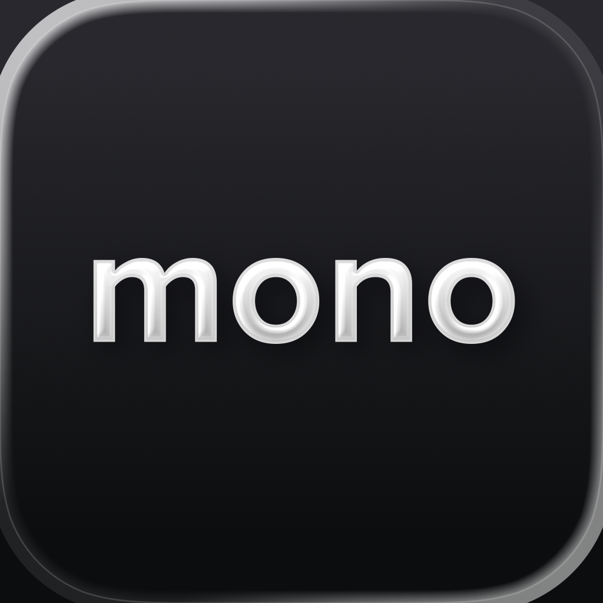

# monobank

> La néobanque ukrainienne à 10 millions de clients, dont toute la personnalité tient dans un chat et dans un catalogue de skins de carte. Ce dossier existe parce que c'est le cas d'école du **ton de voix dans une app de finance** : le sérieux du produit et l'insolence de la marque cohabitent sans se neutraliser.

**Sources :** site officiel monobank.ua (SPA Vue, assets servis en 1x/2x/3x) · brandbook acquéring · App Store et Google Play · Templateshake (écrans in-app réels) · Behance d'Alty, de Grape et de Firma · Wikimedia Commons · presse ukrainienne (AIN, Forbes.ua, minfin, KOSHT, cases.media, creativity.ua, RBC-Ukraine, finance.ua) — détail dans [[#Sources]]

> **Lecture** : chaque famille de visuels est montrée par **une planche** (`<aspect>/planches/`), légendée juste dessous. Les fichiers individuels restent dans leur dossier d'aspect — c'est de là qu'on récupère un visuel précis.

## En bref

- **Trois auteurs pour trois couches du produit** : l'app V1 (2018) par l'agence **Alty**, la mascotte **QR cat** (2019) par **Grape Agency**, les campagnes (2020) par **Banda** et **Firma**. La refonte 2.0 (2024) est faite 100 % en interne.
- **La charte couleur n'est pas faite d'aplats mais de 15 dégradés nommés** (`green`, `mint`, `lavender`, `gloam`, `tomat`…), déclarés en tokens CSS. Chaque dégradé va d'une teinte claire à une teinte saturée en 180°.
- **Le noir de l'app 2.0 n'est pas noir** : c'est une famille de bleus nuit très sombres (#050314, #02020A, #020330). Relevé au comptage de pixels.
- **Un seul rouge corail (#FA5255) pour tous les CTA**, sur toutes les étapes de l'inscription. Aucune autre couleur d'action.
- **Les émoji servent de pictos de liste** dans l'onboarding : pas d'iconographie sur mesure à ce niveau du produit.
- **Les noms de porteur sur les maquettes de carte sont des figures de la culture ukrainienne** — Vasyl Stus, Taras Shevchenko, Lesya Ukrainka, Mykhailo Hrushevsky. Jamais un « John Doe ».
- **Le catalogue de skins de carte est un pilier de marque**, pas un gadget : le site nomme ses assets par collaboration et l'app expose un écran « Дизайн картки » de sélection en grille.

## Écrans

![[ecrans/accueil-reel-pleine-resolution.png|500]]
L'accueil réel en 2344×3760 — la seule capture pleine résolution non promotionnelle du dossier.

![[ecrans/2024-releve-unifie-toutes-cartes.png|500]]
Le relevé unifié « Всі операції », toutes cartes confondues : **la nouveauté centrale du 2.0**, sur fond violet électrique avec des pictos de carte flottants. C'est l'écran qui justifiait la refonte — la V1 était pensée pour un produit unique, la Black Card.

![[ecrans/2024-accueil-carte-3d-degrade-bleu.png|500]]
L'accueil 2.0 : la carte est posée **à plat en 3D avec son ombre portée**, et la carte suivante dépasse à droite pour annoncer le swipe. Le dégradé de la carte est explicitement conservé d'une version à l'autre pour la reconnaissance de marque.

![[ecrans/2024-detail-carte-noire-reglages.png|500]]
Le détail de carte : la carte en grand, puis une liste de réglages plate. À comparer avec `archive/2024-comparatif-ancien-nouveau-menu.webp`.

Les 9 captures `store-ios-*.png` (1260×2736) sont les visuels promotionnels de la fiche App Store — écran habillé d'une accroche. Utiles pour le discours, pas pour lire l'UI. Le jeu Android équivalent (mêmes visuels en ukrainien, 1080×1920) a été écarté comme doublon de plus basse résolution.

## Flows

![[flows/planches/planche-inscription-complete.png]]
**L'inscription complète, 14 étapes réelles en 1284×2778** — la partie « derrière le store » : téléphone, permission notifications, présentation de la carte, choix du mode de justificatif (Дія / passeport / ID), explication Дія, selfie, signature, e-mail, questions d'emploi, revenu, signature du contrat, Apple Pay. Système visuel constant : rouge corail unique en bas, fond blanc, titres centrés gras, listes de grosses cartes blanches très arrondies à illustration ronde.

![[flows/erreur-01-serveur-mascotte-penaude.png|400]] ![[flows/erreur-02-message-serveur-brut-en-anglais.png|400]]
Les deux états d'erreur. À gauche l'habillage de marque assumé — chat penaud sur rond rouge, titre familier « А щоб його підняло і гепнуло! ». À droite **le défaut** : le message serveur anglais brut (« You can not get or finalize client state… ») affiché tel quel à un utilisateur ukrainien. L'habillage n'est pas doublé d'un mapping d'erreurs. À retenir comme contre-exemple.

![[flows/geste-appui-long-copier-numero-carte.webp|400]] ![[flows/defaut-menus-information-dupliques.webp|400]]
Le geste « appuyer sur la carte pour copier son numéro », et le défaut d'architecture relevé par la critique : six blocs « Інформація » identiques répétés d'une carte à l'autre.

## Branding

![[branding/planches/planche-mascotte-chat.png]]
**Le mono kot.** Né en 2017 d'une photo virale du chat du cofondateur Dmytro Dubilet, développé par l'équipe Fintech Band puis par Grape. Le QR-code au cou vient de ce que l'équipe travaillait alors sur le paiement par QR. Hex du vecteur officiel : trait #141414 (jamais du noir pur), ombre du corps #D1D3D4, drapeau #FCD84A et #007CE5. Deux marques déposées à l'image du chat en 2019.

![[branding/planches/planche-skins-de-carte.png]]
**Le catalogue de skins** — 14 des variantes publiées. Le chat en cosaque zaporogue, en boss de jeu vidéo, en pochoir façon Banksy, en prince Volodymyr du billet de 1 hryvnia ; un mur de stickers ; une foule de chats en tribune de stade ; un cube voxel « МНЕ МНЕ » ; des photos (Usyk sur le ring, le chien démineur Patron, Boris Johnson) sous le mot « СМІЛИВІСТЬ » ; une mosaïque soviétique-ukrainienne de Donetsk ; un panneau routier mème. **C'est le vrai système d'identité de monobank** : la marque se décline par le contenu de ses cartes, pas par des variations de son logo.

![[branding/planches/planche-cartes-produit.png]]
La gamme produit : la carte noire, l'IRON en métal sablé, les cartes devises USD/EUR, le badge cashback national.

![[branding/logo-lockup-monobank-universal-bank.svg|500]]
Le lockup officiel en SVG (Wikimedia). Le wordmark seul est dans `logo-wordmark-monobank.svg`.

![[branding/logo-plata-by-mono-clair.svg|400]]
Le lockup **plata by mono** — le seul brand asset officiellement téléchargeable, depuis le brandbook acquéring du 12 avril 2024 (deux SVG + @2x/@3x, thème clair et sombre). Le brandbook ne donne ni hex ni typo ni zone de respiration : sa seule règle est éditoriale, « не варто грузити своїх покупців власними назвами » (ne pas encombrer l'acheteur de noms de marque).

![[branding/mascotte-chat-en-costume-grandeur-nature.jpg|400]]
Le chat en costume-marionnette grandeur nature, fabriqué par le studio OMI (2020).

**Typo** — aucune police sur mesure. Les font-family réellement déclarées dans le CSS de production de monobank.ua : `Lato` (token de base), `Inter` (titres), `Geologica`, `Roboto`, `Roboto Mono`, et surtout **`ocr-a-std`** en monospace, qui sert à composer les numéros de carte. Aucune fiche font du vault ne correspond ; aucune entrée Fonts In Use sur monobank.

## Couleurs

![[couleurs/palette-declaree-degrades-nommes.svg]]
**La charte, telle que monobank l'écrit lui-même** : 15 dégradés nommés en tokens `--ui-gradient--*`, tous en `linear-gradient(180deg, …)`. Pas un seul aplat de marque déclaré. C'est le parti pris couleur le plus intéressant du dossier — la marque ne possède pas des couleurs, elle possède des **transitions**.

![[couleurs/palette-interface-et-mascotte.svg]]
Les tokens d'interface du site et les hex lus dans le vecteur de la mascotte.

![[couleurs/palette-relevee-dans-les-ecrans.svg]]
Le relevé de pixels sur les écrans du dossier. Confirme le corail #FA5355 comme unique accent d'action, et montre que les fonds sombres sont des bleus nuit, pas des noirs.

![[couleurs/carte-diia-degrade-maille-bleu-jaune-vert.png|500]]
Le fond de la carte Diia : dégradé maillé bleu → jaune → vert acide sur noir, sans typographie. Le drapeau ukrainien traité en dégradé plutôt qu'en bicolore.

## Composants

![[composants/2018-accueil-tab-bar-actions-rondes_monobank.png|500]]
L'accueil de la V1 en détail : barre d'onglets Main / Payments / Cashback / More, trois actions rondes sous le solde, historique en liste. Référencé dans [[_COMPOSANTS]].

Composants remarquables **visibles dans les écrans de `flows/`** et non extraits, faute d'apporter plus qu'un recadrage : la rangée de chips de domaines e-mail scrollable au-dessus du clavier (`flows/onboarding-10-*`), le picker de revenu à graduations verticales à curseur turquoise qui remplace le clavier (`flows/onboarding-12-*`), et la liste de grosses cartes à illustration ronde (`flows/onboarding-05-*`).

## Animations

![[animations/film-hero-carte-iron-macro-metal_monobank.mp4]]
Le film hero de la carte IRON : macro en lumière rasante sur le grain du métal sablé, sur noir absolu, 19,5 s.

![[animations/stop-motion-scooter-en-bois_monobank.mp4]]
L'autre registre motion, et il n'y en a que deux : le stop-motion d'un objet réel sur fond blanc — une maquette de scooter en bois clair qui s'auto-assemble.

![[animations/drapeau-noir-wordmark-qui-ondule_monobank.gif]]
![[animations/bandeau-dialogue-a-mono-violet_monobank.gif]]
![[animations/bandeau-dialogue-a-mono-orange_monobank.gif]]
Le mécanisme de la campagne 2020 : un dialogue en deux répliques (« — а моно [X] ? — mono ») posé sur un aplat de couleur **interchangeable**. Le même gabarit en violet et en orange démontre le système de déclinaison. Référencées dans [[_ANIMATIONS]].

Aucun Lottie sur le site officiel — pas un seul `.json` d'animation dans les pages.

## Marketing

Captures pleine hauteur de monobank.ua (desktop + mobile) : `home`, `about`, `black`, `iron`, `platinum`, `white`, `business`. Le site est une SPA Vue en Vite ; chaque visuel est servi en AVIF + PNG et en 1x/2x/3x — c'est le 3x qui a été récupéré.

![[marketing/banda-2020-ooh-violet-cashback-abribus.jpeg|500]]
![[marketing/banda-2020-ooh-orange-bank-v-telefoni.jpeg|500]]
La campagne **Banda** (juillet 2020) : un aplat saturé différent par message, le dialogue en deux répliques cadré à gauche, le lockup et une capture d'app en bas à droite — **dont le dégradé reprend la couleur du média**. 127 vidéos déclinées en formats et niveaux sonores pour mesurer l'interaction.

![[marketing/firma-2020-chats-dores-maneki-neko.jpg|500]]
![[marketing/firma-2020-pattes-de-chat-tenant-un-iphone.jpg|500]]
La campagne **Firma** : des chats porte-bonheur dorés façon maneki-neko, et de vraies pattes en fausse fourrure tenant un iPhone. Le chat sort de l'écran.

![[marketing/grape-2019-coque-et-carnet-au-chat.png|500]]
Le chat au trait décliné en coque de téléphone et carnet.

## Process

![[process/grape-2019-04-neuf-declinaisons-par-situation.gif]]
**Le making-of de la mascotte par Grape Agency (novembre 2019)**, et c'est la pièce la plus utile du dossier : neuf déclinaisons du chat pour neuf situations financières (virement, cashback, refus, livraison de carte). La logique publiée est explicite — faire du chat un **personnage** plutôt qu'une image, pour rendre l'interface plus émotionnelle.

![[process/grape-2019-03-idee-creative-silhouette.gif]]
![[process/grape-2019-05-moore-meow-chat-au-trait.gif]]
![[process/grape-2019-01-titre-mono-bank-qr-cat.png|500]]
Le reste du case : la silhouette, la sortie « Moore-meow! », la page de titre au lettrage manuscrit (8000 px).

## Archive

![[archive/2018-alty-case-planche-02-accueil-violet-et-transfert.jpg|600]]
**L'app V1, dessinée par Alty en 2018** (planche Behance, 2800×7859) : accueil violet dégradé avec le solde en grand, trois actions rondes, historique ; flow de transfert vers carte avec liste de contacts et badges « mono » rouges pour les porteurs monobank ; carte noire à plat ; flow de paiement de factures à en-tête bleu dégradé. Tout un système, très différent du 2.0.

![[archive/2018-alty-case-planche-03-rappels-et-equipe-projet.jpg|600]]
La planche qui porte le bloc **Project Team** nominatif — c'est la source des crédits ci-dessous, lue directement dans l'image.

![[archive/2018-flow-inscription-stepper-clavier.png|400]] ![[archive/2018-flow-transfert-liste-contacts.png|400]]
Les mêmes flows isolés, tels que le dossier primé les présentait.

![[archive/2023-11-annonce-2-0-premier-visuel.png|400]] ![[archive/2024-comparatif-ancien-nouveau-menu.webp|400]]
L'annonce du 2.0 (7 novembre 2023) et le comparatif ancien / nouveau menu de la critique KOSHT — utile pour voir la **cohabitation des deux systèmes d'icônes** dans l'app.

## Sources

- **monobank.ua** (officiel) — la mascotte en SVG, le catalogue de skins de carte en @3x, les deux films motion, les tokens CSS de couleur et les font-family réellement rendues. **Pas de press kit** : `/press`, `/brand`, `/brandbook`, `/media`, `/newsroom` renvoient tous le fallback de la SPA (vérifié par comparaison d'octets).
- **[Brandbook acquéring](https://monobank.ua/knowledge-base/acquiring/online/brandbook)** — le seul pack de logos officiellement téléchargeable, « plata by mono », déposé le 12 avril 2024.
- **App Store / Google Play** — icône, 9 + 8 captures promo, métadonnées (version 9.7, 4,88/5 sur 950 009 avis, 10 M+ d'utilisateurs revendiqués).
- **[Templateshake](https://templateshake.com/product/monobank-mobile-bank-online/)** — 16 écrans in-app réels en 1284×2778, datés septembre 2022. **Le seul index d'écrans réels trouvé sur monobank** : l'app est absente de Mobbin, Appshots, Screensdesign, Refero, Banani, Page Flows et Adapty (vérifié négativement par API ou listing sur chacun).
- **[Behance — Alty, « Monobank »](https://www.behance.net/gallery/73882531/Monobank)** — le case de l'app V1, 3 planches à 2800 px de large, avec les crédits nominatifs.
- **[Behance — Grape Agency, « Monobank QR cat »](https://www.behance.net/gallery/87490647/Monobank-QR-cat)** — le making-of de la mascotte, slides à 8000 px.
- **[Behance — Firma, « Monobank Campaign 2020 »](https://www.behance.net/gallery/148058373/Monobank-Campaign-2020)** — key visuals et bandeaux animés.
- **[cases.media](https://cases.media/en/news/a-mono-novu-veliku-kampaniyu-monobank-mono)** — le case de la campagne Banda avec ses crédits complets.
- **[AIN.ua](https://ain.ua/2024/04/04/monobank-onovyv-dyzajn-zastosunku-shho-zminylos/)** — les images de la vidéo officielle de lancement du 2.0.
- **[KOSHT Media](https://kosht.media/a-mono-novyy-dyzayn-mono-ale-ne-bahato-ohliad-monobanku-2-0/)** (Yurii Sydorov, 11 septembre 2024) — la seule vraie critique de design du 2.0, avec des écrans en usage réel.
- **Wikimedia Commons** — les deux logos en SVG original et la mascotte.
- **Wikipedia, finance.ua, RBC-Ukraine** — l'origine du chat, l'identité sonore, les mini-jeux, les marques déposées.

**Ce qui a bloqué** : Dribbble (challenge Cloudflare, aucun navigateur disponible dans la session) — dont `dribbble.com/shots/4889186-Monobank-Enhancements` de Denis Perepelenko, UI designer officiel du projet. Mobbin et UXArchive (login / 403, `claude-in-chrome` non installé). L'article Forbes.ua du 7 novembre 2023 (paywall). Le communiqué officiel d'Universal Bank sur la refonte (mur Cloudflare). Le deck Figma officiel « monobank | ПЧ Guideline ». Aucune vidéo YouTube récupérée (`yt-dlp` sort vide sur cette session).

## Crédits

**App V1 (2018) — agence [Alty](https://alty.co)** (Kyiv puis Cascais), pour Fintech Band. Crédits lus directement dans le bloc *Project Team* de la planche Behance :
- **Kirill Kuznetsov** — Project UX Lead. Passé ensuite Head of Design chez monobank / Fintech Band (source agrégateur, à confirmer).
- **Denis Perepelenko** — UI Designer ([Dribbble](https://dribbble.com/shots/4889186-Monobank-Enhancements))
- **Elena Sevruk** — UI Designer
- **Dmytro Melnik** — UX Designer
- **Anton Skorniakov** — Design Supervisor

Dossier primé aux International Design Awards (Bronze, Multimedia / Interface Design).

**Mascotte QR cat (novembre 2019) — [Grape Agency](https://www.behance.net/gallery/87490647/Monobank-QR-cat)** (Kyiv) : **Yana Ku (Kuchmus)** et **Natasha Tsvetkova**. Le concept de départ vient d'une photo du chat de **Dmytro Dubilet** (cofondateur) devenue virale.

**Campagne « — а моно … ? — mono » (juillet 2020) — agence [Banda](https://cases.media/en/news/a-mono-novu-veliku-kampaniyu-monobank-mono)** : DC **Maksym Borytko**, réalisateur **Yehor Petrov** (cofondateur de Banda), production **Viter production co.** Le cofondateur **Oleh Horokhovskyi** apparaît lui-même dans le film.

**Déclinaisons et motion de campagne — studio [Firma](https://www.behance.net/firmaimagery)** (Kyiv) avec **Anton Raduchits** : 127+ vidéos pour Google/Facebook, 114+ pour panneaux animés, 64+ pour les réseaux.

**Pub Platinum Card (2024) — [Fiber Graphics](https://fiber.graphics)** (Kyiv) : CD **Eugene Tymoshenko** et **Roman Zinaenkov**, AD **Eugene Cameel**. CG en Cinema 4D + Redshift.

**Costume de mascotte — studio [OMI](https://omi.net.ua)** (2020).

**Refonte 2.0 (annoncée le 7 novembre 2023, déployée le 4 avril 2024)** — **100 % en interne, sans prestataire**, en 4 mois : 1 560 h de développement et 1 120 h de design (chiffres d'Oleh Horokhovskyi, via Forbes.ua et minfin). **Aucun nom individuel publié.** L'intention est citée explicitement : « L'interface et la logique du premier design étaient calculées pour UN seul produit carte — la Black Card. Depuis, nous avons créé de nouveaux produits, ce qui a rendu nécessaire de repenser le design. »

Piste vérifiée et **écartée** : ni Fedoriv, ni Banda (côté branding), ni Obys, ni Zpodium n'ont fait l'identité de monobank. Fedoriv a dessiné le typeface e-Ukraine, mais pour l'État ukrainien — **ne pas confondre**. Le wordmark monobank n'a pas d'auteur publié.

## Pourquoi je l'aime

- **La charte est faite de dégradés nommés, pas d'aplats.** Quinze transitions possédées comme on possède un Pantone. C'est un parti pris que je n'ai vu nulle part ailleurs dans la finance.
- **Le ton de voix survit à l'écran d'erreur.** « А щоб його підняло і гепнуло! » avec un chat penaud sur fond rouge, dans une banque. La marque ne se dégonfle pas quand ça va mal — c'est là qu'elle est la plus visible.
- **La déclinaison est dans le contenu, pas dans le logo.** monobank ne fait presque rien varier de son wordmark ; il fait varier ses cartes. Une centaine de skins, chacun un geste culturel ukrainien.
- **Le mécanisme de campagne tient en deux répliques et un aplat.** « — а моно [X] ? — mono ». Interchangeable à l'infini, reconnaissable au premier coup d'œil, et la capture d'app reprend la couleur du média.
- **Le chat n'est pas une mascotte, c'est un système.** Neuf états pour neuf situations financières, une identité sonore avec des variantes de notification selon crédit ou débit, des mini-jeux, des distributeurs baptisés Ryzyk / Dobbi / Tsarapka.

## À réutiliser pour

- Projet : [[ ]]
- Une **charte en dégradés nommés** plutôt qu'en aplats — à tester sur un produit qui manque de matière visuelle.
- Le **mécanisme de déclinaison par le contenu** : un gabarit unique + une bibliothèque d'illustrations culturelles, plutôt que dix versions du logo.
- Le **gabarit d'affichage à deux répliques** : question dans la langue du client, réponse en un mot de marque.
- L'**onboarding KYC** : 14 étapes lourdes rendues supportables par un CTA unique, des cartes très arrondies et une mascotte qui commente. Le contre-exemple à ne pas reprendre : le message serveur brut dans l'état d'erreur.
- La **carte posée à plat en 3D avec ombre portée**, la suivante qui dépasse pour annoncer le swipe.

## Mots-clés

monobank · mono · монобанк · mono kot · моно кіт · котик · QR cat · chat mascotte · cat mascot · Universal Bank · Fintech Band · Ukraine · ukrainien · néobanque · neobank · challenger bank · fintech · banque mobile · mobile banking · carte noire · black card · carte IRON · card skins · skins de carte · catalogue de cartes · dégradé · gradient · dégradés nommés · named gradients · tokens CSS · design tokens · bleu nuit · dark UI · corail · CTA unique · onboarding KYC · Дія · Diia · selfie · vérification d'identité · identity verification · signature électronique · Apple Pay · cashback · банки · tirelires · savings jars · monomarket · monobazaar · relevé unifié · tab bar · OCR-A · numéro de carte · Lato · Inter · Geologica · Alty · Kirill Kuznetsov · Denis Perepelenko · Grape Agency · Yana Ku · Natasha Tsvetkova · Banda · Maksym Borytko · Yehor Petrov · Firma · Anton Raduchits · Fiber Graphics · OMI · Oleh Horokhovskyi · Dmytro Dubilet · monobank 2.0 · refonte · redesign · ton de voix · tone of voice · humour · insolence · état d'erreur · error state · empty state · mascotte financière · gamification · identité sonore · sound identity · СМІЛИВІСТЬ · Слава Україні · vychyvanka · cosaque · maneki-neko · stop-motion · macro produit · OOH · affichage · billboard · abribus

---
[[_APPS|← Apps]] · [[_INSPIRATION|← Inspiration]]
