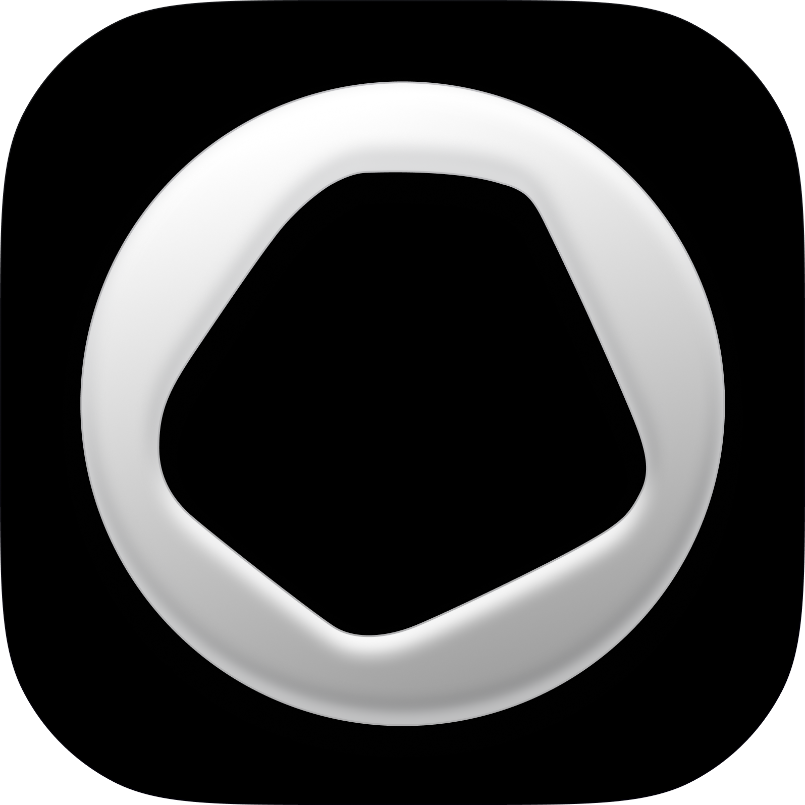

# Opal

> L'app de temps d'écran, et **l'exact opposé de [[brilliant]]** : là où Brilliant met 61 % de blanc à l'écran, Opal met **80,7 % de sombre et 42,8 % de noir pur**. Ce dossier existe pour ça, et pour une chose que presque aucune app ne fait — **une charte sans couleur de marque**, quatre valeurs en tout, et une règle écrite qui interdit le dégradé partout sauf sur l'objet de récompense.

**Sources :** `brandkit.opal.so` (brand kit **et** press kit officiels, ouverts, avec les hex, les gemmes 3D et six films) · opal.so et opalapp.com (20 pages capturées, blog, page équipe) · App Store et Google Play · Screensdesign (8 écrans profonds non floutés) · Mobbin (2 écrans en résolution native) · Adapty (le paywall de 2024) · TechCrunch (la génération 2022) · Speedinvest et RevenueCat/Sub Club (la stratégie) · theorg.com (l'organigramme) — détail dans [[#Sources]]

> **Lecture** : chaque famille de visuels est montrée par **une planche** (`<aspect>/planches/`), légendée juste dessous. Les fichiers individuels restent dans leur dossier d'aspect.

## En bref

- **Une charte de quatre couleurs, et pas une couleur de marque.** `#000000`, `#FFFFFF`, `#BCBBC0`, `#3A3A3A`. C'est tout. Là où toute app de bien-être pose un accent, Opal pose du noir et laisse la couleur aux objets qu'on gagne.
- **Le relevé de pixels le confirme au dixième** : noir pur **42,82 %** de la surface, sombre (canal max ≤ 64) **80,73 %**, clair **7,48 %**. Le token `Surfaces #3A3A3A` sort à `#303030`, le blanc de texte à `#F8F8F8`.
- **La règle des dégradés est écrite noir sur blanc dans le brand kit** : « Gradients are reserved for in-app milestone moments — never as backgrounds or dominant elements. » Cinq dégradés nommés, tous marqués « app only ».
- **La typo est SF Pro Text, la police système d'Apple.** Cinq graisses, aucune police sur mesure, aucune Google Font. Une marque entière construite sur la fonte du système.
- **Ça s'explique par une personne** : le Creative Director **Antoine Choussat** a passé plus de dix ans chez Apple, où il a **co-créé la campagne « Shot on iPhone »**, avant de mener la refonte de marque de Snap. Le noir pur, SF Pro et l'objet photographié en apesanteur sont la grammaire Apple, appliquée à une app.
- **Les gemmes verrouillées sont des rochers gris.** On ne voit pas la gemme avant de l'avoir gagnée — on voit la pierre brute. Cinq paliers relevés : Invested 3 jours, Steadfast 7, Radiant 30, Prismatic 60, Legendary 90, sur 23 à collectionner.
- **Chaque section prend la teinte du halo de son objet.** Sur l'écran MileStones, la flamme de série est ambre et tout le bloc l'est avec elle ; le sablier des heures de focus est vert menthe et son texte aussi. La couleur ne vient jamais d'un token d'interface, elle vient de la lumière d'un objet 3D.
- **Le seul bleu de l'interface n'est pas dans la charte** : `#0070F8`, 0,63 % de la surface. C'est le bleu système d'iOS — les bascules et le bouton d'essai. La marque n'a pas jugé utile de le déclarer.
- **Les membres s'appellent des « Gems ».** Pas des utilisateurs, pas des membres : des gemmes.
- **Kenneth Schlenker, fondateur** : « Teams create product soul. **You can't vibe code a brand.** »

## Écrans

![[ecrans/planches/planche-lapp-reelle.png]]
**L'app telle qu'elle est, sans mockup.** Sept écrans en résolution native — cinq de Screensdesign (filigrane en haut), deux de Mobbin. La grammaire est constante : fond noir pur, cartes `#3A3A3A` à grand rayon, texte SF Pro blanc, bascules bleu système. Deux écrans valent le détour : **Block Screens** range ses options en « Curated by Opal » (Default, Pop Culture, Focus Haiku, Luminaries) puis en **« AI Personalities »** avec un picto étincelle — *Brutal Insults* (« You aren't afraid to get roasted, zinged and smoked. PG13. ») et *Jane Austen*, qui vous cite quand vous ouvrez Instagram. Et **App Lock** pose son bouton « Unblock apps » par-dessus une photo de montagne plein cadre, en écran verrouillé.

![[ecrans/planches/planche-lapp-vue-par-la-marque.png]]
**Les onze mockups du brand kit, et ils racontent autre chose.** Chaque écran est un téléphone en apesanteur dans un espace noir, éclairé par une seule source colorée — exactement une photo produit Apple. Le score de focus est un arc chiffré (86), le minuteur un afficheur segmenté, les mini-jeux des cartes de verre dépoli empilées, la respiration un anneau sur un ciel. Ce sont des **artefacts de marque**, pas des captures : c'est l'app telle que la marque veut qu'on la voie.

`ecrans/reel-milestones-serie-et-collection-de-gemmes.webp` — l'écran le plus intéressant du dossier, et celui d'où sortent la moitié des composants.

## Flows

![[flows/planches/planche-onboarding-et-paywalls.png]]
**Vingt-quatre étapes d'onboarding, dont une qui fait tout le travail.** Après le quiz de temps d'écran (« More than 7 hours » à « Under 1 hour », en pilules blanches sur noir), Opal calcule un **Focus Report** et sert l'écran choc : « The bad news is that you'll spend **158 days** on your phone this year. Meaning that you're on track to spend **31 years** of your life looking down at your phone. » Le nombre est le seul élément coloré de l'écran, en dégradé violet. Puis un écran « fist bump », puis le paywall.

**Deux millésimes de paywall, et ils ne racontent pas la même histoire.** Celui de 2024 (Adapty, en thème **clair** — le seul écran clair de tout le dossier) est une frise « How Your Free Trial Works » en quatre étapes, avec les logos TNW / TC / Bustle et « 1,900+ Reviews », à 99,99 $/an. Celui de 2026 est revenu au noir et ouvre sur une **comparaison Before / After Opal en barres** — 6 h 32 contre 1 h 49 — avant la frise d'essai. Le déplacement est le même que chez [[headspace]] et [[brilliant]] : de l'argumentaire vers la démonstration chiffrée.

Chapitrage relevé par Screensdesign : Focus Report 01:13 · fist bump 01:46 · paywall 01:48 · Before/After 01:49 · **première gemme débloquée 02:27-02:30** · tooltips contextuels 04:17 · Take a Break 04:31 · Choose Activities 05:28 · modes Normal / Timeout / Deep Focus 06:23 · personnalisation des écrans de blocage 07:23 · parrainage « Guest Pass » 10:00. Tarifs relevés chez Adapty en septembre 2024 : hebdo 4,99 $, mensuel 8,99 $ et 19,99 $, annuel 59,99 $ / 69,99 $ / 99,99 $.

## Branding

![[branding/planches/planche-le-systeme-de-marque.png]]
**Le wordmark, le crest, l'icône et le « Gem Burst ».** Le wordmark est un logotype en bas de casse à terminaisons douces, servi en blanc et en noir uniquement — le brand kit interdit explicitement de le recolorer, de l'ombrer, de lui mettre un halo, de le recadrer ou de le redessiner. Le **crest** est le second signe : une forme de gemme facettée qui sert d'avatar et de favicon. Le « Gem Burst » est l'image de campagne : une gemme qui éclate en éclats sur fond noir.

![[branding/planches/planche-les-six-gemmes-de-jalon.png]]
**Les six gemmes livrées dans le brand kit, et leur présentation dit tout.** Chacune est une opale photoréaliste **posée sur un petit socle noir**, avec son propre halo de couleur — un spécimen de musée, pas une icône de jeu. Les halos reprennent les cinq dégradés déclarés. Le brand kit impose : fond noir pur uniquement, pas de recadrage, pas de recoloration, pas de texte par-dessus.

**Ce que la marque interdit, en toutes lettres** : logo blanc sur fond clair, logo noir sur photo sombre, étirement, rotation, distorsion, ombres, effets lumineux, recoloration, recadrage, recréation — et **les captures d'écran de l'app** comme asset de marque. C'est une charte qui liste ses « do not » aussi précisément que ses « do ».

### Typographie

**SF Pro Text, d'Apple, en cinq graisses** — Bold 700 pour les titres, Semibold 600 pour les sous-titres, Medium 500 pour le corps, Regular 400 pour le texte secondaire, Light 300 pour « l'ambiant ». C'est tout, et c'est le point remarquable : **aucune police sur mesure, aucune fonte tierce**. Là où [[toss]] fait fabriquer trois fontes maison et [[brilliant]] deux, Opal prend la police du système et n'en parle plus. Cohérent avec le reste : la marque n'occupe pas l'écran, elle le libère.

Les cinq fichiers `.otf` sont servis par le brand kit ; ils ne sont pas rapatriés ici — c'est la fonte système d'Apple, disponible chez Apple, et un asset de 10 Mo qui n'apprend rien.

## Couleurs

![[couleurs/palette-declaree-la-charte.svg]]
**Quatre valeurs, et aucune n'est une couleur.** C'est le fait central de cette DA : la charte d'Opal ne contient pas de teinte de marque. Un noir, un blanc, un gris de texte légèrement violacé, un gris de surface. Le seul dégradé autorisé hors app est un dégradé de **texte**, du gris secondaire vers le blanc — un titre qui s'éclaircit vers le haut.

**Les quatre valeurs de base**

| Nom déclaré | Hex | Relevé | Usage |
| --- | --- | --- | --- |
| `Background` | `#000000` | 42,82 % | Le fond, partout — du noir pur, pas un gris foncé |
| `Main Text` | `#FFFFFF` | `#F8F8F8`, 5,80 % | Texte principal |
| `Secondary` | `#BCBBC0` | — | Texte secondaire |
| `Surfaces` | `#3A3A3A` | `#303030`, 5,42 % | La seule surface au-dessus du fond |

![[couleurs/palette-declaree-les-cinq-degrades.svg]]
**Les cinq dégradés, et la phrase qui les encadre.** Le brand kit les nomme `Gradient 01` à `05` et les marque tous « app only », avec la règle : *« Gradients are reserved for in-app milestone moments — never as backgrounds or dominant elements. »* Autrement dit : la couleur n'a le droit d'exister qu'au moment où l'utilisateur gagne quelque chose.

| Token | Départ | Arrivée | Ce qu'il colore |
| --- | --- | --- | --- |
| `Gradient 01` | `#E2C9FF` | `#8CFFDD` | violet vers menthe |
| `Gradient 02` | `#A9CBFF` | `#B39AFF` | bleu vers violet |
| `Gradient 03` | `#D4FF9C` | `#9EF9FF` | vert vers cyan |
| `Gradient 04` | `#EDC9F2` | `#EDFF4A` | rose vers jaune acide — le seul à forte tension |
| `Gradient 05` | `#ECB8FF` | `#FFD6AA` | mauve vers pêche |

![[couleurs/palette-relevee-dans-les-ecrans.svg]]
**Le comptage de pixels sur dix écrans réels, filigrane rogné, 5,2 millions de pixels.** Le noir pur occupe 42,82 % de la surface, et **80,73 % de l'écran a un canal maximum inférieur ou égal à 64** — quatre cinquièmes de sombre. Le clair, c'est-à-dire le texte, tient dans **7,48 %**. À comparer avec [[brilliant]], dont le blanc occupe 61,09 % : deux façons opposées de rendre une app calme.

**Ce que le relevé apprend en plus de la charte**

| Nom de rôle | Hex | Part | Note |
| --- | --- | --- | --- |
| Noir pur | `#000000` | 42,82 % | le token `Background`, exact |
| Noir levé | `#101010` | 10,83 % | le halo autour d'un objet lumineux |
| Noir violacé | `#201820` | 6,60 % | la teinte que les gemmes jettent sur le fond |
| Blanc de texte | `#F8F8F8` | 5,80 % | le token `Main Text` |
| Surface | `#303030` | 5,42 % | proche du token `Surfaces` `#3A3A3A` |
| **Bleu d'action** | `#0070F8` | **0,63 %** | **absent de la charte** — c'est le bleu système d'iOS |
| Bleu d'ombre | `#182870` | 0,23 % | le cran bas du même bouton |

Le bleu est le seul écart entre ce que la marque déclare et ce qu'on voit : les bascules et le bouton « Try for $0.00 » prennent le bleu d'iOS, que le brand kit ne mentionne nulle part.

## Composants

![[composants/planche-composants.png]]
Six blocs découpés dans les écrans réels, tous référencés dans [[_COMPOSANTS]].

- `serie-flamme-day-streak_opal.png` — la série est une **flamme 3D avec le chiffre dedans**, et le bloc entier prend l'ambre du halo : titre, sous-titre, et jusqu'au contour du bouton « My Progress ». Aucun token d'interface n'est en jeu ; la couleur est celle de l'objet.
- `focus-hours-sablier-vert_opal.png` — le même mécanisme avec un sablier vert menthe et le chiffre dedans. Deux blocs voisins, deux teintes, une seule règle.
- `grille-de-gemmes-verrouillees-en-rochers_opal.png` — **les jalons non gagnés sont des rochers gris identiques**, avec une barre de progression fine, le nom du palier et le nombre de jours. Invested 3 j, Steadfast 7 j, Radiant 30 j, Prismatic 60 j, Legendary 90 j.
- `entete-progression-2-sur-23_opal.png` — « 2/23 collected » et un trait de progression de 2 px. La collection est bornée et annoncée.
- `ligne-decran-de-blocage-avec-bascule_opal.png` — la ligne de réglage : emoji, titre, description sur deux lignes, bascule bleue, sur une carte `#3A3A3A` à grand rayon.
- `section-personnalites-ia_opal.png` — l'en-tête « AI Personalities » à picto étincelle et ses deux premières entrées.

## Animations

![[animations/gemmes-de-jalon-en-rotation_opal.mp4]]
Les gemmes tournent sur elles-mêmes, chacune projetant sa lumière sur le noir. C'est le meilleur résumé du produit : l'objet est le sujet.

![[animations/ecran-daccueil-gemme-et-score_opal.mp4]]
![[animations/session-de-focus_opal.mp4]]
![[animations/serie-de-jours_opal.mp4]]
Les trois films officiels du brand kit : l'accueil avec la gemme et le score, une session de focus, la série de jours. Durées relevées : 16,4 s · 6,9 s · 22,1 s, toutes en 1920×1080.

**Ce que ces films ne montrent pas, et qui est le cœur du sujet** : Kenneth Schlenker décrit au podcast Sub Club une **animation de gemme qui se fissure** au moment où un jalon tombe, et la présente comme « une fonctionnalité chère qui ne bouge aucune ligne du tableur » — construite pour l'attachement, pas pour la métrique. Toutes référencées dans [[_ANIMATIONS]].

## Marketing

![[marketing/planches/planche-le-site-opal-so.png]]
**Le site est aussi noir que l'app.** Hero « Attention on autopilot. » sur une texture de roche sombre traversée d'une lumière, badges de store, notes. Puis une phrase seule en gris sur noir — « 5 to 6 hours. That's the average time you'll spend on your phone today — often without realising. It's time to fight back. » Trois blocs produit, chacun avec son téléphone en apesanteur. Et la section signature : **« Unlock precious Milestones »**, un mur d'une vingtaine de gemmes, chacune avec son halo, alignées sur fond noir — la collection montrée comme une vitrine de minéralogie. Plus bas : « Average time saved thanks to Opal — 1h 23m saved daily », trois chiffres (94 % / 93 % / 90 %), et une grille de témoignages en photos.

![[marketing/planches/planche-les-deux-registres-de-store.png]]
**La même app vendue dans deux registres opposés selon la plateforme.** Sur l'**App Store**, l'éditorial sombre : surtitres en capitales espacées (`PROFIL DE CONCENTRATION`, `JOYAUX DE CONCENTRATION`, `AMIS DE CONCENTRATION`, `IMPACT`), mockups en apesanteur, gemmes qui éclairent le cadre. Sur **Google Play**, **fond clair** et titres en gras noir — « Opal bloque les distractions pour toi », « Explore tes progrès plus en détail ». C'est le seul endroit du dossier où Opal quitte le noir, et l'écart est assumé : deux publics, deux codes de store.

## Archive

![[archive/planches/planche-generation-2022.png]]
**La génération 2022, celle d'Opal 3.0**, retrouvée dans l'article de TechCrunch du 15 septembre 2022. C'est la bascule technique et visuelle du produit : abandon de l'architecture **VPN** au profit de l'**API Screen Time et de ManagedSettings d'iOS 16**, apparition du **Focus Score**, du rapport de focus gratuit, du retrait temporaire des apps de l'écran d'accueil pendant une session, et d'une extension Chrome. Les chiffres de l'époque : 200 000 téléchargements et 20 millions d'heures de focus — contre 1 million d'utilisateurs quotidiens et plus de 500 millions d'heures aujourd'hui.

Kenneth Schlenker, à ce moment-là : « People spend around four hours per day on their phone, starting age 12. To put this into perspective, this means that they will spend **17 years of their life** staring down at a phone. » Le chiffre est passé de 17 à 31 ans dans l'onboarding de 2026 — même argument, calibré plus fort.

## Process

**Aucun visuel de fabrication n'est publié**, et c'est à signaler : pas de blog design, pas de case study, pas d'explorations. Le portfolio du Lead Designer, `balitskyi.com`, **ne résout plus**. Ce qui existe est verbal, et vient de deux entretiens :

- **Le renversement du modèle économique**, raconté par Kenneth Schlenker au podcast Sub Club (RevenueCat, 2026) : passage d'un **hard paywall à 20 % de conversion** à un vrai freemium qui **descend volontairement la conversion à 9 %** — et fait passer l'ARR de 5 à 10 M$. Le réglage retenu : **trois blocages gratuits par jour**. Le test qu'il applique : *est-ce qu'un utilisateur qui ne paie pas recommanderait l'app ?* Une offre gratuite qui ressemble à un essai mutilé ne produit aucun bouche-à-oreille.
- **Deux tiers du million d'utilisateurs quotidiens sont des lycéens et des étudiants**, arrivés seuls ; c'est cette adoption qui a fait naître « Opal for Schools », en réponse aux interdictions de téléphone dans les établissements.

## Sources

- **[brandkit.opal.so](https://brandkit.opal.so)** — le brand kit officiel, **ouvert, sans compte**, et c'est la source de la moitié de ce dossier : les quatre couleurs et les cinq dégradés avec leurs hex, les cinq graisses de SF Pro Text en `.otf`, le wordmark et le crest en noir et blanc, l'icône, le Gem Burst, **six gemmes de jalon en 4096×4096**, six films MP4, les badges, et onze captures iOS plus sept Android. Les chemins sont relatifs mais les fichiers se téléchargent en direct.
- **[brandkit.opal.so/press.html](https://brandkit.opal.so/press.html)** — le press kit : photos de Kenneth Schlenker et d'Olivia Yokubonis, les clips « Olivia Unplugged », les faits chiffrés (500 M+ heures économisées, financement Adjacent / Speedinvest / fondateurs de Duolingo, Pinterest et Mistral), les mentions NYT, New Yorker et Telegraph.
- **opal.so et opalapp.com** — 20 pages capturées en pleine hauteur, desktop et mobile. Les deux domaines servent le même produit ; `opalapp.com` porte le blog et les pages d'équipe.
- **App Store et Google Play** — icône, 10 captures iOS et 6 Android, métadonnées (v4.12, 4,72/5 sur 86 645 avis US, 4,75/5 sur 13 102 avis FR, sortie le 15 décembre 2020, iOS 18 minimum, 300 Mo, 10 langues).
- **[Screensdesign](https://screensdesign.com/showcase/opal-screen-time-control)** — **8 captures non floutées en 2160×4670**, les seuls écrans profonds du dossier (Block Screens, App Lock, MileStones, Sessions, gemme débloquée, quiz, Before/After, écran choc), plus le chapitrage horodaté du parcours et le décompte des 24 étapes d'onboarding.
- **[Mobbin](https://mobbin.com)** — 2 écrans en 1125×2436 sans filigrane, via les pages de détail `/explore/screens/<uuid>`.
- **[Adapty](https://adapty.io/paywall-library/opal-screen-time-for-focus/)** — le paywall de septembre 2024 et la grille tarifaire complète.
- **[TechCrunch, 15 septembre 2022](https://techcrunch.com/2022/09/15/opal-revamps-its-screen-time-app-to-help-anyone-not-just-parents-with-kids-focus-and-avoid-distractions)** — la refonte 3.0 et cinq visuels de l'époque : toute la section `archive/`.
- **[Speedinvest](https://www.speedinvest.com/knowledge/scaling-smart-how-opal-built-a-10m-arr-business-in-just-2-years)** et **[RevenueCat / Sub Club](https://www.revenuecat.com/blog/growth/kenneth-schlenker-sub-club-podcast-2026)** — la stratégie, les chiffres, et les seules déclarations sur le design.
- **[theorg.com/org/opal-so](https://theorg.com/org/opal-so)** — l'organigramme, d'où sortent les crédits nominatifs.

**Ce qui a bloqué, et c'est à savoir** : les pages de **flow** de Mobbin (`/explore/flows/<uuid>`) ne servent **pas** les écrans du flow dans leur payload — les 40 UUID qu'on y récolte appartiennent au carrousel de recommandations et donnent LINE, DoorDash et des apps de crédit immobilier. Seules les pages `/explore/screens/<uuid>` livrent le bon écran, une par une. `balitskyi.com`, le portfolio du Lead Designer, **ne résout plus** (`ENOTFOUND`). La page Speedinvest renvoie 403 en fetch direct. **Aucun case study de design n'existe** sur Opal : ni Behance, ni Brand New, ni It's Nice That, ni Fast Company. Les huit captures Screensdesign portent un filigrane en haut de l'image, rogné pour le relevé de couleurs mais laissé sur les fichiers. Enfin, la capture du site a laissé de **grandes zones noires vides** : les sections sont révélées au défilement et ne se déclenchent pas toutes pendant la capture pleine hauteur.

## Contexte

- **Société Opal OS Corporation**, app sortie le 15 décembre 2020. Cofondateurs **Kenneth Schlenker** (CEO, ex-**ArtList**) et **Matt Davenport** (CTO). L'équipe créative est francophone et une offre « Founding Brand Designer » est publiée sur **Paris** — le siège exact n'est pas vérifié.
- **Finaliste de l'Apple Design Award 2025, catégorie Social Impact.** C'est la seule distinction vérifiée — le brand kit en fournit le badge officiel.
- **Les chiffres, toujours avec leur date** : 200 000 téléchargements et 20 M d'heures en septembre 2022 (TechCrunch) · ~400 k$ de revenu mensuel en septembre 2024 (Adapty) · 5 M de téléchargements et 10 M$ d'ARR à 11 personnes (Speedinvest) · **1 M d'utilisateurs quotidiens et 500 M+ d'heures économisées** en 2026 (Sub Club, press kit). Ils ne sont pas comparables entre eux : périmètres différents.
- **Financement** : Adjacent, Speedinvest, et les fondateurs de Duolingo, Pinterest et Mistral.
- **Deux tiers des utilisateurs quotidiens sont lycéens ou étudiants**, ce qui a produit « Opal for Schools ».
- **Presse généraliste, pas presse design** : New York Times, New Yorker, Telegraph, TechCrunch, The Next Web, Bustle. Vérifié : aucune couverture sur Brand New, It's Nice That, Fast Company ou The Brand Identity.

## Crédits

**L'équipe créative, nominative** (page équipe d'opalapp.com croisée avec theorg.com) :

- **[Antoine Choussat](https://www.linkedin.com/in/antoine-choussat-65630624/)** — **Creative Director & Advisor** depuis juin 2022. Plus de dix ans chez **Apple**, où il est **co-créateur de la campagne « Shot on iPhone »** ; puis Creative Director chez **Snap** (refonte de marque), **Impossible Foods** et **TBWA\Media Arts Lab**. C'est l'explication de toute la direction artistique.
- **[Anton Balitskyi](https://www.linkedin.com/in/antonbalitsky/)** — **Lead Designer**, et « Founding Designer » sur son propre profil. Auparavant Lead Product Designer chez **Pzizz** (sommeil), Product Designer chez Craft Inc., et sur Mesmerize. Spécialisé dans les apps mobiles par abonnement. Sur X : [@antonbalitskyi](https://x.com/antonbalitskyi). Son site `balitskyi.com` ne répond plus.
- **[Nour Ben Ameur](https://www.linkedin.com/in/nour-ben-ameur-ux-ui-da-designer/)** — **Brand Designer**. C'est elle le contact `brand@` du brand kit, donc très probablement l'autrice du kit lui-même.
- **Alexandru Cucos** — **Design Engineer**.
- **[Elise Braud](https://www.linkedin.com/in/elisebraud/)** — **Creative Ads Producer**.
- **Kenneth Schlenker** — Cofondateur et CEO, et contact presse. **Matt Davenport** — Cofondateur et CTO.
- **Olivia Yokubonis** — présentatrice d'**« Olivia Unplugged »**, le format vidéo de la marque (10 fichiers dans le press kit).

**Typographie** : **SF Pro Text**, d'**Apple** — police système, aucune commande sur mesure.

**Attention aux homonymes** : « Opal » est très courant. Écartés après vérification — **Opal Camera** (la webcam C1 et le Tadpole), **Opal de Google Labs** (le constructeur de mini-apps IA), Opal Autonomous Tech, et la carte de transport Opal de Sydney. Le bon identifiant est `com.withopal.opal`.

## Pourquoi je l'aime

- **Une charte sans couleur de marque.** Quatre valeurs, dont trois sont des gris. Toute app de bien-être pose un accent rassurant ; Opal n'en pose aucun et laisse le noir faire le travail. C'est le pari inverse de [[headspace]] et de [[finch]], sur le même marché.
- **La règle des dégradés est une règle de rareté.** « Réservés aux moments de jalon, jamais en fond » : la couleur est un événement, pas un décor. Peu de chartes osent écrire un interdit aussi net, et encore moins le tiennent — le relevé montre qu'ils le tiennent.
- **Les jalons verrouillés sont des rochers.** On ne montre pas la récompense grisée : on montre la pierre avant la taille. La métaphore fait tout le travail que ferait un cadenas, sans cadenas.
- **La couleur vient de la lumière d'un objet, pas d'un token.** Une section entière prend l'ambre de sa flamme ou le vert de son sablier. C'est un système de couleur piloté par le contenu 3D, ce que je n'ai vu nulle part ailleurs dans le vault.
- **SF Pro et rien d'autre.** Une marque primée par Apple qui refuse de se payer une fonte. Le contraire exact de [[toss]] et de [[brilliant]] — et ça marche parce que la marque, ici, ce n'est pas la typo, c'est le vide.
- **L'écran choc est un calcul, pas un slogan.** « 158 jours cette année, 31 ans de ta vie » — l'argument est le même qu'en 2022 (« 17 ans ») mais recalculé sur les données de la personne. Le chiffre est le seul élément coloré de l'écran.
- **Ils ont baissé leur conversion exprès.** De 20 % à 9 % pour ouvrir le produit, et l'ARR a doublé. Avec la bonne question derrière : *un utilisateur qui ne paie pas recommanderait-il l'app ?*
- **« You can't vibe code a brand. »** La phrase de fondateur la plus utile de tout le vault, et elle sert à défendre une animation de gemme qui se fissure.
- **Le contraste avec [[brilliant]] est presque parfait** : 61 % de blanc contre 80,7 % de sombre, une charte de 14 teintes contre une charte de quatre valeurs, deux fontes sur mesure contre la police système. Deux dossiers à lire l'un après l'autre.

## À réutiliser pour

- Projet : [[ ]]
- **Écrire un interdit de couleur dans la charte**, pas une recommandation : « les dégradés sont réservés aux jalons, jamais en fond ». Un interdit se vérifie, un conseil non.
- **Faire porter la couleur par un objet 3D et teinter la section avec son halo**, au lieu de piocher dans une palette d'interface.
- **Montrer la récompense verrouillée comme une matière brute** — le rocher avant la gemme — plutôt que grisée ou cadenassée.
- **Borner et annoncer la collection** : « 2/23 collected » avec un trait de 2 px. On sait où on va.
- **Chiffrer le problème avec les données de la personne** avant de proposer la solution, et ne colorer que le chiffre.
- **Prendre la police système et l'assumer** quand la marque tient dans le vide et la matière, pas dans la lettre.
- **Vendre la même app dans deux registres selon la plateforme** — éditorial sombre sur l'App Store, fond clair et titres gras sur Google Play.
- **Nommer sa communauté d'après son objet de récompense** (« Gems »).
- **Le test du freemium** : est-ce qu'un utilisateur qui ne paie pas recommanderait le produit ? Sinon, l'offre gratuite est un essai mutilé.

## Mots-clés

Opal · opal.so · opalapp.com · Opal OS Corporation · withopal · temps d'écran · screen time · focus · concentration · productivité · bien-être numérique · digital wellbeing · déconnexion · blocage d'apps · app blocking · App Lock · écran de blocage · block screen · Focus Score · score de concentration · session de focus · Deep Focus · Timeout · Take a Break · minuteur · timer · série · streak · Day Streak · flamme · gemme · gem · Focus Gems · MileStones · jalon · Invested · Steadfast · Radiant · Prismatic · Legendary · Mythical · rocher · pierre brute · collection · 2/23 collected · Focus Hours · sablier · AI Personalities · Brutal Insults · Jane Austen · Focus Haiku · Luminaries · Pop Culture · Curated by Opal · Guest Pass · parrainage · Opal for Schools · noir pur · pure black · #000000 · charte sans couleur · brand kit · brandkit.opal.so · press kit · dégradé · gradient · gradient app only · jalon in-app · SF Pro Text · police système · Apple · Shot on iPhone · Antoine Choussat · Anton Balitskyi · Nour Ben Ameur · Alexandru Cucos · Elise Braud · Kenneth Schlenker · Matt Davenport · Olivia Yokubonis · Olivia Unplugged · ArtList · Pzizz · Snap · Impossible Foods · TBWA Media Arts Lab · Apple Design Award · ADA finaliste · Social Impact · 2025 · onboarding · 24 étapes · quiz · Focus Report · écran choc · 31 years · 158 days · fist bump · paywall · soft paywall · essai gratuit · free trial · 7 jours · Before After · freemium · conversion · ARR · Sub Club · RevenueCat · Speedinvest · Adjacent · verre dépoli · glassmorphism · bascule iOS · bleu système · #0070F8 · mockup en apesanteur · photo produit · halo · glow · opale · minéral · 3D · Rive · Screensdesign · Mobbin · Adapty · TechCrunch · Opal 3.0 · 2022 · API Screen Time · ManagedSettings · VPN · iOS 16 · extension Chrome

---
[[_APPS|← Apps]] · [[_INSPIRATION|← Inspiration]]
