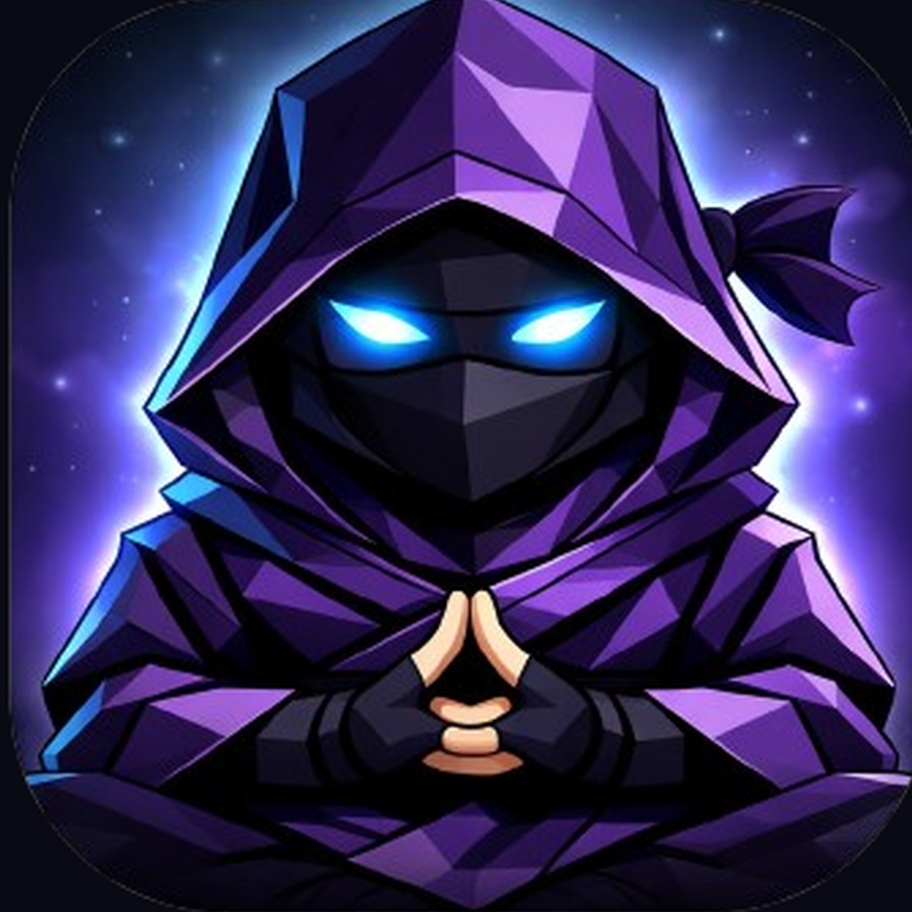

# Temper

> Le playbook comme discipline, pas comme document : un moine ninja vit dans l'encoche du MacBook, regarde le compte de trading en lecture seule, et interrompt la session à la seconde où une règle posée le matin est enfreinte. Écrit par un prop trader australien seul, avec la seule direction artistique d'auteur du corpus.

**Sources :** site officiel et son CSS (aucun bundle externe, tout est inline) · fiche App Store · deux vidéos de démo officielles servies par le site · ABN Lookup · site personnel du fondateur

> **Lecture** : chaque famille d'écrans est montrée par **une planche** (`<aspect>/planches/`), légendée juste dessous. Les fichiers individuels restent dans leur dossier d'aspect.

## En bref

- **Le produit parle à la première personne du singulier.** « I watch your trades and call you out the second you break your rules », « I live in your notch and stop you mid-trade ». Le `<title>` de la page produit est une phrase que l'app dit. Ce n'est pas un tableau de bord, c'est un personnage — et toute la mise en page en découle : des déclarations, pas des formulaires.
- **Le geste typographique tient en un mot.** Chaque titre est en Fraunces 600, et son **dernier mot passe en italique violet** : « Today's *plan*. », « Commit to the *day*. », « You're *ready*. », « Earn the *entry*. » Une règle, appliquée six fois de suite dans le même parcours.
- **Trois générations de charte cohabitent sur quatre pages.** Les pages légales sont restées à l'ère *Stillmind* (Sora, `#9333ea`, `#06b6d4`), l'accueil est intermédiaire (Fraunces, mais palette Tailwind héritée), seule `/notch` porte la charte actuelle. Le domaine n'a que quatre pages et elles ne s'accordent pas.
- **L'ancien nom est encore servi comme image de partage.** L'`og:image` de temper.au est une planche marquée **STILLMIND** — « Master your mind. Master the market. » Le rebranding a laissé son actif le plus visible derrière lui.
- **48,1 % de noirs, 2,52 % de couleur** au relevé de pixels. Et cette couleur se partage en deux accents quasi à égalité — violet 0,94 %, teal 0,89 % — au lieu du couple accent/neutre habituel.
- **Le bouton primaire s'enfonce physiquement.** `box-shadow: 0 4px 0 var(--edge)` au repos, `0 6px 0` + `translateY(-2px)` au survol, `0 0 0` + `translateY(4px)` à l'appui. L'arête basse est une couleur dédiée (`--edge`) qui n'est jamais une surface.
- **Le site est une démo jouable, pas une page de présentation.** L'encoche macOS est reconstruite en CSS pur — congés inversés compris, en `radial-gradient` sur deux pastilles de 14 px — et rejoue en HTML le menu et les alertes de l'app native.
- **Une seule personne, aucun designer.** Cody Brown, prop trader financé, huit ans de marché. Son site personnel charge exactement les mêmes polices que l'app : la DA est celle de son auteur, pas d'un studio.

## Écrans

![[ecrans/planches/planche-app-mac-notch.png]]

**L'app réelle n'existe qu'en vidéo, et c'est la meilleure source du dossier** — la démo officielle est légendée « The real thing · recorded on a Mac, unedited », enregistrée par-dessus un vrai TradingView. Les cinq recadrages ci-dessus en sont extraits. On y lit la règle de forme qui tient tout le produit : **ce qui sort de l'encoche n'a que des rayons bas** (`border-radius: 0 0 18px 18px`), le haut restant collé au bord de l'écran. Le menu est en trois groupes séparés par des filets (agir · consulter · régler), la ligne survolée est un pavé violet plein.

L'écran `mac-notch-the-plan-steppers.jpg` est celui qui définit le playbook : cinq steppers (`MAX TRADES`, `MAX LIVE`, `LOSS CAP`, `RISK/TRADE`, `MAX DAILY LOSS`), une bascule R ou $, et surtout une **« YOUR HONEST QUESTION »** dont les deux réponses sont « Yes — and I mean it » et « Honestly, probably not ». Le produit prévoit que l'utilisateur se mente et lui donne le bouton pour l'admettre.

![[ecrans/planches/planche-app-store-ios.png]]

**Les créas de l'App Store sont un format en soi** : fond noir, surtitre en IBM Plex Mono capitales très espacées, titre en gras arrondi dont **deux ou trois mots sont surlignés dans un bloc de couleur pleine**, puis le mockup. La couleur du bloc dit la nature de l'écran — teal pour ce qui va bien, violet pour l'action, rouge corail pour la menace (« I'll <mark>Stop You</mark> Before It Hurts »).

L'écran des mantras est le plus intéressant du lot : les engagements sont classés en deux groupes nommés — **ACCOUNT KILLERS** (« Breaking these can blow up an account », barre rouge) et **EDGE ERODERS** (« Death by a thousand cuts », barre violette). Une hiérarchie de gravité, pas une liste à cocher.

## Flows

![[flows/planches/planche-checkin-pre-session.png]]

**Le check-in de pré-session est le cœur du produit, et il se lit en six écrans titrés `TEMPER · <ÉTAPE>`** en monospace lettré, avec une barre de progression à cinq segments : STATE → ENERGY & SLEEP → THE PLAN → GATE & PLAYBOOK → MANTRAS → READINESS. Il se termine par un score sur 100 décomposé en trois postes (State /22, Energy + sleep /26, Gate + honesty + mantras /20) et un récapitulatif en clair de ce que l'app va surveiller.

L'étape `GATE & PLAYBOOK` est celle qui donne son sujet à ce dossier : une pré-flight en quatre cases (« Levels marked on every pair I will touch », « News + session times checked », « HTF bias written down », « Yesterday's review read ») **puis le playbook du jour** — London Sweep, NY Reversal, ou `Off-playbook`. Le troisième choix est nommé, donc autorisé, donc compté.

La grille d'états émotionnels compte **douze cases** avec chacune son sous-titre : Focused, Confident, Calm, Anxious, FOMO, Revenge, Frustrated, Tilted, Impatient, Greedy, Fearful, Overconfident. Nommer l'état est la première étape avant de nommer le plan.

L'onboarding, lui, chiffre le coût du problème avant de vendre : « ESTIMATED ANNUAL COST · **$10,400** · lost to emotional trading per year », puis trois tuiles de comparaison dont la dernière est le prix de l'abonnement, en teal.

`flows/planche-demo-mac-v7-integrale.jpg` est la planche de contact de toute la démo — elle donne l'enchaînement d'un seul coup d'œil.

## Composants

![[composants/planches/planche-composants.png]]

**Le composant signature est la tuile de règle à jauge circulaire**, et sa force est qu'elle montre le dépassement plutôt que de le masquer : `OPEN RISK $580 / $200` avec un anneau rouge bloqué à 100, sous un en-tête qui annonce froidement « TRADING RULES · **2 BROKEN** ». Le semainier reprend le même anneau, un jour par cercle, coloré selon la tenue des règles — teal, violet, rouge.

L'alerte du notch n'offre que **deux actions, `I'M AWARE` et `MUTE`** : il n'y a pas de bouton pour continuer, parce que rien n'est bloqué — l'app ne peut pas passer d'ordre, elle ne peut que dire. Et les badges d'alerte sont en monospace capitales à point médian : `URGENT · RULE BREAK`, `WARNING · STOP MOVED`, `WARNING · REVENGE TRADE`, et un seul en teal, `RULE HELD`.

La tab bar iOS fait de la mascotte son bouton central en relief lumineux — le personnage est littéralement au milieu de la navigation.

## Animations

![[animations/demo-mac-v7_temper.mp4]]

**Deux animations nommées seulement, et elles servent le personnage.** `breathe` (3,4 s, ease-in-out, `scale(1)` → `scale(1.1)`) fait respirer la mascotte en permanence dans l'encoche ; `tnblink` (6,5 s) lui fait cligner les yeux — immobile 91 % du temps, puis un `scaleY(.08)` très bref. Ce n'est pas de la décoration, c'est un signe de vie.

Le reste du mouvement tient dans **un ressort** : `transition: width/height .5s cubic-bezier(.34, 1.45, .5, 1)`. Le dépassement supérieur à 1 fait rebondir le panneau à la sortie de l'encoche. Détail de mise en scène : le corps de l'alerte apparaît en `opacity .28s` avec **`.18s` de retard** — la boîte s'ouvre d'abord, le texte arrive ensuite.

Et `prefers-reduced-motion` est traité sérieusement, ce qui est rare : toutes les transitions sont coupées **et le notch est forcé ouvert avec l'alerte visible**. Le message passe sans mouvement plutôt que de disparaître avec lui.

## Branding

![[branding/planches/planche-mascotte.png]]

**La mascotte est le seul actif de marque, et elle se décline par soustraction** : illustration complète en icône (moine ninja low-poly, mains en gassho, fond cosmique), détourée sur transparent pour la navigation, puis **réduite à deux yeux de 48 × 17 px** pour la barre de menus macOS. Le produit tient dans deux pixels blancs qui clignent.

Aucun SVG n'est servi sur le domaine. Les seuls vecteurs sont les treize icônes de menu tracées à la main en `<svg>` inline dans le HTML (`stroke-width` 1.5-1.6, `fill:none`, `viewBox` 24×24).

**Quatre polices, quatre rôles, et une de trop.** Fraunces 600 (romain et italique) pour les titres, DM Sans pour le corps, IBM Plex Mono pour tout ce qui est surtitre, badge, légende ou corps d'alerte — toujours en capitales, `letter-spacing` de .06 à .22 em, corps de 9 à 12 px. **Sora est la quatrième** : elle ne subsiste que sur les pages légales, vestige de l'ère Stillmind que Fraunces a remplacée partout ailleurs.

## Couleurs

![[couleurs/palette-declaree-notch.svg]]

**Il n'y a pas de charte publiée : ces valeurs sont lues dans le style inline de la page.** Et la lecture révèle une distinction que peu de systèmes font — `--edge` (`#8b5cf6`) n'est jamais une surface, c'est **uniquement l'arête basse des boutons**. Une couleur dont le seul rôle est d'être une ombre portée.

**Fonds**

| Nom de rôle | Hex | Usage |
| --- | --- | --- |
| `--bg` | `#0a0a0f` | fond de page, et couleur de **texte** sur les boutons violets pleins |
| `--bg-2` | `#101019` | déclarée mais jamais utilisée dans la feuille — token orphelin |
| noir du notch | `#000000` | noir pur, jamais `--bg` : il doit se fondre dans la dalle du MacBook |
| écran de la maquette | `#050509` | le noir de dalle du MacBook, dessiné en CSS |

**Accents**

| Nom de rôle | Hex | Usage |
| --- | --- | --- |
| `--teal` | `#2dd4a8` | état sain : point d'état, badge `RULE HELD`, score de readiness |
| `--purple` | `#a78bfa` | accent principal : surtitres, italiques Fraunces, boutons pleins, chiffres |
| `--edge` | `#8b5cf6` | **exclusivement** l'arête basse des boutons (`box-shadow: 0 4px 0`) |
| `--red` | `#f0616d` | rupture de règle : badge `URGENT`, point d'état rouge, P&L négatif |

**Encres**

| Nom de rôle | Hex | Usage |
| --- | --- | --- |
| `--text` | `#fafafa` | texte principal |
| `--muted` | `#a1a1aa` | paragraphes, corps d'alerte |
| `--dim` | `#71717a` | légendes, monospace, pied de page |
| `--line` | `rgba(255,255,255,.08)` | toutes les bordures, et les gouttières de 1 px des grilles |

![[couleurs/palette-trois-generations.svg]]

**Un domaine de quatre pages qui porte trois chartes est un fossile de rebranding.** Le même hex change de nom d'une page à l'autre : `#8b5cf6` s'appelle `--purple` sur l'accueil et `--edge` sur `/notch`, où il est rétrogradé du rang de couleur d'accent à celui de couleur d'ombre. Et le teal s'est déplacé de deux points, de `#2dd4bf` — le `teal-400` de Tailwind, hérité de Stillmind — à `#2dd4a8`, une valeur propre. Incohérence relevée au passage : la pastille « free » de l'accueil est peinte avec le teal de `/notch`, pas avec le sien.

![[couleurs/palette-mascotte.svg]]

**Les yeux ne sont pas du teal.** Ils sont d'un bleu électrique `#47baff` qui n'existe nulle part ailleurs dans le système — la mascotte a sa propre palette, saturée, quand l'interface n'en a presque aucune.

![[couleurs/palette-relevee-dans-les-ecrans.svg]]

**Deux accents à parts égales, ce qui est le fait rare de ce système.** Presque tous les produits du corpus ont un accent et des neutres ; Temper en a deux qui se répartissent la même surface — violet 0,94 %, teal 0,89 % — parce qu'ils portent deux états opposés et également fréquents : la règle tenue et l'action à faire. Le rouge suit à 0,59 %, réservé à la rupture.

| Famille | Part | Rôle |
| --- | --- | --- |
| noirs (composante max < 40) | 48,10 % | fonds d'app, de créa et de mockup |
| violet | 0,94 % | action, accent principal |
| teal | 0,89 % | état sain, réussite |
| rouge | 0,59 % | rupture de règle |
| gris neutres | 1,07 % | bordures, séparateurs |
| blancs | 0,55 % | texte principal |

> Relevé fait sur les dix fichiers de `ecrans/`, qui mélangent des créas App Store (elles-mêmes sur fond noir) et des recadrages de l'app Mac : la part des noirs est donc gonflée par le format des visuels. Les **proportions entre accents**, elles, sont significatives.

## Marketing

![[marketing/planches/planche-site.png]]

**Le site tient en quatre pages et une seule compte.** `/notch` est bâtie pour l'acquisition payante : un paramètre `?hook=` permute titre et sous-titre entre **quatre accroches nommées dans le code** — `notch`, `confession`, `journal`, `receipt`. La plus frappante : « I risked 27% on one trade. It won. That was the problem. » Chacune est un angle publicitaire testable, écrit d'avance.

Un calculateur interactif fait le chiffre à la place du visiteur : un curseur de risque par trade, multiplié par 52, sous la formule « if I catch one bad trade a week, for a year ». Encadré de deux avertissements — « an illustration of avoided risk, not a promise ».

La créa App Store la plus forte n'est pas un écran d'app : c'est un **écran de verrouillage iOS** montrant une photo de léopard en noir et blanc, avec la notification prioritaire par-dessus. Le produit se vend sur le moment où on ne l'a pas ouvert.

## Archive

![[archive/2025-stillmind-og-image-cinq-ecrans.png|700]]

**L'ère Stillmind, toujours en ligne.** Cette planche est encore l'`og:image` officielle de temper.au — c'est elle qui s'affiche quand quelqu'un partage le lien. Elle donne la structure de l'app iPhone d'alors, numérotée 2/8 à 7/8 (il manque trois écrans à la série) : PRE-SESSION, READINESS SCORE, EMOTION TRACKING, ANALYTICS, RESET. Le bundle id de l'App Store, `au.stillmind.app`, confirme l'ancien nom — c'est le champ qu'on ne peut pas renommer après coup.

`archive/demo-mac-v6-avec-gate-et-state_temper.mp4` est l'autre pièce d'archive, et elle est involontaire : **la version précédente de la vidéo de démo est toujours servie** par le serveur, alors que le HTML ne la référence plus. Elle contient trois étapes que la v7 a retirées — `STATE`, `ENERGY & SLEEP`, `GATE & PLAYBOOK`. Deux états du produit à quelques semaines d'écart, dont un que l'éditeur croit avoir remplacé. Les recadrages `checkin-02` et `checkin-03` en viennent.

## Pourquoi je l'aime

- **Une règle typographique appliquée sans exception vaut un système entier.** Le dernier mot en italique violet, six écrans de suite : ça coûte une ligne de CSS et ça donne une signature reconnaissable à un produit sans logo.
- **L'ombre portée est traitée comme une couleur nommée.** Séparer `--purple` de `--edge`, c'est admettre qu'une ombre colorée est une décision de charte et pas un effet.
- **Le produit prévoit le mensonge de son utilisateur** et lui offre « Honestly, probably not » comme bouton légitime. C'est de l'écriture d'interface, pas de la copie.
- **Le `prefers-reduced-motion` qui force le notch ouvert.** La plupart des sites coupent l'animation et perdent le contenu avec elle. Ici on a réfléchi à ce que le message doit survivre au mouvement.

## À réutiliser pour

- Tout produit qui doit **avertir sans bloquer** : la paire `I'M AWARE` / `MUTE` et le badge à point médian sont un modèle de ton.
- Une **jauge de dépassement** qui reste lisible quand la valeur sort des bornes (l'anneau bloqué à 100, en rouge, avec les deux chiffres en clair).
- Une DA à **deux accents co-dominants** quand le produit a deux états opposés et également fréquents.
- Projet : [[ ]]

## Limites de la récolte

- **Aucun écran de l'app Mac à plat.** Tout ce que montre `ecrans/` côté Mac vient de recadrages d'une vidéo 1280 × 720 : la définition plafonne, et le fond TradingView reste dans l'image. Il n'existe aucune autre source publique.
- **Le contenu du `.dmg` n'a pas pu être ouvert.** Le paquet de l'app Mac (11,8 Mo) a été téléchargé mais c'est une image APFS compressée : sans montage — que je n'ai pas fait — ni outil d'extraction sur la machine, les assets et polices embarqués restent inaccessibles.
- **Aucun press kit, aucun SVG, aucune charte publiée.** Dix-huit routes testées sur le domaine, toutes en 404. L'icône plafonne à 500 px côté site, 1024 px côté store.
- **Le compte X du fondateur est inaccessible** (HTTP 402, et le miroir xcancel est hors service depuis août). Si un fil raconte la conception de Temper, il est là et je ne l'ai pas lu.
- **Aucune base d'UI n'indexe l'app** : Appshots, Screensdesign, Adapty et Banani vérifiés au sitemap, zéro occurrence. UXArchive et Mobbin répondent 403 — non conclu plutôt qu'absent.
- **Zéro note et zéro avis** sur l'App Store US depuis la sortie du 6 avril 2026 : aucune traction publique mesurable.

## Sources

- **Site officiel et son CSS** — quatre pages, tout le CSS en `<style>` inline, lu intégralement : les trois générations de charte, les deux `@keyframes`, le ressort du notch, les quatre accroches `?hook=`, le vocabulaire produit. → [temper.au](https://temper.au) et [temper.au/notch](https://temper.au/notch)
- **Les deux vidéos de démo officielles** — `hero-v7.mp4` (référencée) et `hero-v6.mp4` (orpheline sur le serveur, avec ses étapes supprimées) : la seule fenêtre sur l'app réelle.
- **App Store** — les 9 créas en résolution native, l'icône 1024, les métadonnées d'éditeur, le bundle `au.stillmind.app` et les notes de version. → [apps.apple.com/…/id6761505603](https://apps.apple.com/us/app/temper-trade-with-discipline/id6761505603)
- **Captures maison** (`capture-site.py`, desktop + mobile + sombre) — le site en pleine hauteur et le relevé des polices réellement rendues : DM Sans 427 éléments, IBM Plex Mono 64, Sora 62, Fraunces 34.
- **ABN Lookup** — l'identité et l'ancienneté de l'éditeur. → [abr.business.gov.au](https://abr.business.gov.au/ABN/View?abn=94673554964)
- **Site personnel du fondateur** — l'attribution de la DA, et le même chargement de polices que le produit. → [codez.au](https://codez.au)

## Crédits

- **Cody Brown** — fondateur, développeur et, selon toute vraisemblance, auteur du dessin : aucun designer ni studio n'est crédité nulle part, et son site personnel charge exactement les mêmes familles typographiques que le produit. Aucune source ne l'écrit noir sur blanc, donc c'est une attribution par faisceau, pas une certitude. → [codez.au](https://codez.au) · [x.com/codez_au](https://x.com/codez_au)
- **STUNT CULTURE PTY LIMITED** — éditeur (ABN 94 673 554 964, NSW, Australie). Ce n'est pas une société de fintech : le même compte publie *Stunt Pro* (sport) et *Dream Spinner* (histoires du soir). Temper est son troisième produit.
- **Fraunces** — [Undercase Type](https://undercase.xyz/fonts/fraunces), dessinée par **Flavia Zimbardi** et **Phaedra Charles**, SIL OFL 1.1.
- **DM Sans** — [Colophon Foundry](https://github.com/googlefonts/dm-fonts) sur commande de Google, direction créative MultiAdaptor, latin dérivé de Poppins (Jonny Pinhorn, Indian Type Foundry), SIL OFL 1.1.
- **IBM Plex Mono** — **Mike Abbink** chez IBM avec [Bold Monday](https://github.com/IBM/plex) (Paul van der Laan, Pieter van Rosmalen), SIL OFL 1.1.

## Mots-clés

playbook de trading, trading playbook, discipline de trading, règles de trading, trading rules, gatekeeper, garde-fou, guardrails, rule break, pre-session check-in, readiness score, mantras, engagements, setups nommés, London Sweep, NY Reversal, off-playbook, prop firm, prop trader, encoche, notch, menu bar app, app de barre de menus, macOS, mascotte, moine, ninja, low-poly, personnage, voix à la première personne, ton d'interface, UX writing, Fraunces, italique, serif display, monospace, IBM Plex Mono, DM Sans, Sora, surlignage de mot, highlight, dark mode, noir profond, teal, menthe, violet, corail, deux accents, ombre portée colorée, bouton à arête, box-shadow, ressort, spring, cubic-bezier, rebond, prefers-reduced-motion, accessibilité du mouvement, jauge circulaire, anneau de progression, stepper, tab bar flottante, alerte push, notification prioritaire, écran de verrouillage, psychologie du trading, tilt, revenge trading, FOMO, états émotionnels, respiration, breathing, reset, mini-jeu, coach IA, AI coach, Bybit, API lecture seule, read-only, rebranding, Stillmind, indie, solo dev, build in public, Australie

## À voir aussi

- [[tradingplan]] — l'autre playbook pur du corpus, en Apple natif et sans personnage : la règle y est un objet de formulaire, pas une déclaration.
- [[traders-second-brain]] — l'autre système à très faible taux de couleur (0,88 % contre 2,52 % ici).
- [[tradetrack]] — l'autre produit d'une seule personne, avec la discipline d'animation inverse : 39 `@keyframes` là où Temper en a deux.
- [[_APPS]] · [[_COMPOSANTS]] · [[_ANIMATIONS]]
