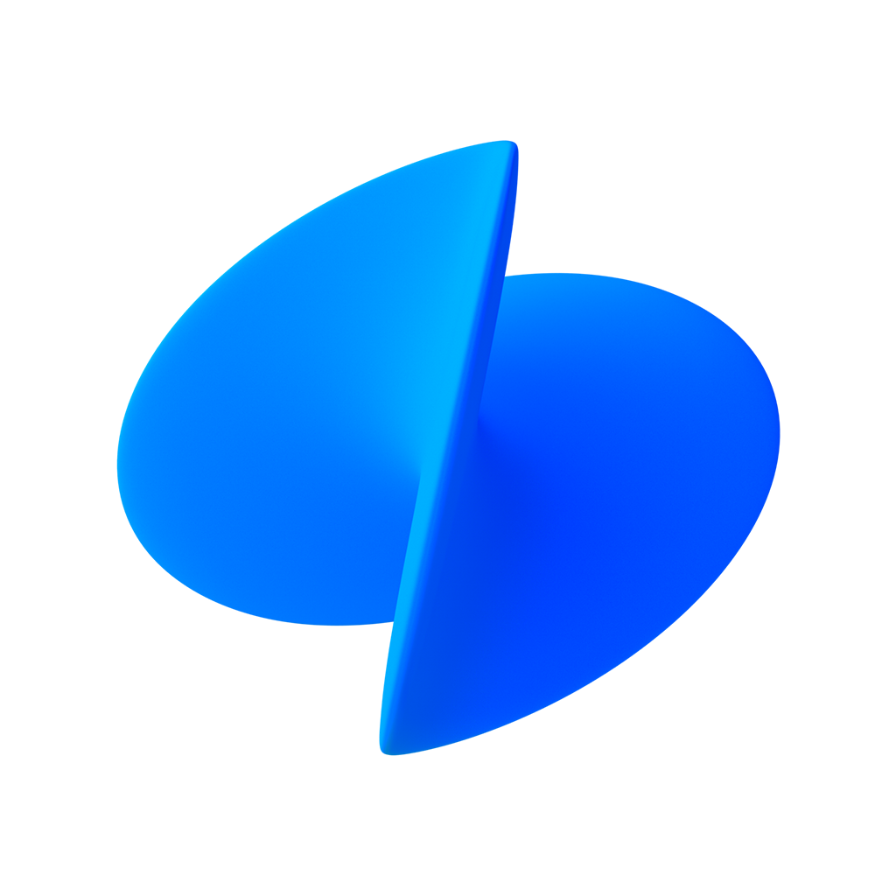

# Toss

> La super-app financière coréenne — 30 millions d'utilisateurs, environ 60 % de la population. Ce dossier existe parce que **Toss publie tout** : son centre de marque avec les fichiers Illustrator, son design system, les making-of de ses **trois familles de fontes maison** dont une police d'emoji entière, et jusqu'à sa mise au point publique après une controverse.

**Sources :** [brand.toss.im](https://brand.toss.im) (centre de ressources de marque) · [tossmini-docs.toss.im/tds-mobile](https://tossmini-docs.toss.im/tds-mobile) (doc publique du Toss Design System) · [toss.im/tossface](https://toss.im/tossface) et [github.com/toss/tossface](https://github.com/toss/tossface) · toss.tech et toss.im/tossfeed · [WWIT](https://wwit.design/2021/02/16/toss/) (268 captures) · Behance de la toss design team · Sandoll · Emojipedia, Design Compass, 한국일보, etnews, Red Dot — détail dans [[#Sources]]

> **Lecture** : chaque famille de visuels est montrée par **une planche** (`<aspect>/planches/`), légendée juste dessous. Les fichiers individuels restent dans leur dossier d'aspect.

## En bref

- **Le bleu du design system n'est pas le bleu de marque.** Toss Blue = **#0064FF** (PANTONE 2175 C), et la règle écrite dit que la couleur de marque « ne peut jamais être modifiée ». Mais le token `blue500` du TDS vaut **#3182F6**. Deux systèmes, deux bleus, assumés séparément.
- **Trois familles de fontes maison.** **Toss Product Sans** (5 graisses, 12 617 glyphes, dessinée avec Sandoll puis Leedotype), **Tossface** (3 600 emojis, la première police d'emoji primée au Red Dot), **Moneygraphy** (Rounded et Pixel, pour la chaîne de contenus).
- **Le projet typo a priorisé le latin et les chiffres avant le hangeul** — l'inverse de tous les projets de fonte de marque coréens. Le hangeul reste un Sandoll Gothic Neo1 retouché ; le latin, les chiffres et la ponctuation sont redessinés pour s'y accorder.
- **La ponctuation a été dessinée comme des icônes d'interface.** Chevrons et flèches de Toss Product Sans servent de boutons de navigation dans l'app. Trois options de génération distinctes : usage interne, app (ponctuation modifiée en icônes), site web (hangeul réduit de 11 172 à 2 780 glyphes).
- **Chiffres à largeur fixe (tabulaires)** parce que les montants sont courts et changent tout le temps. La barre horizontale du « 1 » a été écartée au profit du concept d'ensemble.
- **Le PIN s'affiche toujours en surface sombre translucide** par-dessus l'écran précédent flouté, avec **un pavé numérique aux chiffres remélangés à chaque affichage**.
- **Le formulaire KYC est « à l'envers »** : le champ actif remonte en haut de l'écran, les champs déjà remplis se compressent en dessous, au-dessus du clavier.
- **12 règles d'usage du logo, illustrées par 17 planches barrées de rouge** — dont « ne pas le personnifier » (avec des yeux) et « ne pas utiliser le logotype seul ».
- **La conférence design maison s'appelle *Simplicity*** (SLASH étant celle des devs), tenue depuis 2021, fusionnées en 2025 en « Toss Makers Conference ».
- **Ce que les utilisateurs reconnaissent, ce n'est pas le logo** : une recherche UX publiée par Toss montre que c'est un **trio** — logo au format icône d'app avec son fond carré, lettrage anglais noir gras, et la combinaison blanc + bleu + noir. Quand on leur demande de dessiner le logo de mémoire, ils ajoutent systématiquement le fond carré.

## Écrans

![[ecrans/planches/planche-millesime-2021.png]]
**Le millésime 2021, capté sur WWIT en 1125×2436 natif.** L'accueil de la super-app est une **liste verticale austère à filets** : score de crédit en haut, puis 계좌 (comptes) ligne par ligne avec le logo de chaque banque et un bouton 송금 par ligne, puis 대출 (crédit), 카드, 투자, 보험. Pas une illustration, pas une carte. Tout le patrimoine financier d'une personne dans une seule colonne. C'est cette version-là qui a fait la réputation de Toss.

![[ecrans/podometre-manbogi-illustration-plein-ecran.png|400]]
**Et voilà le contraste.** Le podomètre 만보기 récent : illustration plein écran d'une montagne enneigée en dégradé, les paliers 4 000 / 6 000 / 9 000 / 10 000 걸음 posés en points le long du sentier, des cartes flottantes de points et de loterie, une bulle de tooltip. Toss est passé de la liste austère à l'illustration — les deux écrans côte à côte racontent dix ans d'évolution.

![[ecrans/2021-toss-securities-donut-plein-ecran.png|400]] ![[ecrans/2021-onglet-tout-annuaire-de-services.png|400]]
Toss Securities : un gros donut vert plein écran avec sa légende, un horodatage de rafraîchissement, puis les lignes détaillées. Et l'onglet 전체 — un annuaire de services à icônes colorées, avec les onglets 최근 / 추천 / 신규 et une section 기간한정 à badge EVENT.

![[ecrans/2021-connexion-pin-plein-ecran-sombre.png|400]] ![[ecrans/2021-releve-de-points-au-won-pres.png|400]]
La connexion en mode sombre plein écran, pavé numérique aléatoire. Et le relevé de points **au won près** : « 지금까지 559원 받았어요 » puis le journal daté ligne par ligne (행운퀴즈 117원, 브랜드 캐시백 285원 GS25). Une gamification qui compte en centimes, sans jamais arrondir.

![[ecrans/quatre-ecrans-avec-la-typo-en-usage.png|600]]
Quatre écrans réels en 2160×4678, publiés par la fonderie : missions/marché, Top 100 des baisses en bourse, choix du destinataire d'un virement, avantages et points. C'est la meilleure preuve de Toss Product Sans en situation.

![[ecrans/planches/planche-store-ios-coreen.png]]
Les 6 captures App Store coréennes — quasi des écrans à plat, juste une accroche au-dessus. Le jeu Android (mêmes visuels en anglais, même résolution) est rangé dans `marketing/fiche-store-localisee-anglais/` : c'est la localisation de la fiche store, pas une autre version du produit.

![[ecrans/toss-front-ui-de-paiement-sur-le-terminal.jpg|500]]
L'UI de paiement sur le **Toss Front**, le terminal côté client. Toss dessine aussi son hardware.

## Flows

![[flows/planches/planche-virement-huit-etapes.png]]
**Le virement — le geste fondateur de Toss, en 8 étapes.** Destinataire (onglets 추천 / 계좌 / 연락처, favoris en étoile) → grille de banques en bottom sheet → montant à vide avec un **placeholder gris géant** et un pavé numérique custom pleine largeur → montant saisi, avec **la lecture littérale « 1만 원 » sous le chiffre** → récapitulatif rédigé en phrase pleine (« 나의 NH농협은행 계좌로 10,000원을 보냅니다 ») → choix du compte à débiter en sheet par-dessus le récap flouté → PIN sombre à chiffres mélangés → succès avec une pastille secondaire « 메모 남기기 ».

Deux détails qui font tout : **le montant est relu en mots** sous le chiffre, et **le récapitulatif est une phrase**, pas un tableau de champs.

![[flows/planches/planche-inscription-et-kyc.png]]
L'inscription et le KYC. Le premier écran ne vend pas des fonctions, il vend une **preuve sociale chiffrée** : « 누적 다운로드 4,000만, 누적 보안사고 0건 » — 40 millions de téléchargements, zéro incident de sécurité. Puis le fameux **formulaire à l'envers** : le champ actif en haut, les champs remplis compressés en dessous. Puis les consentements, avec une case maîtresse encadrée en bleu au-dessus de quatre lignes secondaires. Et 더치페이 (Dutch Pay), où on coche des transactions dans un flux groupé par date.

## Branding

![[branding/planches/planche-logo-et-declinaisons.png]]
**Le logo Toss** — le symbole 3D (deux demi-disques bleus en volume, surnommé « 타코 », taco, en interne), sa version mono pour quand la 3D est impossible, et les **trois fonds autorisés** quand on pose le symbole hors de Toss : fond sombre, pastille bleu pâle, pastille blanche. Le centre de marque distribue les fichiers en **.ai (vrais vecteurs) + PNG jusqu'à 7500 px — aucun SVG**.

![[branding/planches/planche-les-usages-interdits.png]]
**Les 17 planches « ne faites pas ça », barrées de rouge.** Ne pas faire tourner le logo, ne pas l'utiliser comme cadre d'image, **ne pas le personnifier** (avec des yeux), ne pas accoler une autre serif au symbole, pas de version filaire, pas d'effet, pas de dégradé arbitraire, pas de texte dedans, pas de ratio modifié, pas de fond illisible, **ne pas utiliser le logotype seul**. La règle générale : « le logo s'utilise tel quel, sans variation de forme, de couleur ou de style, et sans combinaison avec un autre élément graphique ».

![[branding/planches/planche-les-douze-filiales.png]]
**Les 12 filiales**, chacune avec son lockup construit sur « logo Toss + nom », soumis aux mêmes règles : 토스페이먼츠, 토스뱅크, 토스증권, 토스인슈어런스, 토스씨엑스, 토스플레이스, 토스모바일, 토스인컴, 토스인사이트, 토스쇼핑, 토스애즈, plus Toss Pay comme identité de service.

![[branding/planches/planche-hardware-et-cartes.png]]
Les cartes Toss Bank **WIDE** en trois finitions (violet, turquoise, argent) avec le verso où **le numéro et le titulaire sont composés à la verticale**. Et les terminaux **Toss Place** : le Terminal (côté commerçant, imprimante à l'arrière tournée vers le client) et le Front (côté client, NFC / IC / MSR / QR), avec leur packaging blanc et kraft.

### Les trois familles de fontes maison

![[branding/typo/planche-les-trois-fontes-maison.png]]
**Toss Product Sans** — 5 graisses, 12 617 glyphes, v1.7.0 (les OTF sont dans `branding/typo/`). **Tossface** — 3 600 emojis, couverture Unicode 14.0, open source sur GitHub. **Moneygraphy** — deux styles, Rounded et Pixel (le Pixel est un vrai dessin bitmapé à escaliers), 11 465 glyphes chacun, réservés à Moneygraphy, la chaîne de contenus de Toss. **Trois registres, trois fontes.**

![[branding/typo/planche-tossface.png]]
**Tossface, et ses 7 principes de dessin déclarés** : formes de base les plus simples possible ; taille optique uniforme pour tous les emojis ; **une seule palette valable sur fond clair ET sombre** ; orientation systématique vers la droite ; inclinaison unifiée à 45° pour les objets anguleux ; point de vue constant ; mises à jour continues sur retours utilisateurs. Environ la moitié des 3 600 emojis sont des dérivés modulaires de visages de base — voir [[#Process]]. Le volet 3D existe aussi. `branding/typo/tossface-19-emojis-svg/` contient 19 emojis en SVG original (viewBox 40×40) depuis Wikimedia.

**Licence Tossface** — licence maison de type OFL : usage, étude et redistribution libres tant qu'on ne vend pas la fonte seule, qu'on ne l'utilise pas frauduleusement et qu'on ne produit pas de version modifiée non autorisée. Les images 3D de la page ne sont **pas** redistribuables. Couleur non supportée sous Windows.

**Toss Product Sans** n'est **pas** déclaré libre : les OTF sont servis publiquement par le build du site de marque, mais aucune page ne publie de licence. À traiter comme référence de lecture, pas comme fonte utilisable.

## Couleurs

![[couleurs/palette-couleurs-de-marque-declarees.svg]]
**Les deux couleurs de marque, et rien d'autre.** Toss Blue #0064FF (R0 G100 B255, C100 M60 Y0 K0, PANTONE 2175 C) et Toss Gray #202632 (PANTONE 433 C). Règle écrite : « la couleur de marque ne peut jamais être modifiée ». Une marque de fintech à 7 milliards de dollars avec **deux** couleurs déclarées.

![[couleurs/palette-tds-huit-echelles-nommees.svg]]
**Les 8 échelles nommées du Toss Design System**, 10 paliers chacune, avec les noms de tokens : grey50 → grey900, blue50 → blue900, red, orange, yellow, green, teal, purple. Plus une échelle `greyOpacity` (couleur + alpha) et quatre fonds nommés. **Le `blue500` du TDS (#3182F6) n'est pas le Toss Blue de la marque (#0064FF)** — deux systèmes distincts, et c'est délibéré.

![[couleurs/capture-de-la-page-colors-du-tds.png|500]]
La page Colors de la doc publique, chaque token avec sa pastille et son hex.

![[couleurs/tossface-palette-unique-clair-et-sombre.png|500]]
La palette de Tossface : six aplats (menthe, lavande, jaune, corail, vert, bleu) choisis pour rester lisibles sur clair **et** sur sombre. Une seule palette pour 3 600 emojis.

**Typographie du TDS** — 20 tokens hiérarchisés : Typography 1 à 7 et sub Typography 1 à 13, de 30/40 (très grand titre) à **11/16.5, dont la définition est « aucune obligation de lire »**. Corps courant = Typography 5 (17/25.5). Plus une table d'accessibilité « 더 큰 텍스트 » à 9 ratios (100 % Large → 310 % A11y_xxxLarge) mappée sur les crans iOS et Android, avec consigne explicite de ne jamais coder les valeurs en dur.

## Composants

![[composants/design-system-doc-publique-45-composants_toss.png|600]]
La doc publique du **TDS Mobile** et sa sidebar de ~45 composants (Badge, BottomCTA, Keypad, ListRow, Segmented Control, Progress Stepper…). Chiffres déclarés par Toss : un écran qui prenait 30-40 min à dessiner en prend 3-4 ; la longueur du code divisée par 2 ; les développeurs 3 à 5× plus rapides qu'en fabriquant l'UI à la main. **Attention licence** : le UI Kit Figma et le TDS ne sont concédés que dans le cadre du service App in Toss — ce n'est pas un design system librement réutilisable.

![[composants/design-system-visuel-cle-3d_toss.png|600]]
Le visuel clé du TDS : boutons, switch, stepper, cartes et listes de montants posés en isométrie sur une grille, lettrage TDS en creux.

![[composants/bottom-sheet-grille-de-banques_toss.png|400]] ![[composants/liste-reordonnable-au-doigt-avec-tooltip_toss.png|400]]
La grille de logos de banques en bottom sheet (4 colonnes, tout le secteur bancaire coréen). Et **la liste de comptes réordonnable au doigt**, avec un titre pédagogique (« 계좌를 위 아래로 밀어서 순서를 바꿔보세요 »), des poignées de drag et un tooltip qui enseigne le geste — un pattern rare, et très « Toss ».

![[composants/ponctuation-dessinee-comme-icones-de-nav_toss.png|600]]
**La ponctuation dessinée comme des icônes.** Chevrons, flèches et hangeul en cours d'édition, points de Bézier visibles. Ces glyphes servent de boutons de navigation dans l'app. Tous référencés dans [[_COMPOSANTS]].

## Animations

![[animations/logo-anime-fond-clair_toss.mp4]]
![[animations/symbole-anime-fond-sombre_toss.mp4]]
Les deux motions officielles du logo, en 1920×1080, **fournies par le centre de marque pour usage tiers** — l'apparition du disque plié en 3D, version fond clair et version fond sombre.

![[animations/tossface-film-d-intro-emojis-3d_toss.mp4]]
Le film d'intro de Tossface : les emojis modélisés en 3D, format carré 2500×2500.

![[animations/simplicity-21-cinq-objets-3d_toss.gif]]
Les cinq objets 3D de la conférence Simplicity 21 alignés sur fond noir — un par notion : *Simplicity*, *Obsession*, *Details*, *Paradigm Shift*, *Extra Mile*. Chacun dérivé d'une construction géométrique au trait et coloré dans un ton de la palette. Référencées dans [[_ANIMATIONS]].

## Marketing

![[marketing/capture-toss-im-hero-video.png|500]]
Le site `toss.im` : nav minimale sur fond blanc, hero vidéo plein cadre, accroche « From money to everyday life. All in one place. » en Toss Product Sans blanc. Captures pleine hauteur aussi de `career-jobs` et des templates de service en anglais.

![[marketing/simplicity-21-visuel-cle.png|500]] ![[marketing/simplicity-saison-4-visuel-cle.jpg|500]]
![[marketing/simplicity-24-simple-questions-big-wins.jpg|500]]
**La conférence *Simplicity*, trois millésimes.** Simplicity 21 : quatre journées thématiques (Obsession, Detail, Extramile, Paradigm Shift), sessions archivées en vidéo. Simplicity 24 : « Simple Questions, Big Wins », 11 sessions en trois pistes (Wise Whys, Noise to Melody, Beyond Frames), objets 3D violet et vert acide sur noir. Saison 4 (2025) : « Vision-Driven Design / 현실 너머, 이상을 그리는 여정 » — dessiner l'idéal au-delà du réel, 14 sessions dont un outil interne « Tosst » qui génère un graphisme Toss en 3 secondes, l'accessibilité pour les déficients visuels, et l'adoption du design system traitée comme un **sujet de culture**.

![[marketing/the-journey-titre-du-film-de-marque.png|500]] ![[marketing/campagne-2022-vers-une-nouvelle-dimension.png|500]]
Le film de marque **THE JOURNEY** et la campagne 2022 : « maintenant, au-delà de la finance simple et pratique — vers une nouvelle dimension », texture holographique bleu-violet.

## Process

![[process/refonte-du-logo-2022-mille-propositions.png|600]]
**La refonte du logo, publiée par Toss lui-même.** Décision prise en février 2021, annonce le 5 septembre 2022, un an de dessin, **~1 000 propositions** — dont la photo de la salle de revue avec les murs entièrement punaisés. Six mois d'exploration en 2D avant le basculement en modélisation 3D qui a débloqué le projet. Trois valeurs déclarées : 자유롭게 (librement, le dégradé bleu), 유연하게 (souplement, le disque tordu), 대담하게 (audacieusement, la 3D). Critères de sélection affichés sur les planches : **Uniqueness / Meaningful / Newness**.

![[process/planches/planche-the-journey-2022.png]]
**THE JOURNEY — la chaîne complète**, du moodboard au symbole final. Le moodboard est une grille de références **science-fiction des années 1970** avec, sous chaque bloc, la palette extraite en bandes. Puis le storyboard en 12 cases annotées, les planches d'explorations du logo-disque en 3D (anneaux, halos, matières, rendus écartés), les explorations de personnages (les petites créatures blanches du film), les props design au trait, et le symbole final en matière iridescente savon/métal.

![[process/planches/planche-fabrication-de-tossface.png]]
**Les règles de dessin de Tossface, publiées.** La grille de construction du smiley. La règle des visages de base (masculin / neutre / féminin) dont tout le reste dérive. **Le système modulaire** : un visage décliné par genre, âge, coiffure et carnation, puis la matrice complète — c'est ce qui permet 3 600 emojis cohérents. Et la règle des 45° démontrée sur un gabarit.

![[process/planches/planche-sandoll-toss-product-sans.png]]
**Le making-of de Toss Product Sans, raconté par la fonderie Sandoll elle-même.** Les chiffres en largeur variable contre largeur fixe, avec les gouttières annotées. Le « 081 » comparé deux fois, chasse serrée contre chasse fixe. Les corrections annotées en bleu de la v2 : bas-de-casse agrandies, ponctuation grossie, **barre horizontale du 1 supprimée**, jonctions du *s* corrigées. Et les sept décisions de dessin publiées côté Toss : les trois principes (équilibre / contexte financier / forme neutre), le redessin des symboles financiers (%, virgule, +, −, →) **comme éléments d'UI**, les variantes de flèches, l'affinage des chiffres 1 4 5 6 7 9, l'intégration au TDS, et l'harmonisation des métriques verticales pour un centrage identique iOS / Android / Windows / Chrome / Safari.

![[process/simplicity-21-construction-du-symbole.png|400]] ![[process/simplicity-21-variantes-3d-ecartees.png|400]]
La construction géométrique du symbole, et une planche de **dizaines de variantes 3D écartées** — matières et couleurs différentes.

![[process/tossface-mise-au-point-publique-2-mars-2022.png|400]]
**Et la pièce la plus rare du dossier** : le post du 2 mars 2022 sur le compte officiel, après les critiques sur Tossface. Toss explique que le but était « qu'au moins dans l'app Toss, un même emoji s'affiche sans dépendre de l'OS » et reconnaît qu'en publiant à l'extérieur pour la première fois, « beaucoup de points n'avaient pas été assez pensés depuis d'autres points de vue ». Correctifs livrés dans le mois. Voir [[#Archive]].

## Archive

![[archive/planches/planche-chronologie-du-logo.png]]
**2015 → 2019 → 2022, le récit que Toss fait de sa propre marque.** 2015 : logo bulle-de-message avec le won ₩, « envoi d'argent aussi facile qu'un message ». 2019 : sphères bleues en 3D, « la finance aussi simple que lancer une balle » — le passage du virement à la super-app. 2022 : « au-delà de la finance facile, une nouvelle dimension ». `archive/2019-ancien-wordmark-avant-le-rebranding.svg` est le SVG original de l'ancien wordmark (Wikimedia, domaine public, auteur déclaré Viva Republica).

![[archive/planches/planche-controverse-tossface.png]]
**La controverse Tossface — et c'est le meilleur cas d'école du dossier.** Au lancement (28 février 2022), Toss avait pris deux partis divergents d'Unicode : **« coréaniser »** les emojis d'origine japonaise (saké → makgeolli, bureau de poste japonais → bureau de poste coréen, dango → sotteok, onigiri → gimbap) et **« moderniser »** les technologies obsolètes (pager → bulles de messagerie, pousse-pousse → drone). Les critiques : distorsion d'un standard international, décalage entre le dessin et ce que lisent les lecteurs d'écran (qui annoncent le nom Unicode), et des erreurs franches — drapeau des Samoa à la place de Taïwan, avion à l'atterrissage montré au décollage. Retour aux formes Unicode en mars 2022 ; les 14 dessins coréens ont été **réintroduits plus tard hors Unicode, en zone PUA**. Un aller-retour complet, documenté publiquement par la marque et par la presse.

![[archive/tossface-key-visual-de-lancement-2022.png|400]]
Le key visual de lancement : un mur d'emojis 3D lustré sur fond noir, « toss face » et « 3600개의 표정 » — 3 600 expressions.

## Sources

- **[brand.toss.im](https://brand.toss.im)** — le centre de ressources de marque, sur un sous-domaine Framer (le vrai, `toss.im/brand` ne sert que la SPA d'accueil). Sections : signature, symbole, mono, couleurs de marque, logos de filiales, icône d'app, Toss Pay, icônes de service, **règles d'usage**, kit média. Tous les paquets sont des ZIP contenant **.ai + PNG haute résolution — aucun SVG**. Les logos sont rangés sous `/2026-CI/` (jeu courant, repackagé le 23 février 2026) et `/2022-CI/`.
- **[tossmini-docs.toss.im/tds-mobile](https://tossmini-docs.toss.im/tds-mobile)** — la doc publique du Toss Design System : ~45 composants, 2 foundations (Colors, Typography), hooks, guides de migration. Le paquet npm `@toss/tds-colors` porte les tokens.
- **[toss.im/tossface](https://toss.im/tossface)** et **[github.com/toss/tossface](https://github.com/toss/tossface)** — la police d'emoji, ses principes, sa licence, son CDN jsDelivr.
- **[toss.im/moneygraphy-font](https://toss.im/moneygraphy-font)** — Moneygraphy.
- **toss.tech et toss.im/tossfeed** — les making-of. Les plus utiles : `toss.im/tossfeed/article/toss-newlogo` (refonte du logo), `toss.im/tossfeed/article/beginning-of-tps` (Toss Product Sans, par **Kim Ji-yoon**, brand designer), `toss.tech/article/22205` (Tossface, par **Hyun Seon Ko**), `toss.tech/article/43061` (la recherche UX sur le symbole de marque, par **Kim Eun-shim**, 1er décembre 2025), `toss.tech/article/toss-design-system`.
- **[WWIT — wwit.design](https://wwit.design/2021/02/16/toss/)** — **la source d'écrans la plus riche, et de loin** : une seule fiche Toss datée du 16 février 2021, mais **268 captures uniques en 1125×2436 natif**, rangées en 23 sections nommées en coréen, téléchargeables sans login (motif `wwit.design/images/posts/toss/toss_<section>_<NN>.PNG`). Détail du gisement non récolté : 온보딩 13 · 홈/알림 4 · 송금 11 · 신용 8 · 계좌 21 · 카드 21 · 소비 11 · 혜택 17 · 주식 55 · 전체 7 · 대출 6 · 보험 71 · 더치페이 11 · 자동이체 12 · ATM 8 · 자동저금 7. **Note pour les prochains runs : la référence `whatwasit.co` du catalogue de sources ne résout pas — c'est `wwit.design`.**
- **Mobbin** — une fiche Toss iOS existe (Finance, Payment & Wallets, Banking, Trading & Investing) mais un seul écran est public : le podomètre. Découverte utile : l'image pleine résolution est servie sans authentification sur `bytescale.mobbin.com` dès qu'on connaît l'UUID de l'écran, extractible du `og:image` — **le mur est sur la découverte, pas sur le média**.
- **[Behance de la toss design team](https://www.behance.net/d932efe7)** — profil officiel de l'équipe design interne, 4 projets seulement : Tossface, THE JOURNEY, Simplicity 21, THE WIDE IMPACT. Tout le reste des projets « Toss » sur Behance vient d'agences ou de freelances.
- **[Sandoll](https://en.sandoll.co.kr/Story/?bmode=view&idx=19492476)** — le récit de fonderie de première main sur Toss Product Sans.
- **[Emojipedia](https://blog.emojipedia.org/toss-face-emojis-now-on-emojipedia/)** (Keith Broni, 19 mai 2022) — les comparatifs avant/après de la coréanisation.
- **[한국일보](https://www.hankookilbo.com/News/Read/A2022030411020002295)** (Kim Ga-yoon, 5 mars 2022) — la controverse et la mise au point de Toss.
- **[Design Compass](https://designcompass.org/en/2022/09/05-1tp-3tea/toss-new-symbol/)** — le rebranding 2022 et les *Simplicity*. **[etnews](https://www.etnews.com/20241112000125)** — Simplicity 24.
- **[Red Dot](https://www.red-dot.org/project/tossface-66414)** — Tossface, Brands & Communication Design 2023, sous-catégorie Typeface. Client et design : Vivarepublica.
- **App Store / Google Play** — icône, 6 + 6 captures, métadonnées (v5.273.0, 4,24/5 sur 91 393 avis).
- **Wikimedia Commons** — l'ancien wordmark en SVG et 19 emojis Tossface en SVG individuels.

**Ce qui a bloqué** : **aucune vidéo récupérée** — `yt-dlp` échoue en 403 sur tous les clients, et la chaîne YouTube officielle n'a pas pu être moissonnée. Les cibles repérées et vérifiées restent à récupérer : « Toss | Simplicity 21 — Redesigning the Home Screen for 10 Million Users » (11 min), « Toss Documentary | FINTECH — BEHIND THE SIMPLICITY » (48 min, 1,28 M vues), et les films THE JOURNEY / THE WIDE IMPACT (embeds Behance non extractibles ; les GIF de prévisualisation Behance sortent en 448×252, inutilisables). UXArchive 403. Appshots, Screensdesign, Page Flows, Adapty, Refero : **aucune entrée Toss**. Les millésimes Mobbin et les vidéos d'animation sont derrière le login — `claude-in-chrome` n'est pas installé dans cette session. Les images de toss.tech plafonnent à ~1024 px (le proxy ne fait que réduire) : les planches de process en héritent. Moneygraphy n'existe ici qu'en woff2 (les OTF/TTF renvoient 403). **Aucun SVG officiel du logo n'existe** : le centre de marque ne distribue que du .ai. Enfin, **aucune couverture occidentale** : rien sur Brand New, It's Nice That, Fast Company, Design Week, The Brand Identity, AIGA Eye on Design, Typeroom ni Typographica — tout le corpus critique sur Toss est coréen, plus Emojipedia côté anglophone. C'est une information en soi.

## Crédits

**Éditeur** — Viva Republica (비바리퍼블리카), Séoul. CEO **Lee Seung-gun**. CDO citée en 2024 : **정희연 (Jung Hee-yeon)**.

**Tossface (publié le 28 février 2022, ~1 an de travail)** — **Toss Graphic Design Team** : **Kyungtae Kim (김경태)**, **Eunho Lee (이은호)**, **Hyun Seon Ko (고현선)**, assistés d'Inyoung Choi et Doi Park. Production **Leedotype** (inscrit dans les métadonnées de la fonte). Making-of écrit par Hyun Seon Ko, leader de la Graphic Design Team. **Red Dot Award 2023**, Brands & Communication Design / Typeface — équipe créditée nominativement sur la fiche du prix.

**Toss Product Sans** — **ce n'est pas l'équipe Toss qui a dessiné les lettres.** V1 par la fonderie **Sandoll (산돌)**, de juillet 2020 à mars 2021 : 7 à 9 mois, 14 tours de relecture, 7 graisses. À partir de la v2, développée avec **Leedotype (이도타입)**, studio de font design et de font engineering fondé en décembre 2019. Making-of côté Toss signé **Kim Ji-yoon (김지윤)**, brand designer. Aucun nom de dessinateur individuel donné côté Sandoll.

**Refonte du logo 2022 — équipe de 7 nommée** : **최민수**, **김지윤**, **심석용** (brand designers), **고현선**, **김경태**, **김유라** (graphic designers), **백순도** (content producer).

**THE JOURNEY (film de rebranding, 20 septembre 2022)** — réalisation **Kyungtae Kim** (le même designer graphique de Toss), production **Suess Studio**, direction artistique **Sol Yoo**, previz Youngjin Kim, 3D Sol Yoo / Seokcheol Noh / Sookyung Kang / Sora Jung / Sena Yoo, compositing Sol Yoo, musique et son **실리카겔 (Silica Gel)**. Outils : Cinema 4D, After Effects, Illustrator, Procreate. Direction artistique assumée : SF années 1970, illustration mêlée à des textures 3D réalistes pour un rendu « livre d'images ».

**Simplicity 21** — direction artistique et 3D par **Kyungtae Kim**, motion d'intro en renfort par acmeimage.

**Carte Toss Bank WIDE (19 août 2024)** — production **Auv Creative** (Séoul), réalisation **Jisung Moon**, CG Jungin Lee / Dongbin Kim / Boram Choi / Miseul Yang / Hyeonseong Na, FX Sungwon Park. Cinema 4D + Unreal Engine.

**Toss Terminal & Front (6 mars 2023)** — design industriel par **Kwanjun Ryu**, chez Toss Place. Trois suites publiées depuis, toutes en 3840×2160.

**Répartition de l'équipe graphique**, d'après leur interview croisée : **Hyun Seon Ko** dirige l'équipe et pilote le Resource Center (plateforme interne d'assets) et le système d'emojis ; **Eunho Lee** fait les graphiques de contenu financier (« Today's Money Tip », Toss Feed) ; **Kyungtae Kim** est le spécialiste 3D et key visuals — [son Behance perso](https://www.behance.net/alslqq456).

**Chiffres sourcés** : 30 millions d'utilisateurs cumulés (juillet 2025) = ~60 % de la population sud-coréenne ; 76 % des 15-64 ans ; **95 % des vingtenaires**, 87 % des trentenaires (Korea Herald). 25 M+ MAU, plus de 50 % des utilisateurs ouvrent l'app 10 fois par jour ou plus, CA 2024 de 1 960 milliards de wons (~1,4 Md$), valorisation ~7 Md$ (Fortune, avril 2025). Lee Seung-gun : *« Robinhood a mis deux ans pour atteindre 2 millions de comptes titres, on l'a fait en cinq jours. »*

**Distinctions — à ne pas surestimer** : la seule distinction design solide est le **Red Dot 2023 pour Tossface**. Aucun iF Design Award pour Toss (le « Toss App » primé chez iF est une app photo de LINE, homonyme), aucun Awwwards pour toss.im, aucun « App of the Year » Apple ou Google Play Corée confirmable. Apple Corée lui a en revanche consacré une story éditoriale « Editor's Choice », qui attribue explicitement la rupture au design : Toss a remplacé cartes de sécurité et certificats d'authentification par Face ID, et « un design d'app qui met l'utilisateur au centre fait une différence énorme ».

**Date à trancher** : Wikipedia EN dit « fondée en 2014, Toss lancé en 2014 », le brand story officiel dit **février 2015** pour le lancement du virement simplifié. Deux sources concordantes pour 2015 — je retiens février 2015 pour l'app et je ne tranche pas l'année de fondation.

**Dribbble est un cul-de-sac** : aucun compte officiel Toss ni Viva Republica, et les shots taggués « toss » sont des homonymes sans rapport (cricket, coin toss, apps scolaires).

## Pourquoi je l'aime

- **Deux couleurs de marque. Point.** #0064FF et #202632, avec écrit noir sur blanc qu'elles ne changent jamais. Et un design system qui a son propre bleu, séparé, sans que personne prétende que c'est le même.
- **Trois fontes maison pour trois registres.** Le produit, les emojis, les contenus. Et une police d'emoji entière — 3 600 dessins — comme geste de marque. Unique au monde.
- **La ponctuation dessinée comme des icônes.** Les chevrons de la fonte servent de boutons. La typo et l'iconographie sont le même objet.
- **Le montant relu en mots sous le chiffre.** « 10,000 원 » puis « 1만 원 » en dessous. Deux secondes de dessin, zéro erreur de virement.
- **Le récapitulatif rédigé en phrase**, pas en tableau de champs. « J'envoie 10 000 wons vers mon compte NH. »
- **Le formulaire à l'envers.** Le champ actif remonte, les champs remplis se compressent en dessous. Le clavier ne cache plus jamais ce qu'on tape.
- **Le PIN à chiffres remélangés**, sur surface sombre translucide par-dessus l'écran flouté. Sécurité rendue lisible.
- **Toss publie ce qu'il a jeté.** Mille propositions punaisées au mur, les variantes 3D écartées, les corrections de fonderie annotées en bleu. Et il publie **la salle de revue**.
- **Il publie aussi ses erreurs.** La mise au point après Tossface, l'aveu que « beaucoup de points n'avaient pas été assez pensés depuis d'autres points de vue », le retour à Unicode puis la réintroduction en PUA. Le cycle complet, à découvert.
- **Ce que les gens reconnaissent n'est pas ce qu'on croit.** La recherche UX de Toss montre que c'est le trio icône-d'app + lettrage noir + blanc/bleu/noir — pas le symbole. Et l'entreprise a changé ses écrans de paiement en conséquence.

## À réutiliser pour

- Projet : [[ ]]
- **Deux couleurs de marque et une échelle de tokens séparée.** Arrêter de faire passer les gris d'interface pour de la marque.
- **Relire le chiffre en mots** partout où il y a une somme, une quantité ou une date à confirmer.
- **Le récapitulatif en phrase pleine** au lieu d'une liste de champs. À tester sur le prochain formulaire de validation.
- **Le formulaire à l'envers** : champ actif en haut, historique compressé en dessous.
- **La liste réordonnable au doigt avec un tooltip qui enseigne le geste** — pattern à voler tel quel.
- **La ponctuation d'une typo sur mesure dessinée comme jeu d'icônes** — à proposer dès qu'un client commande une fonte.
- **Publier le concept écarté et la salle de revue** dans une présentation. Mille propositions au mur vaut tous les arguments.
- **Le « aucune obligation de lire »** comme définition d'un cran typographique : nommer l'intention plutôt que la taille.
- **Chercher ce que les gens reconnaissent vraiment** avant de refaire un logo. Ce n'est peut-être pas le symbole.

## Mots-clés

Toss · 토스 · Viva Republica · 비바리퍼블리카 · Lee Seung-gun · Corée · Corée du Sud · coréen · Séoul · fintech · super-app · super app · néobanque · banque mobile · virement · 송금 · transfer · Toss Bank · 토스뱅크 · Toss Securities · 토스증권 · Toss Pay · Toss Payments · Toss Place · Toss Mobile · terminal de paiement · hardware · carte WIDE · Toss Blue · 0064FF · Toss Gray · PANTONE 2175 C · Toss Design System · TDS · design tokens · blue500 · grey900 · greyOpacity · échelles nommées · typography tokens · accessibilité · 더 큰 텍스트 · Toss Product Sans · Sandoll · 산돌 · Leedotype · 이도타입 · chiffres tabulaires · largeur fixe · symboles financiers · ponctuation comme icônes · métriques verticales · Tossface · toss face · police d emoji · emoji font · 3600 emojis · Unicode 14 · PUA · coréanisation · makgeolli · gimbap · sotteok · controverse · mise au point · Emojipedia · Red Dot 2023 · Moneygraphy · 머니그라피 · Rounded · Pixel · logo 3D · disque plié · taco · 타코 · mono logo · usages interdits · règles d usage · zone de protection · filiales · lockup · THE JOURNEY · Suess Studio · Sol Yoo · Silica Gel · 실리카겔 · SF années 70 · moodboard · storyboard · Simplicity · Simplicity 21 · Simplicity 24 · Vision-Driven Design · Toss Makers Conference · SLASH · Obsession · Extra Mile · Paradigm Shift · Kyungtae Kim · 김경태 · Hyun Seon Ko · 고현선 · Eunho Lee · 이은호 · Kim Ji-yoon · 김지윤 · 최민수 · 심석용 · 김유라 · 백순도 · Kwanjun Ryu · Auv Creative · Jisung Moon · acmeimage · WWIT · wwit.design · millésime 2021 · liste verticale · patrimoine · 만보기 · podomètre · 행운퀴즈 · quiz de chance · cashback · 더치페이 · Dutch Pay · KYC · formulaire à l envers · PIN · chiffres mélangés · bottom sheet · grille de banques · liste réordonnable · tooltip de geste · preuve sociale · simplicité radicale · minimal

---
[[_APPS|← Apps]] · [[_INSPIRATION|← Inspiration]]
