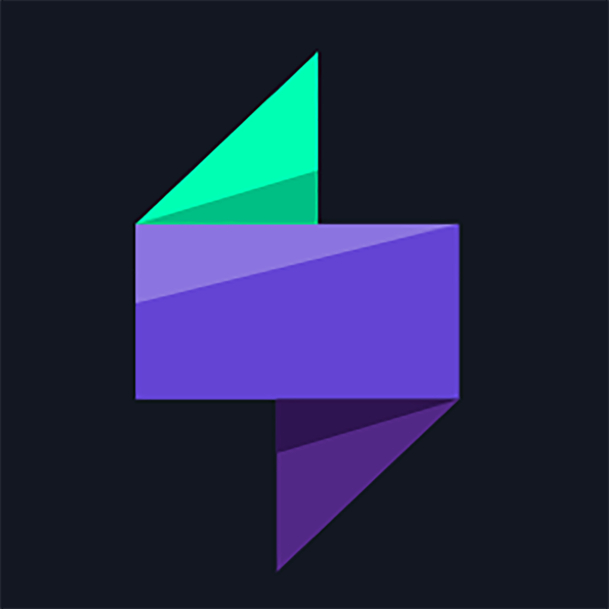

# TraderSync

> Le doyen du lot — fondé en 2014, apps natives iOS et Android depuis 2017 — et son contre-exemple. Trois systèmes chromatiques qui s'ignorent, des visuels de store inchangés depuis cinq ans, une IA qui a changé de nom sans que personne prévienne les stores. À garder pour ça : c'est le dossier qui montre ce que devient une DA qu'on n'entretient pas.

**Sources :** App Store et Google Play · vidéo officielle (frames de flow) · captures produit de StockBrokers.com · site officiel via Wayback Machine (Cloudflare bloque l'accès direct) · Wayback Machine (l'App Store de 2019)

> **Lecture** : chaque famille d'écrans est montrée par **une planche** (`<aspect>/planches/`), légendée juste dessous. Les fichiers individuels restent dans leur dossier d'aspect.

## En bref

- **Trois palettes pour un seul produit** : le site marketing en indigo/magenta, la web app en teal/rose sur gris-bleu, l'app mobile en mint fluo/rose sur bleu-nuit. Aucune ne parle à l'autre.
- **Le rouge de perte n'est pas rouge, il est rose** (`#FF4A93` sur mobile, `#F96D8F` sur web). Parti pris fort, et le seul vraiment mémorable du produit.
- **Les cinq visuels de store sont octet pour octet les mêmes qu'en novembre 2021.** Ils montrent une IA appelée `Zukzu AI` — le produit actuel l'appelle `Cypher`.
- **L'app mobile est un compagnon de consultation**, et l'éditeur l'écrit : « to enter new executions it is best recommended to use the website », « only stock trades can be entered through the app ».
- **Le modèle de données est la vraie signature** : un trade se qualifie par des `Setups` (chips mint) et des `Mistakes` (chips violets), plus photos et notes. Tous les rapports en découlent.
- Notes des stores : **2,71/5** sur l'App Store (84 avis), 3,1/5 sur Play (227 avis). Les plus basses du lot.
- **Une seule police sur le site : Manrope.** En 2017, c'était Roboto + Material Icons — le passage d'une DA Material à une DA propre est daté.
- Tarifs les plus élevés du lot : 29,95 $ / 49,95 $ / 79,95 $ par mois.
- **828 pages archivées**, dont plusieurs centaines de `/broker/<nom>/` : le SEO longue traîne est un pilier de l'acquisition.

## Écrans

![[ecrans/planches/planche-app-mobile.png]]

**Comparer les trois premières images à la quatrième est tout l'intérêt du dossier.** Les visuels de store sont propres — wordmark `TRADERSYNC` lettre-espacé, KPI en grand, sélecteur de période en pilules mint, jauges circulaires, histogramme quotidien. La capture réelle, extraite de la vidéo officielle, montre la même chose en moins tenu : pagination par points, densité inégale, hiérarchie plus molle. L'écart entre la promesse de store et le produit est ici mesurable.

- `ecrans/app-dashboard.png` — `Account Overview` en visuel de store : aire de performance violette, quatre jauges (Win Rate, Mistakes Ratio), Daily P/L mint/rose.
- `ecrans/app-dashboard-reel.png` — le même écran, capture réelle.
- `ecrans/app-detail-trade.png` — le détail d'un trade : bandeau à cinq colonnes (Side / Entry / Exit / Size / Return), tableau `History` BUY/SELL, chandelier avec marqueurs, chip `EARNINGS`.
- `ecrans/app-zukzu-ai.png` — l'écran `Zukzu AI` : un insight en langage naturel puis quatre métriques séparées par des filets. **Nom abandonné depuis** — la preuve que les stores ne sont plus tenus.

![[ecrans/planches/planche-web-app.png]]

**La web app est nettement au-dessus de l'app mobile, et c'est là que le produit vit.** L'état vide de `Cypher AI` est correct — logo en dégradé mint→violet centré, `How can I help you today?`, quatre cartes de prompts suggérés, champ en pilule avec bouton micro. Le rapport `Mistakes` est le meilleur écran du produit : des barres roses nommées comme le trader les vit (`Didnt Cut Losses Quick`, `FOMO`, `Revenge Trading`) et un panneau `Insights` dont le titre est généré en jaune par l'IA.

- `ecrans/web-cypher-ai.webp` — l'état vide de l'assistant.
- `ecrans/web-rapport-mistakes.webp` — le rapport des erreurs et son panneau d'insights.
- `ecrans/web-market-replay.webp` — le simulateur : layout trois zones façon terminal (Account / Watchlist / Screener / Time of Sales, chandelier TradingView, échelle de prix), précision annoncée à 250 ms.

## Flows

![[flows/planches/planche-ajout-de-trade.png]]

**Le flow d'ajout est un formulaire en quatre temps, avec un pavé numérique maison.** Formulaire vierge (Portfolio, Symbol, Action, Date, Time, Price, Size, Commission en lignes label-gauche / champ-droite) → saisie avec un clavier numérique sombre custom qui remonte du bas → retour à la liste où le trade apparaît en badge `OPEN` jaune → puis l'écran qui compte : **l'enrichissement**.

`flows/flow-execution-04-setups-mistakes-photos.png` est le cœur du produit : quatre blocs — `Photos`, `Setups`, `Mistakes`, `Notes` — chacun avec un bouton rond mint `+`. C'est là que le trade devient une donnée analysable, et toute l'architecture des rapports (Setup Report, Mistake Report, Hourly, Volume, Price, Weekly, Monthly) en dépend.

## Composants

![[composants/planches/planche-composants.png]]

**Le codage couleur des chips est la meilleure idée du produit** : `setup` en mint, `mistake` en violet côté app (rose côté web). Deux familles de tags qui ne se confondent jamais, sur un objet — le trade — qui en porte souvent les deux. À rapprocher du même geste chez [[ultratrader]] (tags bleus / mistakes rouges).

- `composants/chips-setup-et-mistake_tradersync.png` — les deux familles côte à côte sur un trade.
- `composants/liste-trades_tradersync.png` — cellules à bord gauche violet, badge P/L coloré (mint, rose, ou jaune `OPEN`).
- `composants/rapport-setups_tradersync.png` — barres horizontales par setup, mint au positif, rose au négatif.
- `composants/barres-de-setups_tradersync.png` — la version réelle, avec ses onglets scrollables.
- `composants/cartes-metriques_tradersync.png` — grille à deux colonnes de cartes de métriques, chacune avec delta coloré et micro-sparkline.
- `composants/tableau-trades-web_tradersync.webp` — côté web : badges pilule `WIN` teal / `LOSS` rose, chips LONG/SHORT et chips de setup.
- `composants/histogramme-horaire_tradersync.webp` — P&L sur 24 heures, avec cases à cocher de séries.
- `composants/note-journaliere_tradersync.webp` — courbe intraday à gauche, éditeur de texte riche à droite.

## Couleurs

![[couleurs/palette-app-mobile.svg]]

**Le mint fluo `#00FFB3` et le rose `#FF4A93` sont le seul geste chromatique mémorable du produit.** Refuser le rouge pour la perte est un vrai choix : le rose alerte sans dramatiser, ce qui, dans un journal qu'on ouvre après avoir perdu de l'argent, se défend. Le problème n'est pas ce couple — c'est qu'il n'existe que sur mobile.

| Nom de rôle | Hex | Usage |
| --- | --- | --- |
| carte | `#1D2331` | |
| fond | `#121721` | |
| fond bas | `#111620` | |
| le plus sombre | `#080C13` | aussi le départ du dégradé promo |
| bord et élevé | `#2D3342` | |
| gain | `#00FFB3` | mint saturé, presque fluo |
| perte | `#FF4A93` | **rose, pas rouge** |
| en cours | `#FCF26A` | jaune pâle |
| aire de graphe | `#2D285B` → `#302860` | indigo |

![[couleurs/palette-web-app.svg]]

**Sur le web, le même produit parle teal et rose sur gris-bleu.** Le mint fluo devient un teal sourd (`#039790`), le rose s'assagit (`#F96D8F`), et un violet (`#6345D3`) apparaît pour l'assistant. Rien de laid pris isolément — mais un utilisateur qui passe du téléphone au navigateur change de produit à l'œil.

| Nom de rôle | Hex | Usage |
| --- | --- | --- |
| fond principal | `#181E27` | |
| fond alterné | `#0F1719` | |
| gain | `#039790` | teal, là où le mobile met du mint fluo |
| perte | `#F96D8F` | rose |
| violet de Cypher AI | `#6345D3` | l'assistant |

![[couleurs/palette-site-marketing.svg]]

**Et le site, lui, est indigo et magenta.** Troisième système, aucun rapport avec les deux autres. `#6563F0` et `#E73D8A` sont les variables globales Elementor : ce sont les couleurs d'un thème WordPress, pas celles d'un produit.

| Nom de token | Hex | Usage |
| --- | --- | --- |
| indigo primaire | `#6563F0` | |
| indigo clair | `#8483F2` | |
| magenta secondaire | `#E73D8A` | servi aussi à 12 % (`#E73D8A1F`) |
| navy profond | `#191939` | fond des sections sombres |

Neutres : `#FFFFFF` · `#ECECEC` · `#CACACA` · `#8D8D8D` · `#4B4B4B` · `#1F1F1F`.

## Branding

**Un chevron en dégradé mint → violet, et c'est le seul fil qui relie les trois systèmes.** Le monogramme sert d'icône d'app, de favicon, et d'avatar à Cypher AI dans la web app — c'est, ironiquement, l'élément le plus cohérent du produit. Le wordmark l'accompagne en capitales lettre-espacées.

- `branding/monogramme.svg` — le vectoriel, la meilleure source pour relever les stops exacts du dégradé.
- `branding/logo-wordmark.webp` — le lockup horizontal officiel (998 × 181).
- `branding/icone-ios-1024.png` et `icone-android-512.png` — les deux icônes de store, pour comparer les traitements.

Aucun press kit sur les 828 pages archivées : les logos viennent des uploads WordPress.

## Archive

![[archive/planches/planche-2019-biometrie.png]]

**En 2019, TraderSync mesurait le pouls et la colère.** Les captures d'App Store de l'époque montrent un tout autre produit : thème **clair**, fond promo bleu ardoise, mockup iPhone 6 blanc, et deux promesses aujourd'hui disparues — `Track Your Biometric Signals While Trading` avec un anneau à `86 BPM` corail, et `Track Your Emotions While Trading` avec un plein écran corail affichant `74% ANGRY`.

C'est une direction produit entière qui a été abandonnée. Et c'est précieux : la « psychologie du trading » que tout le secteur remet au goût du jour en 2026 (le tilt-meter d'Edgewonk, la Leak Map de [[traders-second-brain]], les `demons` de [[tradetrack]]) avait déjà été tentée ici, en biométrie, sept ans plus tôt.

## Marketing

![[marketing/planches/planche-site.png]]

Les visuels du site officiel, récupérés via Wayback (le domaine est derrière un challenge Cloudflare) :

- `marketing/web-ai-assistant-chat-r-multiple.png` — le visuel de l'AI Assistant : bulle utilisateur violette, réponse en carte sombre contenant un graphe `R-Multiple vs Profit Factor`, fond dégradé violet → noir.
- `marketing/web-calendrier-pnl-et-performance.webp` — le calendrier mensuel en heatmap teal/rose avec cartes flottantes.
- `marketing/web-market-replay-place-order.webp` — la carte `Place Order` flottante sur un grand chandelier.
- `marketing/web-multi-charts-tablette.png` — mockup tablette, grille de quatre chandeliers TradingView.

Architecture produit : **Analytics**, **Market Replay Simulator**, **AI Performance Assistant (Cypher)**, déclinés par actif (Stock / Futures / Options / Forex / Crypto), chacun avec sa page journal et sa page backtester.

Tarifs (juillet 2026) : Pro 29,95 $/mois · Premium 49,95 $/mois · Elite 79,95 $/mois (tape + Level II + coaching IA), −25 % en annuel, essai 7 jours.

## Typographie

**Manrope**, seule famille du site 2026 : 600 pour les titres, 500 pour l'accent, 400 pour le texte et le secondaire, déclarée dans les variables globales Elementor. En 2017, le site tournait sous **Roboto** (300/400/500/700) + **Material Icons** : le produit a quitté le look Material par défaut, ce qui est déjà un progrès, mais s'est arrêté là.

Pas de fiche Manrope dans le vault — candidate à `/font`.

## Pourquoi je le garde

Pas pour le copier. Pour deux choses.

D'abord parce que **le modèle de données est juste** : qualifier chaque trade par un setup et une erreur, puis faire de ce couple l'ossature de tous les rapports, c'est la bonne idée du produit, et elle a douze ans. Tous les concurrents récents la reprennent sans le dire.

Ensuite parce que c'est **la démonstration de ce que coûte l'absence de système**. Trois palettes, deux noms d'IA en circulation, des visuels de store figés depuis cinq ans, et une note de 2,71/5 — pas parce que le produit est mauvais, mais parce que plus personne ne tient l'ensemble. À montrer à côté de [[ultratrader]], qui fait exactement l'inverse avec moins de fonctionnalités.

## À réutiliser pour

- **Le couple setup / mistake** comme modèle de qualification d'un événement, et son codage couleur en deux familles de chips.
- **Le rose plutôt que le rouge** pour une perte : alerter sans dramatiser.
- **Nommer les erreurs dans la langue de l'utilisateur** (`Didnt Cut Losses Quick`, `FOMO`, `Revenge Trading`) plutôt qu'en jargon d'analyse.
- **Un état vide d'assistant IA** : logo centré, question ouverte, quatre prompts suggérés, champ en pilule.
- **Un pavé numérique maison** dans un formulaire de saisie chiffrée.
- **En contre-exemple** : ce qu'il ne faut pas faire — laisser diverger le site, la web app et le mobile.

## Limites de la récolte

- **`tradersync.com` est derrière un challenge JS Cloudflare** : curl, WebFetch et Chrome headless reçoivent tous la page de vérification (403 sur le HTML comme sur `/wp-content/`). Tout le matériel du site est passé par la Wayback Machine — **aucune capture pleine hauteur de la landing actuelle n'existe dans ce dossier**.
- **Wayback injoignable depuis Chrome** dans cet environnement (`ERR_CONNECTION_REFUSED`) : la landing archivée n'a pas pu être rendue en image non plus.
- **Aucune base d'UI mobile ne référence l'app** — vérifié un par un : Mobbin (0), Page Flows (0), Screensdesign (0), SaaS Landing Page (0), Refero (0) ; UXArchive et Land-book en 403, SiteInspire en 429. C'était la source présumée la plus riche pour une app native : elle est vide. **Les flows ont donc été reconstitués en extrayant des frames de la vidéo officielle**, plafonnée à 606 × 1280.
- **Six captures de la web app portent le filigrane `StockBrokers.com`** et sont plafonnées à 1 000 px par leur CDN. Faute de mieux : ce sont les seules vues récentes de l'interface web.
- **Aucun paywall à récolter** : l'app est gratuite, l'abonnement se souscrit sur le web.
- **Aucun designer nommé** nulle part. `process/` **est vide**.

## Sources

- **App Store** — <https://apps.apple.com/us/app/tradersync/id1177329277> : icône 1024, métadonnées (bundle `com.shockdav.tradersync`, version 2.10.15, note 2,71/5 sur 84 avis).
- **Google Play** — package `com.tradersync` : les cinq visuels promo en 1920 × 3840 (bien meilleure définition que la fiche iOS pour les mêmes rendus), 50 K+ téléchargements.
- **Vidéo officielle** — « Mobile App Trading Journal Overview » (30/04/2020), <https://www.youtube.com/watch?v=iZgILpo7150> : toutes les frames de flow et les captures réelles de l'app.
- **StockBrokers.com** — <https://www.stockbrokers.com/review/tools/tradersync> : les six vues récentes de la web app (filigranées).
- **Site officiel via Wayback** — snapshot du 2026-07-16 : les visuels marketing, les logos, les variables Elementor, le pricing.
- **Wayback Machine** — snapshot App Store du 2019-10-15 : l'ère biométrie et émotions.
- **Interview du fondateur** — tradingreviewers.com.

## Crédits

- **David Olivares** — co-fondateur, développeur web de métier. TraderSync fondé en **2014** avec son frère et une partie de son équipe de développement web.
- Éditeurs déclarés : **1473010 ALBERTA LTD** / `artistName` **Shockdav** (iOS) · **Creative Phenomenon** (Android). Contact `info@tradersync.com`.
- **Aucun designer nommé** — ni sur le site, ni sur les stores, ni sur Dribbble ou Behance (le produit n'y a aucune présence).
- Typographie : **Manrope**. Charts : **TradingView**.
- Pile : **WordPress + Elementor Pro** (thème maison `tradersync_v26`), hébergé chez **Kinsta**.
- Réseaux : X, Instagram, YouTube (chaîne officielle avec tutoriels produit).

## Mots-clés

journal de trading, trading journal, portfolio tracker, app native iOS Android, web app, setups et mistakes, chips de qualification, FOMO, revenge trading, didnt cut losses quick, rapport d'erreurs, mistake report, setup report, hourly report, market replay, simulateur 250 ms, Cypher AI, Zukzu AI, assistant IA, état vide, empty state, R-multiple, profit factor, MFE MAE, calendrier P&L, heatmap, mint fluo, rose au lieu du rouge, indigo magenta, teal, trois palettes, incohérence chromatique, dette de design, visuels de store obsolètes, Manrope, Roboto Material, WordPress Elementor, Kinsta, Cloudflare, SEO longue traîne, pages broker, biométrie, BPM, émotions, 74% angry, 2014, Alberta, contre-exemple

## À voir aussi

- [[ultratrader]] — le même terrain (apps natives + web) traité avec une cohérence exemplaire.
- [[traders-second-brain]] — la psychologie du trading reprise en 2026, en Leak Map.
- [[tradetrack]] — les `demons`, même idée que les `mistakes`, dans un système tenu.
- [[_APPS]] · [[_COMPOSANTS]]
