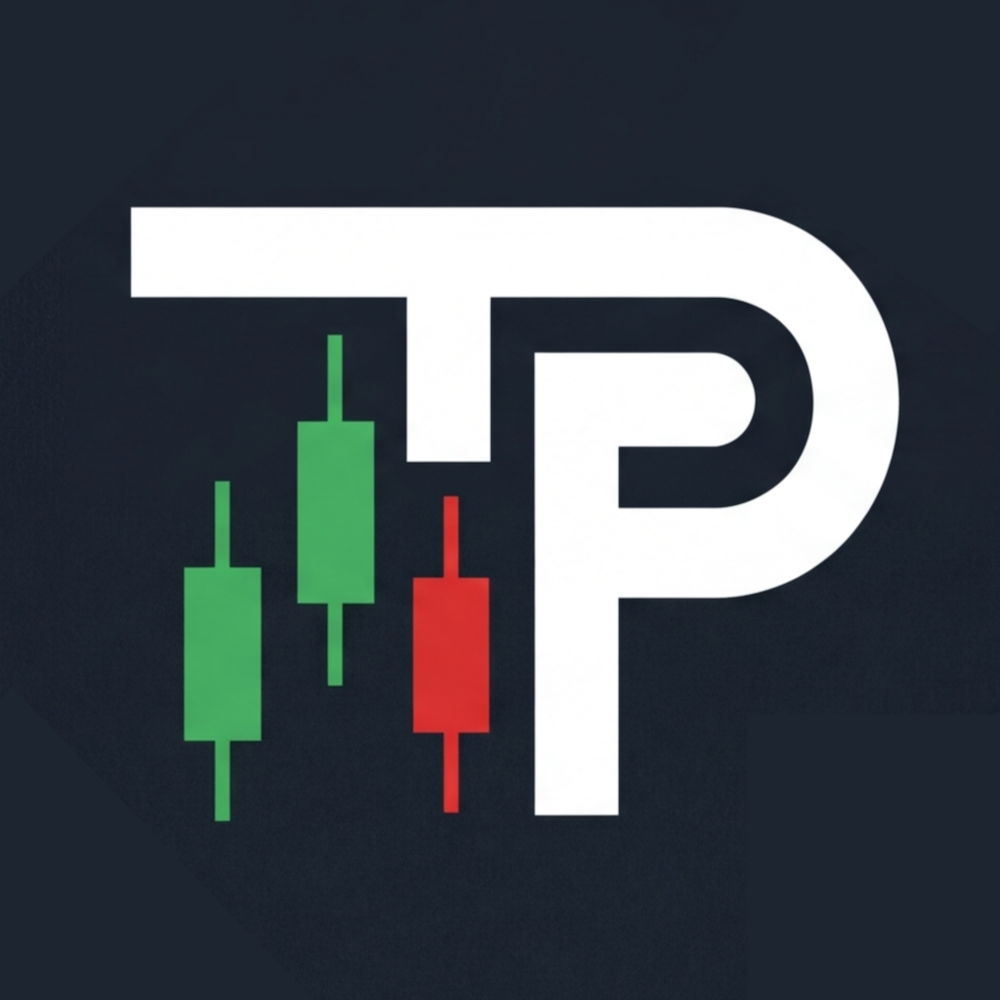

# TradingPlan

> Le playbook à l'état pur : pas un seul trade journalisé dans toute l'app, l'objet unique est la **règle**. On la construit dans un éditeur à six onglets, puis on la rejoue avant chaque session sous forme de checklist vivante — « 6 of 17 rules checked ». Écrit par un développeur solo qui a livré son app et cent trente pages de contenu le même mois.

**Sources :** site officiel et son CSS (2 386 lignes, lues intégralement) · press kit avec charte publiée · Help Centre de 43 articles · App Store (20 créas sur trois surfaces) · Wayback Machine

> **Lecture** : chaque famille d'écrans est montrée par **une planche** (`<aspect>/planches/`), légendée juste dessous. Les fichiers individuels restent dans leur dossier d'aspect.

## En bref

- **Il n'y a pas de journal de trades.** C'est ce qui sépare ce dossier des sept autres produits de trading du vault : aucun P&L, aucun graphique, aucun prix de marché nulle part. L'app ne mesure qu'une chose, la conformité du trader à ses propres règles.
- **Le press kit publie sa charte — et le site ne la respecte pas.** Un second bloc `:root` en fin de feuille, commenté « V3 VISUAL ENHANCEMENTS — MAKE IT POP », écrase trois tokens de surface. Retournement : **c'est l'app, elle, qui rend les valeurs publiées** (`#111418` occupe 26,6 % de la surface relevée).
- **Le vert et le rouge des règles sont ceux d'Apple**, pas ceux de la marque : `#30d158` est systemGreen, le rouge d'échec est le systemRed du mode sombre. Le produit n'a pas jugé utile de définir ses propres couleurs d'état.
- **Un seul accent, et il fait 98 % de la couleur** : le bleu clair `#a6ceff`, décliné en une quinzaine de rgba. La seule autre couleur systématique est l'ambre `#fbbf24`, **entièrement réservée au PRO** — couronne, cadenas, badge de palier, étoiles d'avis.
- **Zéro `@keyframes`.** Vérifié sur toute la feuille, sur le style inline du press kit et sur les 43 articles du Help Centre. Tout le mouvement passe par des transitions de 0,15 à 0,35 s, toutes en `ease` par défaut, sans une seule courbe personnalisée.
- **Le press kit déclare cinq polices, le site en charge une.** Inter est la seule servie ; Bebas Neue, DM Mono, Cormorant Garamond et Instrument Serif sont annoncées sans être vérifiables — et n'apparaissent sur aucune capture.
- **Le paywall montre au lieu de cacher.** Les neuf modules de risque avancés sont affichés en clair, grisés, avec leur nom et leur promesse, dans le flux de la page. Aucun interstitiel.
- **Une DA, quatre surfaces déclarées, trois réellement dessinées.** iPhone en pile de cartes, iPad en split view, Mac en fenêtre à sidebar — les captures Mac ne sont pas des redimensionnements d'iPad. visionOS est compatible mais n'a aucune créa : l'app y tourne en portage iPad.

## Écrans

![[ecrans/planches/planche-iphone.png]]

**Sur iPhone, tout est une pile de cartes à bordure fine et rayon généreux, et les états vides sont prescriptifs.** Le Dashboard n'annonce pas « rien ici » mais « Tap + to run through a routine's steps for your current session » et « Set your market beliefs and trading style in the Plan Builder tab ». Chaque champ de réglage porte sa phrase d'explication en dessous — « Hard stop — cease trading until reviewed » — : l'app enseigne pendant qu'on la paramètre.

Le **Strategy Builder** est l'écran fondateur. Sa barre d'onglets est **scrollable horizontalement, avec une flèche de débordement assumée** plutôt que masquée : sept onglets ne tiennent pas sur 390 pt, et le produit le dit. Chaque section porte son propre timeframe (« Timeframe: 4H » sur Analysis, « Daily » sur Directional Bias), et l'édition d'une règle ouvre une feuille qui combine **trois modes de saisie dans le même panneau** — cartes de condition structurées étiquetées `WHEN` / `THEN`, bibliothèque filtrable par chips, et un champ totalement libre « Search or type custom condition… ». La documentation assume que la plupart des traders utilisent le texte libre.

![[ecrans/planches/planche-ipad-et-mac.png]]

**La Watchlist est le pari de densité du produit, et elle rompt avec tout le reste.** La même marque qui aère ses cartes sur iPhone assume un tableur complet sur iPad et Mac : 27 lignes de marché, et surtout un **double niveau d'en-têtes** où un bandeau supérieur groupe les colonnes par stratégie (« HMA Trend » coiffe STATUS / DIR / RULES). On compare N marchés × M stratégies sans quitter la vue, et les cellules de statut sont des menus déroulants en ligne. Chaque libellé de marché porte un fond dégradé et une barre d'accent verticale codant son groupe.

Le **Plan Builder** sur Mac est la carte-mère : six grandes cartes en grille 2 × 3 (Philosophy, Mindset, Strategy, Risk Management, Routine, Business Notes), chacune avec un des **trois états explicites** — cercle vide, demi-cercle, coche verte — sous un bandeau « 4 of 6 sections complete — 66% ». Mettre Philosophy, Mindset et Business Notes au même rang que Strategy et Risk dit la thèse du produit en un seul écran.

## Flows

![[flows/planches/planche-strategy-et-routine-flow.png]]

**Tout le produit tient dans « 6 of 17 rules checked ».** Un en-tête minimal — nom de la stratégie, point médian, instrument, et « Done » (pas de retour : on est dans un rituel qu'on termine) — puis une seule métrique alignée à droite au-dessus d'une barre fine. Le corps est une pile de cartes-sections avec **deux niveaux de progression**, global et par section (Directional Bias 4/4, Analysis 2/4, Stop Loss 0/2).

Chaque règle est une ligne de ~86 px avec **trois états visuellement non ambigus** et un triple contraste — couleur de pastille, couleur de libellé, opacité : coche blanche sur disque vert, croix blanche sur disque rouge, cercle vide à contour gris avec libellé atone. L'avancement se lit en périphérie, sans lire.

Et le point le plus intéressant : **le système n'empêche rien.** On peut cocher une croix rouge et continuer. Le « 6 of 17 » n'est pas un score, c'est un frein. C'est l'exact opposé du parti pris d'[[edgeflo]], où le bouton d'achat devient inclickable.

Le **Routine Flow** adopte la même grammaire en timeline verticale, et met « Fill water bottle » au même niveau visuel que « Mark key support, resistance and liquidity zones ». Tout est une étape, rien n'a de statut supérieur. C'est aussi là que se trouve le **seul vrai défaut d'UI du lot** : les badges de type sont tronqués par ellipse en « ST… » et « TH… », leur largeur ne s'adaptant pas au texte.

Le document exporté, enfin, rend le plan complet comme un **imprimé** : listes numérotées, en-têtes de section à filet vertical, typographie très petite et régulière. Ce n'est plus un écran d'app, c'est une pièce à conserver — l'export PDF est une fonction PRO.

## Composants

![[composants/planches/planche-composants.png]]

**La modale « Edit Rule » du Mac est le composant à retenir** : une rangée de chips séquentiels étiquetés `START` / `THEN` / `THEN` / `THEN` résume la chaîne de règles en haut, celle qu'on édite étant bordée de vert. Dessous, un champ de recherche qui accepte aussi bien la sélection que la saisie libre, une rangée de chips de catégories (Previous Rules, Confirmation Rules, Price Action, Market Structure, Indicators, Fibonacci), et la liste des conditions proposées. Quatre boutons en pied : Cancel / Back / Add Rule / Save.

Le **Schedule** d'une routine réduit la programmation à sept cercles de jours et une heure, avec deux bascules dont l'une, « Expires at Midnight », explique sa propre conséquence : « incomplete sessions are automatically logged to Flow History at midnight ».

Le **choix de type de routine** est une liste de radios à icône et description longue — Weekend Review, Pre-Market, Live Session, Post-Market, Quarterly / Annual Review — chacune décrivant son moment plutôt que sa fonction.

## Couleurs

![[couleurs/palette-declaree.svg]]

**Un press kit qui publie ses hex est assez rare pour être noté**, et il tient en cinq valeurs. La plus significative n'est pas l'accent mais le fond : `#0a0c0f` sert **aussi de couleur de texte** sur les boutons primaires, ce qui interdit tout bouton bleu sur fond bleu et force la hiérarchie à passer par le contraste.

| Nom publié | Hex | Usage |
| --- | --- | --- |
| Background | `#0a0c0f` | fond global, et **encre** des boutons primaires |
| Surface | `#111418` | fond des cartes |
| Primary blue | `#a6ceff` | l'unique accent : boutons, le `.io` du wordmark, liens, barres de progression |
| Dark blue | `#7ab0f5` | survol du bouton primaire — plus saturé, pas plus sombre, malgré son nom |
| Text | `#f1f5f9` | texte principal (Slate-100 de Tailwind) |

![[couleurs/palette-le-site-contredit-son-press-kit.svg]]

**Le site ne rend pas ce qu'il publie, et l'app si.** Un second `:root` en fin de feuille, sous le commentaire « V3 VISUAL ENHANCEMENTS — MAKE IT POP », redéfinit trois tokens ; la dernière déclaration gagne, donc le site affiche `#13171d` là où le press kit annonce `#111418`. Or le relevé de pixels sur les captures d'app retombe exactement sur la valeur **publiée**. La charte est juste, c'est la vitrine qui a dérivé — l'inverse du cas habituel.

| Rôle | Déclaré (et rendu par l'app) | Rendu par le site |
| --- | --- | --- |
| Surface | `#111418` | `#13171d` |
| Surface 2 | `#1a1f26` | `#1c2230` |
| Border | `#232930` | `#2d3744` |

![[couleurs/palette-relevee-dans-les-ecrans.svg]]

**La couleur la plus présente n'est pas le fond, c'est la carte.** `#111418` occupe 26,6 % de la surface contre 21,4 % au fond : l'interface est faite de blocs posés, pas d'un aplat sur lequel on écrit. Et les 81,8 % de surfaces sombres ne laissent que **2,58 % de couleur, dont 98 % de bleu**.

| Famille | Part | Rôle |
| --- | --- | --- |
| surfaces sombres (composante max < 48) | 81,75 % | fond, cartes, surfaces imbriquées |
| bleu | 2,52 % | accent unique : actions, états actifs, progression |
| vert `#30d158` | 0,37 % (relevé sur `flows/`) | règle validée — **systemGreen d'Apple** |
| blancs | 0,80 % | texte principal |
| gris neutres | 0,61 % | bordures |
| rouge `#ff4245` | 0,01 % | règle échouée — quasi absent des captures officielles |

> Deux relevés distincts : `ecrans/` pour les surfaces, `flows/` pour les états de règle (le vert et le rouge n'existent que là). Que le rouge tombe à 0,01 % dit surtout que les captures officielles montrent des plans presque toujours respectés.

![[couleurs/palette-la-couleur-de-la-monetisation.svg]]

**L'ambre n'est pas tokenisée et pourtant c'est la seconde couleur du système** : cinq occurrences dans la feuille, et jamais pour autre chose que l'abonnement ou la preuve sociale. Une couleur entièrement dédiée à la monétisation, toujours doublée d'un fond en `rgba` de 4 à 35 %.

## Branding

![[branding/planches/planche-identite.png]]

**Le geste typographique de la marque tient dans un point.** Le `.io` du wordmark est coloré en `#a6ceff` — dans la nav du site, dans l'OG image, et sur l'écran de connexion de l'app. C'est tout, et c'est suffisant pour rendre le lockup reconnaissable.

Le monogramme est un disque bleu-gris sombre portant « TP » en blanc superposé à un petit groupe de chandelles vertes et rouges. **Il n'existe qu'en PNG 160 px** : le press kit le dit lui-même, « Higher-resolution masters available on request ». Le seul SVG servi par tout le domaine est `waves.svg`, un motif d'ambiance de courbes de Bézier tracées à 8-11 % d'opacité, utilisé en fond de hero à `opacity: .08`. Quasi subliminal, et c'est le seul ornement graphique non photographique de la marque.

**L'écran de connexion est le seul moment photographique.** Une photo de bureau de trading (MacBook, horloges multi-fuseaux, bougie) noyée sous un voile noir à ~85 % : elle donne une température, pas une image. La même photo sert de fond au hero du site, référencée uniquement depuis le CSS. Un seul moyen d'authentification, « Sign in with Apple », en variante noire sur iPad et blanche sur iPhone — les deux déclinaisons du bouton Apple sont documentées.

## Marketing

![[marketing/planches/planche-marketing.png]]

**L'OG image met la hiérarchie de la marque à nu** : « Your trading plan. » et « Your rules. » en bleu, « Actually followed. » en **blanc** — la ligne qui compte est la seule qui ne soit pas colorée. Bleu = le système, blanc = la promesse.

Les créas des trois stores partagent une grammaire rigoureusement constante : fond navy très sombre à texture de grille, motif d'angle en L, titre blanc en gras serré sur deux lignes, sous-titre bleu pâle, puis un mockup d'appareil réel aligné en bas et coupé par le bord. **Aucune 3D, aucune illustration, aucun personnage — uniquement de l'UI réelle.** Et toutes les captures montrent les **mêmes données cohérentes** d'une surface à l'autre (Trend Pullback, HMA Trend, NAS100, la session du 28 mai) : ce n'est pas du lorem, c'est le plan de trading de l'auteur.

Le site lui-même est une machine de contenu : plus de 130 pages en silos SEO — `/guides/` nommés par symptôme du trader (revenge-trading, cutting-winners-early, rule-drift, know-what-to-do-but-dont-do-it), `/compare/` face à onze concurrents, `/prop-firms/` par firme. Et son `robots.txt` **whiteliste nommément ClaudeBot, GPTBot et PerplexityBot** avec le commentaire « AI search and web crawlers are explicitly welcomed » — le sitemap étiquette même une section « AI Citation Pages ».

## Archive

![[archive/2025-domaine-site-de-formation.png|700]]

**Le domaine a eu trois occupants sans aucun lien entre eux, et l'app est le troisième.** 2020-2022 : une web-app malaisienne « Plan Your Trade, Trade Your Plan » bâtie sur le template admin Bootstrap Limitless. 2024-2025 : le site ci-dessus, un vendeur de formations en euros à quatre paliers (149 € à 2 249 €), fond blanc, bleu marine et orange, avec des fautes visibles dans les intitulés. 2026 : l'app de Stuart Jones.

**Conséquence pour la lecture du dossier : il n'existe aucun avant/après de la DA actuelle.** La Wayback Machine n'a crawlé le site de l'app qu'une seule fois, le 14 juin 2026 — et sa page d'accueil n'a jamais été capturée, seulement ses pages internes. Ce que cette campagne révèle en revanche, c'est qu'un mois après le lancement, les 130 pages de contenu étaient déjà en place.

## Pourquoi je l'aime

- **Un produit qui retire le graphique d'une app de trading** et n'en garde que la règle. La contrainte est si nette qu'elle dessine l'interface toute seule.
- **La checklist qui laisse échouer.** Une croix rouge cochable, sans blocage, sans culpabilisation : c'est un choix de ton qui vaut une charte entière.
- **Une bande d'onglets scrollable avec sa flèche de débordement visible.** Le produit préfère montrer qu'il déborde plutôt que de bricoler un menu « plus ». Honnêteté d'interface.
- **La cohérence des données de démonstration** sur vingt captures et trois surfaces. Rare, et ça se sent immédiatement — l'app a l'air d'avoir des utilisateurs.

## À réutiliser pour

- Un **onboarding de contenu riche** : la grille de six cartes à trois états de complétion plus un pourcentage global est directement transposable.
- Un **éditeur de règles semi-structuré** : le panneau qui accepte à la fois une condition cliquable, une bibliothèque filtrable et du texte libre, sans imposer de langage.
- Un **groupement de colonnes par entité** dans un tableau dense (une stratégie = 2 à 3 colonnes sous un bandeau commun).
- Projet : [[ ]]

## Limites de la récolte

- **Le Help Centre ne contient aucune capture d'écran.** Les 43 articles ont été téléchargés et inspectés : la seule image de tout le centre d'aide est le logo de la nav. Les articles décrivent l'interface entièrement en prose. Le vocabulaire produit en a été extrait, pas les images.
- **Aucun logo vectoriel.** Le seul SVG du domaine est un motif d'ambiance. Le monogramme plafonne à 160 px, et le press kit renvoie à un e-mail pour les masters.
- **Les quatre polices secondaires du press kit ne sont pas vérifiables** : ni chargées par le site, ni visibles sur une capture. Rapportées comme déclarées, pas comme constatées.
- **`/img/` renvoie 403** (pas de listing) : l'inventaire des visuels a été reconstitué en suivant les ``, les `url()` du CSS et les JSON-LD. Des fichiers orphelins peuvent subsister.
- **Aucune capture visionOS** — vérifié par inspection des étagères média de la fiche store : seules `phone`, `pad` et `mac` existent. Ce n'est pas un manque de récolte, c'est une absence côté éditeur.
- **L'identité de l'auteur ne repose que sur ses propres pages.** Aucune source tierce ne corrobore « Stuart Jones » : ni presse, ni Product Hunt, ni réseau social. Aucun nom n'a été déduit.
- **Note de store non significative** : 5,0/5 sur **un seul avis** au store US, zéro au store FR.

## Sources

- **Site officiel et son CSS** — `main.css` lu intégralement (2 386 lignes, 50 Ko) : les tokens, le bloc V3 qui les écrase, l'absence totale de `@keyframes`, les dix transitions, le halo de téléphone à cinq couches. → [tradingplan.io](https://tradingplan.io)
- **Press kit** — la charte publiée, les cinq polices déclarées, les 12 captures produit dont 5 absentes de la home, et une lettre de fondateur de ~900 mots. → [tradingplan.io/press](https://tradingplan.io/press/)
- **Help Centre** — 43 articles, aucune image mais tout le vocabulaire produit exact et le détail des neuf modules de risque. → [tradingplan.io/help](https://tradingplan.io/help/)
- **App Store** — 20 créas natives sur trois étagères distinctes (iPhone, iPad, Mac), les métadonnées, et l'historique des versions qui date l'arrivée de la Watchlist. → [apps.apple.com/…/id6761687862](https://apps.apple.com/us/app/tradingplan-strategy-builder/id6761687862)
- **Wayback Machine** — 251 captures du domaine, qui établissent les trois occupants successifs et l'absence d'antécédent de la DA actuelle. → [web.archive.org/…/tradingplan.io](https://web.archive.org/web/*/tradingplan.io*)
- **Captures maison** (`capture-site.py`, desktop + mobile + sombre) — le site en pleine hauteur, aucune variante claire détectée.

## Crédits

- **Stuart Jones** — auteur unique : développeur, concepteur et rédacteur. Il se décrit lui-même « Trader. Product manager. iOS & macOS developer. Founder of TradingPlan. » Aucun designer, aucun studio, aucun collaborateur crédité, et **aucune présence sur le moindre réseau social** — le seul canal public est `hello@tradingplan.io`. C'est un anonymat délibéré, rare pour un indie iOS en 2026. → [tradingplan.io/about](https://tradingplan.io/about/)
- **Inter** — [Rasmus Andersson](https://rsms.me/inter/), SIL OFL 1.1. Servie depuis Google Fonts en fonte **variable** : les cinq graisses demandées (400 à 800) pointent vers un seul et même fichier `.woff2`, md5 identique.
- **SF Pro** — Apple, police système de toute l'interface de l'app.

## Mots-clés

playbook de trading, trading playbook, strategy builder, constructeur de stratégie, règles de trading, trading rules, règle SI-ALORS, if-then, condition, checklist, checklist d'exécution, pre-flight, checklist pré-vol, plan de trading, trading plan, discipline, conformité, compliance, adhérence au plan, routine, pre-market, post-market, watchlist, revue de marché, tableau dense, tableur, colonnes groupées, double en-tête, split view, sidebar, iPad, macOS, visionOS, Apple natif, HIG, SF Symbols, segmented control, stepper, toggle iOS, radio, feuille modale, bottom sheet, état vide, empty state, état prescriptif, trois états, pastille d'état, barre de progression, deux niveaux de progression, complétion, onglets scrollables, débordement, paywall intégré, paywall non bloquant, PRO, ambre, couronne, cadenas, accent unique, bleu clair, dark mode, sombre, sans mode clair, systemGreen, couleurs système, press kit, charte publiée, tokens CSS, custom properties, token écrasé, Inter variable, monogramme, chandelier, wordmark, point coloré, SEO programmatique, silo de contenu, robots.txt, ClaudeBot, dev solo, indie, anonyme, Royaume-Uni, prop firm, FTMO, Fibonacci, ADX, EMA, directional bias, stop loss, take profit, R:R

## À voir aussi

- [[temper]] — l'autre playbook pur, à l'opposé sur le ton : là où TradingPlan fait un formulaire, Temper fait une déclaration à la première personne.
- [[edgeflo]] — le playbook fondu dans le terminal, avec le parti pris inverse : il bloque l'exécution au lieu de laisser passer.
- [[tradetrack]] — l'autre produit d'une seule personne, avec 39 `@keyframes` là où celui-ci n'en a aucun.
- [[_APPS]] · [[_COMPOSANTS]]
