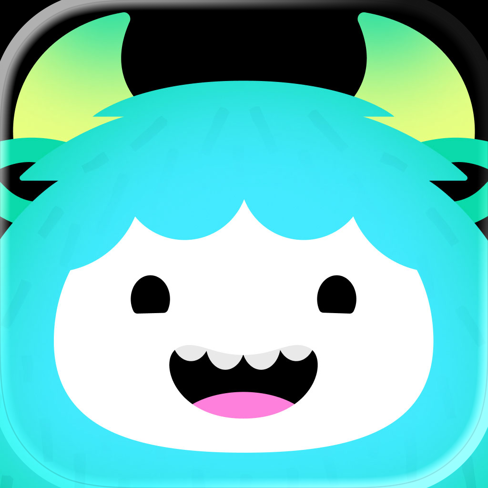

# Yazio

> Compteur de calories et tracker de jeûne intermittent allemand, 100 millions d'utilisateurs. Ce dossier existe pour une raison : **la refonte de marque signée Koto (octobre 2025)** est un cas d'école de mascotte-pivot — une identité entière construite autour d'un yéti, typo sur mesure comprise, sur un produit de santé qui vendait jusque-là un logo-pomme générique.

**Sources :** [site officiel](https://www.yazio.com/fr) · [press kit et factsheet](https://www.yazio.com/en/press) · [App Store](https://apps.apple.com/fr/app/yazio-compteur-de-calories-ia/id946099227) · [Google Play](https://play.google.com/store/apps/details?id=com.yazio.android) · [case study Koto](https://koto.com/projects/yazio) · [Hot Type — Yazio Sans](https://hottype.co/projects/yazio) · [BP&O](https://bpando.org/2026/04/16/yazio-by-koto/) · [Creative Bloq](https://www.creativebloq.com/design/branding/i-would-die-for-this-brands-adorable-yeti-mascot) · ScreensDesign · PaywallScreens · Adapty · Behance · Dribbble · Wayback Machine

---

## Branding

La refonte est le cœur du dossier. Concept stratégique : **« Good Dopamine »** — repositionner un tracker de calories, outil de contrainte, en compagnon qui récompense. La mascotte **Yettie** (un yéti) porte tout le système.

### Avant / après

![[planche-avant-apres-identite.png]]
Une pomme en cinq couleurs + capitales grises ardoise (jusqu'à 2025) → un wordmark bas-de-casse ultra-gras à terminaisons rondes (octobre 2025). Le logo passe d'un pictogramme + nom à **un nom seul, qui fait pictogramme**.

![[planche-logo-lockups.png]]
Wordmark et lockup paysage, versions « Night » (noir #181617, pour fonds clairs) et « Day » (crème #FFFEF9, pour fonds sombres) — le nommage de la charte est contre-intuitif. Fichiers vectoriels dans `branding/` (`.eps`, `.svg`).

![[wordmark-geant-mascotte-dans-le-o.png]]
Le détail qui fait le système : en pied du site, la tête de Yettie se loge **dans le « o »** du wordmark. Le logo et la mascotte sont le même objet à deux échelles.

### La charte logo officielle (15 pages)

![[planche-charte-logotype-et-couleurs.png]]
Logotype, quatre fonds autorisés (crème, bleu nuit #293880, noir, menthe #0AFBC3), et logo sur photographie.

![[planche-charte-construction.png]]
Clear space construit **sur la hauteur du « y »**. Taille mini : 100 px / 35 mm pour le wordmark seul, 300 px / 100 mm pour le lockup. Rotation autorisée uniquement à 90° vertical.

![[planche-charte-interdits.png]]
Les « do not » : changer le rapport de taille du lockup, modifier l'espacement, déplacer Yettie, faire pivoter un seul élément, ombre portée, dégradé, contour, logo sur image chargée.

![[planche-charte-lockup-icone-partenariat.png]]
Lockup paysage, icône d'app (Yettie recadré, **les cornes suivent la courbe de la tuile**), autres formats de crop, et lockup de partenariat avec Google Gemini.

PDF complet : `branding/charte-logo-yazio.pdf`.

### Yettie

![[planche-yettie-8-poses-officielles.png]]
Les 8 poses du press kit, en PNG transparent 2400×2400 (`branding/yettie/`). Corps dégradé cyan→vert (#43EAFF → #09DAA9), cornes lime, face blanche, joues roses.

![[grille-18-poses-koto.png]]
Le système de character design complet tel que Koto le présente : 18 poses (drapeau, courses, chef, sport, sommeil, série de flammes, lunettes, tablette). Fred North, directeur de création chez Koto : *« Clear rules define when Yazio speaks and when Yettie takes the mic. »*

![[planche-mascotte-pomme-ecartee.png]]
**La piste écartée.** Manuel Corsi a livré en juin 2025 une mascotte pomme complète — turnaround, poses, émotions, palette — qui n'a pas été retenue. Elle a pourtant vécu : le paywall de juin à septembre 2025 l'utilisait (voir la planche des paywalls). Le yéti l'a remplacée en décembre.

### Typographie

![[planche-typo-yazio-sans.png]]
**Yazio Sans**, dessiné sur mesure par la fonderie croate **Hot Type** (Marko Hrastovec, Mihael Šandro ; cyrillique Anna Khorash ; type motion Matko Mijić). Construction humaniste malgré l'apparence géométrique, poids lourd, angles internes **et** externes arrondis, formes de cornes et de griffes cachées dans certaines lettres, ponctuation dérivée de l'anatomie de Yettie. Détail rare : un set de **chiffres variables à 4 masters**, dessiné spécifiquement pour animer les compteurs in-app (objectif de poids, jalons).

Le site ne sert qu'**un seul poids** (Bold 700, `YazioSans-Bold-Final.woff2`, copié dans `branding/`). Texte courant en **Noto Sans**, et **Rubik** subsiste sur une partie du site (héritage de l'ancienne charte). Aucune de ces trois n'a encore de fiche dans le vault → `/font` à passer sur Yazio Sans et Rubik.

### Campagne

![[planche-campagne-koto.png]]
Trois registres du même personnage : *« Healthy habits don't bite »* (Yettie mignon, fond crème, aliments en dégradé), *« Off days, nope days, just-not-happening days »* (typo pleine page, Yetties miniatures **intercalés dans les interlignes**), et *« Junk food beware »* en affichage urbain — Yettie en monstre menaçant, yeux rouges, fond rouge sombre. La mascotte a un registre sombre assumé, c'est ce qui l'empêche d'être gnangnan.

### L'identité d'avant (archive)

![[planche-archive-ancienne-charte.png]]
« The YAZIO Identity Guideline », 41 pages, avril 2024, documentée par **Maria Botsch** : logo pomme 5 couleurs, dégradés orange→rose→violet→bleu→turquoise, **Cera Pro** en titrage + **Rubik** en texte, illustrations plates sans contour. Utile pour mesurer l'écart : l'ancienne marque était une somme de couleurs, la nouvelle est un personnage.

---

## Couleurs

Pas de charte publiée : tout vient du CSS du site et de la pipette sur les assets officiels. Le design system s'appelle **« Yettie »**, comme la mascotte — 113 tokens à noms sémantiques (`accent-primary`, `background-floor`, `label-primary`).

![[palette-coeur-de-marque-yazio.svg]]

![[palette-rampe-verte-yazio.svg]]

![[palette-neutres-yazio.svg]]

![[palette-semantiques-yazio.svg]]

![[palette-relevee-yazio.svg]]

Ce que le relevé ajoute aux tokens : la **proportion**. L'accent ne pèse que 1,1 % des pixels — il ne marche que parce que tout le reste est blanc, gris très clair et noir.

---

## Écrans

### Le produit réel

![[planche-app-journal-et-aliments.png]]
Journal du jour (anneau de calories restantes encadré par Eaten / Burned, trois barres de macros), journée remplie (un anneau de progression coloré par repas), ajout d'aliment (3 gros onglets illustrés Foods / Meals / Recipes puis Frequent / Recent / Favorites), fiche nutritionnelle, **gating PRO** (chaque vitamine et minéral masqué par une pastille orange « PRO » — du teasing de donnée, pas un mur), scan de code-barres, création d'aliment, et conseils IA avec micro-sondage pouce vert / pouce rouge.

![[planche-app-jeune-recettes-analyse.png]]
Le tracker de jeûne et son **changement d'état par la couleur** : carte vert d'eau au repos (« Get ready to fast »), carte **rose** une fois le jeûne lancé (« You're fasting! »). Puis les statistiques en barres empilées, la section recettes, la feuille de filtres à chips emoji dont le CTA compte le résultat en direct (« See 2 Recipes »), l'écran Analysis — **le seul écran vraiment coloré de l'app**, une grille de tuiles en dégradés saturés avec une illustration 3D par métrique —, le graphique de poids, l'empty state de liste de courses et les réglages.

### Les écrans officiels, en mode sombre

![[planche-ecrans-officiels-mode-sombre.png]]
Le press kit ne montre **que** du mode sombre : fond #0C0E0E, accent menthe #00FFC3 pur, titres en Yazio Sans crème. C'est là que l'identité est la plus lisible.

![[planche-maquettes-site-mode-clair.png]]
Le site, lui, ne montre **que** du mode clair. Les mêmes écrans, deux discours : le sombre pour la presse (la marque), le clair pour l'acquisition (le produit).

### Les paywalls — quatre ans de la même structure

![[planche-paywall-evolution-2023-2026.png]]
La série la plus instructive du dossier. Le squelette ne bouge jamais — titre personnalisé avec l'objectif chiffré **et la date cible** calculés pendant l'onboarding, une illustration, deux plans, deux témoignages, un CTA large. Seul l'habillage change :

| Date | Ce qui change |
| --- | --- |
| mars 2023 | Deux cartes côte à côte, bandeau bleu « BEST MATCH », 79,99 $/an |
| oct. 2023 | Variante orange, graphe de projection de poids, offre **Lifetime** 149,99 $, mention « Limited access with ads » |
| mars 2025 | Liste verticale, illustration de matériel de sport, accent bleu, 47,90 $/an |
| juin 2025 | L'illustration devient la **mascotte pomme**, apparition de « Cancel anytime » |
| sept. 2025 | Objectif « build muscle » → **59,90 $/an**, soit 25 % plus cher que « lose weight » : le prix est segmenté par intention déclarée |
| déc. 2025 | **La refonte** : Yettie remplace la pomme, accent vert, CTA noir, titre déplacé sous l'illustration |
| juil. 2026 | Mode sombre violet/indigo, Yettie en glow cyan, cartes de plan translucides |

Baisse d'environ 40 % du tarif affiché en trois ans, et bascule d'une comparaison en cartes vers une liste verticale.

### Les écrans promotionnels des stores

![[planche-store-ios-yazio.png]]

![[planche-store-android-yazio.png]]
Deux stores, deux thèmes : l'App Store vend l'app en **clair** sur fonds violet/bleu, Google Play la vend en **sombre**. Même produit, même semaine.

### Archive — l'app d'avant

![[planche-archive-ancienne-charte.png]]
Voir aussi `ecrans/archive-feature-buddies-molnar.png` et `ecrans/archive-section-recettes-molnar.png` : la feature Buddies et la refonte des recettes par **Andrea Molnar**, product designer chez YAZIO à l'époque de l'ancienne identité (fonds bleu pâle et violet pastel, très loin du noir/menthe actuel).

---

## Flows

![[planche-onboarding.png]]
Sept étapes prélevées sur **environ 95** avant que le paywall ne tombe. Accueil, objectif principal en cartes-radio pleine largeur, saisie du prénom sur une ligne type cahier, **écran d'engagement** (« I, julia, will use Yazio to… » avec un *tap and hold* sur l'icône qui remplit l'écran en vert — un contrat moral transformé en geste), saisie de la taille et du poids au gros chiffre + pavé numérique, et estimation finale en courbe de perte de poids avec une pastille YAZIO sur le point cible.

Deux langages cohabitent et la couture est nette : l'onboarding est en blanc pur, titres très gras centrés, **CTA pilule noire** pleine largeur, mascotte omniprésente ; l'app derrière est en UI iOS native, **CTA bleu système**, listes plates.

![[monetisation-parcours-complet-7-ecrans.png]]
Le parcours de monétisation en entier, en mode sombre. Escalier de downsell en trois temps : paywall à 47,90 $/an → si fermeture, **roue de la fortune** (« Craving a better deal? Spin to get your 75% discount, forever! ») → modale « Spin Again » qui promet mieux → offre finale à 23,90 $/an, bandeau « 75% OFF FOREVER ». Le mot *forever* porte toute la promesse.

À noter, en contrepoint : **pas d'essai gratuit**. À la place, un écran de **timeline de renouvellement** en quatre étapes (Today / 30 days before renewal / Renewal day). La transparence remplace l'essai.

Voir aussi `ecrans/app-roue-remise-75-pourcent.png` (la roue en pleine page) et `ecrans/app-promo-in-app-singles-day.png` (promo saisonnière en carte pleine largeur dans le journal, −88 %, compte à rebours).

---

## Composants

![[cartes-streak-feu-et-glace_yazio.png]]
Le meilleur du système : deux états de la même carte de série. « 55 days streak! » — Yettie en météore de feu, dégradé orange/jaune. « 2 days frozen » — Yettie prisonnier d'un glaçon, dégradé bleu nuit. Le **Streak Freeze** n'est pas une pénalité, c'est un personnage dans une autre situation.

![[bandeau-mint-carrousel-cartes_yazio.png]]
Bandeau menthe pleine largeur avec titre en Yazio Sans, débordant sur un carrousel de cartes photo à points de pagination. Le bandeau est coupé net par les cartes qui le chevauchent.

![[bento-4-fonctionnalites_yazio.png]]
Quatre cartes de fonctionnalité, chacune une illustration Yettie sur un aplat pastel différent (jaune, bleu, orange, rose), titre + paragraphe dessous. Grille stricte, variation par la couleur seule.

![[temoignages-avant-apres_yazio.png]]
Bento de témoignages : blocs de texte sur aplat menthe ou bleu pâle mélangés à des photos avant/après, badge « −24 kg » en pilule noire posée sur la photo. Registre très différent du reste — c'est le bloc « preuve », pas le bloc « marque ».

Le bouton du système s'appelle `YettieButton` et a son animation d'appui dédiée : un **ripple** en `scale(2)` sur 0,5 s doublé d'un fondu, avec un token d'ombre pleine décalée (`#0C0E0E` en neutre, `#00B5CC` sous le bouton PRO).

À référencer dans [[_COMPOSANTS]].

---

## Animations

Le case study Koto est **entièrement en vidéo** — 26 films Vimeo, 15 récupérés ici. C'est la meilleure partie du dossier pour du motion.

| Fichier | Ce qu'il montre |
| --- | --- |
| `koto-01-reveal-logotype` | Reveal du wordmark, Yettie qui sort du « o » |
| `koto-02-meet-yettie` | Présentation de la mascotte, « with you every step of the way » |
| `koto-03-good-dopamine` | La plateforme de marque en typographie animée |
| `koto-04-grille-expressions-yettie` | Les 18 poses animées en grille |
| `koto-05-construction-yazio-sans` | Construction vectorielle du « g » — les cornes cachées dans la lettre |
| `koto-06-dashboard-app` | Le dashboard Today animé dans la nouvelle identité |
| `koto-07-chiffres-variables-poids` | **Les chiffres variables 4 masters en action** sur un poids qui descend |
| `koto-08-tone-of-voice` | Voix « Brand » vs voix « Mascot » sur le même écran |
| `koto-09-llm-de-copy` | L'interface du LLM entraîné pour écrire dans les deux tons |
| `koto-10-mur-ecrans-app` | Mur d'écrans de l'app gamifiée |
| `koto-11-loader-lets-go` | Micro-animation de barre de progression « Let's go » |
| `koto-12-campagne-off-days` | La campagne typographique animée |
| `koto-13-yettie-3d` | Yettie en 3D, rendu figurine, en rotation |
| `koto-14-icone-app-yettie` | Construction de l'icône → cartes macros → homescreen iOS |
| `koto-15-typo-poids-aliments` | Contour animé de Yettie, cartes de poids, liste d'aliments défilante |

Trois principes de motion énoncés par Koto : **« Alive and responsive »**, **« Celebrating both big and small wins »**, **« occasionally Burst into Brilliance »**.

![[koto-07-chiffres-variables-poids_yazio.mp4]]

![[koto-11-loader-lets-go_yazio.mp4]]

À référencer dans [[_ANIMATIONS]].

---

## Marketing

![[site-home-yazio.png|700]]
La home yazio.com/fr en pleine hauteur (desktop). Mise en page centrée, hero sur dégradé bleu très pâle, cinq écrans d'app à plat alignés sous le titre, sections alternées, wordmark géant en pied. Version mobile : `marketing/site-home-mobile-yazio.png`. **Le site n'a pas de thème sombre** (vérifié : 0,04 % de différence entre le rendu clair et le rendu `prefers-color-scheme: dark`).

![[planche-cartes-fonctionnalites-site.png]]

![[mockup-koto-today-typo-geante.png]]
Le mockup de Koto : l'écran Today posé sur une typographie géante crème. C'est l'image qui articule marque et produit.

Aussi : `marketing/lineup-iphone-watch-sombre.png` (lineup officiel iPhone + Apple Watch + Galaxy Watch) et `marketing/factsheet-yazio-decembre-2025.pdf` (10 pages maquettées dans la nouvelle identité).

---

## Crédits

| Qui | Quoi | Où |
| --- | --- | --- |
| **Koto** | Refonte de marque complète 2025 — stratégie « Good Dopamine », Yettie, design system, motion | [koto.com/projects/yazio](https://koto.com/projects/yazio) |
| **Fred North** | Creative Director, Koto | — |
| **James Roadnight** | Senior Strategy Director, Koto | — |
| **Hot Type** (Croatie) | Typographie sur mesure Yazio Sans | [hottype.co/projects/yazio](https://hottype.co/projects/yazio) |
| **Marko Hrastovec**, **Mihael Šandro** | Type design | Hot Type |
| **Anna Khorash** | Cyrillique | Hot Type |
| **Matko Mijić** | Type motion | Hot Type |
| **Manuel Corsi** | Mascotte pomme (non retenue), juin 2025 | [behance.net/manudesign-manu](https://www.behance.net/manudesign-manu) · [dribbble.com/manuel-corsi-manu](https://dribbble.com/manuel-corsi-manu) |
| **Maria Botsch** | Ancienne charte YAZIO, 41 pages, avril 2024 | [behance.net/mariabotsch1](https://www.behance.net/mariabotsch1) |
| **Andrea Molnar** | Product designer YAZIO (features Buddies, Recipes) | [dribbble.com/and-rea](https://dribbble.com/and-rea) |
| **Filippo Gianessi** | Sr Growth Designer & Design System Owner, YAZIO | [dribbble.com/filippogianessi](https://dribbble.com/filippogianessi) |

**Provenance des écrans du produit réel** (`ecrans/app-*`, `flows/onboarding-*`) : frames d'un enregistrement complet de l'app publié par **ScreensDesign** (novembre 2025). Un écran vient de **Mobbin** (`app-ai-conseils-repas-feedback`, version iOS mars 2026). Paywalls : **PaywallScreens**, **Adapty**, **RoastMyApp**, ScreensDesign. Visuels de campagne et motion : **BP&O** et **Creative Bloq** relayant les assets fournis par Koto. Ancien logo : snapshot **Wayback Machine** de juin 2025.

---

## Faits (factsheet officiel, décembre 2025)

- YAZIO GmbH fondée en avril 2014 à Erfurt par **Sebastian Weber** et **Florian Weißenstein** — projet démarré fin 2008 comme portail web pendant leurs études.
- App Android avril 2014, iOS janvier 2015, freemium par abonnement novembre 2015.
- 1 M d'utilisateurs 2016 · n°1 en Europe 2019 · 50 M en 2020 · **100 M en mai 2025**.
- Fonctionnalité de suivi alimentaire par IA en juin 2025, **refonte de marque en octobre 2025**.
- 120+ salariés, 32 nationalités, équipe remote-first, 20 langues, 150+ pays, 3 000+ recettes créées en interne.
- Note App Store France : 4,67 sur 139 530 avis. Contact presse : press@yazio.com.

> Une rumeur circule sur une prise de participation majoritaire de Groupe SEB depuis fin 2023. **Aucune source ouverte ne la confirme** — ni le factsheet officiel, ni la presse allemande, qui décrit au contraire une société montée sans investisseurs. À ne pas reprendre.

---

## Pourquoi je l'aime

- **La mascotte n'est pas un ornement, c'est l'architecture.** Le design system porte son nom (`YettieButton`, tokens « Yettie »), elle est dans le « o » du logo, elle est le sujet de la typo (cornes cachées dans les lettres), elle est le vocabulaire des états (streak en feu / streak gelée). C'est très rare de voir un personnage descendre jusqu'à la couche des tokens.
- **Un registre sombre assumé.** « Junk food beware » avec un Yettie aux yeux rouges empêche la marque de tomber dans le mignon inoffensif. Une mascotte qui ne peut faire qu'une seule émotion est une décoration.
- **La retenue chromatique.** Le vert ne pèse que 1 % des pixels. Tout le reste est noir, crème, blanc cassé. C'est exactement l'inverse de l'ancienne identité en cinq couleurs, et c'est ce qui rend l'accent violent quand il apparaît.
- **Les chiffres variables à 4 masters.** Faire dessiner un jeu de chiffres spécifiquement pour que les compteurs de l'app s'animent proprement, c'est le genre de détail qu'on ne voit que si on cherche — et c'est là que se joue la qualité perçue.
- **La série de paywalls sur quatre ans.** Voir la même structure survivre à trois habillages successifs dit plus sur la conception d'un paywall que n'importe quel article.

## Ce que je n'aime pas

- La couture entre l'onboarding (blanc, CTA noir, mascotte) et l'app (UI iOS native, CTA bleu système) est visible. Deux produits collés.
- ~95 écrans d'onboarding avant le paywall, avec un prompt de notation App Store **inséré au milieu du parcours**. Efficace, sans doute. Élégant, non.
- Le bloc de témoignages avant/après en photos de corps casse net le ton du reste de la marque.

## À réutiliser pour

- Projet : [[ ]] — un système de mascotte qui descend jusqu'aux tokens et aux états
- Projet : [[ ]] — gamification santé/habitude : séries, gel de série, jalons, célébrations
- Projet : [[ ]] — structure de paywall personnalisé (objectif chiffré + date cible dans le titre)
- Projet : [[ ]] — onboarding conversationnel long avec écran d'engagement gestuel

## Mots-clés

yazio · yettie · koto · hot type · yazio sans · good dopamine · mascotte · mascot · character design · yéti · yeti · monstre · monster · refonte · rebrand · rebranding · nouvelle identité · avant après · before after · nutrition · calories · compteur de calories · calorie counter · calorie tracker · jeûne intermittent · intermittent fasting · fasting timer · santé · health · fitness · bien-être · wellness · perte de poids · weight loss · macros · food tracking · scan code-barres · barcode scanner · food diary · journal alimentaire · recettes · recipes · vert menthe · mint green · spring green · turquoise · cyan · noir et crème · black and cream · design system · design tokens · token set · rampe de couleur · color ramp · typo sur mesure · custom typeface · chiffres variables · variable numerals · fonderie · foundry · onboarding long · onboarding quiz · engagement gestuel · tap and hold · paywall · hard paywall · soft paywall · downsell · roue de la fortune · spin wheel · one-time offer · pricing segmenté · price test · freemium · abonnement · subscription · gating · teasing de donnée · PRO · streak · série · streak freeze · gamification · célébration · confettis · jalon · milestone · empty state · tab bar · mode sombre · dark mode · anneau de progression · progress ring · macros bars · illustration 3D · dégradé · gradient · press kit · charte logo · brand guidelines · clear space · lockup · app icon · Erfurt · Allemagne · Germany
