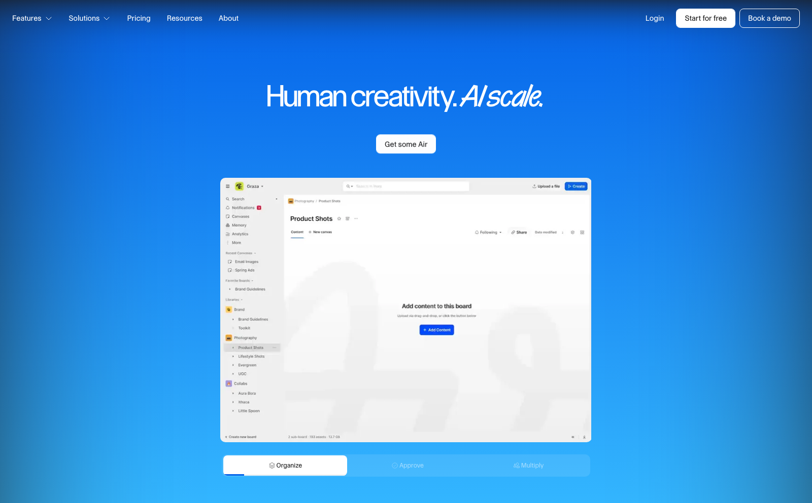
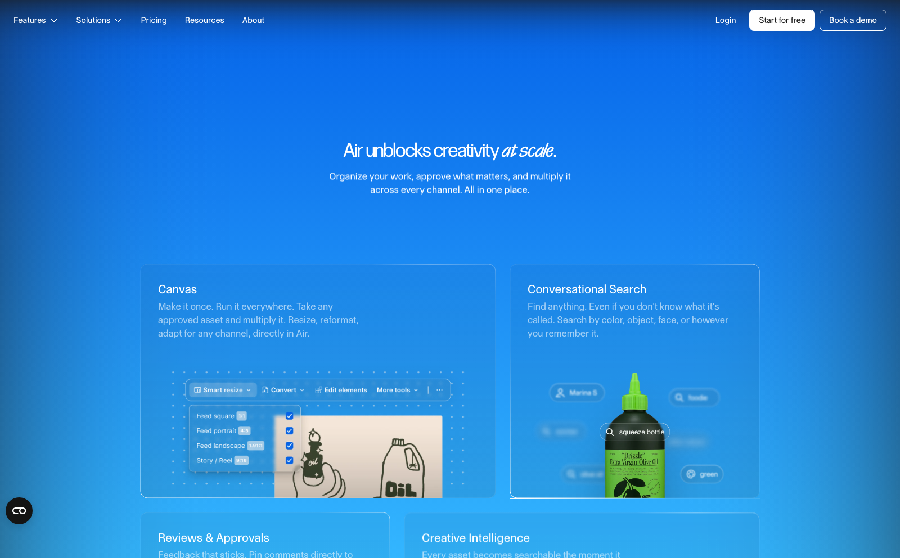
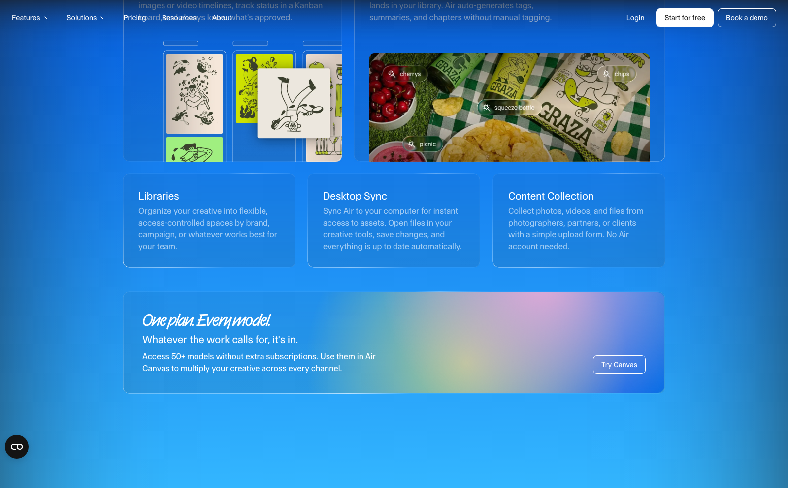
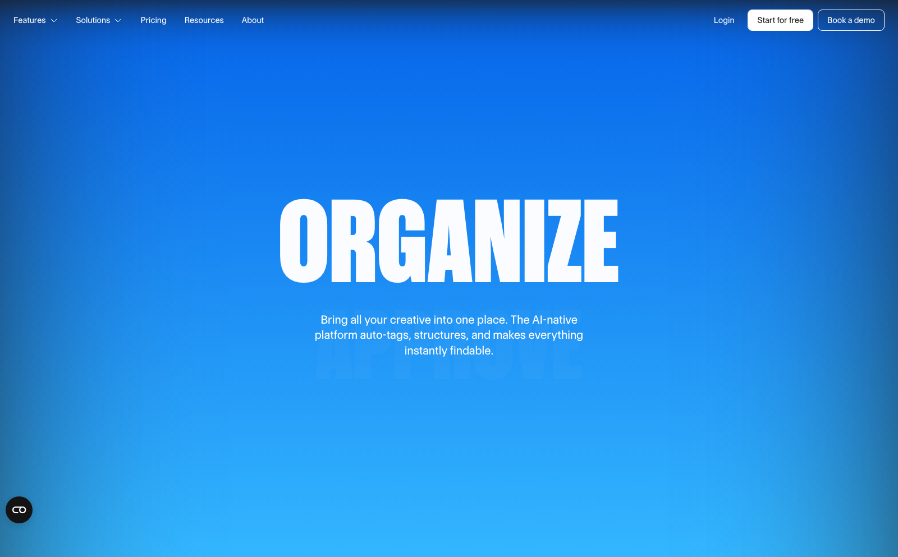
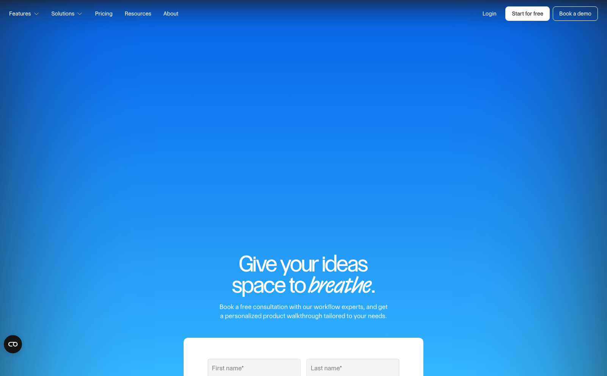

# Air — air.inc

**Source:** https://air.inc/ — capturé le 2026-06-24

Landing de **Air**, plateforme de *creative operations* / DAM (digital asset management) dopée à l'IA. Promesse : « Human creativity. AI scale. » et le claim géant « Make it once. Run it everywhere. ». SaaS B2B pour équipes créa / marketing.

## Pourquoi je l'aime
- **Typo titre énorme et condensée** (« MAKE IT ONCE. RUN IT EVERYWHERE. », « ORGANIZE / APPROVE / MULTIPLY ») sur aplat bleu : très bold, éditorial, lisible.
- **Mockup produit animé** dans le hero qui glisse depuis le bas — la sidebar et le board se révèlent proprement.
- **Tab bar flottante « Organize / Approve / Multiply »** avec une **très belle micro-animation** : la pill blanche glisse d'un onglet à l'autre et une barre de progression bleue se remplit, synchronisée avec le scroll / les grandes sections.
- Palette resserrée : dégradé bleu marine → bleu vif, blanc, quasi-noir. Beaucoup de respiration.

## À réutiliser pour
- Projet : [[ ]]
- Hero SaaS avec démo produit animée + gros titre condensé.
- Pattern de **segmented control / tab bar animée** (indicateur qui glisse + progress) → reproduit dans Figma (voir plus bas).

## Pages du site
> Le site est une expérience **WebGL / scroll-driven** : la capture pleine hauteur statique (`home.png`) ressort en grande partie vide (le contenu n'apparaît qu'au scroll). Les visuels ci-dessous sont des **frames rendues au scroll**, plus représentatives, complétées par la vidéo.

### Walkthrough vidéo
![[walkthrough.mp4]]

## Composants extraits
Blocs UI statiques dans `composants/` (indexés dans [[_COMPOSANTS]]) ; sections animées (intro 3D, toggle, reveal) dans `animations/` (indexées dans [[_ANIMATIONS]]).

- **Intro 3D « Air » (WebGL)** — l'animation d'entrée du site : le « Air » se forme en verre dans un ciel de nuages.
  ![[intro-3d_air-inc.gif]]
- **Side bar verticale Sunrise / Sun / Sunset / Moon** — toggle d'éclairage de la scène 3D, pill qui glisse (clic).
  ![[sidebar-toggle_air-inc.gif]]
  ![[sidebar-toggle_air-inc.png]]
- **Tab bar Organize / Approve / Multiply** — segmented control animé (pill + progress).
  ![[tabbar_air-inc.png]]
- **Sidebar de l'app Air** (mockup) — navigation gauche complète (workspace, Libraries, dossiers, item actif).
  ![[sidebar_air-inc.png]]
- **Mockup produit complet** (sidebar + topbar + board).
  ![[mockup_air-inc.png]]
- **Reveal animation** du mockup au scroll.
  ![[reveal_air-inc.gif]]

> Note technique : le hero est un **canvas WebGL** (3D Air). Capturé en GL matériel (le rendu logiciel est trop lent). La side bar d'éclairage n'est visible que pendant la **phase claire de l'intro** (la scène retombe ensuite en bleu uni).

## Reproduction Figma — sidebar + tab bar
Sidebar **et** tab bar reproduites fidèlement dans Figma (page 1). La tab bar est déclinée en 3 états (Organize → Approve → Multiply, barre de progression qui se remplit).

**Prototype interactif** (page « Prototype — Tab bar ») : la pill blanche **glisse** d'un onglet à l'autre via Smart Animate, avec auto-advance en boucle (1,5 s) + clic sur chaque onglet — comme le composant du site.

→ Fichier Figma : https://www.figma.com/design/5zEKE3wcdo4AhGcp90rciB/Air-sidebar-tab-bar-inspi (drafts perso)

---
[[_INSPIRATION|← Inspiration]] · [[ACCUEIL|Accueil]]
