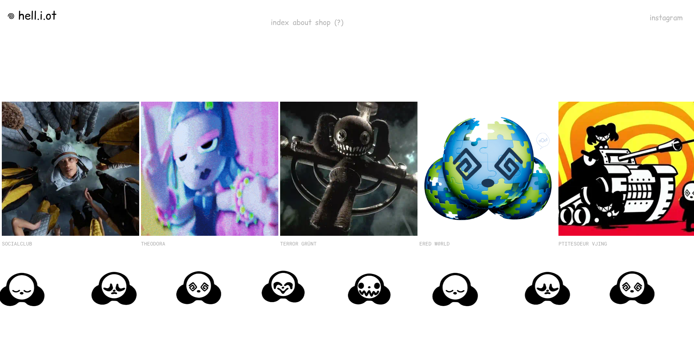
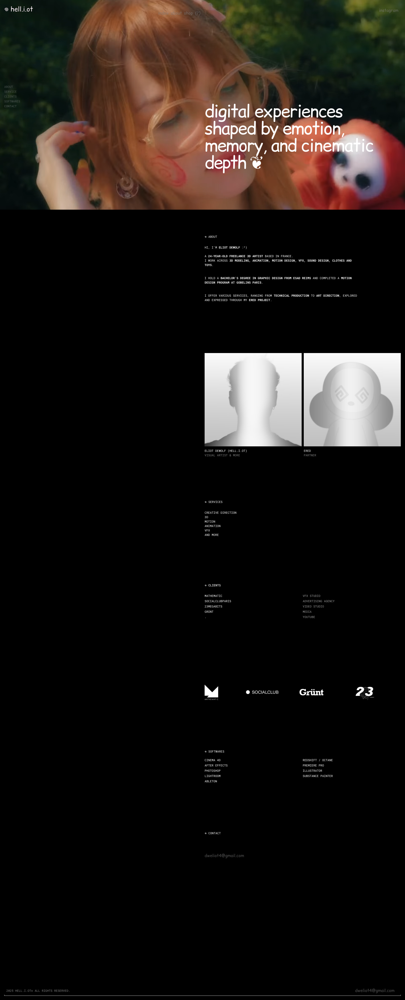
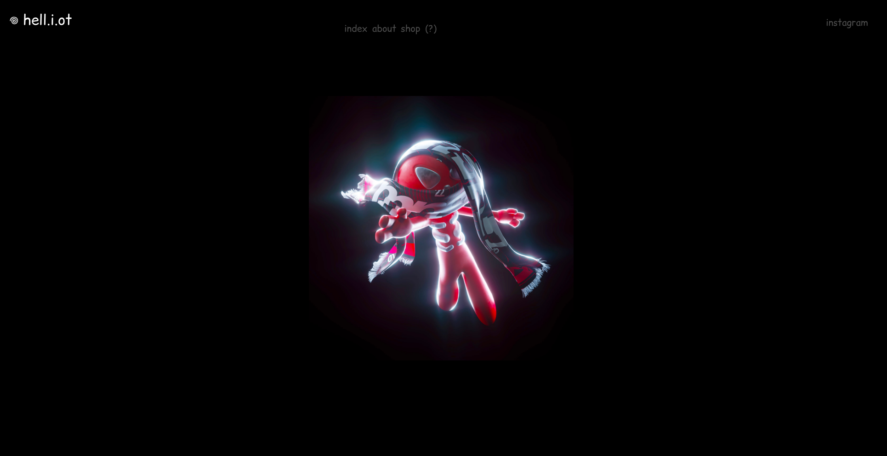
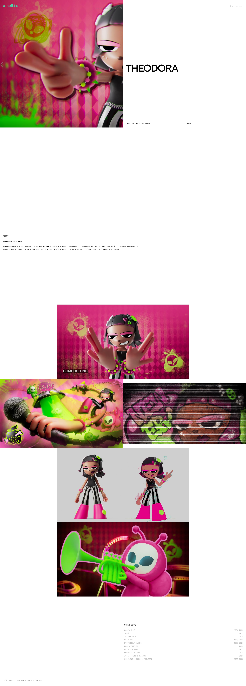

# hell.i.ot — Eliot DeWolf

 **Source:** https://eliotdewolf.framer.website/ · pages uniques capturées + **1 page projet** comme exemple de template *(10 projets regroupés)*

Portfolio de **Eliot DeWolf** (alias *hell.i.ot*) — créateur multidisciplinaire (design, art numérique, VJing, GOBELINS). Site **Framer**, mise en page **minimale** : fond blanc, nav discrète (`index · about · shop`), galerie de projets très **typés 3D/CGI**, edgy et colorés. Une **mascotte blob verte** récurrente (loader + marqueurs) donne une identité ludique et mémorable. Titres en capitales avec caractères spéciaux (@, ü, ï).

## Pourquoi je l'aime
- Contraste fort entre **layout ultra-sobre** (blanc, nav minuscule) et **visuels 3D bold/excentriques**.
- La **mascotte-signature** comme fil rouge = branding malin.
- **Pages projet** en layout splitté (visuel plein cadre + titre énorme) très efficaces.

## À réutiliser pour
- Projet : [[ ]] — portfolio créatif, direction artistique 3D, branding par mascotte, pages projet plein cadre.

## Pages du site (captures pleine hauteur)
**About / Random :**

**Page projet (template, 1 exemple sur 10) :**

## Composants retenus
Bloc UI statique dans `composants/` (indexé dans [[_COMPOSANTS]]) :
- **Index « OTHER WORKS »** (page projet) — index éditorial réutilisable :
![[index-projets_eliotdewolf.png]]

Animation dans `animations/` (indexée dans [[_ANIMATIONS]]) :
- **Loader blob animé** (mascotte verte) :
![[loader_eliotdewolf.gif]]

## Vidéo du site
Walkthrough complet (défilement de toutes les pages) : `walkthrough.mp4`
![[walkthrough.mp4]]
