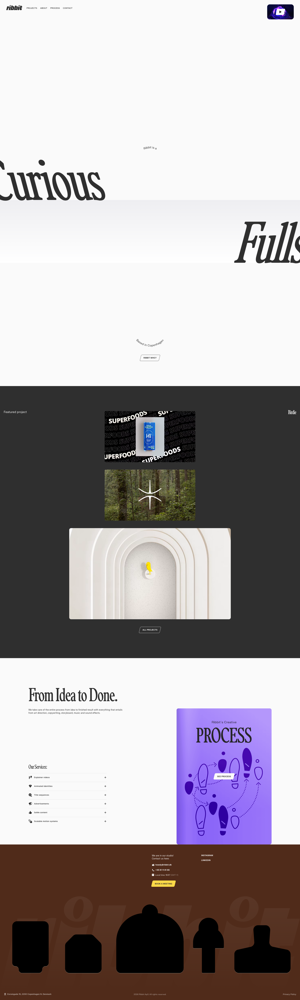
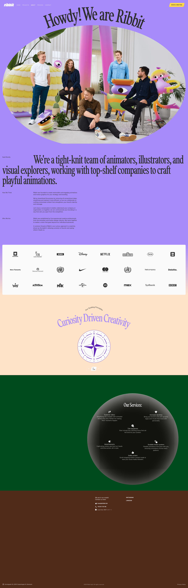
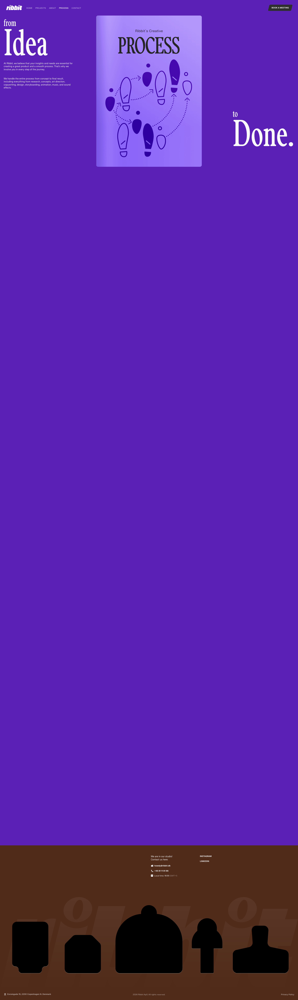
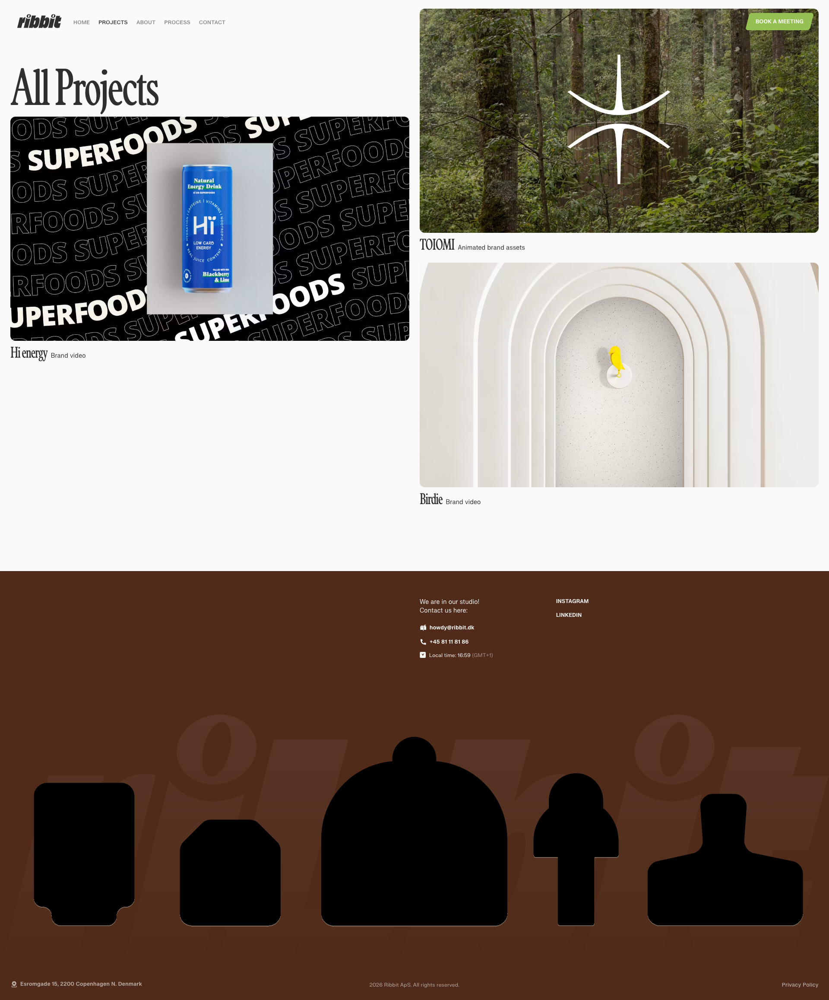
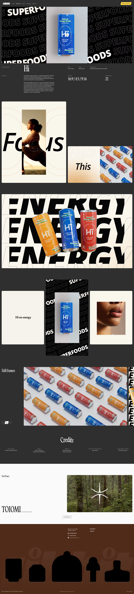
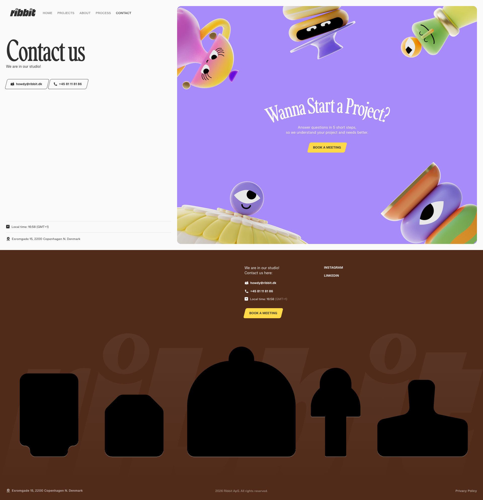

# Ribbit — agence de motion design (Copenhague)

**Source:** https://ribbit.dk/

Site d'une agence créative de motion design basée à Copenhague (explainer videos, identités animées, génériques, social). Design éditorial très typographique : énormes serifs display italiques qui défilent au scroll, blocs de couleurs ultra-saturées (violet électrique, vert sapin, marron, lavande, crème) et illustrations d'archétypes en silhouettes noires.

## Pages du site

## Walkthrough

![[walkthrough.mp4]]

## Pourquoi je l'aime
- **Typo display géante en serif italique** (« Curious », « Fullservice ») qui traverse l'écran au scroll — très éditorial, fort caractère.
- **Système de couleurs par blocs**, chaque section bascule dans une teinte saturée pleine (violet, vert sapin, marron) — rythme visuel franc.
- **Footer signature** : silhouettes noires d'archétypes (jester, sage, explorer…) sur fond marron avec « ribbit » en filigrane — identité mémorable, récurrente sur tout le site.
- Mélange réussi sérieux / playful : grille de projets sobre + illustrations character-driven.

## À réutiliser pour
- Hero typographique animé au scroll (texte qui traverse) → landings Sordulo / ICAN.
- Footer « personnages » comme signature de marque.
- Découpage d'une page par grands blocs de couleur saturée.
- Projet : [[ ]]

## Composants extraits
`composants/` — blocs UI (indexés dans [[_COMPOSANTS]]) :
- ![[footer_ribbit.png]] — footer à archétypes

## Animations
`animations/` — sections / intros animées (indexées dans [[_ANIMATIONS]]) :
- ![[header_ribbit.gif]] — animation d'intro / header : loader « Howdy » → logo « ribbit » avec personnages 3D qui rebondissent → révélation du hero serif géant « Fullservice Motion Agency »
- ![[process_ribbit.gif]] — carte « Process » animée au scroll
